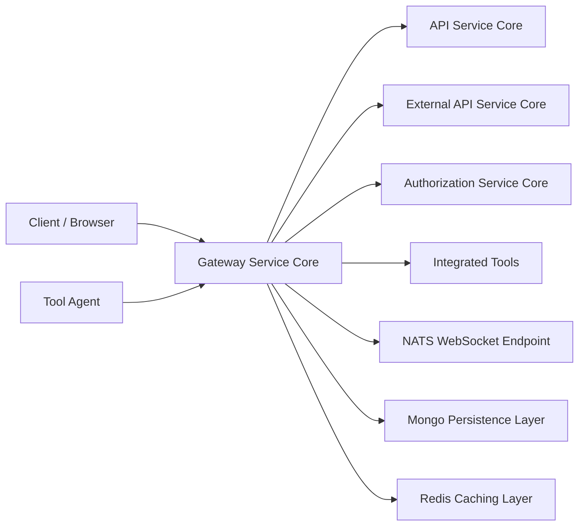
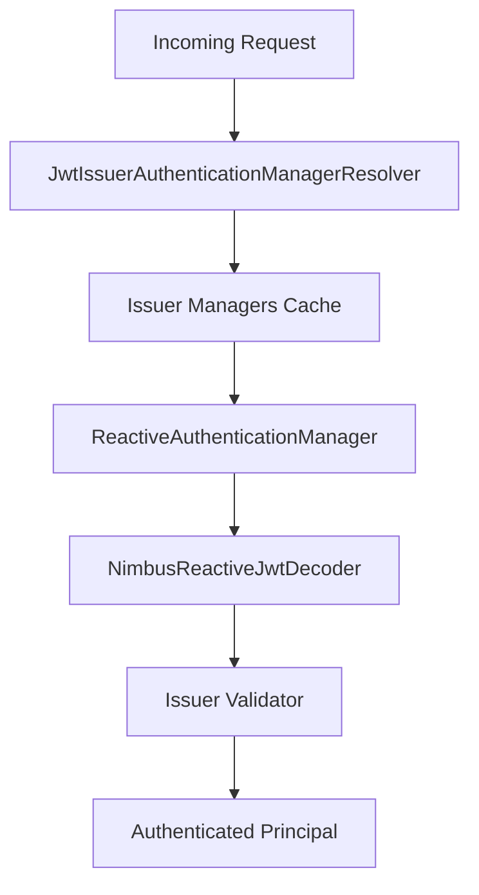
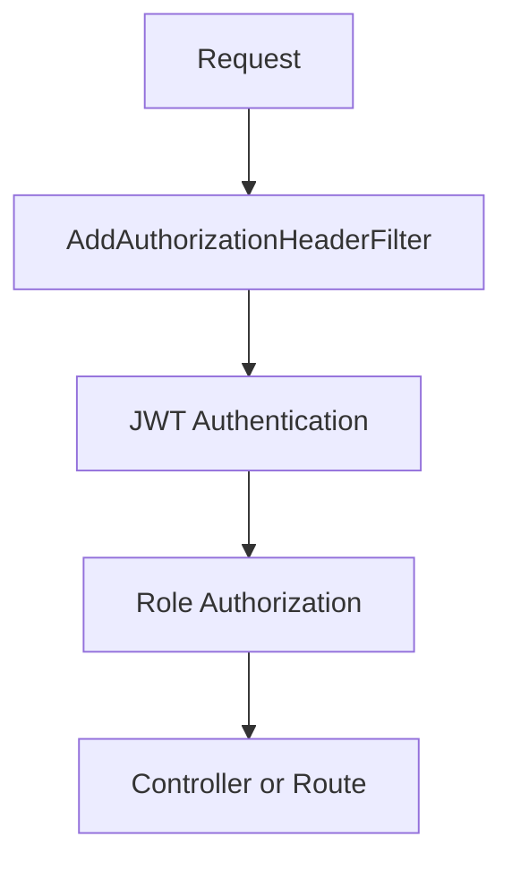
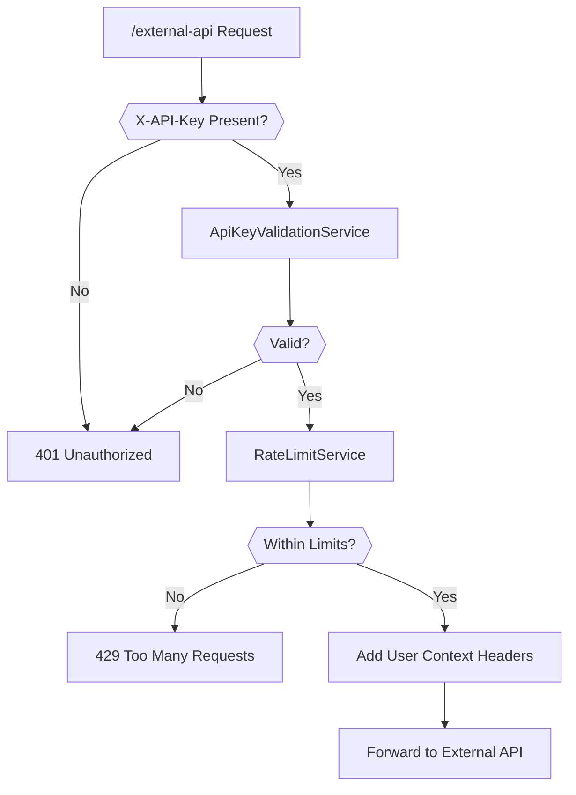
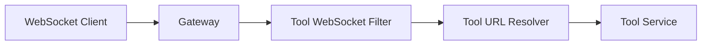
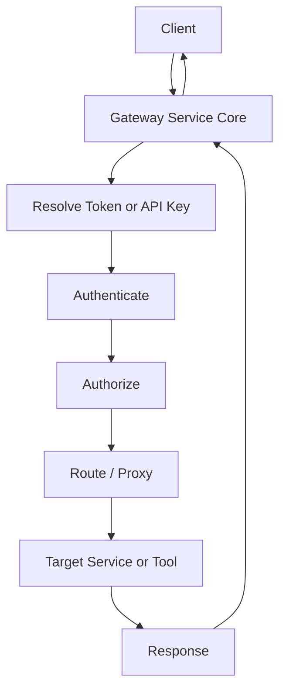

# Gateway Service Core

## Overview

The **Gateway Service Core** module is the reactive API gateway of the OpenFrame platform. It acts as the unified ingress layer for:

- REST APIs
- WebSocket connections
- External API integrations
- Tool and agent proxying
- JWT-based multi-tenant authentication
- API key authentication with rate limiting

Built on **Spring Cloud Gateway (WebFlux)**, it provides non-blocking, high-throughput routing and security enforcement across the platform.

This module is responsible for:

- Centralized authentication and authorization
- Multi-tenant JWT issuer validation
- API key validation and rate limiting for external APIs
- Dynamic proxying of tool REST and WebSocket traffic
- Header enrichment and token normalization
- CORS and origin sanitization

---

## High-Level Architecture



The Gateway Service Core sits at the edge of the system and orchestrates communication between clients, agents, tools, and internal services.

---

## Core Responsibilities

### 1. Reactive Routing and Proxying

Routing is implemented using **Spring Cloud Gateway** and `RouteLocator`.

Key configuration:

- `WebSocketGatewayConfig`
- `IntegrationController`
- `WebClientConfig`

Capabilities:

- Route REST traffic to internal services
- Proxy tool APIs dynamically based on tool ID
- Proxy agent endpoints
- Route WebSocket traffic for tools and NATS

---

### 2. JWT Authentication (Multi-Tenant)

The Gateway functions as an OAuth2 resource server.

Key components:

- `GatewaySecurityConfig`
- `JwtAuthConfig`
- `IssuerUrlProvider`

#### Multi-Issuer JWT Resolution

JWT authentication supports:

- Static issuer (platform default)
- Dynamic tenant-based issuers
- Super-tenant support
- Caffeine-cached authentication managers per issuer



The `IssuerUrlProvider` retrieves allowed issuer URLs from the tenant repository and ensures strict issuer validation.

---

### 3. Authorization Rules

Authorization is defined in `GatewaySecurityConfig`.

Key path groups (from `PathConstants`):

- `/api/**` → `ADMIN` role
- `/tools/**` → `ADMIN` role
- `/tools/agent/**` → `AGENT` role
- `/ws/tools/**` → Role-based access
- `/clients/**` → Agent access
- `/external-api/**` → API key protected

Security flow:



---

## API Key Authentication and Rate Limiting

The `ApiKeyAuthenticationFilter` is a global filter applied to `/external-api/**` endpoints.

### Flow



### Features

- Requires `X-API-Key` header
- Validates API key via `ApiKeyValidationService`
- Applies per-minute, per-hour, per-day rate limits
- Adds headers:
  - `X-API-Key-Id`
  - `X-User-Id`
- Removes raw API key before forwarding
- Adds standard rate limit headers
- Records success/failure statistics

This isolates external API traffic from internal JWT-based flows.

---

## WebSocket Gateway

WebSocket support is configured in `WebSocketGatewayConfig`.

### Supported Endpoints

- `/ws/tools/{toolId}/**`
- `/ws/tools/agent/{toolId}/**`
- `/ws/nats`

Custom proxy filters:

- `ToolApiWebSocketProxyUrlFilter`
- `ToolAgentWebSocketProxyUrlFilter`

These filters:

- Extract tool ID from path
- Resolve tool base URL
- Dynamically rewrite target URI
- Proxy WebSocket traffic reactively



Additionally, the `WebSocketServiceSecurityDecorator` ensures JWT claims are accessible during WebSocket handshake processing.

---

## REST Tool Proxying

`IntegrationController` handles dynamic REST proxying for tools.

### Endpoints

- `GET /tools/{toolId}/health`
- `POST /tools/{toolId}/test`
- `/tools/{toolId}/**` (generic proxy)
- `/tools/agent/{toolId}/**` (agent proxy)

The controller delegates to:

- `IntegrationService`
- `RestProxyService`

Responsibilities:

- Forward HTTP method and body
- Preserve authentication context
- Log tool interactions
- Handle reactive responses

---

## Token Normalization and Header Enrichment

The `AddAuthorizationHeaderFilter` ensures a standard `Authorization` header exists.

### Token Sources

- Access token cookie
- Custom `Access-Token` header
- Authorization query parameter

If found, it injects:

```text
Authorization: Bearer <token>
```

This enables consistent JWT authentication regardless of how the token is supplied.

---

## CORS and Origin Handling

### CorsConfig

- Configurable via `spring.cloud.gateway.globalcors`
- Enabled unless explicitly disabled

### OriginSanitizerFilter

- Removes `Origin: null`
- Prevents invalid browser-origin scenarios
- Executed at highest precedence

---

## WebClient Configuration

`WebClientConfig` provides a shared reactive HTTP client with:

- 30s connect timeout
- 30s read timeout
- 30s write timeout
- Reactor Netty configuration

This WebClient is used for:

- Tool API proxying
- Integration testing
- Internal service calls

---

## Internal Auth Probe

`InternalAuthProbeController` exposes:

```
GET /internal/authz/probe
```

Enabled only when:

```
openframe.gateway.internal.enable=true
```

Used for internal health checks and sidecar validation.

---

## Path Classification

Defined in `PathConstants`:

```text
/clients
/api
/tools
/ws/tools
/chat
```

These constants centralize security and routing decisions.

---

## Integration with Other Platform Modules

The Gateway Service Core interacts with:

- Authorization Service Core → JWT issuance and validation
- API Service Core → Admin and internal APIs
- External API Service Core → API key protected endpoints
- Mongo Persistence Layer → API key, tenant, and user lookups
- Redis Caching Layer → Rate limiting storage
- Data Platform Core → Tool and integration metadata

The Gateway does not implement business logic. Instead, it:

- Authenticates
- Authorizes
- Routes
- Enforces limits
- Normalizes requests

---

## End-to-End Request Lifecycle



---

## Summary

The **Gateway Service Core** is the secure reactive edge of the OpenFrame platform.

It provides:

- Multi-tenant JWT authentication
- API key validation and rate limiting
- Role-based authorization
- REST and WebSocket proxying
- Header normalization
- CORS and origin sanitization
- High-performance reactive routing

By centralizing ingress concerns, it ensures internal services remain focused on domain logic while maintaining strict security and scalability guarantees.