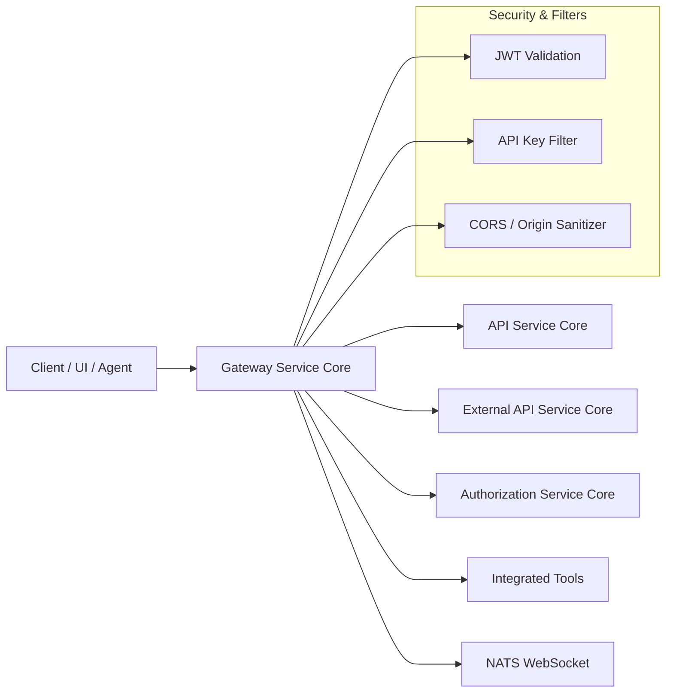
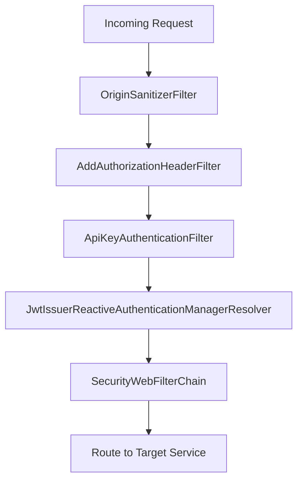
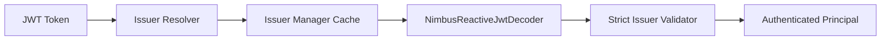
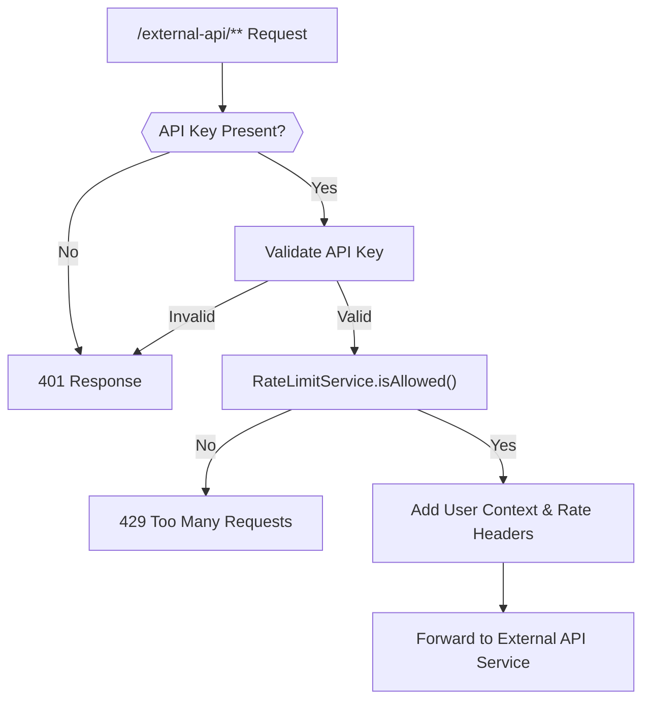
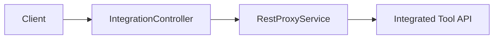
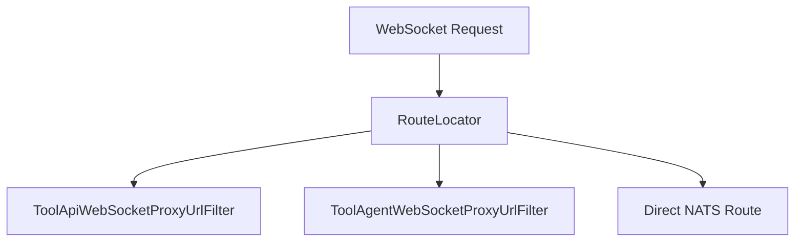
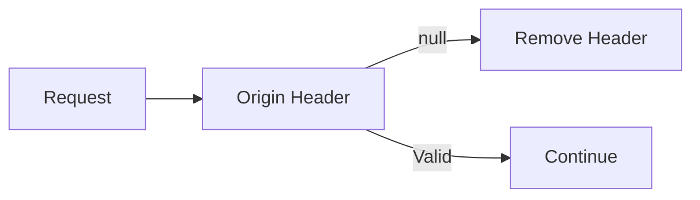
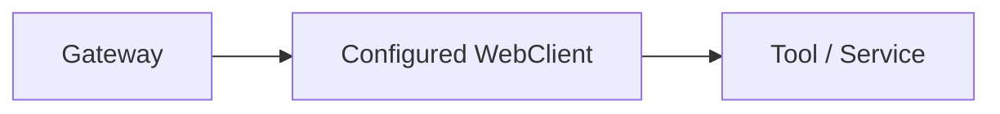

# Gateway Service Core

## Overview

The **Gateway Service Core** module is the reactive edge layer of the OpenFrame platform. It acts as a secure, multi-tenant API gateway built on **Spring Cloud Gateway** and **Spring WebFlux**, responsible for:

- Centralized authentication and authorization (JWT, API keys)
- Multi-tenant issuer resolution
- HTTP and WebSocket proxying to tools and agents
- Rate limiting for external APIs
- CORS management and origin sanitization
- Token propagation and header normalization

This module sits at the boundary between clients (UI, agents, external integrations) and internal platform services such as API Service Core, Authorization Service Core, External API Service Core, and data services.

---

## High-Level Architecture

### Core Responsibilities

1. **Authentication** – Validates JWTs using multi-issuer support.
2. **API Key Enforcement** – Secures `/external-api/**` endpoints.
3. **Authorization Rules** – Enforces role-based access (ADMIN, AGENT).
4. **Tool Proxying** – Routes REST and WebSocket traffic to integrated tools.
5. **Tenant Awareness** – Dynamically resolves valid issuers per tenant.
6. **Rate Limiting** – Protects external API endpoints with minute/hour/day quotas.

---

# Security Architecture

Security in the Gateway Service Core is composed of multiple layers:

## 1. JWT Authentication and Multi-Issuer Support

### Components

- `GatewaySecurityConfig`
- `JwtAuthConfig`
- `IssuerUrlProvider`

### Flow

1. `AddAuthorizationHeaderFilter` ensures an `Authorization` header exists.
2. `JwtAuthConfig` provides a `JwtIssuerReactiveAuthenticationManagerResolver`.
3. A Caffeine cache stores `ReactiveAuthenticationManager` per issuer.
4. `IssuerUrlProvider` resolves allowed issuer URLs dynamically from tenant data.

### Role and Scope Mapping

`GatewaySecurityConfig` configures:

- `roles` claim → `ROLE_` authorities
- `scope` claim → `SCOPE_` authorities
- `sub` → principal

Authorization rules are path-based using `PathConstants`.

---

## 2. API Key Authentication and Rate Limiting

### Component

- `ApiKeyAuthenticationFilter`
- `RateLimitConstants`

This filter applies **only** to `/external-api/**` endpoints.

### Processing Flow

### Features

- Validates API key using `ApiKeyValidationService`
- Increments request statistics
- Enforces minute, hour, and day limits
- Adds rate limit headers:
  - `X-Rate-Limit-Limit-Minute`
  - `X-Rate-Limit-Remaining-Minute`
  - Hour and day equivalents
- Strips raw `X-API-Key` header before forwarding
- Adds contextual headers:
  - `X-API-Key-Id`
  - `X-User-Id`

Errors are written reactively without relying on controller-level exception handling.

---

# HTTP and WebSocket Routing

The Gateway Service Core proxies both REST and WebSocket traffic.

## 1. REST Proxying for Tools

### Component

- `IntegrationController`

### Endpoints

- `GET /tools/{toolId}/health`
- `POST /tools/{toolId}/test`
- `/{toolId}/**` → API proxy
- `/agent/{toolId}/**` → Agent proxy

The controller delegates routing to `RestProxyService` and `IntegrationService` for connection validation.

---

## 2. WebSocket Routing

### Components

- `WebSocketGatewayConfig`
- `ToolApiWebSocketProxyUrlFilter`
- `ToolAgentWebSocketProxyUrlFilter`

### Supported Paths

- `/ws/tools/{toolId}/**` – Tool API WebSocket
- `/ws/tools/agent/{toolId}/**` – Agent WebSocket
- `/ws/nats` – NATS WebSocket

### Tool URL Resolution

Both WebSocket filters:

- Extract `toolId` from path
- Query `ReactiveIntegratedToolRepository`
- Resolve target URL via `ToolUrlService`
- Use `ProxyUrlResolver` to compute final upstream destination

A custom `WebSocketService` decorator ensures JWT claims are available during handshake.

---

# CORS and Origin Handling

### Components

- `CorsConfig`
- `CorsDisableConfig`
- `OriginSanitizerFilter`

### Behavior

- Default: CORS enabled via `spring.cloud.gateway.globalcors`
- SaaS mode (`openframe.gateway.disable-cors=true`): permissive CORS allowing all origins with credentials
- `OriginSanitizerFilter` removes `Origin: null` headers to prevent CORS validation issues

---

# Internal and Operational Endpoints

### InternalAuthProbeController

- Path: `/internal/authz/probe`
- Enabled via property: `openframe.gateway.internal.enable=true`
- Used for internal health/auth validation

---

# WebClient Configuration

### Component

- `WebClientConfig`

Provides a customized `WebClient.Builder` with:

- 30s connect timeout
- 30s read timeout
- 30s write timeout
- Reactor Netty configuration

This builder is used for outbound calls from the gateway (e.g., integration checks, proxy operations).

---

# Path-Based Authorization Model

`PathConstants` defines core prefixes:

- `/clients`
- `/api`
- `/tools`
- `/ws/tools`

`GatewaySecurityConfig` enforces:

- `ROLE_ADMIN` → Dashboard and tool APIs
- `ROLE_AGENT` → Agent endpoints and NATS WebSocket
- Public → UI and selected client registration paths

---

# Integration with Platform Modules

The Gateway Service Core integrates with:

- **Authorization Service Core** – JWT issuance and OAuth flows
- **API Service Core** – Dashboard and internal APIs
- **External API Service Core** – Public external endpoints secured by API keys
- **Data Mongo Core** – Tenant and API key data
- **Security and OAuth Core** – JWT configuration and security constants

It does not contain business logic for tools or tenants; it enforces security and routing boundaries.

---

# Design Principles

1. **Reactive and Non-Blocking** – Fully built on Spring WebFlux.
2. **Multi-Tenant Aware** – Dynamic issuer validation.
3. **Zero Business Logic** – Strictly routing, security, and policy enforcement.
4. **Edge Observability** – Centralized rate limiting and authentication logging.
5. **Composable Filters** – Ordered WebFilters and GlobalFilters for clear responsibility boundaries.

---

# Summary

The **Gateway Service Core** module is the secure entry point to the OpenFrame platform. It:

- Authenticates JWTs across tenants
- Enforces API key validation and rate limiting
- Routes REST and WebSocket traffic to tools and services
- Applies role-based authorization
- Manages CORS and origin sanitation
- Bridges token sources into a unified Authorization header model

By centralizing these concerns, it enables downstream services to remain focused on business logic while the gateway enforces consistent security, routing, and policy behavior across the platform.
