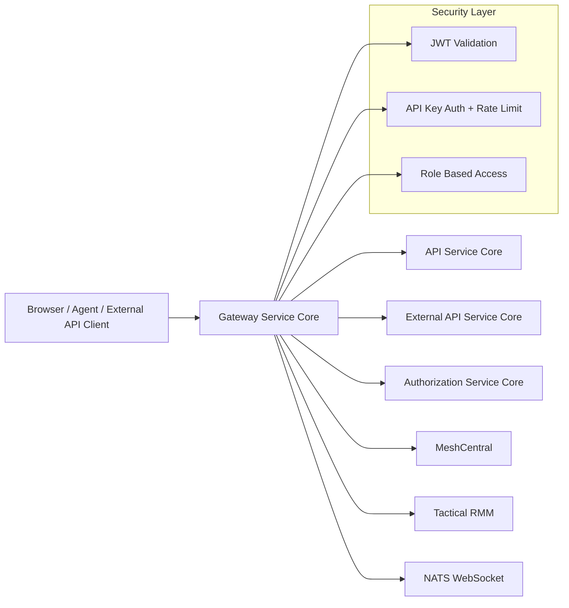
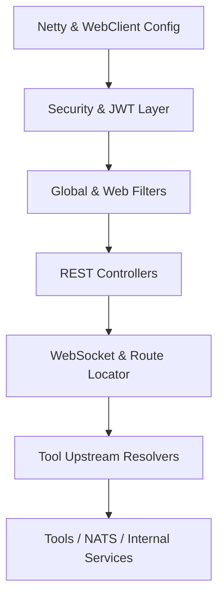
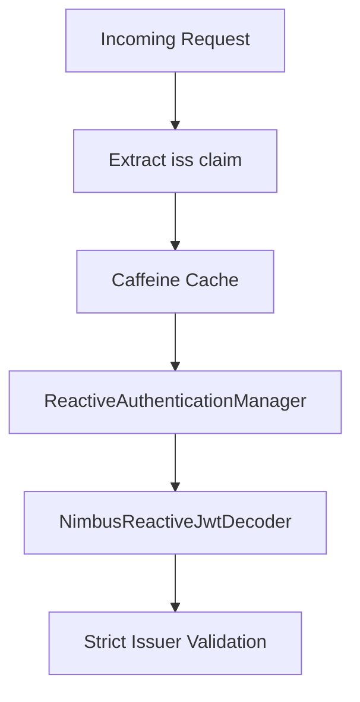
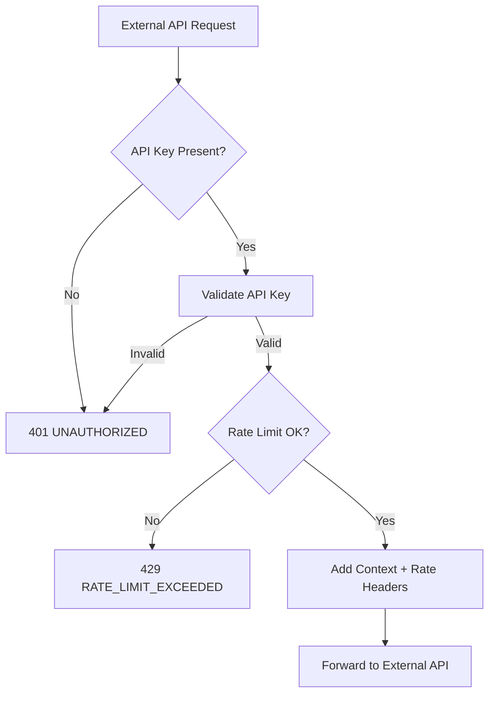
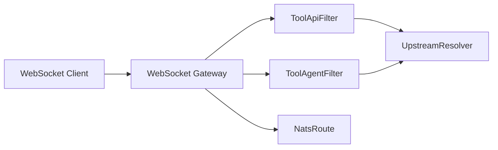
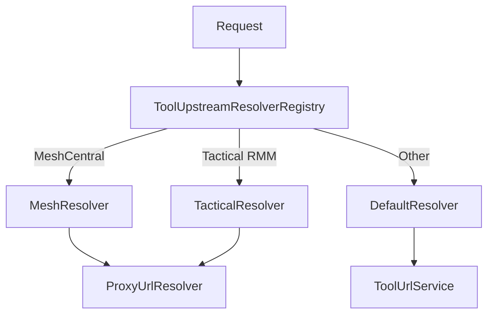
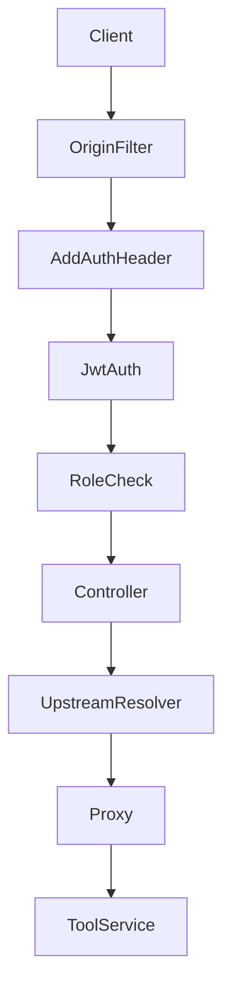
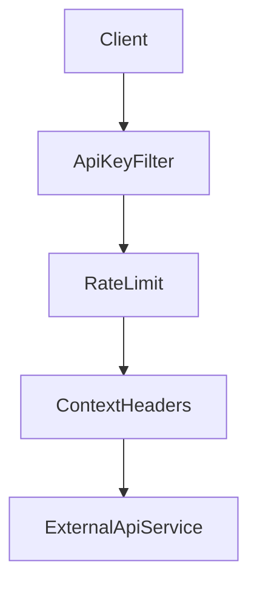
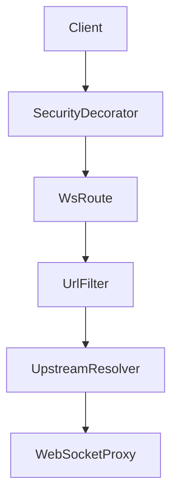

# Gateway Service Core

The **Gateway Service Core** module is the reactive edge layer of the OpenFrame platform. It acts as:

- ✅ API Gateway (Spring Cloud Gateway)
- ✅ WebSocket Proxy (for tools, agents, and NATS)
- ✅ Security Enforcement Layer (JWT, API keys, role-based access)
- ✅ Multi-tenant issuer-aware resource server
- ✅ Tool-specific upstream router

It sits between clients (UI, agents, external consumers) and internal platform services such as:

- API Service Core
- External API Service Core
- Authorization Service Core
- Integrated Tools (MeshCentral, Tactical RMM, etc.)

This module is fully reactive (Spring WebFlux + Reactor Netty) and optimized for high-throughput REST and WebSocket traffic.

---

## 1. Architectural Overview

The Gateway Service Core orchestrates routing, authentication, rate limiting, and upstream resolution.

```mermaid
flowchart LR
    Client["Browser / Agent / External API Client"] --> Gateway["Gateway Service Core"]

    Gateway --> ApiService["API Service Core"]
    Gateway --> ExternalApi["External API Service Core"]
    Gateway --> Authz["Authorization Service Core"]
    Gateway --> Mesh["MeshCentral"]
    Gateway --> Tactical["Tactical RMM"]
    Gateway --> Nats["NATS WebSocket"]

    subgraph security["Security Layer"]
        Jwt["JWT Validation"]
        ApiKey["API Key Auth + Rate Limit"]
        Roles["Role Based Access"]
    end

    Gateway --> Jwt
    Gateway --> ApiKey
    Gateway --> Roles
```

### Responsibilities

| Concern | Implemented By |
|----------|----------------|
| REST routing | Spring Cloud Gateway routes + controllers |
| WebSocket proxy | WebSocketGatewayConfig |
| JWT validation | JwtAuthConfig + GatewaySecurityConfig |
| Multi-issuer resolution | JwtIssuerReactiveAuthenticationManagerResolver |
| API key auth | ApiKeyAuthenticationFilter |
| Rate limiting | RateLimitService + RateLimitConstants |
| Tool upstream resolution | ToolUpstreamResolver implementations |
| Origin hardening | OriginSanitizerFilter |
| CORS configuration | CorsConfig / CorsDisableConfig |

---

# 2. Core Layers of the Gateway

The module can be understood in seven logical layers.

```mermaid
flowchart TD
    Netty["Netty & WebClient Config"] --> Security
    Security["Security & JWT Layer"] --> Filters
    Filters["Global & Web Filters"] --> Controllers
    Controllers["REST Controllers"] --> Routing
    Routing["WebSocket & Route Locator"] --> Upstream
    Upstream["Tool Upstream Resolvers"] --> ExternalSystems

    ExternalSystems["Tools / NATS / Internal Services"]
```

---

# 3. Netty & Reactive HTTP Configuration

## NettySocketConfig

Optimizes TCP-level behavior:

- `SO_LINGER = 0`
- `TCP_NODELAY = true`
- Custom WebSocket client bean

Improves:
- Connection teardown performance
- Reduced latency for WebSocket frames
- Reduced packet buffering delay

## WebClientConfig

Creates a tuned `WebClient.Builder` with:

- 30s connect timeout
- 30s response timeout
- Read/write timeout handlers
- Reactor Netty HTTP client connector

This client is used for proxying REST calls to upstream tools.

---

# 4. Security Layer

The Gateway Service Core is a **Reactive OAuth2 Resource Server**.

## 4.1 GatewaySecurityConfig

Configures:

- CSRF disabled
- CORS disabled at Spring Security level
- JWT resource server
- Role-based authorization rules
- AddAuthorizationHeaderFilter insertion

### Role Mapping

JWT claims are mapped as:

- `roles` → `ROLE_*`
- `scope` → `SCOPE_*`
- `sub` → principal

### Path Authorization Model

| Path | Required Role |
|------|---------------|
| `/api/**` | ADMIN |
| `/tools/agent/**` | AGENT |
| `/ws/tools/agent/**` | AGENT |
| `/ws/nats` | AGENT or ADMIN |
| `/content/**` | ADMIN |

Path prefixes are centralized in `PathConstants`.

---

## 4.2 JWT Multi-Issuer Support (JwtAuthConfig)

The gateway supports multiple tenant issuers.

```mermaid
flowchart TD
    Request["Incoming Request"] --> ExtractIssuer["Extract iss claim"]
    ExtractIssuer --> Cache["Caffeine Cache"]
    Cache --> Manager["ReactiveAuthenticationManager"]
    Manager --> Decoder["NimbusReactiveJwtDecoder"]
    Decoder --> Validate["Strict Issuer Validation"]
```

Features:

- Per-issuer authentication manager caching
- Public key loading for super tenant
- Dynamic issuer resolution via IssuerUrlProvider
- Strict issuer validation using allowed issuer list

### DefaultIssuerUrlProvider

OSS fallback implementation:

- Single-tenant
- Issuer = `allowed-issuer-base + super-tenant-id`

---

# 5. Pre-Authentication & Security Filters

## 5.1 AddAuthorizationHeaderFilter

Purpose:

Ensures every private endpoint has a standard `Authorization: Bearer` header.

Token resolution priority:

1. Access token cookie
2. Custom `Access-Token` header
3. `authorization` query parameter

If resolved → header injected before authentication.

---

## 5.2 ApiKeyAuthenticationFilter

Global filter for `/external-api/**`.

```mermaid
flowchart TD
    Req["External API Request"] --> HasKey{"API Key Present?"}
    HasKey -->|No| Reject["401 UNAUTHORIZED"]
    HasKey -->|Yes| Validate["Validate API Key"]
    Validate -->|Invalid| Reject
    Validate -->|Valid| Rate{"Rate Limit OK?"}
    Rate -->|No| Limit["429 RATE_LIMIT_EXCEEDED"]
    Rate -->|Yes| AddHeaders["Add Context + Rate Headers"]
    AddHeaders --> Continue["Forward to External API"]
```

### Responsibilities

- Validate API key
- Increment usage statistics
- Enforce minute/hour/day limits
- Inject context headers:
  - `X-API-KEY-ID`
  - `X-USER-ID`
- Add standard rate limit headers

Rate limit constants are defined in `RateLimitConstants`.

---

## 5.3 OriginSanitizerFilter

Removes invalid `Origin: null` header to avoid CORS misbehavior and upstream rejection.

---

## 5.4 CORS Configuration

Two modes:

### CorsConfig

- Standard Spring Cloud Gateway CORS configuration
- Controlled via `spring.cloud.gateway.globalcors`

### CorsDisableConfig

When `openframe.gateway.disable-cors=true`:

- Allows all origins
- Enables credentials
- Intended for SaaS same-domain deployments

---

# 6. REST Controllers

## IntegrationController

Handles tool REST proxying:

| Endpoint | Description |
|----------|-------------|
| `/tools/{toolId}/health` | Health check |
| `/tools/{toolId}/test` | Connection test |
| `/tools/{toolId}/**` | Proxy API calls |
| `/tools/agent/{toolId}/**` | Proxy agent calls |

Flow:

1. Extract `toolId`
2. Resolve upstream
3. Forward via RestProxyService
4. Return reactive response

---

## InternalAuthProbeController

Conditional endpoint:

- `/internal/authz/probe`
- Enabled only if `openframe.gateway.internal.enable=true`

Used for internal service-to-service auth probing.

---

# 7. WebSocket Gateway Layer

Configured via `WebSocketGatewayConfig`.

### Supported WebSocket Endpoints

| Path | Purpose |
|------|----------|
| `/ws/tools/{toolId}/**` | Tool API WebSocket |
| `/ws/tools/agent/{toolId}/**` | Agent WebSocket |
| `/ws/nats` | NATS WebSocket |
| `/ws/nats-api` | NATS API WebSocket |

```mermaid
flowchart LR
    Client["WebSocket Client"] --> GatewayWS["WebSocket Gateway"]

    GatewayWS --> ToolApiFilter
    GatewayWS --> ToolAgentFilter
    GatewayWS --> NatsRoute

    ToolApiFilter --> UpstreamResolver
    ToolAgentFilter --> UpstreamResolver
```

### ToolApiWebSocketProxyUrlFilter

- Extracts toolId from path
- Resolves upstream
- Injects tool API key headers
- Removes `Origin` header

### ToolAgentWebSocketProxyUrlFilter

- Extracts toolId
- Resolves upstream
- No API key header mutation

### Proxy Session Cleanup

Optional wrapper around WebSocket client:

- Enabled via property
- Cleans up dangling sessions
- Logs traffic metrics

---

# 8. Tool Upstream Resolution

The Gateway Service Core supports pluggable routing strategies.

```mermaid
flowchart TD
    Request --> Registry["ToolUpstreamResolverRegistry"]
    Registry -->|MeshCentral| MeshResolver
    Registry -->|Tactical RMM| TacticalResolver
    Registry -->|Other| DefaultResolver

    MeshResolver --> ProxyUrlResolver
    TacticalResolver --> ProxyUrlResolver
    DefaultResolver --> ToolUrlService
```

## 8.1 DefaultToolUpstreamResolver

Fallback strategy:

- Reads ToolUrl from Mongo
- Uses ToolUrlService
- Supports REST and WebSocket

---

## 8.2 MeshCentralUpstreamResolver

Optimized routing:

- Avoids Mongo lookup
- Reads static config from properties
- Supports API and WebSocket upstreams
- Supports optional tenant path prefix injection

Special handling:
- Avoids double tenant path prefix
- Preserves raw query components

---

## 8.3 TacticalRmmUpstreamResolver

Multi-upstream routing logic:

| Traffic Type | Upstream |
|-------------|----------|
| REST | Django backend |
| WS containing NATS prefix | NATS listener |
| Other WS | Daphne (ASGI) |

Routing decision is path-based.

---

# 9. Rate Limiting Model

Integrated with API key validation.

Headers returned (if enabled):

- `X-Rate-Limit-Limit-Minute`
- `X-Rate-Limit-Remaining-Minute`
- `X-Rate-Limit-Limit-Hour`
- `X-Rate-Limit-Remaining-Hour`
- `X-Rate-Limit-Limit-Day`
- `X-Rate-Limit-Remaining-Day`

On exceed:

- HTTP 429
- `Retry-After: 60`
- Structured JSON error

---

# 10. End-to-End Request Lifecycle

## REST API Request

```mermaid
flowchart TD
    Client --> OriginFilter
    OriginFilter --> AddAuthHeader
    AddAuthHeader --> JwtAuth
    JwtAuth --> RoleCheck
    RoleCheck --> Controller
    Controller --> UpstreamResolver
    UpstreamResolver --> Proxy
    Proxy --> ToolService
```

## External API Request

```mermaid
flowchart TD
    Client --> ApiKeyFilter
    ApiKeyFilter --> RateLimit
    RateLimit --> ContextHeaders
    ContextHeaders --> ExternalApiService
```

## WebSocket Request

```mermaid
flowchart TD
    Client --> SecurityDecorator
    SecurityDecorator --> WsRoute
    WsRoute --> UrlFilter
    UrlFilter --> UpstreamResolver
    UpstreamResolver --> WebSocketProxy
```

---

# 11. How It Fits in the Platform

The Gateway Service Core is the **single public entry point** for:

- UI requests
- Agent traffic
- Tool integrations
- External API consumers
- WebSocket communications

It integrates with:

- Authorization Service Core (JWT issuer, OAuth)
- API Service Core (admin APIs)
- External API Service Core (public APIs)
- Integrated Tools (MeshCentral, Tactical RMM)
- NATS messaging

It provides:

- Centralized security enforcement
- Multi-tenant isolation
- Tool abstraction
- Protocol bridging (HTTP ↔ WebSocket)
- Rate-limited external API access

---

# Conclusion

The **Gateway Service Core** module is the high-performance, security-aware edge layer of OpenFrame.

It combines:

- Reactive networking (Netty)
- OAuth2 JWT resource server
- API key + rate limiting
- Dynamic multi-tenant issuer resolution
- Pluggable upstream routing strategies
- WebSocket proxying

This design enables OpenFrame to support:

- SaaS multi-tenant deployments
- OSS single-tenant deployments
- Tool-agnostic integration architecture
- High concurrency WebSocket workloads

The Gateway Service Core is foundational to the platform’s scalability, security, and extensibility.
