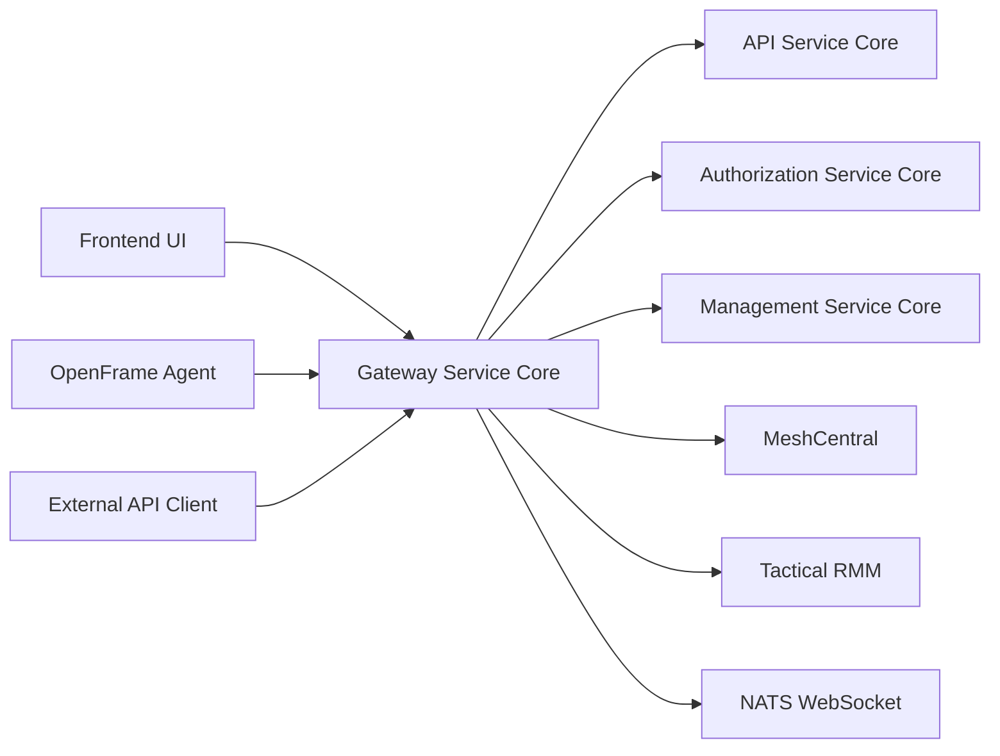
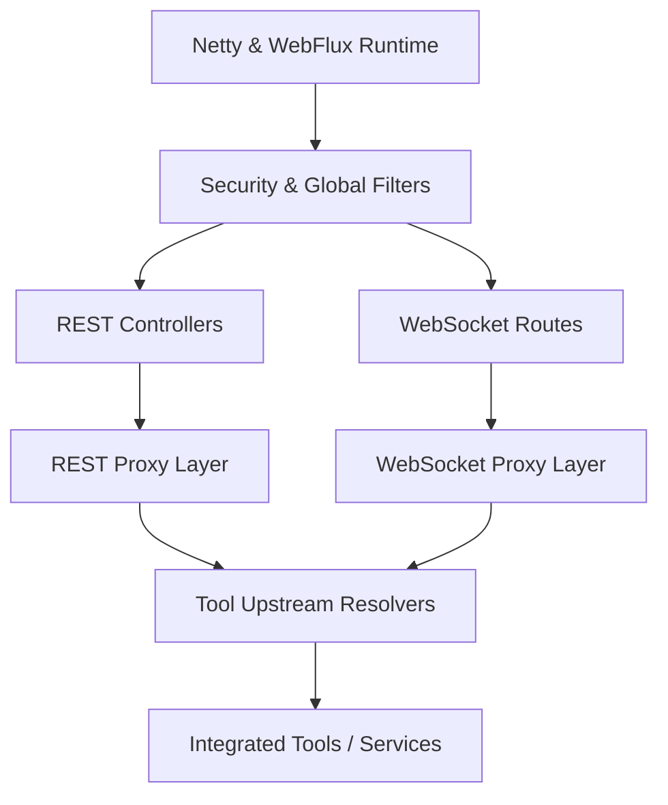
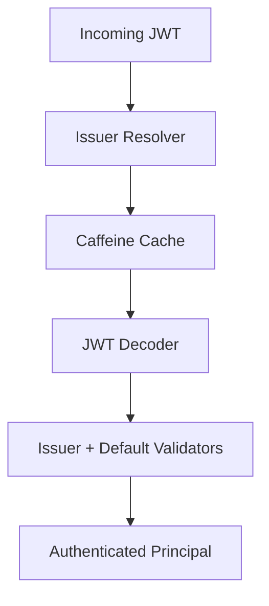
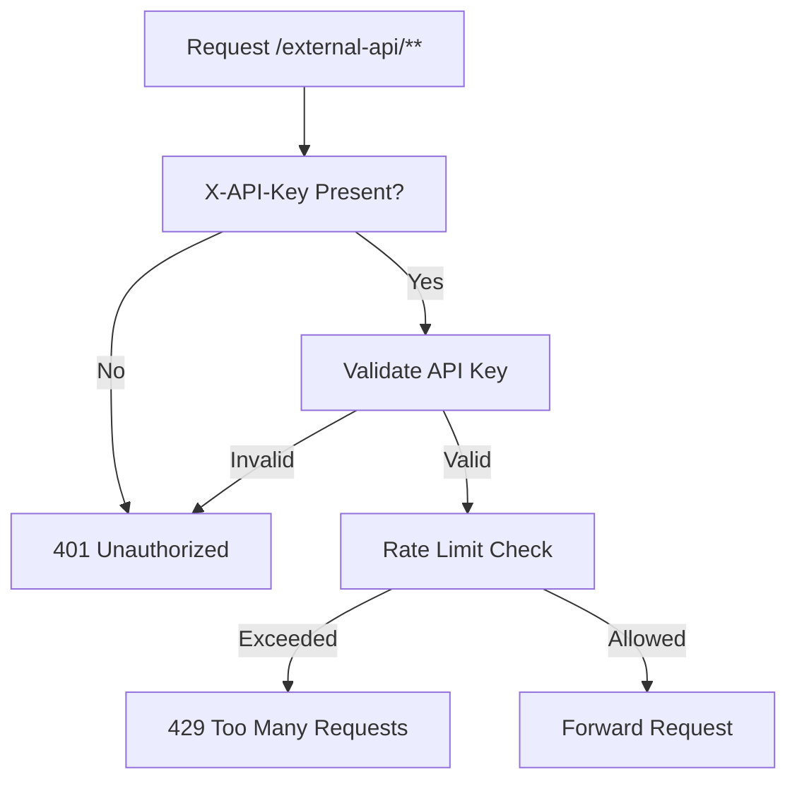
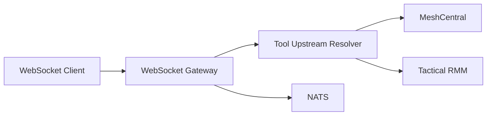
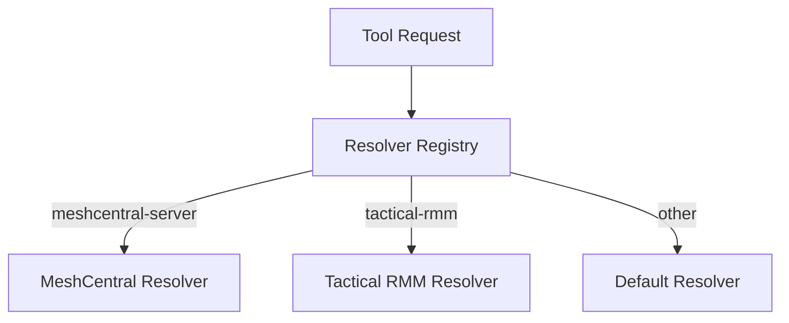

# Gateway Service Core

The **Gateway Service Core** module is the reactive edge layer of the OpenFrame platform. It acts as the unified entry point for:

- REST API traffic
- WebSocket connections
- Tool integrations (MeshCentral, Tactical RMM, and others)
- External API access with API keys and rate limiting
- Multi-tenant JWT validation and security enforcement

Built on **Spring Cloud Gateway + WebFlux (Netty)**, this module provides high-performance, non-blocking request routing and security orchestration between frontend clients, agents, and downstream services.

---

## 1. Architectural Overview

The Gateway Service Core sits between clients (UI, agents, integrations) and internal services or integrated tools.

```mermaid
flowchart LR
    Browser["Frontend UI"] --> Gateway["Gateway Service Core"]
    Agent["OpenFrame Agent"] --> Gateway
    ExternalAPI["External API Client"] --> Gateway

    Gateway --> ApiService["API Service Core"]
    Gateway --> AuthService["Authorization Service Core"]
    Gateway --> Management["Management Service Core"]
    Gateway --> ToolMesh["MeshCentral"]
    Gateway --> ToolTactical["Tactical RMM"]
    Gateway --> Nats["NATS WebSocket"]
```

### Responsibilities

1. **Authentication & Authorization** (JWT, roles, scopes)
2. **API Key validation and rate limiting**
3. **Tenant-aware issuer resolution**
4. **REST and WebSocket proxying**
5. **Tool-specific upstream resolution strategies**
6. **CORS and security header enforcement**
7. **Reactive performance tuning (Netty + WebClient)**

---

## 2. Core Layers Inside the Gateway

```mermaid
flowchart TD
    Netty["Netty & WebFlux Runtime"] --> Filters["Security & Global Filters"]
    Filters --> Controllers["REST Controllers"]
    Filters --> WsRoutes["WebSocket Routes"]

    Controllers --> RestProxy["REST Proxy Layer"]
    WsRoutes --> WsProxy["WebSocket Proxy Layer"]

    RestProxy --> UpstreamResolvers["Tool Upstream Resolvers"]
    WsProxy --> UpstreamResolvers

    UpstreamResolvers --> Downstream["Integrated Tools / Services"]
```

The module is structured around five main concerns:

- **Runtime & Networking Configuration**
- **Security & JWT Infrastructure**
- **API Key & Rate Limiting**
- **Tool Routing & Upstream Resolution**
- **WebSocket Proxying**

---

# 3. Runtime & Networking Configuration

### NettySocketConfig

Optimizes the embedded Netty server and client:

- Disables `SO_LINGER`
- Enables `TCP_NODELAY`
- Customizes both server and HTTP client behavior
- Provides a dedicated `ReactorNettyWebSocketClient`

This ensures low-latency proxy behavior for high-frequency WebSocket and REST traffic.

### WebClientConfig

Defines a tuned `WebClient.Builder` with:

- 30s connect timeout
- 30s read/write timeout
- Response timeout configuration

Used internally by proxy and integration services.

---

# 4. Security Architecture

Security in the Gateway Service Core is fully reactive and role-driven.

## 4.1 GatewaySecurityConfig

Configures:

- OAuth2 Resource Server (JWT validation)
- Role-based access rules
- WebFlux security filter chain
- Endpoint-level role constraints

### Role Model

- `ROLE_ADMIN`
- `ROLE_AGENT`
- `SCOPE_*` authorities

### Path-Based Access

Path constants define security zones:

- `/api/**` → ADMIN
- `/tools/agent/**` → AGENT
- `/ws/tools/**` → ADMIN or AGENT (depending on route)
- `/clients/**` → AGENT
- `/chat/**` → AGENT or ADMIN

---

## 4.2 JWT Multi-Tenant Validation

### JwtAuthConfig

Implements:

- Dynamic issuer-based authentication manager resolution
- Caffeine cache of `ReactiveAuthenticationManager`
- Strict issuer validation

```mermaid
flowchart TD
    Request["Incoming JWT"] --> IssuerResolver["Issuer Resolver"]
    IssuerResolver --> Cache["Caffeine Cache"]
    Cache --> JwtDecoder["JWT Decoder"]
    JwtDecoder --> Validator["Issuer + Default Validators"]
    Validator --> Authenticated["Authenticated Principal"]
```

### DefaultIssuerUrlProvider

OSS fallback for single-tenant deployments:

- Uses `allowed-issuer-base + super-tenant-id`
- Avoids database lookup

---

## 4.3 Authorization Header Injection

### AddAuthorizationHeaderFilter

Pre-auth filter that ensures an `Authorization` header exists by resolving the token from:

1. `access_token` cookie
2. Custom header
3. Query parameter

This enables:

- WebSocket auth
- Browser cookie-based sessions
- Backward compatibility with legacy clients

---

## 4.4 CORS Handling

Two configurations:

- **CorsConfig** → Standard configurable CORS
- **CorsDisableConfig** → Permissive CORS (SaaS mode)

Controlled via `openframe.gateway.disable-cors` property.

---

# 5. API Key Authentication & Rate Limiting

The gateway protects `/external-api/**` endpoints via a global filter.

## ApiKeyAuthenticationFilter

Flow:

```mermaid
flowchart TD
    Req["Request /external-api/**"] --> CheckHeader["X-API-Key Present?"]
    CheckHeader -->|"No"| Reject["401 Unauthorized"]
    CheckHeader -->|"Yes"| Validate["Validate API Key"]
    Validate -->|"Invalid"| Reject
    Validate -->|"Valid"| RateCheck["Rate Limit Check"]
    RateCheck -->|"Exceeded"| TooMany["429 Too Many Requests"]
    RateCheck -->|"Allowed"| Forward["Forward Request"]
```

### Responsibilities

- Validates API key
- Increments usage statistics
- Applies minute/hour/day limits
- Adds headers:
  - `X-RateLimit-Limit-*`
  - `X-RateLimit-Remaining-*`
- Injects user context headers

This enables secure external tool integrations and third-party automation.

---

# 6. REST Tool Proxying

## IntegrationController

Handles tool-based routing under:

- `/tools/{toolId}/**`
- `/tools/agent/{toolId}/**`

Capabilities:

- Health checks
- Integration tests
- Transparent REST proxying

Delegates to:

- `IntegrationService`
- `RestProxyService`

---

# 7. WebSocket Gateway

WebSocket routing is handled via Spring Cloud Gateway route definitions.

## WebSocketGatewayConfig

Defines routes for:

- `/ws/tools/agent/{toolId}/**`
- `/ws/tools/{toolId}/**`
- `/ws/nats`
- `/ws/nats-api`

Also provides:

- Optional proxy session cleanup
- WebSocket security decorator
- Traffic metrics integration

```mermaid
flowchart LR
    ClientWS["WebSocket Client"] --> GatewayWS["WebSocket Gateway"]
    GatewayWS --> ToolResolver["Tool Upstream Resolver"]
    ToolResolver --> Mesh["MeshCentral"]
    ToolResolver --> Tactical["Tactical RMM"]
    GatewayWS --> Nats["NATS"]
```

---

# 8. Tool Upstream Resolution Strategy

The gateway uses a pluggable `ToolUpstreamResolver` strategy.

## DefaultToolUpstreamResolver

- Reads tool URLs from Mongo
- Supports REST and WS
- Fallback for all tools

## MeshCentralUpstreamResolver

Optimized routing:

- Avoids Mongo lookup per request
- Reads config from `openframe.tools.meshcentral.*`
- Supports path prefix injection for tenant scoping

## TacticalRmmUpstreamResolver

Path-aware routing:

- REST → backend
- WS → Daphne
- WS with NATS path prefix → NATS upstream

```mermaid
flowchart TD
    Request["Tool Request"] --> ResolverRegistry["Resolver Registry"]
    ResolverRegistry -->|"meshcentral-server"| MeshResolver["MeshCentral Resolver"]
    ResolverRegistry -->|"tactical-rmm"| TacticalResolver["Tactical RMM Resolver"]
    ResolverRegistry -->|"other"| DefaultResolver["Default Resolver"]
```

This design allows each tool to define:

- Independent REST upstream
- Independent WebSocket upstream
- Path-based internal fan-out

Without modifying core gateway logic.

---

# 9. Origin Sanitization & Internal Probes

## OriginSanitizerFilter

Removes `Origin: null` headers to avoid WebSocket/CORS edge-case failures.

## InternalAuthProbeController

Optional internal probe endpoint:

- `/internal/authz/probe`
- Enabled only via configuration

Used for health or sidecar verification.

---

# 10. Interaction with Other Modules

The Gateway Service Core coordinates with:

- **Authorization Service Core** → Issues JWT tokens
- **API Service Core (HTTP & GraphQL)** → Business APIs
- **Management Service Core** → Tool initialization and lifecycle
- **Data Models & Mongo Repositories** → Tool and API key metadata
- **Stream Processing (Kafka)** → Event-driven backend processing
- **Frontend Core UI & Chat** → Consumes REST and WebSocket endpoints

The gateway itself remains stateless and reactive, delegating persistence and business logic to downstream modules.

---

# 11. Design Principles

1. **Reactive First** – Non-blocking I/O everywhere
2. **Multi-Tenant Secure by Default**
3. **Pluggable Tool Routing**
4. **Protocol-Agnostic Proxy (REST + WS)**
5. **Clear Role Segmentation (ADMIN vs AGENT)**
6. **OSS and SaaS Compatibility**

---

# Conclusion

The **Gateway Service Core** is the high-performance security and routing backbone of OpenFrame. It:

- Enforces authentication and authorization
- Validates API keys and rate limits
- Dynamically resolves JWT issuers per tenant
- Transparently proxies REST and WebSocket traffic
- Implements tool-specific upstream routing strategies

It enables OpenFrame to integrate diverse IT tools, agents, and clients behind a unified, secure, and reactive edge layer.