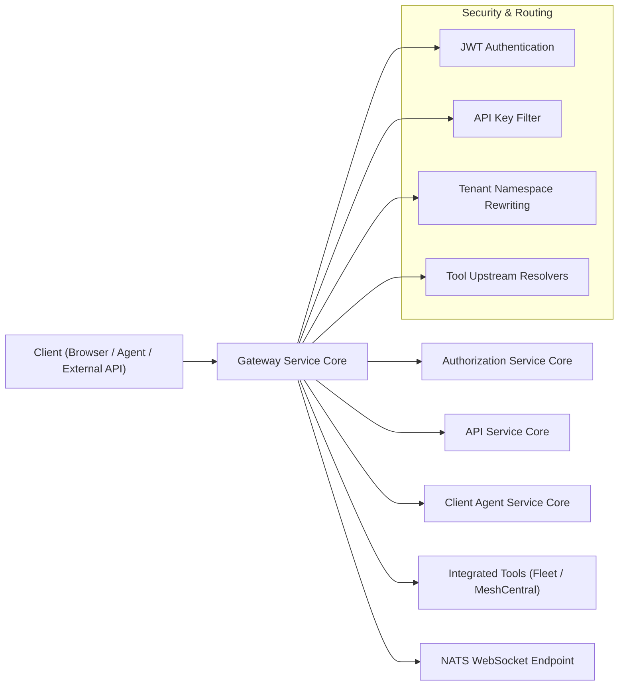
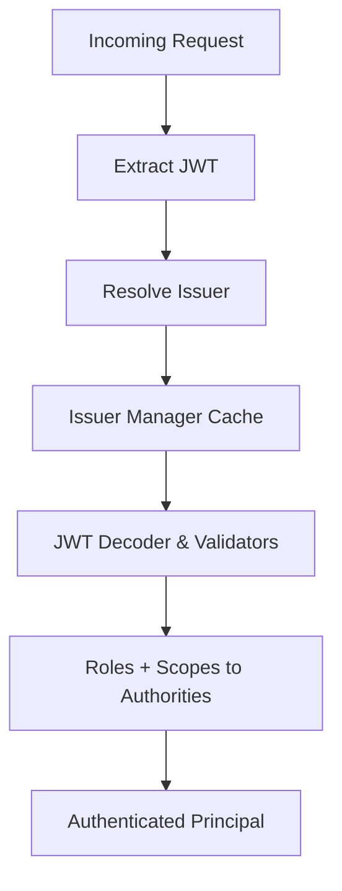
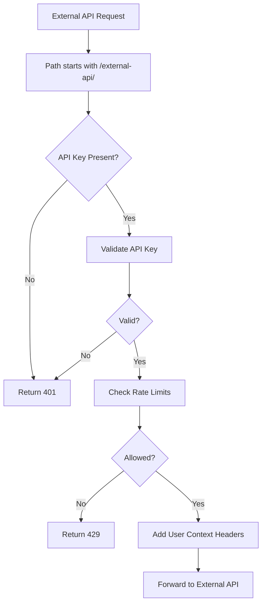
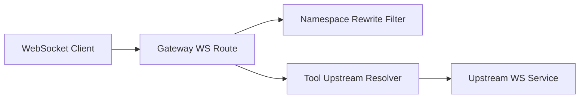
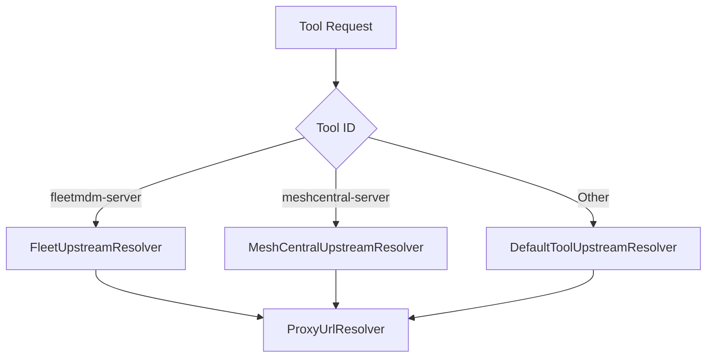

# Gateway Service Core

The **Gateway Service Core** module is the reactive edge layer of the OpenFrame platform. It acts as a secure, multi-tenant, protocol-aware entry point for HTTP and WebSocket traffic, routing requests to internal services and integrated third-party tools.

Built on **Spring Cloud Gateway (WebFlux + Netty)**, this module provides:

- JWT-based authentication and role-based authorization
- API key authentication and rate limiting for external APIs
- Multi-tenant namespace and path rewriting
- WebSocket proxying for tools and NATS
- Tool-specific upstream resolution strategies (Fleet, MeshCentral)
- Reactive REST proxying for tool integrations

It sits between clients (agents, admins, browsers, external systems) and internal services such as the API Service Core, Authorization Service Core, Client Agent Service Core, and integrated tool backends.

---

## Architectural Overview

```mermaid
flowchart LR
    Client["Client (Browser / Agent / External API)"] --> Gateway["Gateway Service Core"]

    Gateway --> Authz["Authorization Service Core"]
    Gateway --> ApiCore["API Service Core"]
    Gateway --> ClientCore["Client Agent Service Core"]
    Gateway --> Tools["Integrated Tools (Fleet / MeshCentral)"]
    Gateway --> Nats["NATS WebSocket Endpoint"]

    subgraph security["Security & Routing"]
        Jwt["JWT Authentication"]
        ApiKey["API Key Filter"]
        Tenant["Tenant Namespace Rewriting"]
        Upstream["Tool Upstream Resolvers"]
    end

    Gateway --> Jwt
    Gateway --> ApiKey
    Gateway --> Tenant
    Gateway --> Upstream
```

The Gateway Service Core is responsible for:

1. Authenticating incoming requests (JWT or API key).
2. Authorizing access based on roles (ADMIN, AGENT).
3. Rewriting tenant-specific routing information.
4. Resolving upstream destinations dynamically.
5. Proxying REST and WebSocket traffic in a reactive, non-blocking way.

---

## Core Responsibilities

### 1. Reactive Networking and Netty Customization

**Key components:**
- `NettySocketConfig`
- `WebClientConfig`

The module customizes the underlying Netty server and client behavior:

- Disables `SO_LINGER`
- Enables `TCP_NODELAY`
- Configures connection and response timeouts
- Provides a shared `WebClient.Builder`
- Exposes a tuned `ReactorNettyWebSocketClient`

This ensures low-latency, high-throughput reactive traffic suitable for WebSocket proxying and API forwarding.

---

### 2. Security Architecture

Security is implemented using **Spring Security WebFlux** with OAuth2 Resource Server support.

**Key components:**
- `GatewaySecurityConfig`
- `JwtAuthConfig`
- `PathConstants`

#### JWT Authentication (Multi-Issuer)

`JwtAuthConfig`:

- Uses `JwtIssuerReactiveAuthenticationManagerResolver`
- Caches authentication managers per issuer using Caffeine
- Supports strict issuer validation via `IssuerUrlProvider`
- Combines roles and scopes into authorities

Authentication managers are cached with:
- Maximum size
- Expire-after-write
- Refresh-after-write

```mermaid
flowchart TD
    Request["Incoming Request"] --> Extract["Extract JWT"]
    Extract --> Issuer["Resolve Issuer"]
    Issuer --> Cache["Issuer Manager Cache"]
    Cache --> Validator["JWT Decoder & Validators"]
    Validator --> Authorities["Roles + Scopes to Authorities"]
    Authorities --> Authenticated["Authenticated Principal"]
```

#### Role-Based Authorization

`GatewaySecurityConfig` defines path-based authorization rules:

- `/api/**` → ADMIN
- `/tools/agent/**` → AGENT
- `/ws/tools/agent/**` → AGENT
- `/tools/**` → ADMIN
- `/clients/**` → AGENT
- NATS WebSocket endpoints → ADMIN or AGENT

Security is applied reactively via a `SecurityWebFilterChain`.

---

### 3. API Key Authentication and Rate Limiting

**Key component:**
- `ApiKeyAuthenticationFilter`

This is a `GlobalFilter` applied to `/external-api/**` endpoints.

#### Processing Flow

```mermaid
flowchart TD
    Start["External API Request"] --> CheckPath["Path starts with /external-api/"]
    CheckPath --> HasKey{"API Key Present?"}
    HasKey -->|"No"| Unauthorized["Return 401"]
    HasKey -->|"Yes"| Validate["Validate API Key"]
    Validate --> Valid{"Valid?"}
    Valid -->|"No"| Unauthorized
    Valid -->|"Yes"| RateCheck["Check Rate Limits"]
    RateCheck --> Allowed{"Allowed?"}
    Allowed -->|"No"| TooMany["Return 429"]
    Allowed -->|"Yes"| AddHeaders["Add User Context Headers"]
    AddHeaders --> Forward["Forward to External API"]
```

#### Features

- Requires `X-API-Key` header
- Validates API key (via `ApiKeyValidationService`)
- Enforces minute/hour/day rate limits
- Adds rate-limit headers:
  - `X-Rate-Limit-Limit-Minute`
  - `X-Rate-Limit-Remaining-Minute`
  - `X-Rate-Limit-Limit-Hour`
  - `X-Rate-Limit-Remaining-Hour`
  - `X-Rate-Limit-Limit-Day`
  - `X-Rate-Limit-Remaining-Day`
- Injects user context headers:
  - `X-API-Key-Id`
  - `X-User-Id`
- Records success/failure statistics

In multi-tenant mode, rate limiting is scoped using the trusted `X-Tenant-Id` header.

---

### 4. WebSocket Gateway and Proxying

**Key component:**
- `WebSocketGatewayConfig`

Defines WebSocket routes for:

- `/ws/tools/agent/{toolId}/**`
- `/ws/tools/{toolId}/**`
- `/ws/nats`
- `/ws/nats-api`

#### Route Behavior

- Tool routes use custom WebSocket proxy URL filters.
- NATS routes use `NamespaceRewriteGatewayFilter`.
- Optional proxy wrapper enables:
  - Frame payload logging
  - Proxy session cleanup

Additionally, a `WebSocketServiceSecurityDecorator`:

- Reads JWT claims
- Enforces security
- Emits gateway traffic metrics

```mermaid
flowchart LR
    WsClient["WebSocket Client"] --> GatewayWs["Gateway WS Route"]
    GatewayWs --> Rewrite["Namespace Rewrite Filter"]
    GatewayWs --> Resolver["Tool Upstream Resolver"]
    Resolver --> UpstreamWs["Upstream WS Service"]
```

This allows secure, tenant-aware WebSocket routing for agents and tool integrations.

---

### 5. Multi-Tenant Routing

**Key component:**
- `NamespaceRewriteGatewayFilter`

This route-scoped filter:

- Reads trusted tenant headers
- Rewrites the resolved upstream URI
- Applies only when `openframe.gateway.tenant-routing.enabled=true`

Behavior:

- Multi-tenant mode → rewrite namespace placeholders
- Single-tenant mode → no-op

The filter runs immediately after route resolution to ensure correct cluster-local addressing.

---

### 6. Tool Upstream Resolution Strategies

The Gateway Service Core supports pluggable upstream resolvers for integrated tools.

#### Fleet Upstream Resolver

**Key component:**
- `FleetUpstreamResolver`

- Supports tool ID: `fleetmdm-server`
- Enables shared-Fleet multi-tenancy
- Separately gates REST and WebSocket routing
- Falls back to `DefaultToolUpstreamResolver` if not configured

Used when a single Fleet instance serves multiple tenants within a cluster.

#### MeshCentral Upstream Resolver

**Key component:**
- `MeshCentralUpstreamResolver`

- Supports tool ID: `meshcentral-server`
- Avoids per-request MongoDB lookups
- Applies namespace and path-prefix rewrites in multi-tenant mode
- Carefully rebuilds URIs to preserve encoded query parameters

```mermaid
flowchart TD
    ToolRequest["Tool Request"] --> Match{"Tool ID"}
    Match -->|"fleetmdm-server"| Fleet["FleetUpstreamResolver"]
    Match -->|"meshcentral-server"| Mesh["MeshCentralUpstreamResolver"]
    Match -->|"Other"| Default["DefaultToolUpstreamResolver"]
    Fleet --> Proxy["ProxyUrlResolver"]
    Mesh --> Proxy
    Default --> Proxy
```

This design allows optimized routing logic per tool without impacting other integrations.

---

### 7. Integration REST Proxy

**Key component:**
- `IntegrationController`

Handles REST proxying for tools under `/tools/**`.

Endpoints:

- `GET /tools/{toolId}/health`
- `POST /tools/{toolId}/test`
- Generic proxy for:
  - `/tools/{toolId}/**`
  - `/tools/agent/{toolId}/**`

Delegates to:

- `IntegrationService` for health checks
- `RestProxyService` for generic request forwarding

This enables:

- Admin UI to communicate with tool APIs
- Agents to proxy traffic securely
- Transparent forwarding with preserved HTTP methods

---

## Interaction with Other Modules

The Gateway Service Core integrates closely with:

- **Authorization Service Core** for OAuth2/JWT issuance and validation.
- **API Service Core** for internal administrative APIs.
- **Client Agent Service Core** for agent registration and management endpoints.
- **External REST API Service Core** for `/external-api/**` routing.
- **Data Mongo Domain Model** and repositories indirectly through downstream services.

The Gateway does not contain domain logic or persistence. Its responsibility is:

- Security enforcement
- Tenant isolation
- Protocol translation
- Intelligent routing

---

## Design Principles

1. **Reactive by Default** – Built entirely on WebFlux and Netty.
2. **Strict Tenant Isolation** – Namespace rewriting and header-based scoping.
3. **Protocol-Aware** – Separate handling for REST and WebSocket.
4. **Pluggable Routing** – Tool-specific upstream resolvers.
5. **Edge-Level Enforcement** – Authentication, authorization, and rate limiting at the boundary.

---

## Summary

The **Gateway Service Core** is the secure, reactive edge layer of OpenFrame. It:

- Authenticates and authorizes every request
- Enforces API key validation and rate limits
- Routes REST and WebSocket traffic dynamically
- Applies tenant-aware rewriting in multi-tenant deployments
- Resolves tool-specific upstream strategies

It is the foundational module that enables scalable, multi-tenant, secure access to the entire OpenFrame platform ecosystem.
