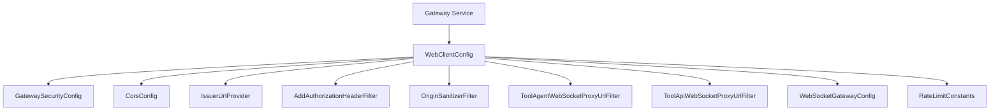
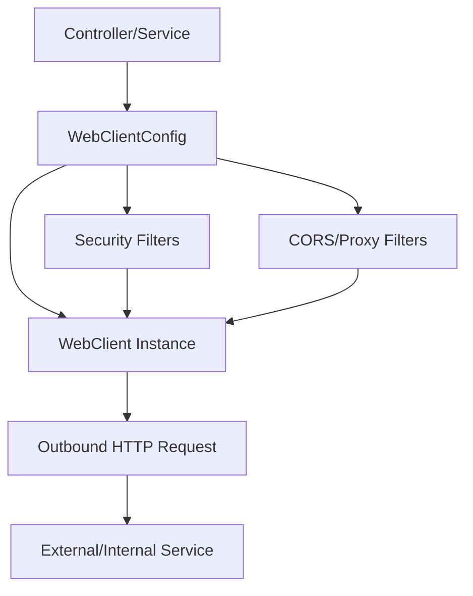

# gateway_service_core_config Module Documentation

## Introduction

gateway_service_core_config is responsible for configuring the core HTTP client infrastructure for the Gateway Service. Its primary role is to provide a standardized, secure, and extensible WebClient configuration for outbound HTTP requests made by the gateway, including integration with authentication, security, and proxying layers. This module is foundational for enabling communication between the gateway and external/internal services, ensuring consistent behavior, observability, and compliance with security policies.

## Core Component

### WebClientConfig

- **Purpose:**
  - Centralizes the configuration of the WebClient (Spring's reactive HTTP client) used by the gateway for outbound HTTP calls.
  - Ensures that all HTTP requests from the gateway are subject to consistent settings for timeouts, connection pooling, SSL, logging, and custom filters (such as authentication or tracing).
  - Provides extension points for injecting additional filters or customizations as required by other modules (e.g., security, CORS, tenant isolation).

- **Key Responsibilities:**
  - Define and instantiate the WebClient bean(s) for use throughout the gateway service.
  - Integrate with security modules (see [gateway_service_core_security.md]) to apply authentication headers or JWT tokens.
  - Support for proxying, CORS, and multi-tenant scenarios via integration with related modules (see [gateway_service_core_security_cors.md], [gateway_service_core_security_tenant.md]).
  - Enable observability features such as logging, tracing, and metrics collection for outbound requests.

- **Typical Usage:**
  - Consumed by controllers, services, and filters that need to make HTTP calls to other microservices, third-party APIs, or internal endpoints.
  - Used in conjunction with filters from [gateway_service_core_filter.md] and [gateway_service_core_security_filter.md] to enforce security and compliance.

## Architecture & Component Relationships

- **Legend:**
  - **WebClientConfig**: This module's core component.
  - **GatewaySecurityConfig, CorsConfig, IssuerUrlProvider, AddAuthorizationHeaderFilter, OriginSanitizerFilter**: Security and compliance modules that provide filters and configuration for outbound requests.
  - **ToolAgentWebSocketProxyUrlFilter, ToolApiWebSocketProxyUrlFilter, WebSocketGatewayConfig**: WebSocket proxying and configuration modules.
  - **RateLimitConstants**: Provides rate limiting configuration for outbound calls.

## Data Flow & Process Overview

- **Step 1:** A controller or service requests a WebClient instance from WebClientConfig.
- **Step 2:** WebClientConfig applies security, CORS, and proxy filters as configured.
- **Step 3:** The WebClient instance is used to make an outbound HTTP request.
- **Step 4:** The request is sent to the target external or internal service.

## Integration with Other Modules

- **Security:**
  - Integrates with [gateway_service_core_security.md] and [gateway_service_core_security_filter.md] to ensure all outbound requests are authenticated and authorized.
- **CORS and Proxying:**
  - Works with [gateway_service_core_security_cors.md] and [gateway_service_core_config_ws.md] for cross-origin and WebSocket proxy scenarios.
- **Rate Limiting:**
  - Utilizes [gateway_service_core_constants.md] for enforcing outbound request rate limits.
- **Tenant Isolation:**
  - Leverages [gateway_service_core_security_tenant.md] for multi-tenant context propagation.

## Extensibility

- Additional filters or customizations can be injected via Spring configuration or by extending WebClientConfig.
- Supports integration with observability tools for logging, tracing, and metrics.

## References

- [gateway_service_core_security.md]
- [gateway_service_core_security_filter.md]
- [gateway_service_core_security_cors.md]
- [gateway_service_core_security_tenant.md]
- [gateway_service_core_config_ws.md]
- [gateway_service_core_constants.md]

---

*For details on the implementation of security, CORS, and WebSocket proxying, refer to the respective module documentation files listed above.*
