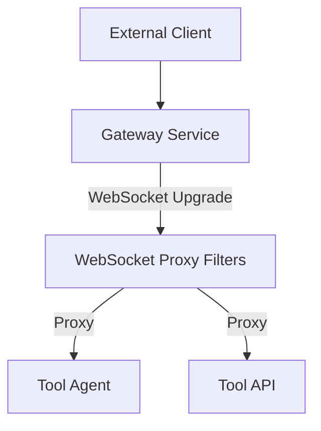
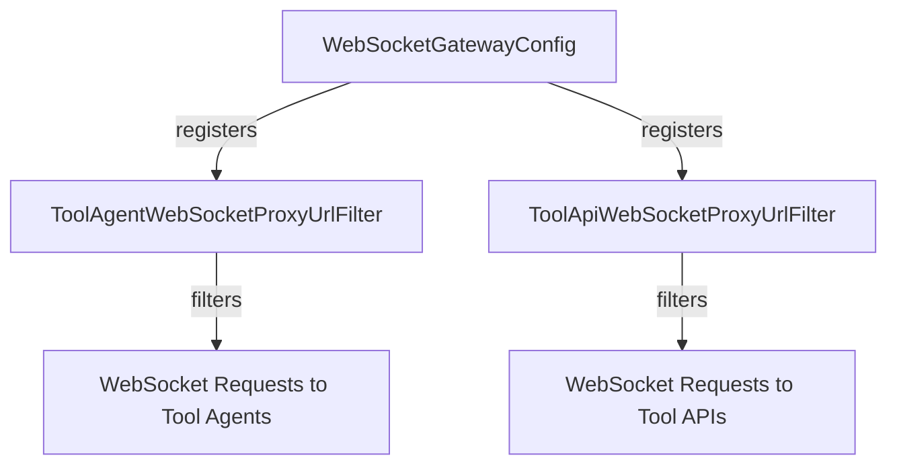
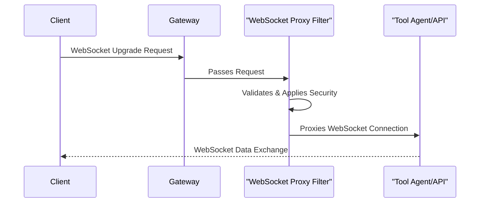

# gateway_service_core_config_ws Module Documentation

## Introduction

gateway_service_core_config_ws is a configuration module responsible for setting up and managing WebSocket proxying and gateway behavior for tool agents and APIs within the gateway service. It provides filters and configuration classes that control how WebSocket traffic is routed, secured, and filtered between clients, tool agents, and backend APIs. This module is essential for enabling real-time, bidirectional communication between external clients and internal services via WebSocket, while enforcing security and routing policies.

## Core Components

- **ToolAgentWebSocketProxyUrlFilter**: Filter for proxying WebSocket connections to tool agents, enforcing URL and security policies.
- **ToolApiWebSocketProxyUrlFilter**: Filter for proxying WebSocket connections to tool APIs, with similar enforcement as above but for API endpoints.
- **WebSocketGatewayConfig**: Central configuration class for WebSocket gateway behavior, including filter registration, allowed origins, and proxy settings.

## Architecture Overview

The module is designed to work as part of the gateway service, sitting between external clients and internal tool agents/APIs. It leverages filter chains to intercept and process WebSocket upgrade requests, applying security and routing logic before proxying the connection to the appropriate backend service.

### High-Level Architecture

- **Client**: Initiates WebSocket connection.
- **Gateway Service**: Entry point, applies filter chain.
- **WebSocket Proxy Filters**: Includes ToolAgentWebSocketProxyUrlFilter and ToolApiWebSocketProxyUrlFilter.
- **Tool Agent / Tool API**: Target backend services.

## Component Relationships and Data Flow

### Component Interaction

- **WebSocketGatewayConfig**: Instantiates and registers the proxy filters.
- **ToolAgentWebSocketProxyUrlFilter**: Handles and filters WebSocket requests targeting tool agents.
- **ToolApiWebSocketProxyUrlFilter**: Handles and filters WebSocket requests targeting tool APIs.

### Data Flow

1. **Client** sends a WebSocket upgrade request to the gateway.
2. **WebSocketGatewayConfig** ensures the appropriate filters are in place.
3. **ToolAgentWebSocketProxyUrlFilter** or **ToolApiWebSocketProxyUrlFilter** intercepts the request based on the URL pattern.
4. The filter validates, applies security/routing logic, and proxies the connection to the correct backend (Tool Agent or Tool API).

## Dependencies and Integration

This module is tightly integrated with other gateway service modules:

- **[gateway_service_core_config.md]**: For general gateway configuration (e.g., WebClientConfig).
- **[gateway_service_core_security.md]**: For security configuration and JWT authentication.
- **[gateway_service_core_constants.md]**: For rate limiting and path constants.
- **[gateway_service_core_filter.md]**: For additional API key authentication filters.

It is also designed to work with the broader service architecture, including:

- **api_service_core_config**: For API application and security configuration.
- **api_service_core_controller**: For REST endpoints that may interact with WebSocket-enabled services.

## Example Process Flow

## Extending and Customizing

- To add new proxying rules or filters, extend the configuration in **WebSocketGatewayConfig**.
- To enforce additional security or routing logic, implement or modify the relevant filter (ToolAgentWebSocketProxyUrlFilter or ToolApiWebSocketProxyUrlFilter).
- For integration with authentication, refer to [gateway_service_core_security.md].

## See Also

- [gateway_service_core_config.md]: General gateway configuration
- [gateway_service_core_security.md]: Security and authentication
- [gateway_service_core_constants.md]: Constants and path definitions
- [gateway_service_core_filter.md]: API key and other filters

---

*This documentation provides an overview of the gateway_service_core_config_ws module, its architecture, and its role in the gateway service. For details on related modules, see the referenced documentation files.*
