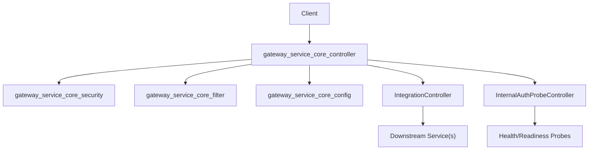
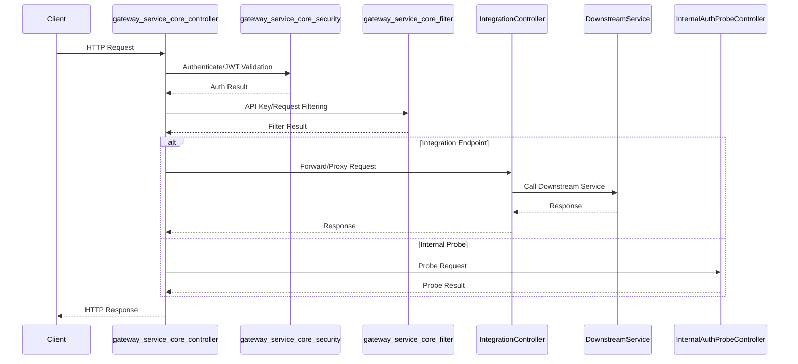

# gateway_service_core_controller Module Documentation

## Introduction

gateway_service_core_controller is a central module in the gateway service layer, responsible for handling HTTP API endpoints related to integration and internal authentication probing. It acts as the entry point for requests that need to be routed, authenticated, or proxied to internal or external services, and is a key part of the gateway's security and integration infrastructure.

This module is designed to:
- Expose integration endpoints for external/internal services
- Provide internal health and authentication probe endpoints
- Enforce gateway-level security and filtering
- Serve as a bridge between the gateway and downstream microservices or APIs

## Core Components

- **IntegrationController**: Handles integration-related API endpoints, such as proxying requests, managing integration flows, or facilitating communication between the gateway and other services.
- **InternalAuthProbeController**: Exposes endpoints for internal authentication and health probes, often used for liveness/readiness checks or internal service authentication validation.

## Architecture Overview

The gateway_service_core_controller module is part of the broader gateway service architecture. It interacts closely with security, configuration, and filter modules to ensure secure and reliable request handling.

### Component Relationships

- **gateway_service_core_controller** depends on:
  - [gateway_service_core_security.md]: For security configuration and JWT authentication ([GatewaySecurityConfig], [JwtAuthConfig], [PathConstants])
  - [gateway_service_core_filter.md]: For API key authentication and request filtering ([ApiKeyAuthenticationFilter])
  - [gateway_service_core_config.md]: For web client and gateway configuration ([WebClientConfig])
  - [gateway_service_core_config_ws.md]: For WebSocket proxying and configuration ([WebSocketGatewayConfig])

- **IntegrationController** may interact with downstream services, either by proxying requests or orchestrating integration flows.
- **InternalAuthProbeController** is typically used by internal monitoring or orchestration systems to check the health and authentication status of the gateway.

## Data Flow

## Component Interaction

- **IntegrationController**
  - Receives requests from clients or other services
  - Validates and authenticates requests via security and filter modules
  - Proxies or orchestrates requests to downstream services
  - Returns responses to the client

- **InternalAuthProbeController**
  - Exposes endpoints for health and authentication checks
  - Used by internal systems for monitoring and orchestration

## Dependencies and Related Modules

- [gateway_service_core_security.md]: Security configuration and JWT authentication
- [gateway_service_core_filter.md]: API key authentication and request filtering
- [gateway_service_core_config.md]: Web client and gateway configuration
- [gateway_service_core_config_ws.md]: WebSocket proxy configuration

## How It Fits Into the System

The gateway_service_core_controller module is the main entry point for integration and internal probe requests in the gateway service. It ensures that all incoming requests are properly authenticated, authorized, and filtered before being routed to the appropriate downstream service or internal handler. This makes it a critical component for enforcing security, observability, and integration consistency across the system.

For more details on related modules, see:
- [gateway_service_core_security.md]
- [gateway_service_core_filter.md]
- [gateway_service_core_config.md]
- [gateway_service_core_config_ws.md]

---
*This documentation is auto-generated. For implementation details, refer to the source code and related module documentation.*
