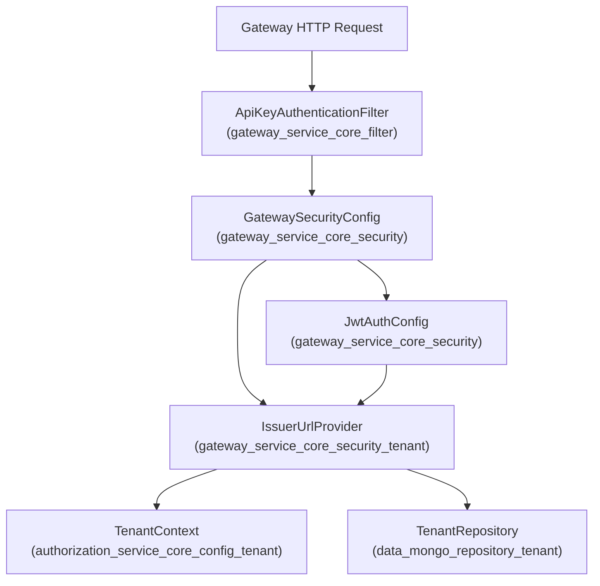
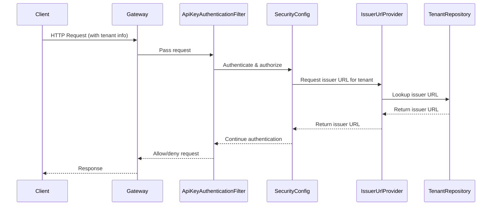

# gateway_service_core_security_tenant Module Documentation

## Introduction

gateway_service_core_security_tenant is a focused module within the gateway service layer, responsible for providing tenant-aware security support. Its primary role is to supply tenant-specific issuer URLs for authentication and authorization flows, enabling secure, multi-tenant operation of the gateway service. This module is essential for environments where multiple tenants (organizations or customers) are served from a single gateway instance, and each tenant may have its own identity provider or security configuration.

## Core Functionality

- **Issuer URL Resolution**: Supplies the correct issuer URL for a given tenant, which is critical for validating JWTs and integrating with tenant-specific identity providers.
- **Integration Point**: Serves as a bridge between the gateway's security configuration and the broader multi-tenant context, ensuring that security operations are always tenant-aware.

## Core Components

### IssuerUrlProvider
- **Purpose**: Central service/component that determines and provides the issuer URL for a given tenant context.
- **Usage**: Consumed by security filters, authentication handlers, and other security infrastructure within the gateway to ensure that all security checks are performed against the correct tenant's issuer.
- **Typical Methods**:
    - `getIssuerUrl(tenantId)`: Returns the issuer URL for the specified tenant.
    - May cache or retrieve issuer URLs from a configuration service or tenant registry.

## Architecture & Component Relationships

The following diagram illustrates how `gateway_service_core_security_tenant` fits into the overall gateway security architecture:

### Explanation
- **ApiKeyAuthenticationFilter**: Handles initial authentication, may extract tenant context from the request.
- **GatewaySecurityConfig**: Configures security filters and authentication mechanisms, delegates issuer resolution to IssuerUrlProvider.
- **IssuerUrlProvider**: Core of this module, provides tenant-specific issuer URLs.
- **TenantContext**: Supplies current tenant information, possibly from request context or a filter.
- **TenantRepository**: Data source for tenant configuration, including issuer URLs.
- **JwtAuthConfig**: Uses IssuerUrlProvider to validate JWTs against the correct issuer.

## Data Flow

## Dependencies & Integration

- **Depends on:**
    - [authorization_service_core_config_tenant.md]: For tenant context management (`TenantContext`)
    - [data_mongo_repository_tenant.md]: For tenant configuration and issuer URL storage (`TenantRepository`)
    - [gateway_service_core_security.md]: For overall gateway security configuration and JWT handling
    - [gateway_service_core_filter.md]: For authentication filter integration

- **Used by:**
    - All gateway security flows that require tenant-aware issuer validation
    - JWT authentication and authorization mechanisms

## How It Fits Into the System

gateway_service_core_security_tenant is a specialized module that enables the gateway to operate securely in a multi-tenant environment. By abstracting issuer URL resolution, it allows the rest of the security infrastructure to remain agnostic of tenant-specific details, promoting modularity and maintainability.

For more details on related modules, see:
- [authorization_service_core_config_tenant.md] for tenant context management
- [data_mongo_repository_tenant.md] for tenant data access
- [gateway_service_core_security.md] for gateway security configuration
- [gateway_service_core_filter.md] for authentication filter logic

## Summary

gateway_service_core_security_tenant is a critical enabler for secure, multi-tenant gateway operation, providing the glue between tenant context, data storage, and security configuration. Its main responsibility is to ensure that all security operations are performed with the correct tenant's identity provider, supporting robust and scalable authentication and authorization flows.
