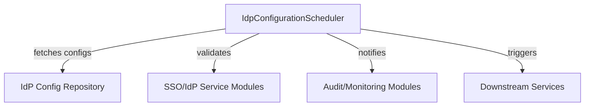
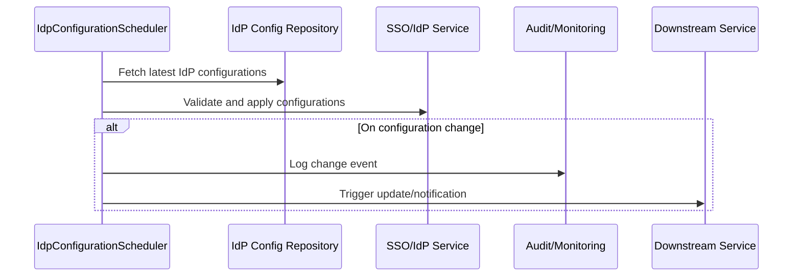

# idp_configuration_scheduler Module Documentation

## Introduction

The `idp_configuration_scheduler` module is responsible for orchestrating scheduled tasks related to Identity Provider (IdP) configuration management within the broader system. Its primary function is to ensure that IdP configurations are kept up-to-date, synchronized, and consistent across tenants and services that rely on federated authentication and Single Sign-On (SSO) capabilities. This module is critical in environments where IdP settings may change dynamically or require periodic validation and refresh.

## Core Component

- **IdpConfigurationScheduler**: The main scheduler class responsible for executing periodic jobs related to IdP configuration.

## Purpose and Core Functionality

The `idp_configuration_scheduler` module automates the following key tasks:

- **Periodic Synchronization**: Ensures that IdP configurations (such as SSO provider settings, client registrations, and tenant-specific IdP metadata) are regularly synchronized with external sources or internal configuration stores.
- **Configuration Validation**: Periodically validates the integrity and correctness of IdP configurations, detecting misconfigurations or expired credentials.
- **Triggering Downstream Updates**: Notifies or triggers updates in dependent services or modules when IdP configuration changes are detected.
- **Audit and Monitoring**: Optionally logs configuration changes and synchronization events for audit and monitoring purposes.

## Architecture Overview

The `idp_configuration_scheduler` module is designed to operate as a background scheduler, typically leveraging a task scheduling framework (such as Spring Scheduler or Quartz in Java-based systems). It interacts with configuration repositories, SSO/IdP service modules, and notification/audit subsystems.

### High-Level Architecture

- **IdpConfigurationScheduler**: Orchestrates scheduled tasks.
- **IdP Config Repository**: Stores IdP and SSO provider configurations (may be a database or external config service).
- **SSO/IdP Service Modules**: Handle SSO logic, client registration, and provider metadata (see [api_service_core_service](api_service_core_service.md), [authorization_service_core_service_sso](authorization_service_core_service_sso.md)).
- **Audit/Monitoring Modules**: Log and monitor configuration changes (see [api_lib_dto_audit](api_lib_dto_audit.md)).
- **Downstream Services**: Any service that depends on up-to-date IdP configuration (e.g., authentication gateways, tenant management).

## Component Interactions

### Data Flow and Process

### Dependencies

- **Configuration Storage**: Relies on a repository or database for storing IdP configurations (see [data_mongo_document_tenant](data_mongo_document_tenant.md)).
- **SSO/IdP Service Modules**: For applying and validating configurations (see [api_service_core_service](api_service_core_service.md), [authorization_service_core_service_sso](authorization_service_core_service_sso.md)).
- **Audit/Monitoring**: For logging and monitoring (see [api_lib_dto_audit](api_lib_dto_audit.md)).
- **Downstream Notification**: May interact with notification or eventing systems to propagate changes.

## Integration in the Overall System

The `idp_configuration_scheduler` module is a backend infrastructure component that ensures the reliability and consistency of federated authentication across the platform. It is especially important in multi-tenant environments where each tenant may have unique IdP settings that must be kept current.

It works in concert with:
- **Tenant and SSO configuration modules** ([authorization_service_core_config_tenant](authorization_service_core_config_tenant.md), [authorization_service_core_service_sso](authorization_service_core_service_sso.md))
- **Audit and logging modules** ([api_lib_dto_audit](api_lib_dto_audit.md))
- **Core SSO/IdP service logic** ([api_service_core_service](api_service_core_service.md))

## Related Modules

- [api_service_core_service](api_service_core_service.md): SSO configuration and management services
- [authorization_service_core_service_sso](authorization_service_core_service_sso.md): Default provider configs for SSO
- [data_mongo_document_tenant](data_mongo_document_tenant.md): Tenant-specific IdP configuration storage
- [api_lib_dto_audit](api_lib_dto_audit.md): Audit logging and monitoring

## Summary

The `idp_configuration_scheduler` module is a foundational component for maintaining the health and consistency of IdP configurations across the system. By automating synchronization, validation, and notification processes, it reduces manual intervention and ensures a secure, reliable authentication experience for all tenants and users.
