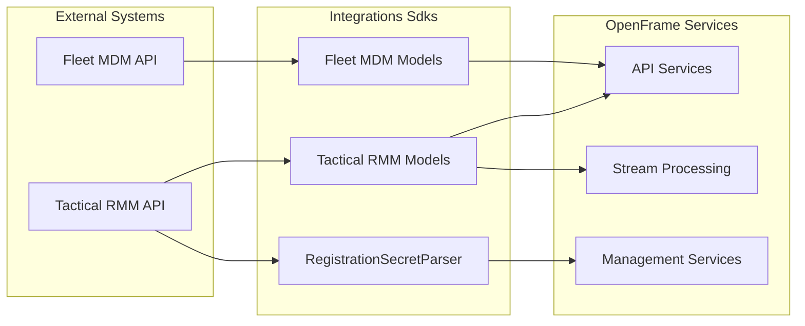
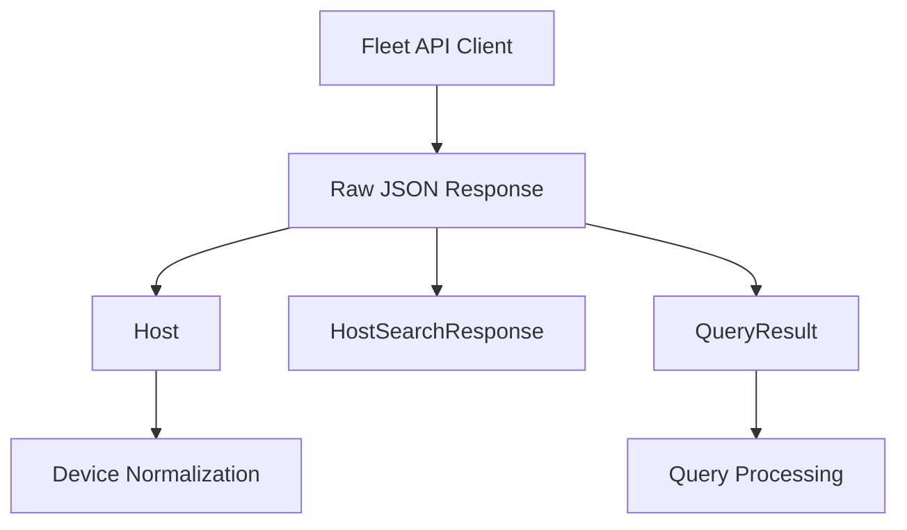
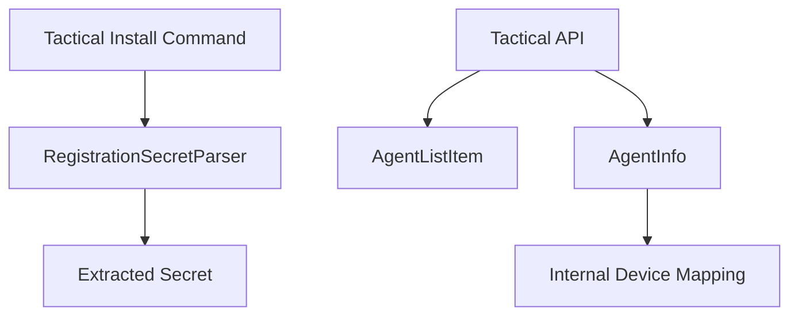
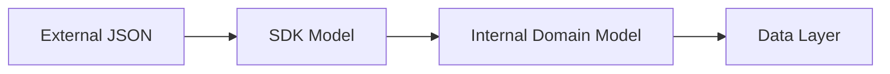

# Integrations Sdks

The **Integrations Sdks** module provides strongly typed Java SDK models and utilities for interacting with external RMM and MDM platforms integrated into OpenFrame. It acts as a boundary layer between third-party APIs (such as Fleet MDM and Tactical RMM) and the internal OpenFrame services.

This module focuses on:

- External API response modeling
- Command parsing utilities
- Normalized representations of remote agents and hosts
- Lightweight, dependency-free integration contracts

It does **not** contain transport logic (HTTP clients) or persistence. Instead, it provides reusable SDK components consumed by higher-level services such as API services, stream processors, and management services.

---

## Architectural Positioning

The Integrations Sdks module sits at the edge of the system where OpenFrame communicates with third-party tools.



### Responsibilities by Layer

- **External Systems**: Provide raw JSON payloads and command strings.
- **Integrations Sdks**: Convert raw external data into strongly typed Java models.
- **OpenFrame Services**: Apply business logic, persistence, enrichment, and streaming.

---

# Fleet MDM SDK

The Fleet MDM SDK provides models for interacting with Fleet's REST API and osquery execution results.

## Core Components

### Host

**Component:** `Host`

Represents a device enrolled in Fleet MDM. This class maps directly to Fleet's host JSON representation using Jackson annotations.

Key characteristics:

- Uses `@JsonIgnoreProperties(ignoreUnknown = true)` for forward compatibility
- Maps snake_case JSON fields using `@JsonProperty`
- Contains hardware, OS, network, and agent metadata
- Provides getters/setters and a detailed `toString()`

### Functional Domains Covered

The Host model encapsulates:

- **Identity**: `id`, `uuid`, `hostname`, `displayName`
- **Platform**: `platform`, `osVersion`, `build`, `codeName`
- **Hardware**: CPU details, memory, vendor, model, serial
- **Network**: `primaryIp`, `primaryMac`, `publicIp`
- **Fleet Metadata**: team ID, enrollment timestamps, update timestamps
- **Disk Metrics**: available space, total space, percentage

This rich structure enables downstream services to:

- Normalize device inventory
- Enrich events
- Map Fleet devices to internal Device entities

---

### HostSearchResponse

**Component:** `HostSearchResponse`

Wraps paginated host search results from Fleet.

Fields include:

- `hosts` (List of Host)
- `page`
- `perPage`
- `orderKey`
- `orderDirection`
- `query`

This model ensures pagination and sorting metadata are preserved when forwarding data to internal services.

---

### QueryResult

**Component:** `QueryResult`

Represents the result of executing an osquery query on a Fleet host.

Important fields:

- `hostId`
- `rows` (List of dynamic key-value maps)
- `error`
- `status`
- `query`
- `executedAt`

#### Helper Methods

- `isSuccess()` – Checks if the query completed without error.
- `getRowCount()` – Returns number of result rows safely.

This abstraction allows OpenFrame services to:

- Process structured query results
- Handle partial failures gracefully
- Stream enriched query outputs

---

## Fleet Data Flow Example



---

# Tactical RMM SDK

The Tactical RMM SDK provides models and utilities for interacting with Tactical's API and agent registration mechanisms.

## Core Components

### AgentInfo

**Component:** `AgentInfo`

Represents a detailed Tactical RMM agent record.

Mapped fields:

- `agentId`
- `platform`
- `operatingSystem`
- `hostname`

Used when:

- Fetching full agent details
- Correlating external agents with internal Device entities
- Validating agent identity

---

### AgentListItem

**Component:** `AgentListItem`

Represents lightweight agent entries returned when `detail=false`.

Fields include:

- `id`
- `agentId`
- `hostname`
- `site`
- `client`

Includes `getPk()` as an alias for backward compatibility.

This model is typically used for:

- Listing agents
- Sync operations
- Caching strategies

---

### RegistrationSecretParser

**Component:** `RegistrationSecretParser`

Utility class responsible for extracting the `--auth` secret from Tactical RMM installation commands.

Example input pattern:

```text
... tacticalrmm.exe -m install --api http://example --client-id 1 --site-id 1 --agent-type server --auth 15ec17179f1c4db7082386ed631d4bbb2c687b9ad9673d777220d781dd20e6d9
```

### Parsing Strategy

The parser:

1. Uses a case-insensitive regex to locate `--auth`.
2. Supports quoted and unquoted values.
3. Falls back to a simplified pattern if necessary.
4. Returns an empty string when not found.

This utility is critical for:

- Extracting secrets during automated agent registration
- Validating onboarding flows
- Integrating with management initialization logic

---

## Tactical Integration Flow



---

# Design Principles

The Integrations Sdks module follows several key principles:

## 1. Strongly Typed External Contracts

Each external system has dedicated models that:

- Preserve original field names using Jackson annotations
- Ignore unknown properties for forward compatibility
- Avoid leaking internal domain models into integration boundaries

## 2. Minimal Dependencies

The module contains:

- Plain Java objects (POJOs)
- Utility parsing logic
- No persistence or business logic

This ensures the SDK can be reused across:

- API services
- Stream processors
- Management services
- Background schedulers

## 3. Forward Compatibility

Use of `@JsonIgnoreProperties(ignoreUnknown = true)` protects against upstream API changes without breaking deserialization.

## 4. Clear Separation of Concerns



- SDK models represent **external contracts**.
- Domain models represent **internal business logic**.
- Persistence models represent **database structures**.

---

# When to Use Integrations Sdks

Use this module when:

- Deserializing Fleet MDM or Tactical RMM API responses
- Parsing installation command secrets
- Creating adapters for new RMM integrations
- Writing integration tests that mock third-party responses

Do **not** use this module for:

- Business validation
- Database persistence
- REST controller definitions
- Security enforcement

---

# Extending Integrations Sdks

To add support for a new tool integration:

1. Create a dedicated package under `sdk.<toolname>`.
2. Add response models annotated with Jackson.
3. Ensure unknown fields are ignored.
4. Keep utilities stateless and static where possible.
5. Avoid adding transport or service-layer logic.

This keeps Integrations Sdks focused on its core responsibility: **accurate, stable modeling of external system contracts.**
