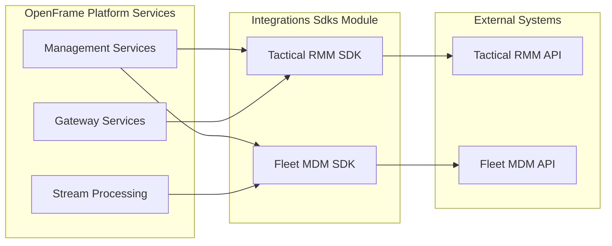
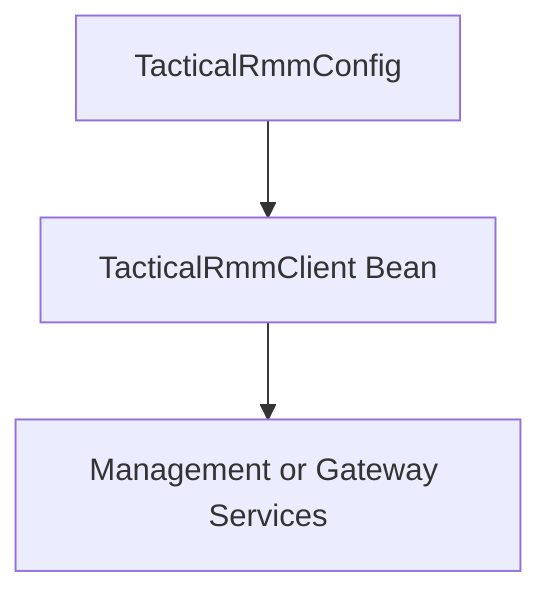
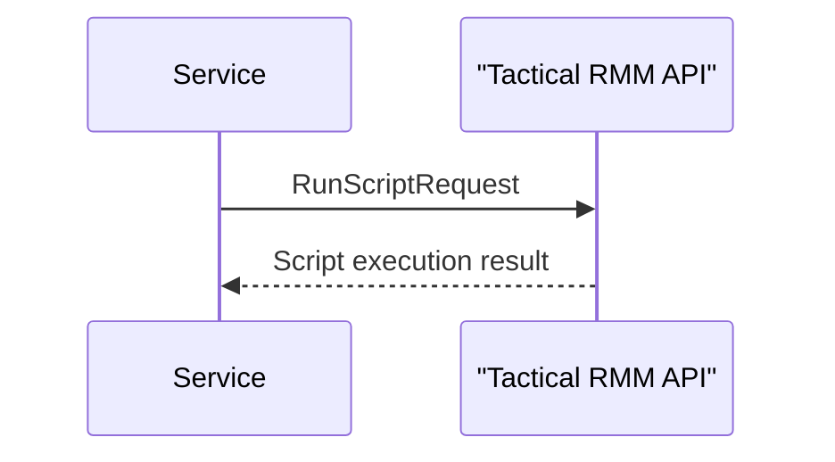
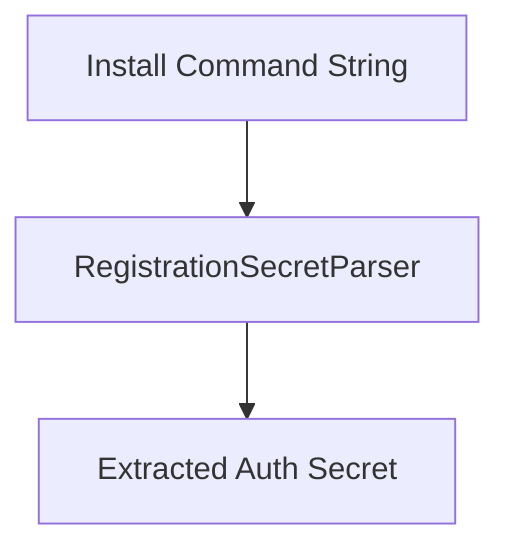
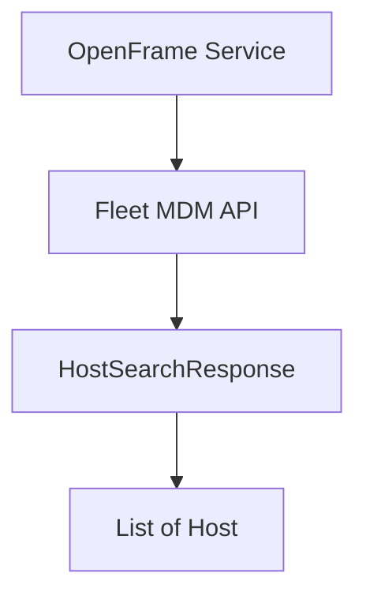
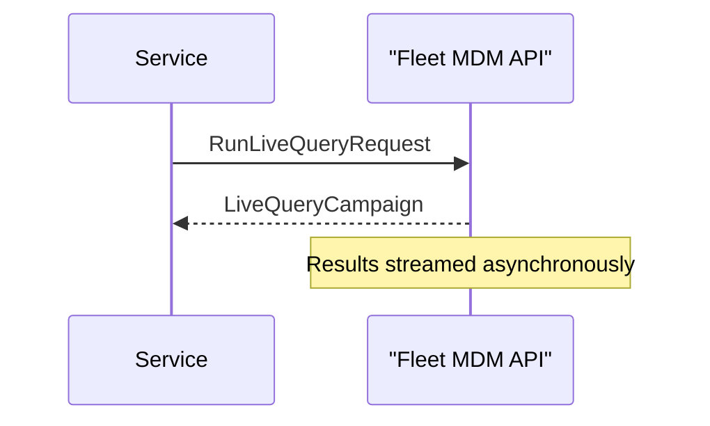
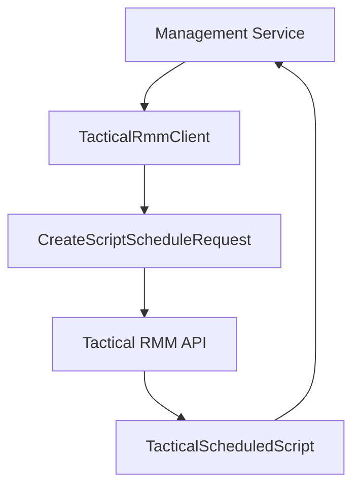
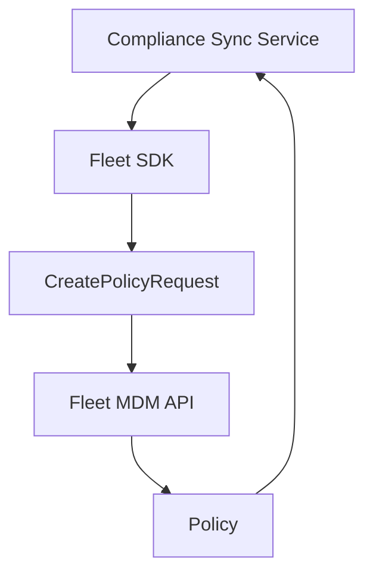

# Integrations Sdks

## Overview

The **Integrations Sdks** module provides typed, reusable Java SDKs for integrating OpenFrame with external RMM and device management platforms. It abstracts vendor-specific REST APIs into strongly typed models and Spring Boot auto-configurations, enabling other services in the platform to:

- Authenticate against third-party systems
- Manage agents and hosts
- Execute remote scripts and queries
- Synchronize policies and schedules
- Parse and handle installation artifacts

Currently, the module focuses on:

- **Tactical RMM SDK** – agent lifecycle, script execution, and schedule management
- **Fleet MDM SDK** – host inventory, compliance policies, and live queries

These SDKs are consumed by higher-level services such as gateway, management, and stream-processing layers, allowing OpenFrame to orchestrate actions across integrated tools.

---

## High-Level Architecture

```mermaid
flowchart LR
    subgraph OpenFramePlatform["OpenFrame Platform Services"]
        Management["Management Services"]
        Gateway["Gateway Services"]
        Stream["Stream Processing"]
    end

    subgraph IntegrationsSdks["Integrations Sdks Module"]
        TacticalSdk["Tactical RMM SDK"]
        FleetSdk["Fleet MDM SDK"]
    end

    subgraph ExternalSystems["External Systems"]
        TacticalApi["Tactical RMM API"]
        FleetApi["Fleet MDM API"]
    end

    Management --> TacticalSdk
    Management --> FleetSdk
    Gateway --> TacticalSdk
    Stream --> FleetSdk

    TacticalSdk --> TacticalApi
    FleetSdk --> FleetApi
```

The Integrations Sdks module acts as a **boundary adapter layer** between OpenFrame internal services and external vendor APIs.

---

## Design Principles

### 1. Strongly Typed API Contracts
Each external endpoint is represented by:

- Request models (e.g., `CreatePolicyRequest`, `RunScriptRequest`)
- Response models (e.g., `HostSearchResponse`, `AgentInfo`)
- Supporting value objects (e.g., `TaskAction`, `AssignedHost`)

This ensures:

- Compile-time validation
- Clear serialization rules via Jackson annotations
- Reduced coupling between internal services and raw JSON

### 2. Spring Boot Auto-Configuration
The Tactical RMM SDK exposes:

- `TacticalRmmConfig` – provides a `TacticalRmmClient` bean via Spring Boot auto-configuration

This allows downstream services to inject and use the client without manual wiring.

### 3. Vendor Isolation
Each vendor integration is encapsulated in its own namespace:

- `com.openframe.sdk.tacticalrmm.*`
- `com.openframe.sdk.fleetmdm.*`

This enables:

- Independent evolution
- Clean separation of models
- Future addition of new SDKs without breaking existing integrations

---

# Tactical RMM SDK

## Purpose

The Tactical RMM SDK enables OpenFrame to interact with Tactical RMM instances for:

- Agent discovery and inspection
- Script execution
- Scheduled automation tasks
- Agent assignment management
- Registration secret extraction

---

## Core Configuration

### TacticalRmmConfig

Registers a `TacticalRmmClient` as a Spring Bean:

```mermaid
flowchart TD
    AutoConfig["TacticalRmmConfig"] --> Bean["TacticalRmmClient Bean"]
    Bean --> Services["Management or Gateway Services"]
```

This enables dependency injection across services that need to call Tactical RMM.

---

## Agent Models

### AgentInfo
Represents detailed agent information returned by Tactical RMM APIs.

Key attributes:
- `agentId`
- `platform`
- `operatingSystem`
- `hostname`

### AgentListItem
Lightweight representation for list endpoints (`detail=false`).

Includes:
- Internal primary key (`id` / `pk` alias)
- Agent ID
- Hostname
- Site
- Client

### AssignedAgent
Used for assigning agents to scheduled tasks.

---

## Script Execution

### RunScriptRequest
Represents payload for:

- `POST /agents/<agent_id>/runscript/`

Supports:
- Script ID
- Arguments
- Environment variables
- Timeout
- Output mode (`wait`, `email`, `collector`)
- Optional server execution

```mermaid
sequenceDiagram
    participant Service
    participant TacticalApi as "Tactical RMM API"

    Service->>TacticalApi: RunScriptRequest
    TacticalApi-->>Service: Script execution result
```

---

## Scheduled Script Management

### TacticalScheduledScript
Represents a scheduled task including:

- Schedule metadata
- Recurrence intervals
- Supported platforms
- Assigned agents
- Associated actions

### CreateScriptScheduleRequest / UpdateScriptScheduleRequest
Used to:

- Create recurring scheduled scripts
- Modify recurrence, enabled state, or actions

### TaskAction
Defines a single action inside a scheduled task:

- Script reference
- Timeout
- Run-as-user flag
- Script arguments
- Environment variables

### ScriptScheduleAgentsResult
Reports:

- Number of assigned agents
- Task result rows created or deleted during sync

---

## Registration Secret Handling

### RegistrationSecretParser

Extracts the `--auth` secret from a Tactical RMM install command string.

This is critical when:

- Parsing installation commands
- Synchronizing registration secrets
- Automating agent bootstrap flows

```mermaid
flowchart TD
    Command["Install Command String"] --> Parser["RegistrationSecretParser"]
    Parser --> Secret["Extracted Auth Secret"]
```

The parser:
- Supports quoted and unquoted values
- Is case-insensitive
- Provides fallback pattern matching

---

# Fleet MDM SDK

## Purpose

The Fleet MDM SDK enables OpenFrame to integrate with Fleet for:

- Host inventory synchronization
- Compliance policy management
- Scheduled and live query execution
- Authentication and setup workflows

---

## Authentication Models

### LoginResponse
Returns:
- API token
- Available teams

### SetupResponse
Returns:
- Initial token during setup

### CreateUserResponse
Returns:
- Token for newly created user

These tokens are used by higher-level services to authenticate subsequent API calls.

---

## Host Management

### Host
Represents a fully detailed Fleet host including:

- Identification: `id`, `uuid`, `hostname`
- OS and platform metadata
- CPU, memory, and disk metrics
- Network information (IP, MAC)
- Enrollment and update timestamps
- Team metadata

### HostSearchResponse
Wraps paginated host search results:

- List of `Host`
- Page metadata
- Sort and filter information

```mermaid
flowchart TD
    Service["OpenFrame Service"] --> FleetApi["Fleet MDM API"]
    FleetApi --> Response["HostSearchResponse"]
    Response --> Hosts["List of Host"]
```

---

## Policy Management

### Policy
Represents a compliance policy in Fleet:

- Query logic
- Resolution guidance
- Author metadata
- Passing/failing host counts
- Team association
- Assigned hosts

### CreatePolicyRequest / UpdatePolicyRequest
Used to:

- Define compliance rules
- Modify name, query, description, and platform

---

## Scheduled Queries

### CreateScheduledQueryRequest / UpdateScheduledQueryRequest

Defines recurring osquery-based checks:

- Query text
- Interval
- Platform targeting

---

## Live Queries

### RunLiveQueryRequest

Used to create distributed campaigns via:

- Ad-hoc SQL queries
- Existing saved query IDs
- Target selection by:
  - Host IDs
  - Label IDs
  - Team IDs

### LiveQueryCampaign
Represents a created campaign:

- Campaign ID
- Query
- Status
- User reference
- Creation timestamp

```mermaid
sequenceDiagram
    participant Service
    participant FleetApi as "Fleet MDM API"

    Service->>FleetApi: RunLiveQueryRequest
    FleetApi-->>Service: LiveQueryCampaign
    Note over FleetApi: Results streamed asynchronously
```

---

# Cross-Cutting Concerns

## JSON Mapping

All models use:

- `@JsonProperty` for field mapping
- `@JsonIgnoreProperties(ignoreUnknown = true)` for forward compatibility
- `@JsonInclude(JsonInclude.Include.NON_NULL)` for minimal payloads

This ensures resilience against:

- Vendor API version drift
- Backward-incompatible field additions

---

## Error Isolation

The SDK layer:

- Does not embed business logic
- Avoids persistence concerns
- Focuses purely on transport and representation

This separation allows:

- Business services to remain vendor-agnostic
- Easy mocking in tests
- Swapping or upgrading integrations independently

---

# Integration Flow Example

Below is a typical flow where OpenFrame schedules a script in Tactical RMM:

```mermaid
flowchart TD
    ManagementService["Management Service"] --> TacticalClient["TacticalRmmClient"]
    TacticalClient --> CreateSchedule["CreateScriptScheduleRequest"]
    CreateSchedule --> TacticalApi["Tactical RMM API"]
    TacticalApi --> ScheduledScript["TacticalScheduledScript"]
    ScheduledScript --> ManagementService
```

And a Fleet compliance sync example:

```mermaid
flowchart TD
    SyncService["Compliance Sync Service"] --> FleetClient["Fleet SDK"]
    FleetClient --> PolicyRequest["CreatePolicyRequest"]
    PolicyRequest --> FleetApi["Fleet MDM API"]
    FleetApi --> Policy["Policy"]
    Policy --> SyncService
```

---

# Extensibility Strategy

The Integrations Sdks module is designed for expansion:

- Each new vendor gets a dedicated package namespace
- Models remain vendor-specific and isolated
- Auto-configuration classes register vendor clients
- Higher-level services depend only on SDK abstractions

Future integrations can follow the same pattern:

1. Create vendor-specific model classes
2. Provide a typed client
3. Register via Spring Boot auto-configuration
4. Keep business orchestration outside the SDK

---

# Summary

The **Integrations Sdks** module is a foundational integration layer within OpenFrame. It:

- Encapsulates third-party APIs
- Provides strongly typed request/response contracts
- Supports Tactical RMM and Fleet MDM integrations
- Enables management, gateway, and stream services to orchestrate external tools
- Maintains strict separation between transport models and business logic

By isolating external integrations behind structured SDKs, OpenFrame ensures maintainability, scalability, and clean architectural boundaries across its distributed services ecosystem.
