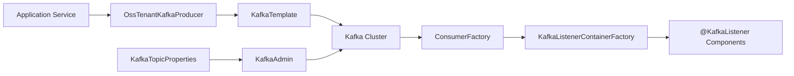
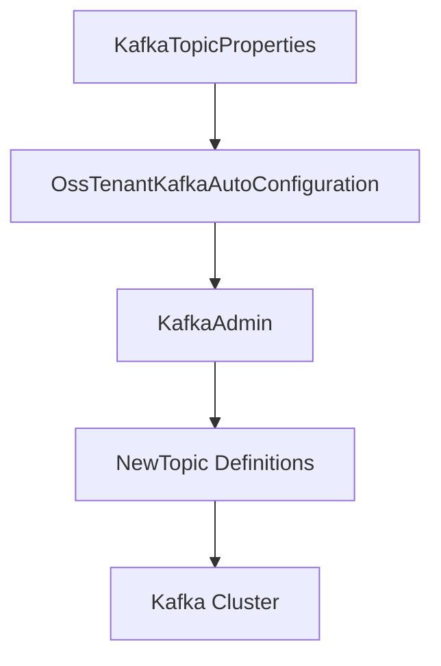
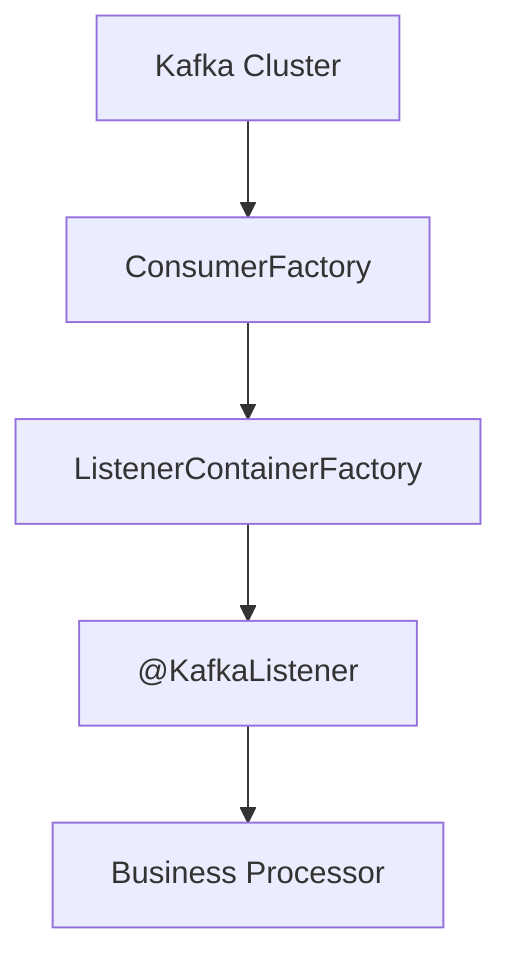
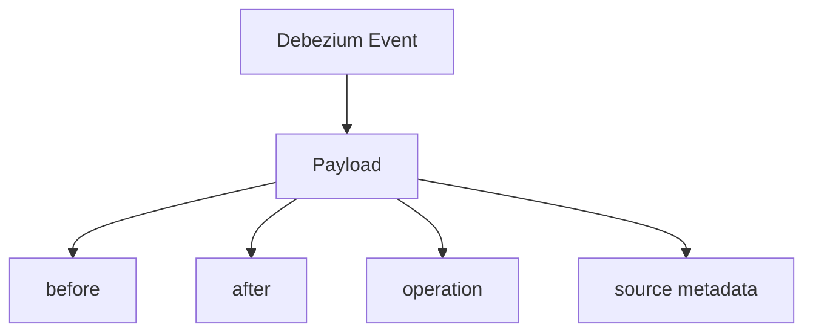
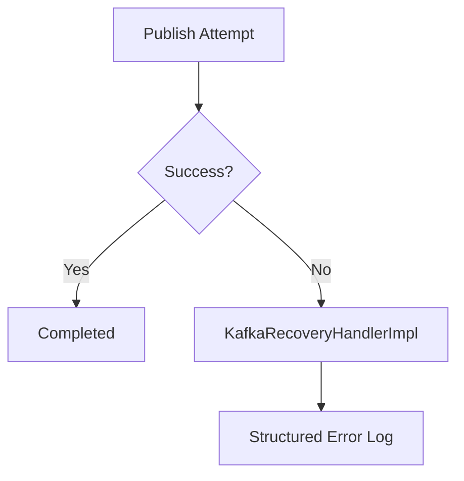
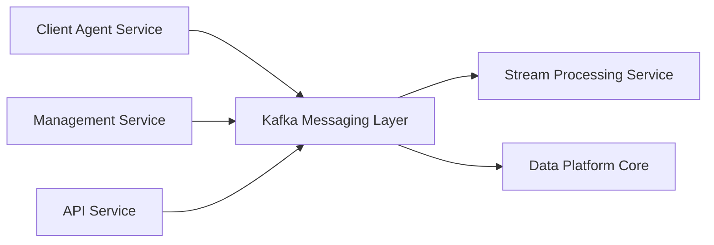

# Kafka Messaging Layer

The **Kafka Messaging Layer** provides the foundational Kafka infrastructure for the OpenFrame OSS platform. It standardizes producer, consumer, topic management, and multi-tenant configuration across services that rely on asynchronous messaging, change data capture (CDC), and stream processing.

This module is responsible for:

- Centralized Kafka auto-configuration for OSS tenants
- Producer and consumer factory setup
- Topic auto-registration and lifecycle management
- Standardized headers and message contracts
- Debezium CDC message modeling
- Recovery and structured logging for failed publish attempts

It is consumed by higher-level modules such as stream processing, management services, and any service that needs to publish or consume Kafka events.

---

## 1. Architectural Overview

The Kafka Messaging Layer abstracts Spring Kafka configuration and enforces a consistent multi-tenant setup using the `spring.oss-tenant` configuration namespace.



### Key Responsibilities

| Concern | Component |
|----------|------------|
| Kafka enablement & custom auto-config | `OssKafkaConfig`, `OssTenantKafkaAutoConfiguration` |
| Tenant-scoped configuration | `OssTenantKafkaProperties` |
| Topic registration | `KafkaTopicProperties` |
| Message header standardization | `KafkaHeader` |
| CDC message model | `DebeziumMessage` |
| Publish recovery handling | `KafkaRecoveryHandlerImpl` |

---

## 2. Configuration Model

### 2.1 OSS Kafka Enablement

`OssKafkaConfig`:

- Enables Spring Kafka via `@EnableKafka`
- Explicitly excludes default `KafkaAutoConfiguration`
- Forces the platform to use its own tenant-aware configuration

This ensures:

- No accidental usage of Spring default Kafka beans
- Full control over producer/consumer factories
- Consistent naming and scoping conventions

---

### 2.2 Tenant-Scoped Properties

`OssTenantKafkaProperties` binds to:

```text
spring.oss-tenant.*
```

It wraps Spring’s `KafkaProperties` and adds an `enabled` toggle.

This enables:

- Independent cluster configuration
- Bootstrap servers override
- Producer, consumer, listener, and template tuning
- Environment-driven deployment control

If:

```text
spring.oss-tenant.kafka.enabled=false
```

The entire auto-configuration is disabled.

---

### 2.3 Topic Management

`KafkaTopicProperties` binds to:

```text
openframe.oss-tenant.kafka.topics
```

It supports:

- Auto topic creation toggle
- Inbound topic map configuration
- Per-topic partition count
- Replication factor

Topic creation is performed through `KafkaAdmin.NewTopics` when:

```text
spring.oss-tenant.kafka.admin.enabled=true
```



This ensures:

- Declarative topic provisioning
- Environment-consistent infrastructure
- Reduced manual Kafka administration

---

## 3. Producer Infrastructure

The module configures a complete producer pipeline:

1. `ProducerFactory<String, Object>`
2. `KafkaTemplate<String, Object>`
3. `OssTenantKafkaProducer`

### Serialization Strategy

- Key: `StringSerializer`
- Value: `JsonSerializer`

This enforces structured JSON payloads across services.


### Default Topic Support

If configured, `KafkaTemplate` applies a default topic automatically.

This reduces boilerplate in publishing services.

---

## 4. Consumer Infrastructure

The module defines:

- `ConsumerFactory<Object, Object>`
- `ConcurrentKafkaListenerContainerFactory`

### Deserialization Strategy

- Key: `StringDeserializer`
- Value: `JsonDeserializer`

### Listener Tuning Options

From properties:

- Concurrency
- Ack mode (default: `RECORD`)
- Poll timeout
- Idle event interval
- Logging behavior



This design allows higher-level services such as the Stream Processing Service Core to focus solely on message handling logic.

---

## 5. Debezium Change Data Capture Model

The `DebeziumMessage<T>` class provides a generic representation of Debezium CDC events.

Structure:

- `before` state
- `after` state
- `operation` type
- `timestamp`
- Source metadata (connector, db, table, schema, etc.)



This model is used by downstream modules such as:

- Stream Processing Service Core
- Management Service Core
- Analytics or Pinot ingestion layers

By abstracting CDC structure here, the platform avoids duplicated Debezium parsing logic.

---

## 6. Standardized Kafka Headers

`KafkaHeader` defines shared header constants.

Example:

```text
message-type
```

This enables:

- Polymorphic event processing
- Versioned message handling
- Content-based routing

It ensures consistent metadata usage across producers and consumers.

---

## 7. Recovery and Failure Handling

`KafkaRecoveryHandlerImpl` provides a structured error logging strategy when publishing fails.

Behavior:

- Captures topic
- Captures message key
- Captures payload snapshot
- Logs exception class and message
- Attaches stacktrace



Although it currently logs errors, it is designed as an extension point for:

- Dead-letter topic forwarding
- Retry orchestration
- Alerting integration

---

## 8. Multi-Module Integration Role

The Kafka Messaging Layer acts as the foundational event backbone for the platform.

### Upstream Producers

- Client Agent Service Core (agent and heartbeat events)
- Management Service Core (version updates, tool changes)
- Authorization and API services (audit and domain events)

### Downstream Consumers

- Stream Processing Service Core (event enrichment, transformation)
- Data Platform Core (Pinot ingestion)
- Analytics or monitoring pipelines



This clear separation ensures:

- Loose coupling between services
- Horizontal scalability
- Replayable event streams
- Fault isolation

---

## 9. Design Principles

The Kafka Messaging Layer follows these architectural principles:

### 1. Explicit Configuration Control
Default Spring auto-config is disabled to prevent hidden behavior.

### 2. Multi-Tenant Awareness
All configuration is scoped under `oss-tenant` properties.

### 3. Declarative Infrastructure
Topics are defined as configuration, not code.

### 4. Strong Serialization Contracts
JSON serialization ensures cross-language compatibility.

### 5. Extensibility
Recovery handler and headers provide extension points for advanced routing and resiliency.

---

# Summary

The **Kafka Messaging Layer** is the messaging backbone of the OpenFrame OSS ecosystem. It standardizes Kafka configuration, enforces tenant isolation, models CDC events, and provides resilient producer and consumer infrastructure.

By abstracting Kafka complexity into a dedicated module, the platform achieves:

- Consistent messaging patterns
- Simplified service development
- Scalable event-driven architecture
- Operational observability and control

It is a foundational building block enabling the platform’s stream processing, analytics, synchronization, and real-time automation capabilities.