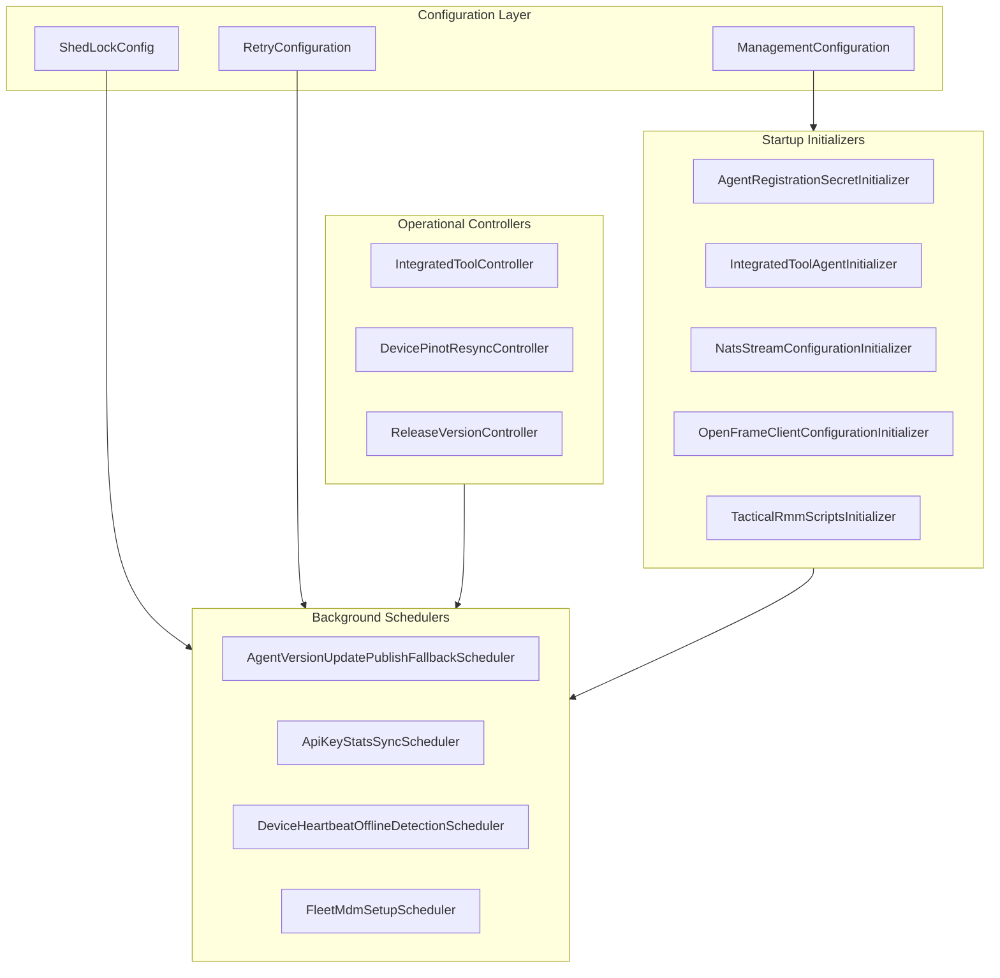
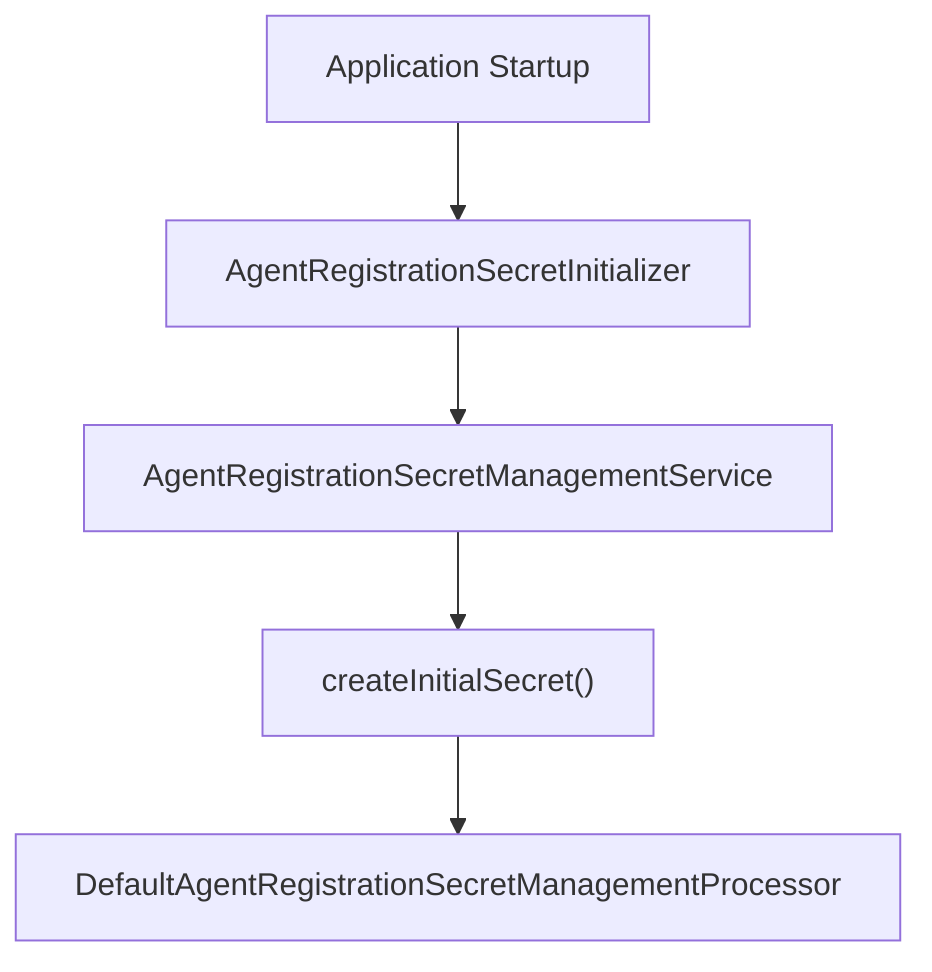
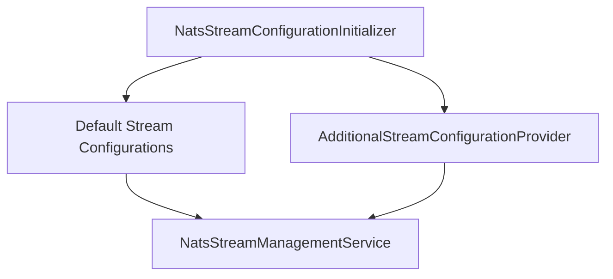
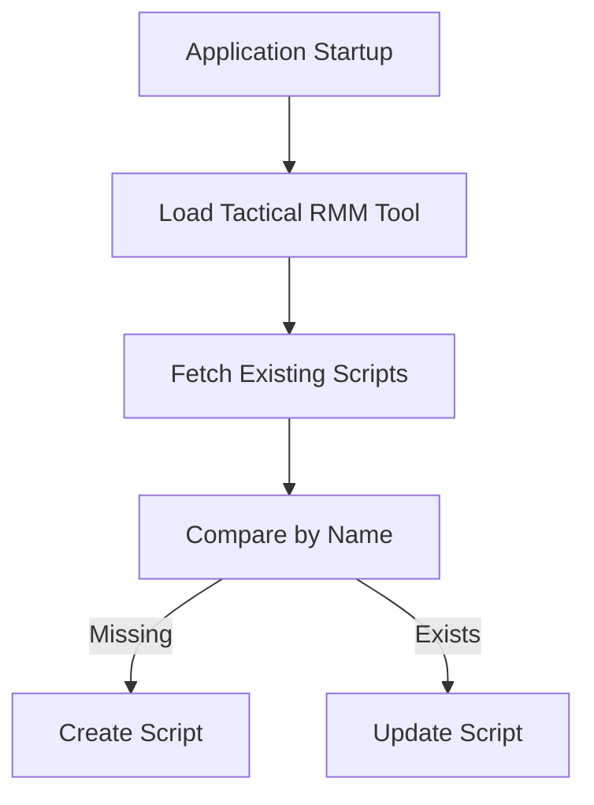
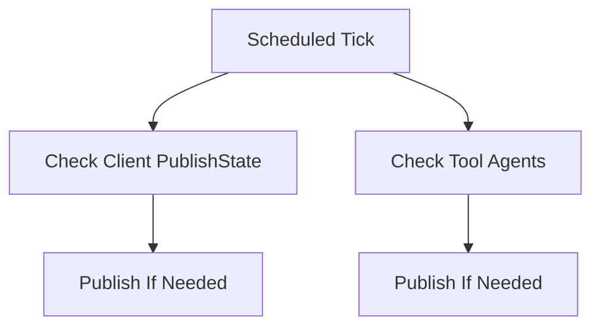
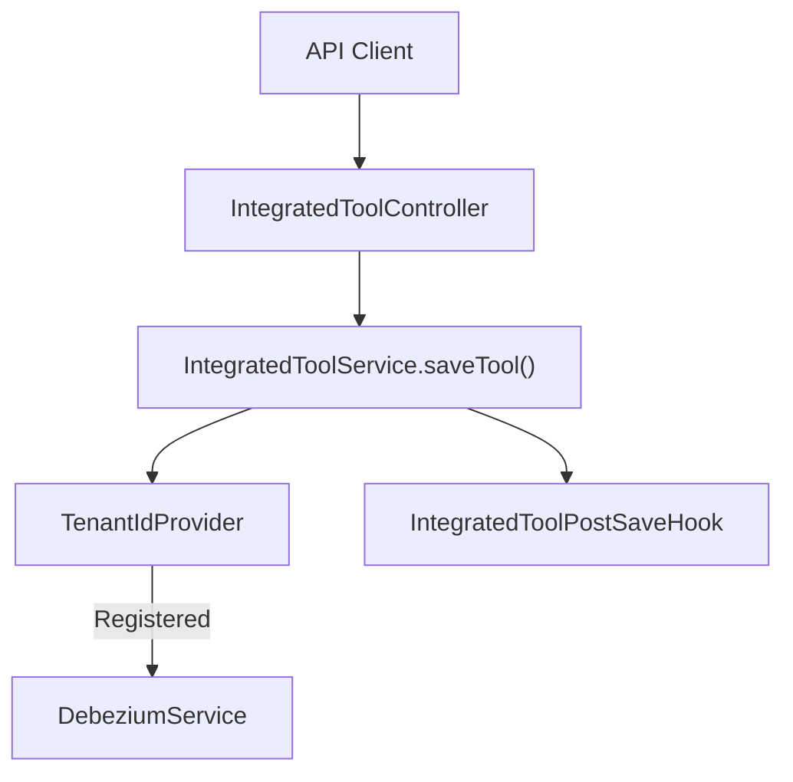
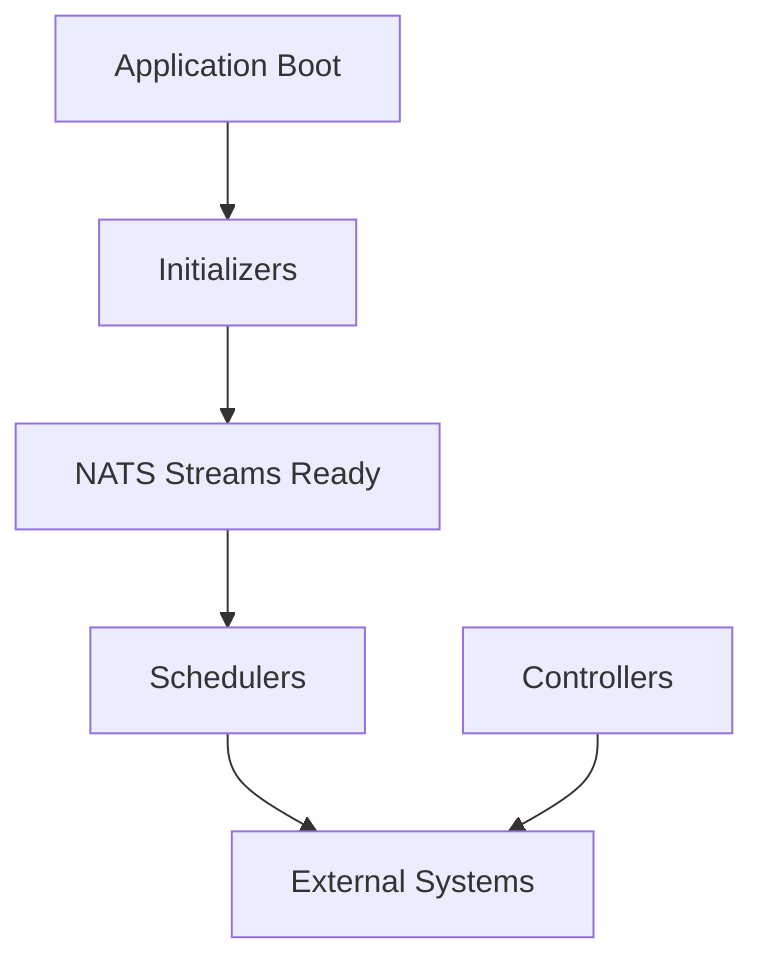

# Management Service Core Initializers And Schedulers

The **Management Service Core Initializers And Schedulers** module is responsible for bootstrapping, orchestrating, and maintaining background operational workflows across the OpenFrame platform. It ensures that required configuration artifacts, streams, secrets, scripts, and distributed jobs are initialized correctly at startup and remain consistent throughout runtime.

This module acts as the operational backbone for:

- System bootstrapping (initial secrets, client configuration, tool agents)
- Distributed scheduling with cluster-safe locking
- Stream and messaging initialization (NATS)
- External tool orchestration (e.g., Tactical RMM)
- Maintenance and retry workflows
- Pinot resynchronization and fleet setup tasks

---

## Architectural Overview

The module is structured into five major concerns:

1. **Configuration Layer** – Enables scheduling, retries, and distributed locks.
2. **Initializers** – Bootstrap critical data and external integrations at startup.
3. **Schedulers** – Periodic maintenance and retry workflows.
4. **Controllers** – Operational endpoints for manual triggers.
5. **Processors & Services** – Extension points and domain orchestration logic.



---

# 1. Configuration Layer

## ManagementConfiguration

Provides the base Spring configuration for the module.

Key responsibilities:
- Component scanning across `com.openframe`
- Excludes `CassandraHealthIndicator` to avoid unnecessary health wiring
- Exposes a `PasswordEncoder` using BCrypt for secure hashing

This ensures secure secret generation and compatibility with other security modules.

---

## RetryConfiguration

Enables Spring Retry using:

```text
@EnableRetry
```

This allows services and schedulers to use retry semantics for transient failures (e.g., network, external systems, Redis, NATS).

---

## ShedLockConfig

Enables:

- `@EnableScheduling`
- `@EnableSchedulerLock`

Provides a Redis-backed distributed `LockProvider`.

### Tenant-Scoped Locking

Lock keys follow the pattern:

```text
of:{tenantId}:job-lock:<environment>:<lockName>
```

This ensures:
- No duplicate scheduler execution across clustered nodes
- Isolation per tenant
- Environment separation


---

# 2. Startup Initializers

All initializers implement `ApplicationRunner`, meaning they execute after Spring Boot startup.

---

## AgentRegistrationSecretInitializer

Ensures an initial `AgentRegistrationSecret` exists at startup.

Flow:



Features:
- Idempotent secret creation
- Pluggable post-processing via `AgentRegistrationSecretManagementProcessor`
- Safe failure handling

---

## IntegratedToolAgentInitializer

Loads agent configurations from classpath resources.

Responsibilities:
- Reads JSON configuration files
- Maps to `IntegratedToolAgentConfiguration`
- Updates persisted configuration via `IntegratedToolAgentService`
- Fails fast if no configuration is defined

This guarantees consistent tool-agent configuration across environments.

---

## NatsStreamConfigurationInitializer

Pre-provisions required NATS streams:

- TOOL_INSTALLATION
- CLIENT_UPDATE
- TOOL_UPDATE
- TOOL_CONNECTIONS
- INSTALLED_AGENTS

Each stream defines:
- Subjects (wildcard-based routing)
- File storage
- Retention policy

Also supports extension via `AdditionalStreamConfigurationProvider`.



---

## OpenFrameClientConfigurationInitializer

Loads the default client configuration from:

```text
agent-configurations/client-configuration.json
```

Steps:
1. Deserialize JSON
2. Assign default ID
3. Persist via `OpenFrameClientConfigurationService`

Ensures the client always has a canonical configuration baseline.

---

## TacticalRmmScriptsInitializer

Bootstraps PowerShell scripts inside Tactical RMM.

Workflow:



Features:
- Loads script bodies from classpath
- Idempotent create-or-update behavior
- Uses API key stored in IntegratedTool
- Logs per-script success/failure

This guarantees consistent automation availability for OpenFrame client updates.

---

# 3. Background Schedulers

Schedulers run conditionally based on configuration properties and use ShedLock for distributed safety when needed.

---

## AgentVersionUpdatePublishFallbackScheduler

Purpose: Retry publishing client and tool-agent updates when previous attempts failed.

Key concepts:
- Checks `PublishState`
- Retries until `maxPublishAttempts`
- Publishes via NATS publishers



This ensures eventual consistency for version update propagation.

---

## ApiKeyStatsSyncScheduler

Synchronizes API key statistics from Redis to MongoDB.

Features:
- Distributed lock (`apiKeyStatsSync`)
- Configurable interval
- Safe retry behavior

Ensures durable persistence of usage metrics.

---

## DeviceHeartbeatOfflineDetectionScheduler

Periodically marks stale devices as offline.

Flow:


This keeps device health states accurate.

---

## FleetMdmSetupScheduler

Ensures Fleet MDM server is configured and API tokens are generated when necessary.

Logic:
- Looks up `fleetmdm-server` tool
- Runs setup logic if present
- Retries on failure

This supports automated fleet provisioning.

---

# 4. Operational Controllers

These controllers provide operational endpoints for manual intervention.

---

## IntegratedToolController

Endpoint base: `/v1/tools`

Responsibilities:
- Retrieve tool configurations
- Save tool configuration
- Conditionally create/update Debezium connectors
- Execute post-save hooks



Key design detail:
- Debezium connectors are deferred until tenant registration.

---

## DevicePinotResyncController

Endpoint: `/v1/devices/pinot-resync`

Purpose:
- Replays all machines to Pinot
- Uses `MachineTagEventService.processMachineSaveAll`

This is typically used for analytics rehydration or recovery.

---

## ReleaseVersionController

Endpoint: `/v1/cluster-registrations`

Delegates version processing to `ReleaseVersionService`.

Intended to coordinate cluster-level version awareness and propagation.

---

# 5. Services and Extension Points

## OpenFrameClientVersionUpdateService

Currently serves as a coordination entry point for client version publishing.

Uses:
- `OpenFrameClientUpdatePublisher`

Designed for future expansion to centralize version update orchestration.

---

## IntegratedToolPostSaveHook

A lightweight extension mechanism:

```text
void onToolSaved(String toolId, IntegratedTool tool)
```

Advantages:
- No Spring event overhead
- Simple service-specific side effects
- Clean separation of concerns

---

## DefaultAgentRegistrationSecretManagementProcessor

Default implementation used when no custom processor is defined.

Behavior:
- Logs secret creation
- Supports override via Spring bean replacement

---

# Runtime Interaction Summary

The module ensures:

1. Startup is safe and idempotent.
2. Distributed jobs execute only once per cluster.
3. External systems (NATS, Tactical RMM, Debezium) are reconciled.
4. Retry and fallback logic guarantee eventual consistency.
5. Operational APIs allow manual recovery and resync.



---

# Key Design Principles

- **Idempotency First** – Initializers and schedulers tolerate repeated execution.
- **Distributed Safety** – ShedLock prevents duplicate execution.
- **Tenant Isolation** – Lock keys and processing are tenant-scoped.
- **Eventual Consistency** – Fallback schedulers ensure propagation.
- **Extensibility** – Hooks and processors enable modular extension.

---

# Conclusion

The **Management Service Core Initializers And Schedulers** module is the operational orchestrator of OpenFrame. It ensures that the system boots correctly, remains consistent across distributed nodes, maintains external integrations, and continuously reconciles state through scheduled processes.

Without this module, OpenFrame would lack:

- Safe distributed background processing
- Automated stream and tool provisioning
- Reliable publish retry mechanisms
- Operational recovery endpoints

It is a foundational module enabling stable, self-healing, multi-tenant management operations.