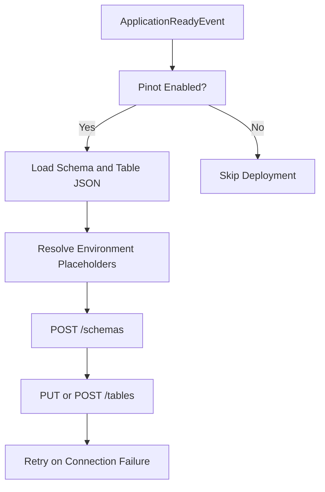
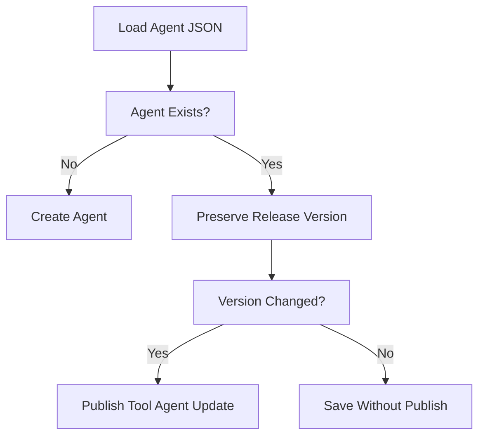
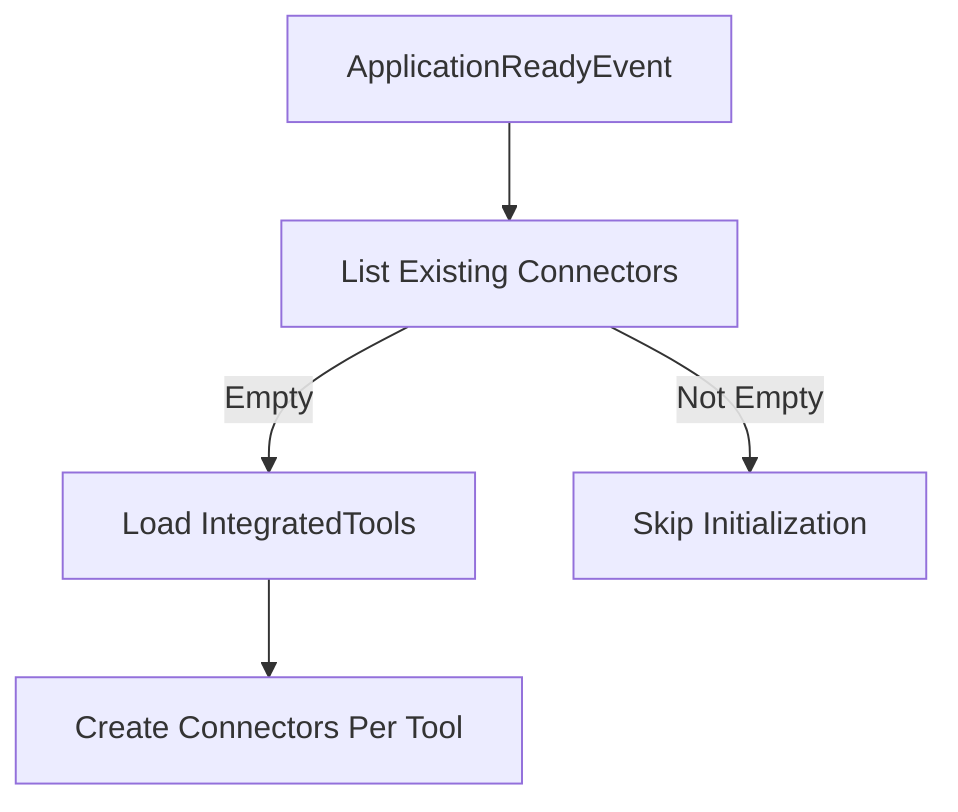
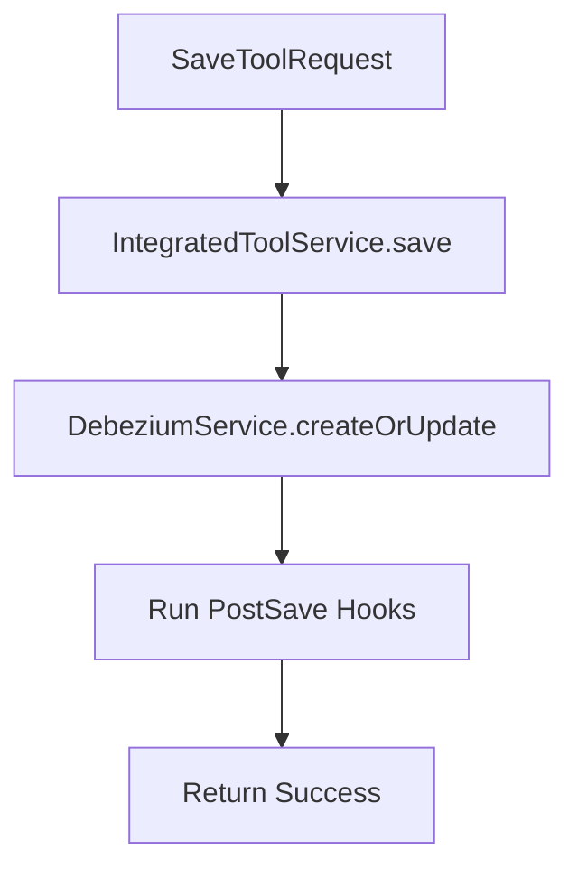
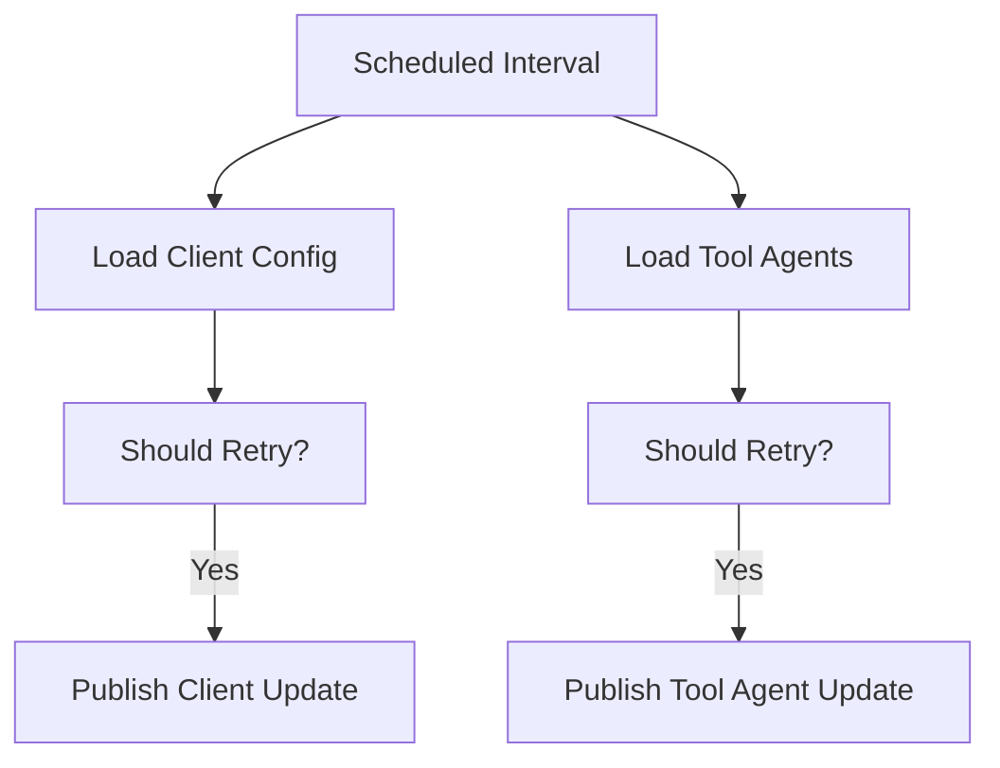

# Management Service Core

## Overview

The **Management Service Core** module is the operational backbone of the OpenFrame platform. It is responsible for:

- Cluster-level and tool-level configuration management
- Debezium connector orchestration
- NATS stream initialization
- Agent and client configuration bootstrapping
- Distributed scheduled jobs with tenant-aware locking
- Release version propagation

While other modules focus on API exposure, authorization, data persistence, or stream processing, the Management Service Core ensures that the platform is correctly initialized, synchronized, and maintained over time.

This module primarily acts as a **control plane layer** across:

- MongoDB (via data-mongo-core)
- Redis (via data-redis-cache)
- Debezium (CDC connectors)
- Apache Pinot (analytics tables and schemas)
- NATS (event streaming)
- Agent update pipelines

---

## High-Level Architecture

```mermaid
flowchart TD
    AppStart["Application Startup"] --> InitPhase["Initializers"]
    AppStart --> Schedulers["Schedulers"]
    AppStart --> Controllers["Management Controllers"]

    InitPhase --> PinotInit["PinotConfigInitializer"]
    InitPhase --> AgentSecretInit["AgentRegistrationSecretInitializer"]
    InitPhase --> ToolAgentInit["IntegratedToolAgentInitializer"]
    InitPhase --> NatsInit["NatsStreamConfigurationInitializer"]
    InitPhase --> ClientConfigInit["OpenFrameClientConfigurationInitializer"]
    InitPhase --> DebeziumInit["DebeziumConnectorInitializer"]

    Controllers --> ToolController["IntegratedToolController"]
    Controllers --> ReleaseController["ReleaseVersionController"]

    Schedulers --> DebeziumHealth["DebeziumHealthCheckScheduler"]
    Schedulers --> ApiKeySync["ApiKeyStatsSyncScheduler"]
    Schedulers --> AgentFallback["AgentVersionUpdatePublishFallbackScheduler"]

    ToolController --> DebeziumService["DebeziumService"]
    DebeziumHealth --> DebeziumService
    DebeziumInit --> DebeziumService

    ToolAgentInit --> ToolAgentPublisher["ToolAgentUpdatePublisher"]
    AgentFallback --> ToolAgentPublisher

    ClientConfigInit --> ClientUpdatePublisher["OpenFrameClientUpdatePublisher"]
    AgentFallback --> ClientUpdatePublisher
```



The module is organized around three major responsibilities:

1. **Startup Initialization** – One-time setup of infrastructure resources.
2. **Runtime Orchestration** – Scheduled jobs and connector health management.
3. **Administrative Control APIs** – Cluster and tool configuration endpoints.

---

# Core Configuration Layer

## ManagementConfiguration

This is the root Spring configuration class.

Key responsibilities:

- Component scanning across the `com.openframe` namespace
- Explicit exclusion of `CassandraHealthIndicator`
- Provision of a `BCryptPasswordEncoder` bean

This ensures:

- Secure password hashing
- Clean separation from Cassandra health checks (which are handled in the data layer)

---

## ShedLockConfig – Distributed Scheduling Safety

The module enables:

- `@EnableScheduling`
- `@EnableSchedulerLock`

It configures a **Redis-based LockProvider** using tenant-scoped keys:

```text
of:{tenantId}:job-lock:{environment}:{lockName}
```

This guarantees:

- No duplicate job execution in clustered deployments
- Environment-aware locking
- Tenant isolation

This configuration directly supports:

- Debezium health checks
- API key statistics sync
- Agent version publish fallback jobs

---

# Startup Initializers

Initializers run either at:

- `@PostConstruct`
- `ApplicationRunner`
- `ApplicationReadyEvent`

They bootstrap system state in external systems.

---

## PinotConfigInitializer

Deploys Pinot:

- Schemas
- Real-time table configs
- Optional offline table configs

### Deployment Flow



Features:

- Retry logic with configurable attempts and delay
- Automatic create-or-update logic
- Environment placeholder resolution
- Strict JSON validation before deployment

This ensures analytics tables are always provisioned correctly.

---

## AgentRegistrationSecretInitializer

Executed at startup via `ApplicationRunner`.

Purpose:

- Ensures an initial agent registration secret exists
- Prevents platform bootstrap failures

This is critical for first-time deployments.

---

## IntegratedToolAgentInitializer

Bootstraps `IntegratedToolAgent` definitions from classpath JSON resources.

### Behavior

- Loads agent configuration files
- Creates new entries if absent
- Updates existing entries while:
  - Preserving release versions
  - Preserving publish state
- Detects version changes
- Publishes update events when necessary

### Version Update Logic



This initializer connects configuration state with event-driven update propagation.

---

## NatsStreamConfigurationInitializer

Creates predefined NATS streams at startup.

Streams include:

- TOOL_INSTALLATION
- CLIENT_UPDATE
- TOOL_UPDATE
- TOOL_CONNECTIONS
- INSTALLED_AGENTS

Each stream defines:

- Subjects
- Storage type
- Retention policy

This guarantees that required messaging infrastructure exists before agents start publishing.

---

## OpenFrameClientConfigurationInitializer

Initializes default client configuration from JSON.

Behavior:

- Loads configuration file
- Forces default ID
- Preserves version on update
- Preserves publish state

Ensures cluster-wide client configuration consistency.

---

## DebeziumConnectorInitializer

Executed on `ApplicationReadyEvent` when health checks are enabled.

### Behavior

- Queries existing Debezium connectors
- If none exist:
  - Loads all `IntegratedTool` entries
  - Creates connectors defined in each tool



This prevents missing CDC pipelines in fresh clusters.

---

# Controllers

## IntegratedToolController

Base path: `/v1/tools`

Endpoints:

- `GET /v1/tools` – List tools
- `GET /v1/tools/{id}` – Fetch tool
- `POST /v1/tools/{id}` – Create or update tool

### Save Flow



Post-save hooks allow modular side-effects without Spring events.

---

## ReleaseVersionController

Base path: `/v1/cluster-registrations`

Accepts:

- `ReleaseVersionRequest`

Delegates to `ReleaseVersionService` to process new image tag versions.

This is used for cluster-level version propagation workflows.

---

# Scheduled Jobs

All schedulers are protected with ShedLock to ensure distributed safety.

---

## DebeziumHealthCheckScheduler

- Periodically checks connector health
- Restarts failed tasks
- Fully distributed lock protected

Ensures CDC stability.

---

## ApiKeyStatsSyncScheduler

- Syncs Redis API key usage stats into MongoDB
- Configurable intervals
- Lock protected

Prevents stat divergence in clustered environments.

---

## AgentVersionUpdatePublishFallbackScheduler

Fallback mechanism to guarantee update propagation.

### Logic

- Fetch client configuration
- Fetch enabled tool agents
- Check publish state
- Retry publish if:
  - Not published
  - Attempts below threshold



This guarantees eventual consistency in distributed update pipelines.

---

# Debezium Integration Model

The Management Service Core orchestrates Debezium connectors through:

- Tool configuration changes
- Startup initialization
- Health checks

Connector state is mapped using `ConnectorStatus` DTOs.

This enables:

- Monitoring
- Automated restart
- Safe bootstrap

---

# Release and Version Propagation

The module supports version management via:

- `ReleaseVersionController`
- `OpenFrameClientVersionUpdateService`
- Tool agent update publishers
- Fallback scheduler

Together they form a **resilient version distribution pipeline**.

---

# External Dependencies Managed

The module directly interacts with:

- MongoDB
- Redis
- Debezium
- Apache Pinot
- NATS
- Event publishing services

It does not expose business APIs; instead, it maintains infrastructure state.

---

# Summary

The **Management Service Core** acts as the operational control plane of OpenFrame.

It ensures that:

- Infrastructure is bootstrapped correctly
- External systems are synchronized
- Connectors remain healthy
- Agent and client versions propagate reliably
- Distributed jobs execute safely

Without this module, the platform would lack automated initialization, health management, and update coordination.

It is the glue that binds configuration, infrastructure, and distributed runtime behavior together.