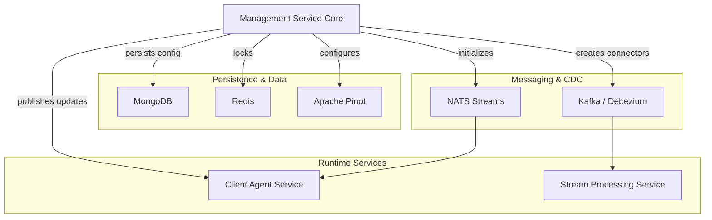
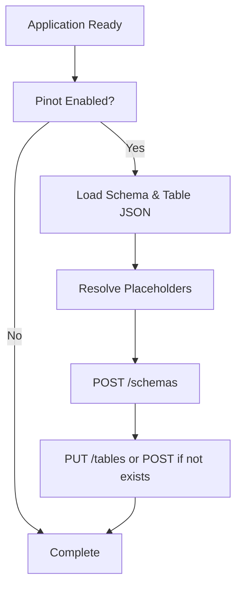
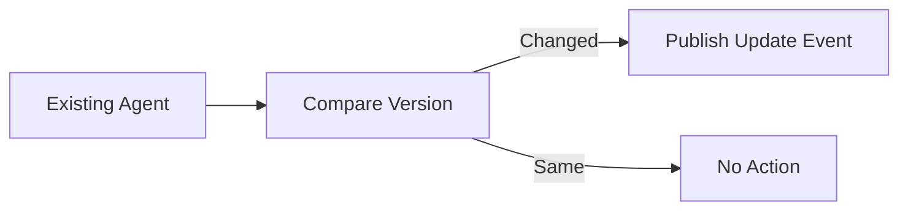
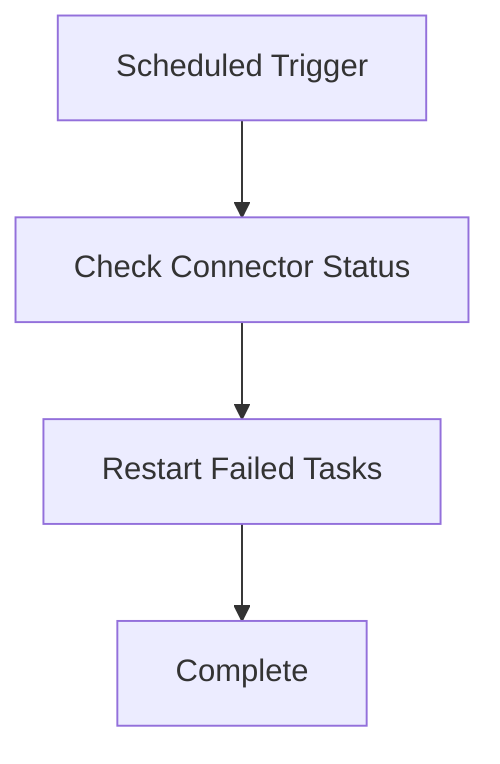
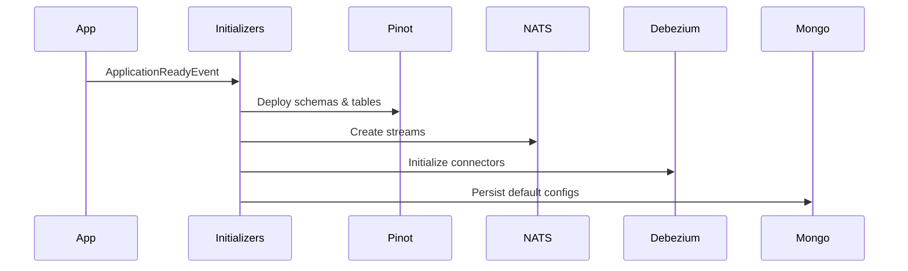

# Management Service Core

## Overview

The **Management Service Core** module is responsible for cluster-level initialization, operational automation, tool lifecycle management, connector orchestration, and scheduled background maintenance across the OpenFrame platform.

While other modules focus on runtime APIs, authentication, data ingestion, or streaming, the Management Service Core ensures that:

- Integrated tools are properly configured and synchronized
- Debezium connectors are initialized and monitored
- Pinot schemas and tables are deployed automatically
- NATS streams are provisioned
- Agent and client configurations are bootstrapped
- Version updates are propagated reliably
- Operational statistics and health checks are executed on schedule

This module acts as the **control plane automation layer** for the OpenFrame backend.

---

## Architectural Role in the Platform

The Management Service Core integrates with:

- Data Platform Core (Pinot, Cassandra, NATS models)
- Mongo Persistence Layer (tool, agent, configuration storage)
- Kafka Messaging Layer (Debezium connectors)
- Redis Caching Layer (ShedLock distributed locks)
- Client Agent Service Core (agent lifecycle and versioning)
- Stream Processing Service Core (downstream consumers of Debezium/NATS data)

### High-Level Architecture



The module primarily operates at startup and through scheduled jobs.

---

## Core Responsibilities

### 1. Application Configuration

**Primary Classes**:
- `ManagementConfiguration`
- `ShedLockConfig`

#### ManagementConfiguration

- Performs component scanning
- Excludes `CassandraHealthIndicator` (avoids duplicate health wiring)
- Defines a `BCryptPasswordEncoder` bean for secure password hashing

#### ShedLockConfig

Enables distributed scheduling using:

- `@EnableScheduling`
- `@EnableSchedulerLock`
- `RedisLockProvider`

Locks are tenant-scoped using a Redis key pattern:

```text
of:{tenantId}:job-lock:{environment}:{lockName}
```

This ensures scheduled jobs:

- Run once across a clustered deployment
- Avoid duplicate execution
- Remain tenant-aware

---

### 2. Pinot Configuration Deployment

**Primary Class**:
- `PinotConfigInitializer`

On `ApplicationReadyEvent`, this initializer:

1. Loads schema and table config JSON files from `classpath:pinot/config/`
2. Resolves Spring placeholders
3. Deploys schemas to Pinot Controller
4. Creates or updates realtime/offline tables
5. Retries failed deployments with backoff

#### Deployment Flow



Features:

- Automatic retries (`maxRetries`, `retryDelayMs`)
- Update-or-create table semantics
- Strict JSON validation before deployment

This ensures analytics infrastructure is provisioned automatically.

---

### 3. Integrated Tool Lifecycle Management

**Primary Classes**:
- `IntegratedToolController`
- `IntegratedToolPostSaveHook`
- `DebeziumConnectorInitializer`

#### IntegratedToolController

Exposes REST endpoints under:

```text
/v1/tools
```

Supports:

- Listing tools
- Fetching tool by ID
- Saving/updating tool configuration

On save:

1. Tool is persisted via `IntegratedToolService`
2. Debezium connectors are created/updated
3. Post-save hooks are executed

#### Post-Save Hook Extension Point

`IntegratedToolPostSaveHook` allows service-specific side effects without Spring event complexity.

Example use cases:

- Provisioning external resources
- Triggering re-index operations
- Publishing configuration updates

#### Debezium Connector Initialization

`DebeziumConnectorInitializer` runs at startup (conditionally) and:

- Checks if connectors exist
- If empty, loads connector definitions from all stored tools
- Creates missing connectors

This guarantees CDC infrastructure consistency.

---

### 4. Agent & Client Configuration Initialization

**Primary Classes**:
- `AgentRegistrationSecretInitializer`
- `IntegratedToolAgentInitializer`
- `OpenFrameClientConfigurationInitializer`

#### Agent Registration Secret

Ensures an initial secret exists for agent onboarding.

Executed via `ApplicationRunner`.

#### Integrated Tool Agent Initializer

Loads JSON-defined tool agents from classpath and:

- Creates new agents if missing
- Updates existing agents
- Preserves release versions
- Detects version changes
- Publishes update events

Version change detection flow:



#### OpenFrame Client Configuration

Bootstraps default client configuration and:

- Preserves version
- Preserves publish state
- Ensures a single default ID

---

### 5. NATS Stream Provisioning

**Primary Class**:
- `NatsStreamConfigurationInitializer`

Creates required NATS streams at startup:

- TOOL_INSTALLATION
- CLIENT_UPDATE
- TOOL_UPDATE
- TOOL_CONNECTIONS
- INSTALLED_AGENTS

Each stream defines:

- Subject patterns (e.g., `machine.*.tool-update`)
- Storage type
- Retention policy

This ensures messaging infrastructure is available before agents begin communication.

---

### 6. Tactical RMM Script Provisioning

**Primary Class**:
- `TacticalRmmScriptsInitializer`

On startup:

1. Fetches Tactical RMM tool configuration
2. Loads script content from resources
3. Checks if scripts exist remotely
4. Creates or updates scripts accordingly

This guarantees:

- Idempotent provisioning
- Version-controlled automation scripts
- Consistency across Tactical RMM environments

---

### 7. Scheduled Operational Jobs

The module includes multiple schedulers guarded by feature flags and distributed locks.

#### A. AgentVersionUpdatePublishFallbackScheduler

Purpose:

- Retry publishing client/tool agent updates
- Respect max attempt limits
- Avoid infinite retry loops

Logic:

- Publish if not published
- Stop after `maxPublishAttempts`

---

#### B. ApiKeyStatsSyncScheduler

Purpose:

- Periodically sync API key usage statistics
- Move Redis stats to MongoDB

Features:

- Distributed lock via ShedLock
- Configurable intervals

---

#### C. DebeziumHealthCheckScheduler

Purpose:

- Monitor Debezium connector task states
- Restart failed tasks automatically

Flow:



---

### 8. Release Version Handling

**Primary Classes**:
- `ReleaseVersionController`
- `ReleaseVersionRequest`
- `OpenFrameClientVersionUpdateService`

Endpoint:

```text
/v1/cluster-registrations
```

Accepts:

```text
{
  "imageTagVersion": "x.y.z"
}
```

Intended purpose:

- Propagate new cluster release versions
- Trigger downstream client update publishing

Currently acts as a processing entry point for version update logic.

---

### 9. Debezium Connector Status Modeling

**Primary Class**:
- `ConnectorStatus`

Represents:

- Connector state
- Worker ID
- Task-level status
- Error traces

Used for:

- Health monitoring
- Automated restarts
- Diagnostics

---

## Startup Lifecycle Overview



The Management Service Core ensures the system reaches a fully operational state automatically.

---

## Design Characteristics

### Idempotent Initialization

- Safe re-runs
- Update-or-create logic
- Version preservation for release agents

### Distributed Safety

- Redis-backed ShedLock
- Tenant-scoped locking
- Conditional feature flags

### Extension-Friendly

- Post-save hooks for tool lifecycle
- Publisher abstractions
- Decoupled service boundaries

### Operational Resilience

- Retry logic for Pinot
- Health checks for Debezium
- Fallback publish scheduler

---

## Summary

The **Management Service Core** module is the automation and orchestration backbone of the OpenFrame backend. It:

- Bootstraps infrastructure
- Provisions analytics and messaging
- Manages tool lifecycle
- Handles agent version propagation
- Executes distributed maintenance jobs
- Enforces operational consistency across services

Without this module, the platform would require manual provisioning, connector management, and operational supervision. With it, the system becomes self-initializing, self-healing, and cluster-aware.

---

**End of Management Service Core Documentation**
