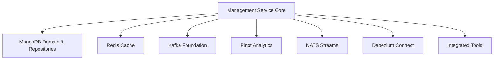
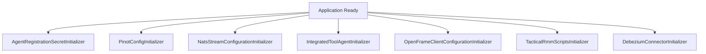
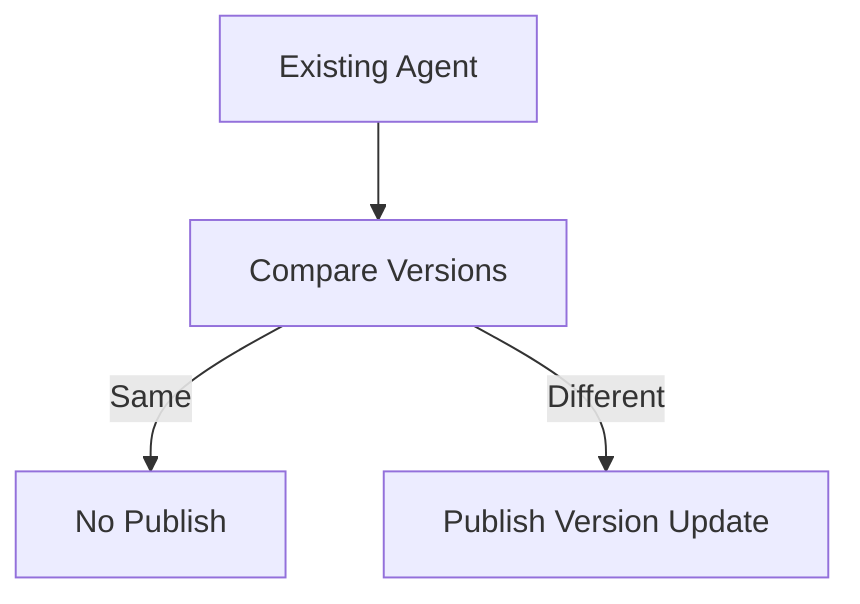
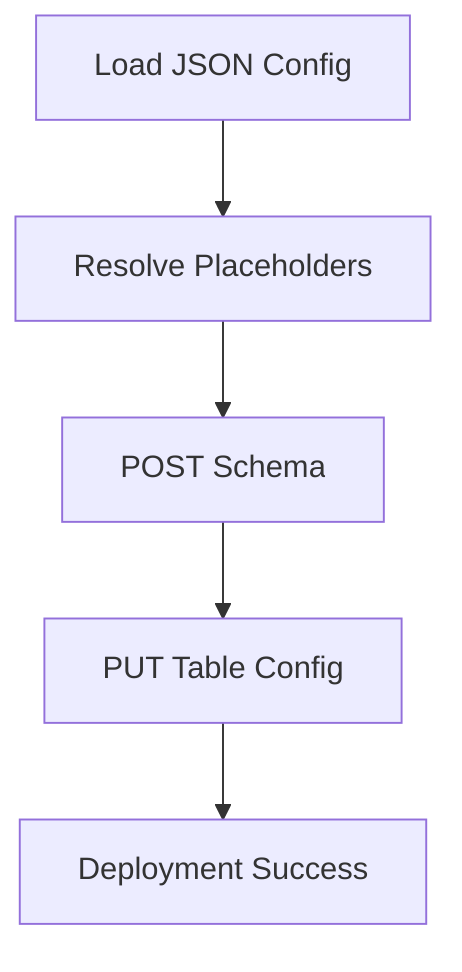
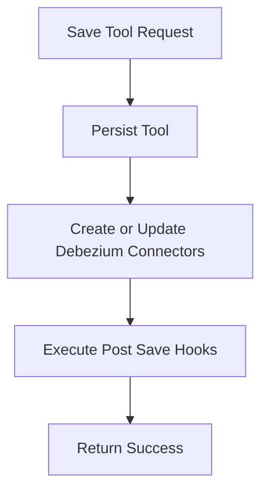
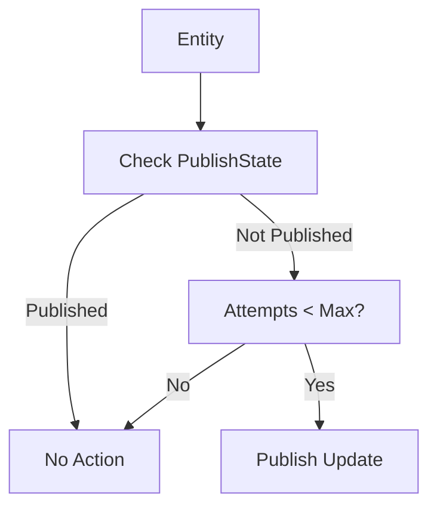

# Management Service Core

The **Management Service Core** module is the operational backbone of the OpenFrame platform. It is responsible for:

- Platform bootstrap and environment initialization
- Integrated tool lifecycle management
- Agent and client configuration provisioning
- Debezium connector orchestration
- Distributed scheduled jobs with cluster safety
- Release version coordination
- NATS stream provisioning

This module acts as the control plane for infrastructure-level concerns that sit above domain services such as devices, users, organizations, and events.

---

## 1. Architectural Position in the Platform

The Management Service Core coordinates multiple foundational modules:

- Data persistence: MongoDB, Cassandra, Pinot
- Streaming: Kafka, NATS
- Change Data Capture: Debezium
- Redis-based distributed locking
- Integrated third-party tools (e.g., Tactical RMM)

### High-Level Architecture



This module is primarily responsible for **platform consistency, orchestration, and automation**, rather than direct end-user business workflows.

---

## 2. Core Responsibilities

### 2.1 Application Configuration

#### `ManagementConfiguration`

- Enables component scanning across `com.openframe`
- Explicitly excludes `CassandraHealthIndicator`
- Provides a `BCryptPasswordEncoder` bean for secure password hashing

This configuration ensures:

- Secure password handling
- Clean management-specific bootstrapping
- Isolation from non-relevant health components

---

### 2.2 Distributed Scheduling with Redis (ShedLock)

#### `ShedLockConfig`

This configuration enables:

- Spring scheduling
- Distributed locks via Redis
- Tenant-scoped lock keys

Lock keys follow a structured prefix pattern:

```text
of:{tenantId}:job-lock:{environment}:{lockName}
```

This ensures:

- No duplicate job execution across cluster nodes
- Tenant isolation
- Safe horizontal scaling

---

## 3. Platform Bootstrapping & Initializers

The Management Service Core performs critical startup initialization tasks.

### Startup Flow



---

### 3.1 Agent Registration Secret Initialization

#### `AgentRegistrationSecretInitializer`

- Runs at application startup
- Delegates to `AgentRegistrationSecretManagementService`
- Ensures an initial secret exists for agent onboarding

This guarantees that device agents can securely register even on fresh deployments.

---

### 3.2 Integrated Tool Agent Initialization

#### `IntegratedToolAgentInitializer`

Responsibilities:

- Loads agent configurations from classpath JSON
- Creates or updates `IntegratedToolAgent` entities
- Preserves release-version agents
- Publishes version updates if required

Version update detection logic:



Publishing is delegated to:

- `ToolAgentUpdateUpdatePublisher`

This ensures agents across the fleet receive updated tool configurations.

---

### 3.3 OpenFrame Client Configuration Initialization

#### `OpenFrameClientConfigurationInitializer`

- Loads default client configuration from classpath
- Ensures a single default configuration (constant ID)
- Preserves existing version and publish state

This prevents accidental rollback of production client versions.

---

### 3.4 Pinot Schema & Table Deployment

#### `PinotConfigInitializer`

Executed on `ApplicationReadyEvent`.

Responsibilities:

- Loads schema and table JSON from classpath
- Resolves environment placeholders
- Deploys via REST to Pinot controller
- Supports retries with backoff
- Updates or creates tables (PUT or POST fallback)

### Pinot Deployment Flow



Resilience features:

- Configurable retry attempts
- Retry delay control
- Clear logging for operational visibility

This guarantees analytics infrastructure is correctly provisioned on startup.

---

### 3.5 NATS Stream Provisioning

#### `NatsStreamConfigurationInitializer`

Creates streams such as:

- TOOL_INSTALLATION
- CLIENT_UPDATE
- TOOL_UPDATE
- TOOL_CONNECTIONS
- INSTALLED_AGENTS

Each stream defines:

- Subject patterns
- Storage type
- Retention policy

This ensures real-time messaging pipelines exist before agents begin publishing events.

---

### 3.6 Tactical RMM Script Initialization

#### `TacticalRmmScriptsInitializer`

Integrates with Tactical RMM via SDK.

Responsibilities:

- Fetch existing scripts
- Load script content from resources
- Create or update scripts
- Ensure OpenFrame update script exists

This module bridges external tool ecosystems into OpenFrame's management layer.

---

### 3.7 Debezium Connector Initialization

#### `DebeziumConnectorInitializer`

- Triggered on `ApplicationReadyEvent`
- Checks if connectors exist
- If empty, reads Debezium configurations from all `IntegratedTool` entities
- Creates connectors automatically

This ensures Change Data Capture pipelines are restored after restarts.

---

## 4. Integrated Tool Management

### `IntegratedToolController`

Base path: `/v1/tools`

Endpoints:

- `GET /v1/tools` → list tools
- `GET /v1/tools/{id}` → get tool
- `POST /v1/tools/{id}` → save or update tool

Save workflow:



### Extension Mechanism

`IntegratedToolPostSaveHook` provides a lightweight extension point:

- Avoids heavy Spring event wiring
- Allows service-specific side effects
- Encourages modular tool-specific logic

This design keeps the controller lean while enabling extensibility.

---

## 5. Release Version Management

### `ReleaseVersionController`

Base path: `/v1/cluster-registrations`

Accepts:

```text
{
  "imageTagVersion": "x.y.z"
}
```

Delegates to:

- `ReleaseVersionService`

The goal is to coordinate cluster-level release propagation.

Additionally:

- `OpenFrameClientVersionUpdateService` is designed to publish new client versions to the fleet.

---

## 6. Scheduled Operations

All scheduled jobs use **Redis-backed distributed locks**.

### 6.1 Agent Version Publish Fallback

#### `AgentVersionUpdatePublishFallbackScheduler`

Purpose:

- Detect unpublished entities
- Retry publish up to configurable attempts

Entities checked:

- `OpenFrameClientConfiguration`
- `IntegratedToolAgent`

Logic:



---

### 6.2 API Key Stats Sync

#### `ApiKeyStatsSyncScheduler`

- Synchronizes Redis API key usage stats into MongoDB
- Uses `@SchedulerLock`
- Configurable interval and lock duration

Ensures accurate usage metrics persistence.

---

### 6.3 Debezium Health Check

#### `DebeziumHealthCheckScheduler`

- Periodically checks connector state
- Restarts failed tasks
- Distributed locking enabled

This ensures CDC stability across deployments.

---

## 7. Debezium Connector Status Model

### `ConnectorStatus`

DTO representing:

- Connector state
- Worker ID
- Individual task states
- Failure traces

Used for:

- Monitoring
- Health checks
- Automated restarts

---

## 8. Interaction with Other Modules

The Management Service Core builds on several foundational modules:

- Data Mongo Domain and Repositories
- Data Redis Cache
- Data Kafka Foundation
- Data Platform Cassandra and Pinot
- Stream Processing Core
- Integrations SDKs

It does not duplicate their logic. Instead, it:

- Orchestrates
- Initializes
- Coordinates
- Monitors

This separation keeps domain logic clean while centralizing operational concerns.

---

## 9. Design Principles

1. Idempotent initialization
2. Safe cluster-wide scheduling
3. External system automation
4. Extension via lightweight hooks
5. Version-aware agent management
6. Self-healing infrastructure components

---

## 10. Summary

The **Management Service Core** acts as the operational brain of OpenFrame.

It ensures that:

- Tools are properly configured
- Agents are version-synchronized
- CDC pipelines are active
- Streams are provisioned
- Analytics infrastructure is deployed
- Scheduled jobs run safely in distributed environments

Without this module, the platform would lack coordinated infrastructure automation and resilient lifecycle management.

It is the layer that turns distributed services into a cohesive, self-managing platform.