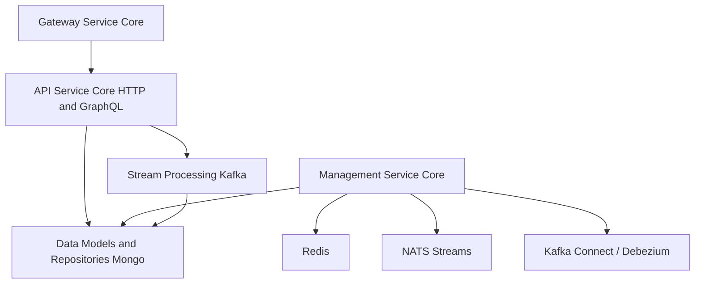
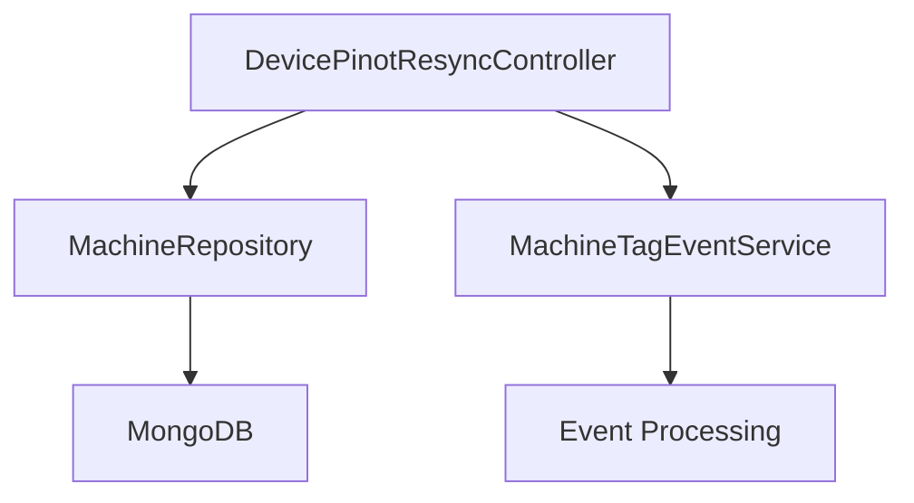
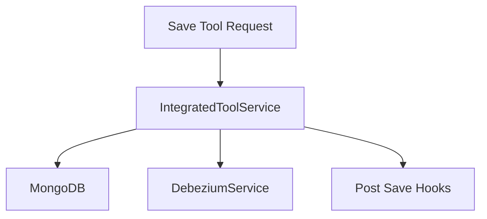
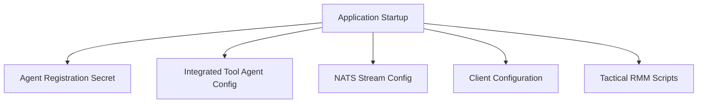
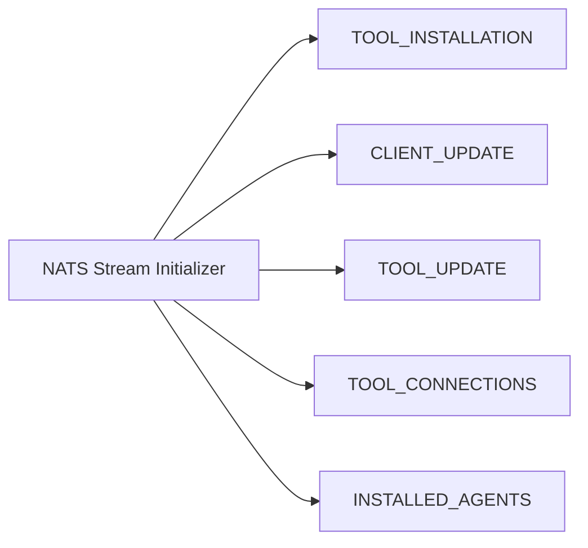
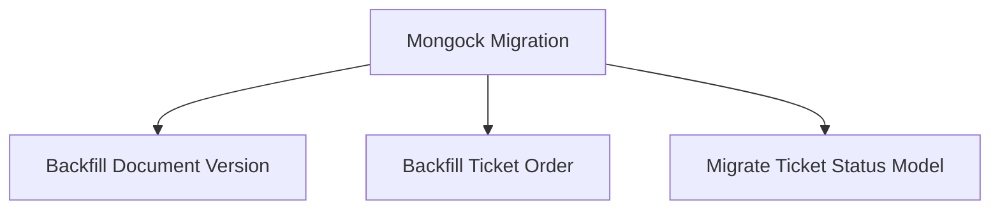
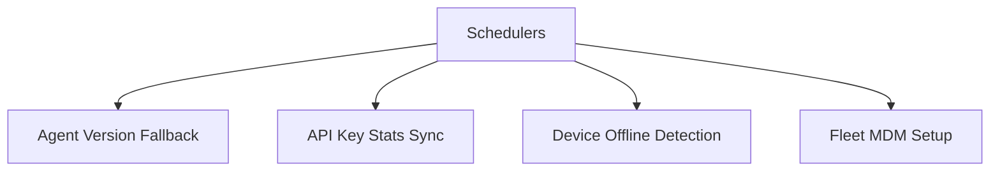

# Management Service Core

## Overview

The **Management Service Core** module is the operational backbone of the OpenFrame platform. It is responsible for:

- Cluster and release version coordination  
- Integrated tool lifecycle management  
- Agent and client configuration bootstrapping  
- Scheduled background maintenance tasks  
- MongoDB migrations and data backfills  
- Distributed job coordination via Redis-based locking  

While the API and Authorization modules expose external interfaces, the Management Service Core ensures that the platform is correctly initialized, synchronized, and maintained over time.

---

## Architectural Role in the Platform

The Management Service Core sits between infrastructure-level components (MongoDB, Redis, NATS, Kafka Connect) and higher-level services such as API, Gateway, and Stream Processing.


```mermaid
flowchart TD
    Gateway["Gateway Service Core"] --> API["API Service Core HTTP and GraphQL"]
    API --> Data["Data Models and Repositories Mongo"]
    API --> Stream["Stream Processing Kafka"]

    Management["Management Service Core"] --> Data
    Management --> Redis["Redis"]
    Management --> NATS["NATS Streams"]
    Management --> KafkaConnect["Kafka Connect / Debezium"]

    Stream --> Data
```

### Responsibilities by Layer

| Layer | Responsibility |
|--------|----------------|
| Configuration | Bootstraps encoders, retry, scheduling, locking |
| Initialization | Seeds secrets, tools, streams, client configs |
| Controllers | Administrative operational endpoints |
| Migrations | Schema and data evolution (Mongock) |
| Schedulers | Periodic distributed background tasks |
| Services | Domain-specific operational logic |
| Hooks | Extensibility points after tool persistence |

---

# Core Configuration

## ManagementConfiguration

Provides the base Spring configuration and defines a `PasswordEncoder` bean using BCrypt for secure hashing.

Key aspects:

- Component scanning across `com.openframe`  
- Excludes Cassandra health indicator  
- Registers BCrypt password encoder  

This configuration ensures Management Service Core can operate independently without requiring Cassandra dependencies.

---

## RetryConfiguration

Enables Spring Retry across the module.

```text
@Configuration
@EnableRetry
```

This allows service methods to use retry semantics for:

- External integrations  
- Transient infrastructure failures  
- Messaging retries  

---

## ShedLockConfig

Enables distributed scheduling using Redis-backed locks.


```mermaid
flowchart LR
    Scheduler["Scheduled Task"] --> ShedLock["ShedLock"]
    ShedLock --> Redis["Redis Lock Provider"]
```

Key characteristics:

- Multi-instance safe scheduling  
- Tenant-scoped lock keys  
- Environment-aware locking namespace  

Lock keys follow a tenant-scoped pattern:

```text
of:{tenantId}:job-lock:{environment}:{lockName}
```

This guarantees only one instance of a scheduled job runs across the cluster.

---

# Controllers

The Management Service Core exposes operational endpoints that are typically invoked by internal services or cluster agents.

---

## DevicePinotResyncController

**Endpoint:** `POST /v1/devices/pinot-resync`

Purpose:

- Reads all machines from MongoDB  
- Triggers `MachineTagEventService.processMachineSaveAll(...)`  
- Forces re-indexing into analytical storage (e.g., Pinot)


```mermaid
flowchart TD
    Controller["DevicePinotResyncController"] --> Repo["MachineRepository"]
    Controller --> EventService["MachineTagEventService"]
    Repo --> Mongo["MongoDB"]
    EventService --> Stream["Event Processing"]
```

This is primarily used for recovery and consistency repair.

---

## IntegratedToolController

**Base path:** `/v1/tools`

Responsibilities:

- Retrieve all integrated tools  
- Retrieve tool by ID  
- Create or update tool configuration  

### Save Flow


```mermaid
flowchart TD
    Request["Save Tool Request"] --> Service["IntegratedToolService"]
    Service --> Mongo["MongoDB"]
    Service --> Debezium["DebeziumService"]
    Service --> Hooks["Post Save Hooks"]
```

Important behavior:

- Preserves existing UUID if tool exists  
- Ensures tenant scoping  
- Enables tool automatically  
- Conditionally applies Debezium connectors only after tenant registration  
- Invokes all `IntegratedToolPostSaveHook` implementations  

### Extension Point

`IntegratedToolPostSaveHook` allows lightweight side effects after persistence without using Spring events.

---

## ReleaseVersionController

**Endpoint:** `POST /v1/cluster-registrations`

Accepts a `ReleaseVersionRequest` containing:

```text
imageTagVersion: string
```

Delegates to `ReleaseVersionService` to process cluster version updates.

This supports:

- Cluster self-registration  
- Rolling upgrade awareness  
- Version-based feature control  

---

# Application Initializers

Initializers run at application startup using `ApplicationRunner`.


```mermaid
flowchart TD
    Startup["Application Startup"] --> SecretInit["Agent Registration Secret"]
    Startup --> ToolAgentInit["Integrated Tool Agent Config"]
    Startup --> NatsInit["NATS Stream Config"]
    Startup --> ClientInit["Client Configuration"]
    Startup --> TacticalInit["Tactical RMM Scripts"]
```

---

## AgentRegistrationSecretInitializer

- Ensures an initial agent registration secret exists  
- Delegates to `AgentRegistrationSecretManagementService`  
- Uses optional processor hook for post-processing  

Default behavior is implemented by `DefaultAgentRegistrationSecretManagementProcessor`.

---

## IntegratedToolAgentInitializer

- Loads agent configurations from classpath JSON files  
- Parses via Jackson  
- Applies configuration updates through `IntegratedToolAgentService`  

Fails fast if no configuration paths are provided.

---

## NatsStreamConfigurationInitializer

Bootstraps NATS streams:

- TOOL_INSTALLATION  
- CLIENT_UPDATE  
- TOOL_UPDATE  
- TOOL_CONNECTIONS  
- INSTALLED_AGENTS  


```mermaid
flowchart LR
    Init["NATS Stream Initializer"] --> Stream1["TOOL_INSTALLATION"]
    Init --> Stream2["CLIENT_UPDATE"]
    Init --> Stream3["TOOL_UPDATE"]
    Init --> Stream4["TOOL_CONNECTIONS"]
    Init --> Stream5["INSTALLED_AGENTS"]
```

Allows additional providers to contribute extra stream definitions.

---

## OpenFrameClientConfigurationInitializer

- Loads `client-configuration.json`  
- Applies configuration through `OpenFrameClientConfigurationService`  

Ensures clients receive consistent update metadata.

---

## TacticalRmmScriptsInitializer

Automates Tactical RMM script lifecycle:

- Reads PowerShell scripts from resources  
- Checks existing scripts via TacticalRmmClient  
- Creates or updates scripts  

This ensures remote management automation remains consistent across deployments.

---

# Database Migrations (Mongock)

The module uses Mongock `@ChangeUnit` migrations for safe schema evolution.


```mermaid
flowchart TD
    Migration["Mongock Migration"] --> BackfillVersion["Backfill Document Version"]
    Migration --> BackfillOrder["Backfill Ticket Order"]
    Migration --> StatusMigration["Migrate Ticket Status Model"]
```

## BackfillDocumentVersionChangeUnit

Adds `documentVersion = 0` where missing in:

- integrated_tool_agents  
- openframe_client_configuration  
- release_versions  

Tenant-scoped execution.

---

## BackfillTicketOrdersChangeUnit

- Assigns LexoRank ordering to tickets missing order  
- Processes per `TicketStatus`  
- Sorts by `createdAt` descending  

Ensures stable column ordering in ticket boards.

---

## MigrateTicketStatusesChangeUnit

Feature-flagged migration that:

- Seeds system status definitions  
- Converts legacy `status` field  
- Writes `statusId` and `statusKind`  
- Removes legacy field  

Supports lifecycle model rollout safely.

---

# Scheduled Background Jobs

Schedulers provide continuous system maintenance.


```mermaid
flowchart TD
    Scheduler["Schedulers"] --> AgentVersion["Agent Version Fallback"]
    Scheduler --> ApiKeySync["API Key Stats Sync"]
    Scheduler --> Heartbeat["Device Offline Detection"]
    Scheduler --> FleetMdm["Fleet MDM Setup"]
```

---

## AgentVersionUpdatePublishFallbackScheduler

- Publishes OpenFrame client updates  
- Publishes tool agent updates  
- Retries until `maxPublishAttempts`  
- Uses distributed ShedLock  

Ensures reliable version propagation via NATS.

---

## ApiKeyStatsSyncScheduler

- Synchronizes API key usage statistics  
- Syncs from Redis to MongoDB  
- Protected by distributed lock  

Provides consistent billing/analytics state.

---

## DeviceHeartbeatOfflineDetectionScheduler

- Periodically marks stale devices offline  
- Delegates to `DeviceHeartbeatOfflineDetectionService`  

Maintains accurate fleet health state.

---

## FleetMdmSetupScheduler

- Detects Fleet MDM tool presence  
- Executes setup and token provisioning  
- Retries automatically on failure  

Enables automated MDM provisioning.

---

# Services

## OpenFrameClientVersionUpdateService

Designed to coordinate version update processing for OpenFrame clients.  
Currently acts as a structural extension point for publishing version updates.

---

## DefaultAgentRegistrationSecretManagementProcessor

Fallback processor for agent registration secrets.

- Executes after initial secret creation  
- Intended for logging or minimal side effects  
- Replaceable via custom bean implementation  

---

# Operational Characteristics

## Multi-Tenancy

- All migrations and schedulers operate with `TenantIdProvider`  
- Redis locks are tenant-scoped  
- Tool and configuration updates preserve tenant boundaries  

## Distributed Safety

- ShedLock prevents duplicate execution  
- Retry mechanisms handle transient failures  
- Feature flags gate risky migrations  

## Extensibility

- Post-save hooks for tools  
- Additional NATS stream providers  
- Replaceable secret processors  

---

# Summary

The **Management Service Core** module ensures that OpenFrame environments:

- Start in a consistent state  
- Remain synchronized across distributed instances  
- Safely evolve database schemas  
- Maintain external tool integrations  
- Execute reliable background operations  

It is the operational control plane of the platform — coordinating lifecycle, infrastructure, and system integrity across all services.