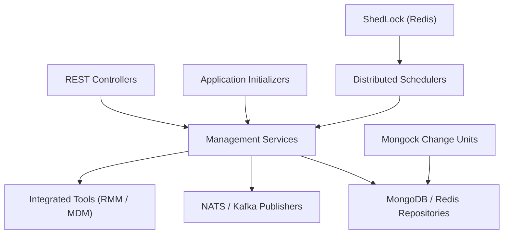
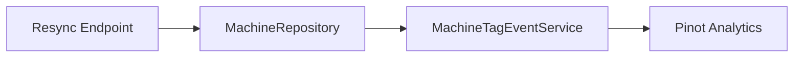
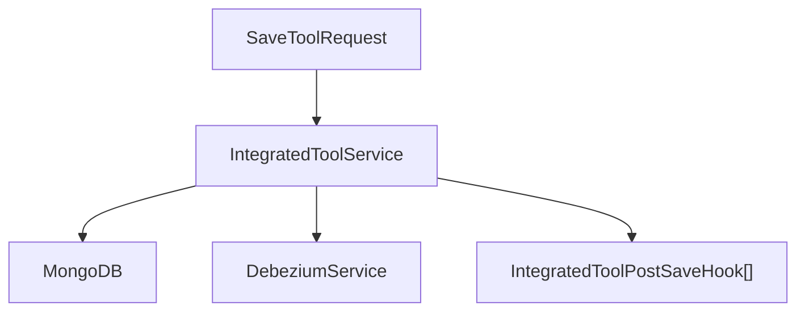
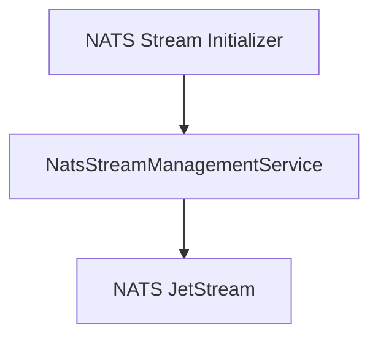
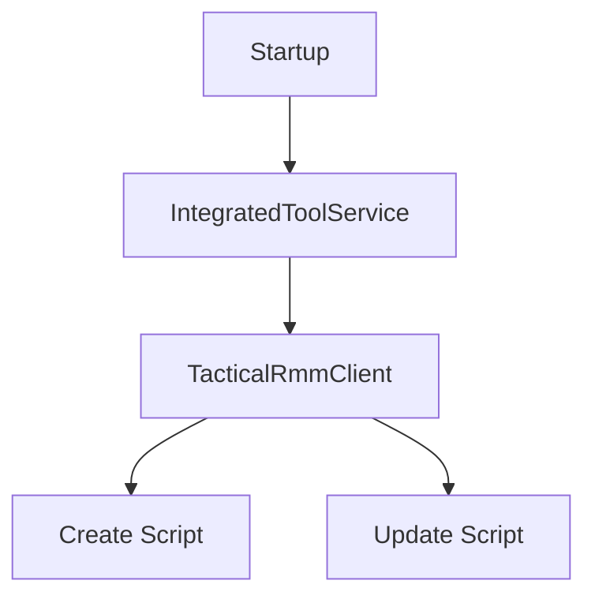
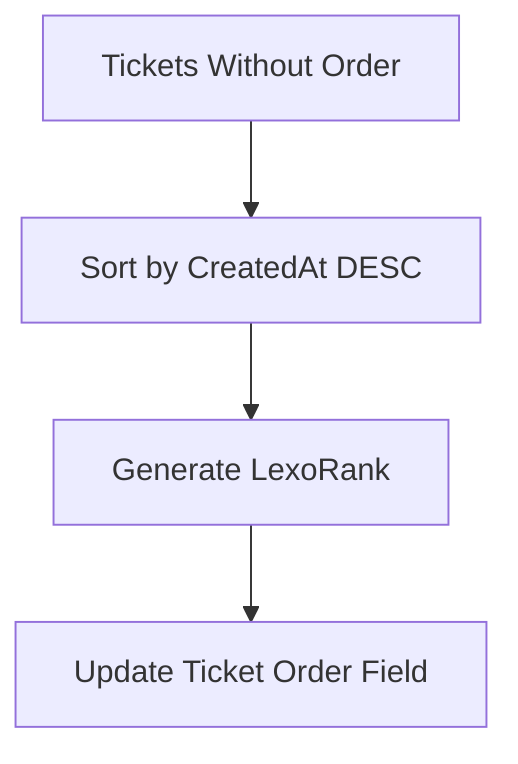
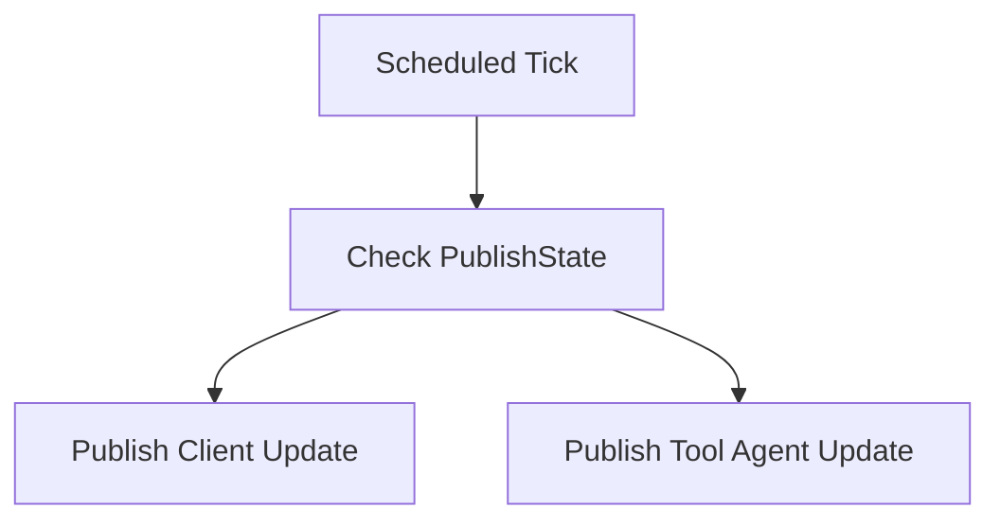
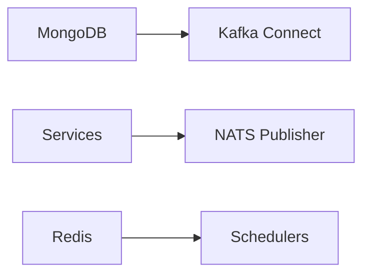
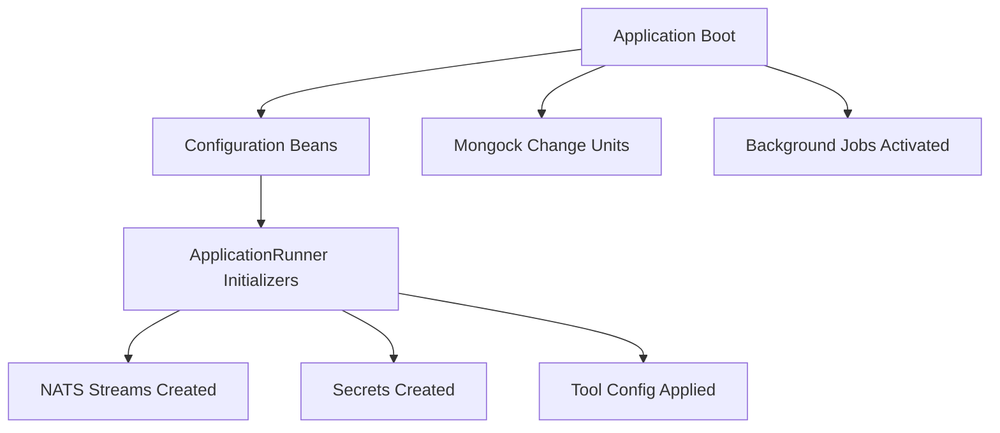

# Management Service Core

## Overview

The **Management Service Core** module is the operational backbone of the OpenFrame platform. It is responsible for:

- System bootstrapping and environment initialization
- Tool and agent configuration management
- Scheduled background orchestration
- Data migrations and lifecycle evolution
- Cross-system synchronization (MongoDB, Redis, NATS, Kafka Connect, Pinot)
- Operational endpoints for cluster and tool management

Unlike API-facing modules, the Management Service Core focuses on **infrastructure orchestration, consistency enforcement, and platform lifecycle control**.

It sits between:

- Data layer modules (MongoDB, Redis, Kafka, NATS, Pinot)
- Integration SDKs (Tactical RMM, Fleet MDM)
- Messaging infrastructure
- Tenant-aware domain services

---

## High-Level Architecture


```mermaid
flowchart TD
    Controllers["REST Controllers"] --> Services["Management Services"]
    Services --> DataLayer["MongoDB / Redis Repositories"]
    Services --> Messaging["NATS / Kafka Publishers"]
    Services --> ExternalTools["Integrated Tools (RMM / MDM)"]

    Initializers["Application Initializers"] --> Services
    Schedulers["Distributed Schedulers"] --> Services
    Migrations["Mongock Change Units"] --> DataLayer

    Locking["ShedLock (Redis)"] --> Schedulers
```

### Responsibilities by Layer

| Layer | Responsibility |
|--------|---------------|
| Controllers | Operational control endpoints |
| Initializers | System bootstrap and configuration seeding |
| Schedulers | Background reconciliation and retry jobs |
| Services | Business orchestration logic |
| Migrations | Data model evolution and backfills |
| Config | Retry, scheduling, locking, security setup |

---

## Configuration Layer

### ManagementConfiguration

- Enables component scanning across `com.openframe`
- Excludes `CassandraHealthIndicator`
- Provides `PasswordEncoder` using `BCryptPasswordEncoder`

This ensures secure hashing for management-related credentials.

---

### RetryConfiguration

```text
@EnableRetry
```

Enables Spring Retry support for resilience in external calls (e.g., tool integrations, connector creation, sync operations).

---

### ShedLockConfig

The module uses **ShedLock with Redis** for distributed scheduling safety.

Key characteristics:

- Enables Spring scheduling
- Uses Redis-based lock provider
- Tenant-aware lock prefix
- Environment-specific lock namespace

Lock key pattern:

```text
of:{tenantId}:job-lock:<environment>:<lockName>
```

This prevents duplicate execution across clustered instances.

---

## REST Controllers

The Management Service Core exposes operational endpoints.

### DevicePinotResyncController

Endpoint:

```text
POST /v1/devices/pinot-resync
```

Purpose:

- Loads all machines from MongoDB
- Re-emits machine save events
- Triggers reprocessing into Pinot analytics

Data Flow:


```mermaid
flowchart LR
    API["Resync Endpoint"] --> Repo["MachineRepository"]
    Repo --> Service["MachineTagEventService"]
    Service --> Pinot["Pinot Analytics"]
```

This is primarily used for recovery or analytics backfills.

---

### IntegratedToolController

Endpoint namespace:

```text
/v1/tools
```

Responsibilities:

- Retrieve tool configurations
- Create or update integrated tools
- Persist Debezium connector templates
- Trigger Kafka Connect updates (if tenant registered)
- Invoke post-save hooks

Flow of a Save Operation:


```mermaid
flowchart TD
    Request["SaveToolRequest"] --> ToolService["IntegratedToolService"]
    ToolService --> Mongo["MongoDB"]
    ToolService --> Debezium["DebeziumService"]
    ToolService --> Hooks["IntegratedToolPostSaveHook[]"]
```

Special behavior:

- Connectors are deferred until tenant registration
- Hooks provide extension points without event bus complexity

---

### ReleaseVersionController

Endpoint:

```text
POST /v1/cluster-registrations
```

Accepts:

```text
ReleaseVersionRequest
  imageTagVersion: String
```

Delegates to `ReleaseVersionService` for cluster version handling.

---

## Application Initializers

Initializers implement `ApplicationRunner` and execute at startup.

### AgentRegistrationSecretInitializer

- Ensures an initial agent registration secret exists
- Delegates to `AgentRegistrationSecretManagementService`
- Supports pluggable post-processing

---

### IntegratedToolAgentInitializer

- Loads agent configurations from classpath JSON files
- Deserializes into `IntegratedToolAgentConfiguration`
- Updates persistent configuration fields
- Fails fast if no configurations defined

---

### NatsStreamConfigurationInitializer

Creates NATS streams at startup.

Configured streams include:

- TOOL_INSTALLATION
- CLIENT_UPDATE
- TOOL_UPDATE
- TOOL_CONNECTIONS
- INSTALLED_AGENTS

Each stream defines:

- Subject patterns (e.g., `machine.*.tool-installation`)
- Storage type
- Retention policy


```mermaid
flowchart TD
    Init["NATS Stream Initializer"] --> Mgmt["NatsStreamManagementService"]
    Mgmt --> NATS["NATS JetStream"]
```

---

### OpenFrameClientConfigurationInitializer

- Loads `client-configuration.json`
- Updates stored OpenFrame client configuration
- Ensures consistent rollout behavior

---

### TacticalRmmScriptsInitializer

Synchronizes predefined scripts into Tactical RMM:

1. Loads script content from classpath
2. Fetches existing scripts from Tactical RMM
3. Creates or updates scripts as needed


```mermaid
flowchart TD
    Start["Startup"] --> Tool["IntegratedToolService"]
    Tool --> Tactical["TacticalRmmClient"]
    Tactical --> Create["Create Script"]
    Tactical --> Update["Update Script"]
```

This ensures platform-managed automation scripts remain consistent.

---

## Data Migrations (Mongock)

The module includes Mongock `@ChangeUnit` migrations.

### BackfillDocumentVersionChangeUnit

Backfills missing `documentVersion` fields in:

- integrated_tool_agents
- openframe_client_configuration
- release_versions

Sets default value:

```text
0L
```

---

### BackfillTicketOrdersChangeUnit

Backfills ticket ordering using **LexoRank**:

- Groups by status
- Sorts by creation date
- Assigns incremental ranks


```mermaid
flowchart TD
    Query["Tickets Without Order"] --> Sort["Sort by CreatedAt DESC"]
    Sort --> Rank["Generate LexoRank"]
    Rank --> Update["Update Ticket Order Field"]
```

---

### MigrateTicketStatusesChangeUnit

Performs lifecycle migration from legacy status field to new model:

- Seeds system statuses
- Migrates legacy tickets
- Sets `statusId` and `statusKind`
- Removes legacy field
- Feature flag controlled

This migration is tenant-aware and safe to rerun.

---

## Distributed Schedulers

Schedulers perform background consistency tasks.

### AgentVersionUpdatePublishFallbackScheduler

Purpose:

- Retries publishing OpenFrame client updates
- Retries publishing tool agent updates
- Honors max publish attempts
- Uses ShedLock for distributed safety


```mermaid
flowchart TD
    Tick["Scheduled Tick"] --> Check["Check PublishState"]
    Check --> PublishClient["Publish Client Update"]
    Check --> PublishTool["Publish Tool Agent Update"]
```

---

### ApiKeyStatsSyncScheduler

- Synchronizes API key usage stats from Redis to MongoDB
- Distributed lock protected
- Configurable interval

---

### DeviceHeartbeatOfflineDetectionScheduler

- Periodically detects stale device heartbeats
- Marks devices offline
- Controlled via feature property

---

### FleetMdmSetupScheduler

- Detects Fleet MDM server integration
- Runs setup if needed
- Retrieves and persists API token

---

## Service Layer

### OpenFrameClientVersionUpdateService

Responsible for processing new release versions.

Currently delegates publishing behavior via:

- `OpenFrameClientUpdatePublisher`

Designed to:

- Trigger client version rollout
- Coordinate update distribution

---

### DefaultAgentRegistrationSecretManagementProcessor

Provides default post-processing for newly created agent secrets.

Extensible via:

```text
AgentRegistrationSecretManagementProcessor
```

Allows platform-specific behavior injection without modifying core logic.

---

## Cross-Cutting Concerns

### Multi-Tenancy

- TenantIdProvider used across migrations and controllers
- Lock keys are tenant-scoped
- Queries are tenant-filtered

---

### Messaging Integration

The module integrates with:

- NATS JetStream
- Kafka Connect (Debezium connectors)
- Redis
- MongoDB


```mermaid
flowchart LR
    Mongo["MongoDB"] --> Debezium["Kafka Connect"]
    Services --> NATS["NATS Publisher"]
    Redis["Redis"] --> Schedulers
```

---

### Resilience & Safety

- Spring Retry enabled
- ShedLock distributed scheduling
- Idempotent migrations
- Defensive exception handling
- Feature-flag guarded rollouts

---

## Execution Lifecycle


```mermaid
flowchart TD
    Boot["Application Boot"] --> Config["Configuration Beans"]
    Config --> Initializers["ApplicationRunner Initializers"]
    Initializers --> Streams["NATS Streams Created"]
    Initializers --> Secrets["Secrets Created"]
    Initializers --> ToolConfig["Tool Config Applied"]

    Boot --> Migrations["Mongock Change Units"]
    Boot --> Schedulers["Background Jobs Activated"]
```

---

## Summary

The **Management Service Core** module is responsible for:

- Bootstrapping platform infrastructure
- Managing integrated tool lifecycle
- Orchestrating background reconciliation jobs
- Enforcing tenant-safe distributed execution
- Performing data migrations and schema evolution
- Synchronizing cross-system configurations

It acts as the **operational control plane** of OpenFrame, ensuring that configuration, integrations, and distributed tasks remain consistent across tenants and clustered deployments.

This module is foundational for platform stability, lifecycle management, and integration governance.