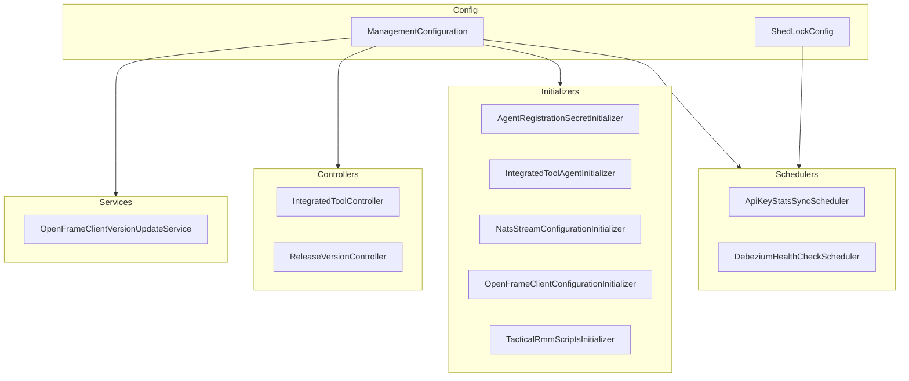

# management_service_core_config Module Documentation

## Introduction

The `management_service_core_config` module provides the foundational configuration for the management service within the system. It is responsible for initializing and managing core settings, distributed locking, and integration points required for the reliable operation of management-related features. This module ensures that the management service is properly configured to interact with other system components, maintain consistency, and support scheduled and concurrent operations.

## Core Components

- **ManagementConfiguration**: Centralizes the configuration properties and beans required for the management service.
- **ShedLockConfig**: Configures distributed locking using ShedLock to ensure that scheduled tasks are executed safely in a clustered environment.

## Architecture Overview

The `management_service_core_config` module acts as the backbone for the management service, providing configuration and distributed coordination. It interacts with initializers, schedulers, controllers, and services within the management service, and ensures safe integration with external systems such as databases and message brokers.

### High-Level Architecture

```mermaid
flowchart TD
    ManagementConfiguration["ManagementConfiguration"] -->|provides config to| IntegratedToolController["IntegratedToolController"]
    ManagementConfiguration -->|provides config to| ReleaseVersionController["ReleaseVersionController"]
    ManagementConfiguration -->|provides config to| ApiKeyStatsSyncScheduler["ApiKeyStatsSyncScheduler"]
    ManagementConfiguration -->|provides config to| DebeziumHealthCheckScheduler["DebeziumHealthCheckScheduler"]
    ManagementConfiguration -->|provides config to| OpenFrameClientVersionUpdateService["OpenFrameClientVersionUpdateService"]
    ManagementConfiguration -->|provides config to| AgentRegistrationSecretInitializer["AgentRegistrationSecretInitializer"]
    ManagementConfiguration -->|provides config to| IntegratedToolAgentInitializer["IntegratedToolAgentInitializer"]
    ManagementConfiguration -->|provides config to| NatsStreamConfigurationInitializer["NatsStreamConfigurationInitializer"]
    ManagementConfiguration -->|provides config to| OpenFrameClientConfigurationInitializer["OpenFrameClientConfigurationInitializer"]
    ManagementConfiguration -->|provides config to| TacticalRmmScriptsInitializer["TacticalRmmScriptsInitializer"]
    ShedLockConfig["ShedLockConfig"] -->|enables distributed locking for| ApiKeyStatsSyncScheduler
    ShedLockConfig -->|enables distributed locking for| DebeziumHealthCheckScheduler
```

### Component Relationships

- **ManagementConfiguration** supplies configuration beans and properties to all major management service components, including controllers, schedulers, and initializers.
- **ShedLockConfig** ensures that scheduled jobs (such as those in `management_service_core_scheduler`) are executed only once across distributed instances, preventing duplicate executions.

## Data and Process Flow

The following diagram illustrates how configuration and distributed locking flow through the management service:

## Integration with Other Modules

- **Schedulers**: [management_service_core_scheduler.md]
- **Initializers**: [management_service_core_initializer.md]
- **Controllers**: [management_service_core_controller.md]
- **Services**: [management_service_core_service.md]
- **Pinot Configuration**: [management_service_core_config_pinot.md]

The `management_service_core_config` module is designed to be extensible and integrates with other configuration modules such as `api_service_core_config` and `data_config` for broader system configuration and data access.

## Dependencies

- **ShedLock**: Used for distributed locking of scheduled tasks.
- **Spring Framework**: For dependency injection and configuration management.
- **Other Management Service Modules**: Relies on and provides configuration to other management service modules as described above.

## Example Usage

The configuration beans defined in this module are automatically picked up by Spring Boot during application startup. Scheduled jobs and initializers depend on these beans for their configuration and distributed coordination.

## See Also

- [management_service_core_scheduler.md] - For details on scheduled jobs and their configuration
- [management_service_core_initializer.md] - For details on system initializers
- [management_service_core_controller.md] - For management service controllers
- [management_service_core_service.md] - For management service business logic
- [management_service_core_config_pinot.md] - For Pinot-specific configuration
- [api_service_core_config.md] - For core API service configuration
- [data_config.md] - For data layer configuration
