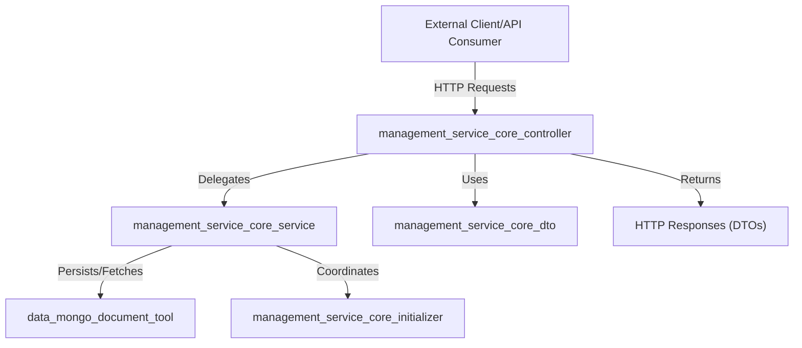
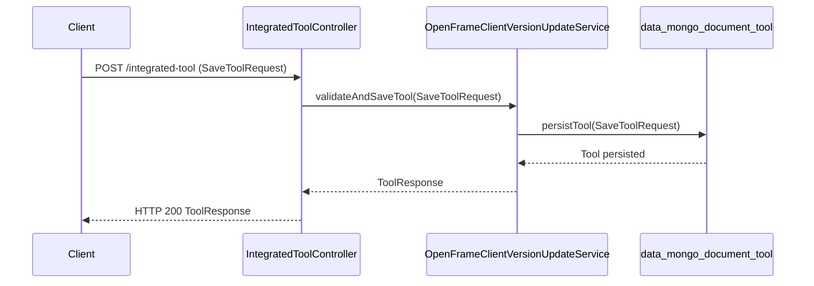
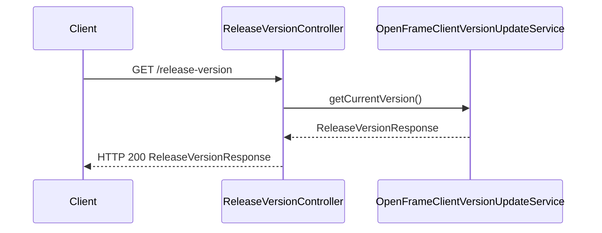
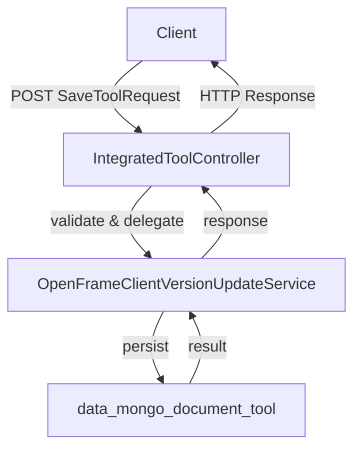

# management_service_core_controller

## Introduction

The `management_service_core_controller` module provides REST API endpoints for managing integrated tools and retrieving release version information within the management service. It acts as the primary interface for external clients and internal services to interact with integrated tool management and versioning features. This module is a key part of the management service's API layer, orchestrating requests, delegating business logic to service layers, and returning structured responses.

**Core Components:**
- `IntegratedToolController`
- `ReleaseVersionController`

## Module Purpose and Core Functionality

The main responsibilities of the `management_service_core_controller` module are:

- **Integrated Tool Management:** Exposes endpoints to create, update, and manage integrated tools within the system.
- **Release Version Information:** Provides endpoints to query and manage release version data for the management service or its components.

These controllers serve as the entry point for HTTP requests, validate and parse incoming data, and coordinate with service and data layers to fulfill requests.

## Architecture Overview

The `management_service_core_controller` module is part of a layered architecture, interacting with DTOs, service, and initializer modules. The following diagram illustrates its high-level relationships:

- **External clients** interact with the controllers via HTTP.
- Controllers use DTOs for request/response payloads.
- Business logic is delegated to the service layer (see [management_service_core_service.md]).
- Data persistence and retrieval are handled by the data layer (see [data_mongo_document_tool.md]).
- Initializers may be invoked for setup or configuration tasks (see [management_service_core_initializer.md]).

## Component Details

### IntegratedToolController

- **Purpose:** Handles all API operations related to integrated tools, such as creation, update, and retrieval.
- **Key Endpoints:**
  - Create or update an integrated tool
  - Fetch integrated tool details
- **Dependencies:**
  - Uses `SaveToolRequest` from [management_service_core_controller_integratedtool.md] for input validation and parsing.
  - Delegates business logic to services in [management_service_core_service.md].
  - May interact with data models in [data_mongo_document_tool.md].

#### Data Flow Example

### ReleaseVersionController

- **Purpose:** Provides endpoints to retrieve or update release version information for the management service or its components.
- **Key Endpoints:**
  - Get current release version
  - Update release version (if applicable)
- **Dependencies:**
  - Uses `ReleaseVersionRequest` from [management_service_core_dto.md] for input.
  - Delegates logic to services in [management_service_core_service.md].

#### Data Flow Example

## Integration with Other Modules

- **DTOs:**
  - Request and response objects are defined in [management_service_core_dto.md] and [management_service_core_controller_integratedtool.md].
- **Service Layer:**
  - Business logic is implemented in [management_service_core_service.md].
- **Data Layer:**
  - Data persistence and retrieval are handled by [data_mongo_document_tool.md] and related modules.
- **Initializers:**
  - System setup and configuration are managed by [management_service_core_initializer.md].

## Process Flow: Integrated Tool Registration

## Summary

The `management_service_core_controller` module is a central API layer for integrated tool and release version management in the management service. It coordinates between clients, service logic, and data persistence, ensuring a clean separation of concerns and maintainable architecture.

For further details on related modules, see:
- [management_service_core_service.md]
- [management_service_core_dto.md]
- [management_service_core_controller_integratedtool.md]
- [data_mongo_document_tool.md]
- [management_service_core_initializer.md]
