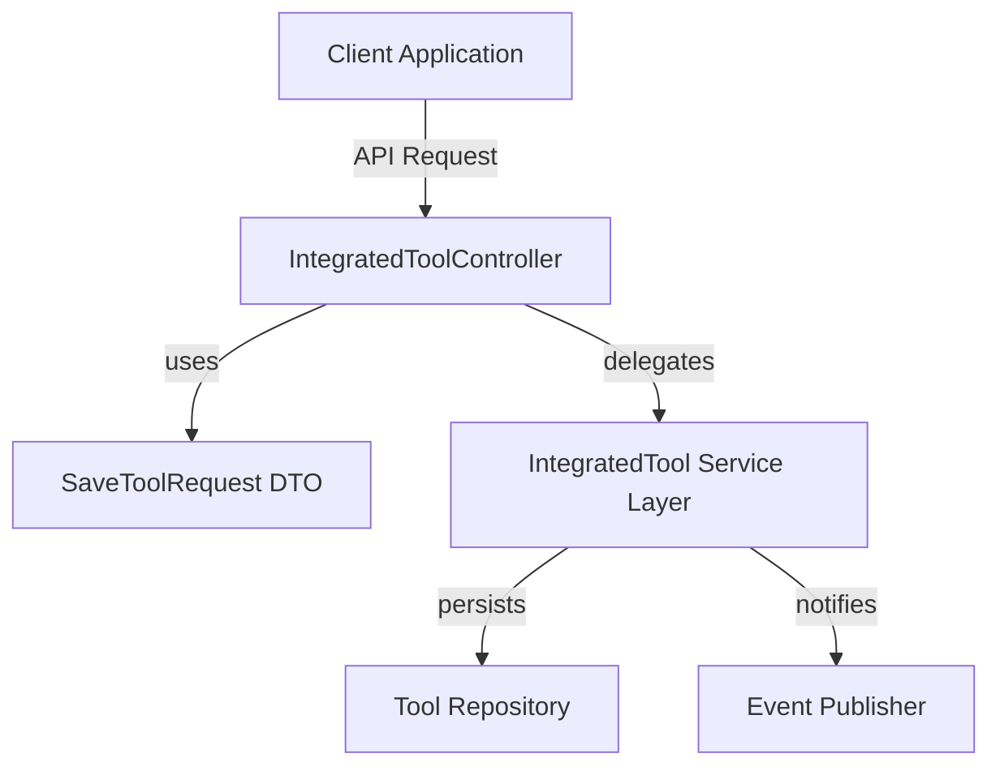
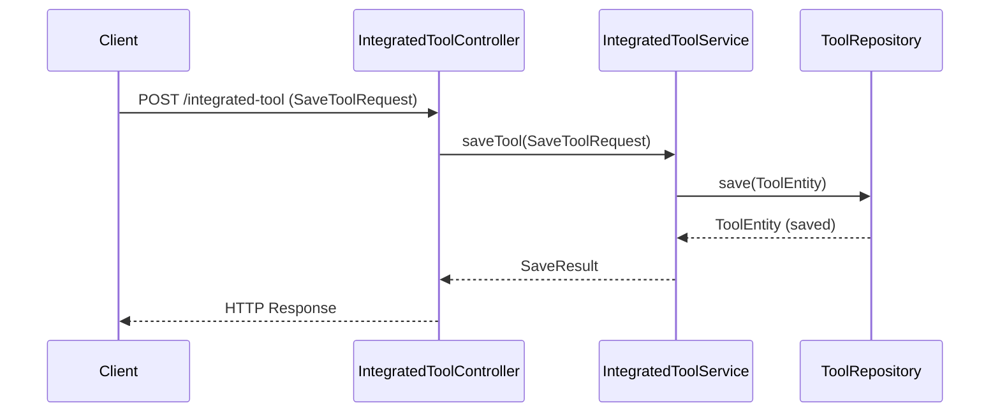
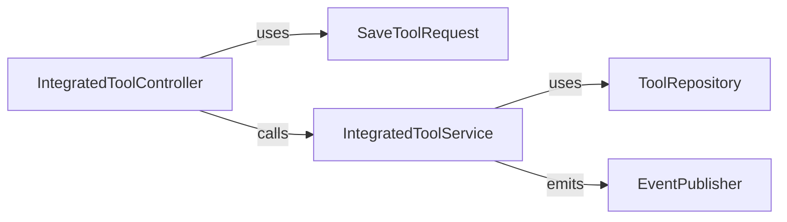

# management_service_core_controller_integratedtool

## Introduction

The `management_service_core_controller_integratedtool` module is responsible for handling API requests related to the management and integration of external tools within the management service. It acts as a controller layer, exposing endpoints for tool-related operations, such as saving or updating tool configurations. This module is a key part of the management service's extensibility, enabling seamless integration with third-party tools and platforms.

## Core Functionality

- **API Endpoint Exposure:** Provides RESTful endpoints for managing integrated tools.
- **Request Handling:** Processes incoming requests for saving or updating tool configurations via the `SaveToolRequest` core component.
- **Delegation:** Delegates business logic to relevant service layers, ensuring separation of concerns and maintainability.

## Key Component

### SaveToolRequest

The `SaveToolRequest` is the primary data transfer object (DTO) used by this controller. It encapsulates all necessary information required to save or update an integrated tool's configuration. This may include tool identifiers, configuration parameters, authentication details, and metadata.

For details on the structure and fields of `SaveToolRequest`, refer to the [management_service_core_controller_integratedtool.md](management_service_core_controller_integratedtool.md) documentation.

## Architecture Overview

The `management_service_core_controller_integratedtool` module fits into the broader management service architecture as follows:

- **Client Application:** Initiates requests to manage integrated tools.
- **IntegratedToolController:** Handles HTTP requests, validates input, and constructs `SaveToolRequest` objects.
- **Service Layer:** Contains business logic for tool integration, such as validation, persistence, and event publishing.
- **Repository:** Manages database operations for tool entities.
- **Event Publisher:** Optionally emits events for downstream processing (e.g., audit, notification).

## Data Flow

## Dependencies and Integration Points

- **Service Layer:** The controller relies on the service layer (see [management_service_core_service.md](management_service_core_service.md)) for business logic and persistence.
- **DTOs:** Utilizes DTOs defined in [management_service_core_controller_integratedtool.md](management_service_core_controller_integratedtool.md) and potentially other shared DTO modules.
- **Repository Layer:** Interacts with repositories for data persistence (see [data_mongo_repository_tool.md](data_mongo_repository_tool.md)).
- **Eventing:** May publish events for audit or notification purposes (see [stream_service_core_service.md](stream_service_core_service.md)).

## Component Relationships

## Related Modules

- [management_service_core_service.md](management_service_core_service.md): Business logic for integrated tool management.
- [data_mongo_repository_tool.md](data_mongo_repository_tool.md): MongoDB repository for tool persistence.
- [stream_service_core_service.md](stream_service_core_service.md): Event publishing and data enrichment services.

## Summary

The `management_service_core_controller_integratedtool` module is a crucial entry point for managing integrated tools within the management service. By cleanly separating API, business, and persistence layers, it ensures maintainability and extensibility for integrating a wide range of external tools.
