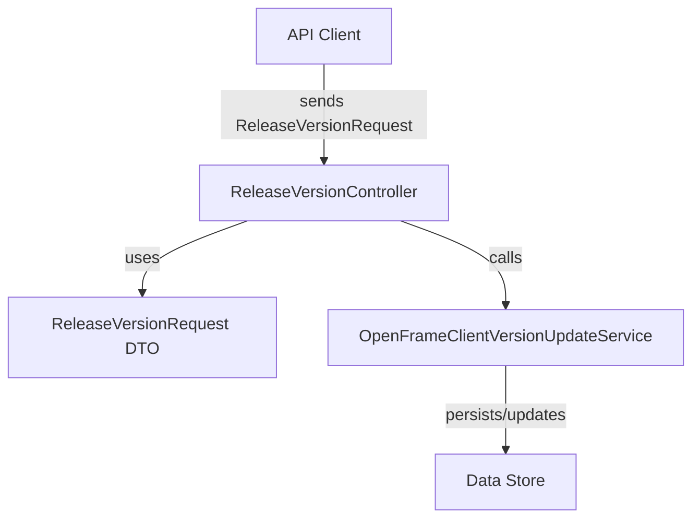
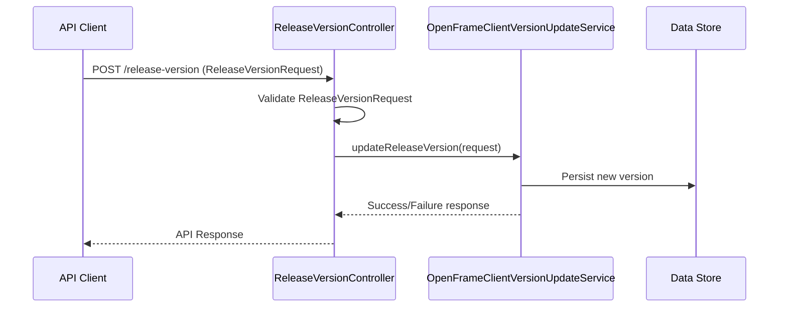

# management_service_core_dto Module Documentation

## Introduction

The `management_service_core_dto` module defines Data Transfer Objects (DTOs) used by the management service core layer, primarily for API requests and responses. DTOs in this module are designed to encapsulate and validate data exchanged between clients and the management service, ensuring a clear contract for versioning, validation, and serialization. This module is essential for maintaining a clean separation between the internal domain models and the data exposed via APIs.

## Core Functionality

- **Defines request/response payloads** for management service endpoints, especially those related to release version management.
- **Ensures type safety and validation** for incoming and outgoing data.
- **Facilitates versioning** and backward compatibility for API consumers.

## Core Components

### ReleaseVersionRequest

The primary DTO in this module is `ReleaseVersionRequest`, which is used to encapsulate the data required to request or update a release version in the management service. This object is typically used by the [ReleaseVersionController](management_service_core_controller.md) to process version-related API calls.

**Typical fields might include:**
- `version`: The version string (e.g., "1.2.3").
- `description`: Optional description of the release.
- `releaseDate`: Timestamp or date string for the release.
- `metadata`: Additional metadata as needed.

> **Note:** For the exact structure and validation rules, refer to the source code or API documentation.

## Architecture and Relationships

The `management_service_core_dto` module is a small but critical part of the management service architecture. It interacts with controllers, services, and other DTO modules to provide a consistent data contract.

### High-Level Architecture

### Component Interaction

- **API Client**: Initiates a request to update or query a release version.
- **ReleaseVersionController** ([see documentation](management_service_core_controller.md)): Receives the request, validates the payload using `ReleaseVersionRequest`, and delegates business logic to the service layer.
- **OpenFrameClientVersionUpdateService** ([see documentation](management_service_core_service.md)): Handles the core logic for updating or retrieving release version information.
- **Data Store**: The persistent storage where release version data is saved or retrieved.

### Dependencies

- **management_service_core_controller**: Uses `ReleaseVersionRequest` for endpoint input validation and processing.
- **management_service_core_service**: Consumes validated DTOs to perform business logic.
- **Other DTO modules**: For more complex operations, may interact with DTOs from other modules (e.g., for pagination, filtering, etc.).

## Data Flow Example

## Integration in the Overall System

The `management_service_core_dto` module is tightly integrated with the management service's controller and service layers. It ensures that all data entering or leaving the management service is well-structured, validated, and versioned, supporting maintainability and scalability.

For related DTOs and broader data contracts, see:
- [api_service_core_dto.md](api_service_core_dto.md) — General API DTOs
- [management_service_core_controller.md](management_service_core_controller.md) — Controllers using these DTOs
- [management_service_core_service.md](management_service_core_service.md) — Services processing these DTOs

## References

- [api_service_core_dto.md](api_service_core_dto.md)
- [management_service_core_controller.md](management_service_core_controller.md)
- [management_service_core_service.md](management_service_core_service.md)

---
*This documentation was auto-generated to provide a comprehensive overview of the `management_service_core_dto` module, its purpose, architecture, and integration points within the system.*
