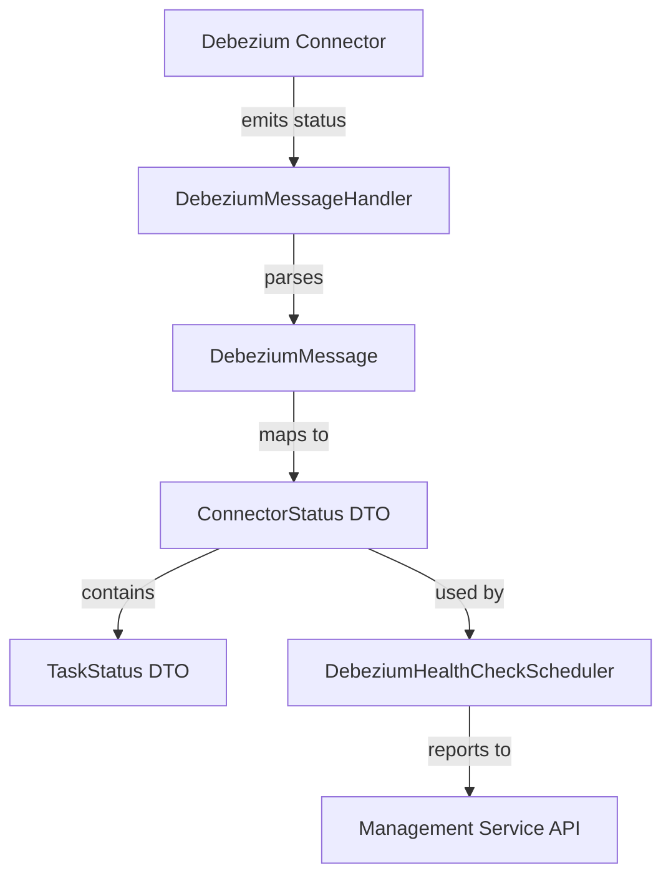

# management_service_core_dto_debezium Module Documentation

## Introduction

The `management_service_core_dto_debezium` module provides Data Transfer Objects (DTOs) for representing the status and health of Debezium connectors and their associated tasks within the management service. These DTOs are essential for monitoring, reporting, and orchestrating Debezium-based change data capture (CDC) integrations in the broader system.

This module is typically used in conjunction with Debezium health check schedulers, message handlers, and Kafka-based event streaming components. It enables the management service to communicate the state of Debezium connectors to other system components and to external clients via APIs.

## Core Components

- **ConnectorStatus**: Represents the status of a Debezium connector, including its name, state, and associated task statuses.
- **TaskStatus**: Represents the status of an individual task within a Debezium connector, including task ID and state.

> For details on how these DTOs are used in health checking and orchestration, see [management_service_core_scheduler.md] and [stream_service_core_handler.md].

## Architecture and Data Flow

The following diagram illustrates how the DTOs in this module fit into the overall Debezium monitoring and management workflow:



### Component Relationships

- **DebeziumMessageHandler** ([stream_service_core_handler.md]) receives and parses status messages from Debezium connectors.
- **DebeziumMessage** ([data_kafka_model_debezium.md]) is the raw message format received from Kafka.
- **ConnectorStatus** and **TaskStatus** (this module) are DTOs used to represent parsed and structured status information.
- **DebeziumHealthCheckScheduler** ([management_service_core_scheduler.md]) uses these DTOs to perform periodic health checks and to update the management service state.

## Usage in the System

The DTOs in this module are primarily used in the following scenarios:

1. **Health Monitoring**: The management service schedules periodic health checks for Debezium connectors. The results are represented using `ConnectorStatus` and `TaskStatus`.
2. **API Responses**: When clients query the management service for connector health, these DTOs are serialized and returned as part of the API response.
3. **Event Processing**: As Debezium emits status events, handlers parse the raw messages and map them to these DTOs for further processing and reporting.

## Example Data Structure

Below is a representative example of how these DTOs might be structured in JSON:

```json
{
  "name": "inventory-connector",
  "state": "RUNNING",
  "tasks": [
    { "id": 0, "state": "RUNNING" },
    { "id": 1, "state": "FAILED" }
  ]
}
```

- The top-level object represents a `ConnectorStatus`.
- The `tasks` array contains multiple `TaskStatus` objects.

## Related Modules

- [management_service_core_scheduler.md]: Debezium health check scheduling and orchestration
- [stream_service_core_handler.md]: Debezium message handling and parsing
- [data_kafka_model_debezium.md]: Raw Debezium message model

## Summary

The `management_service_core_dto_debezium` module provides the essential DTOs for representing and communicating the health and status of Debezium connectors and their tasks. These DTOs are a critical part of the management service's monitoring, orchestration, and API response capabilities.
