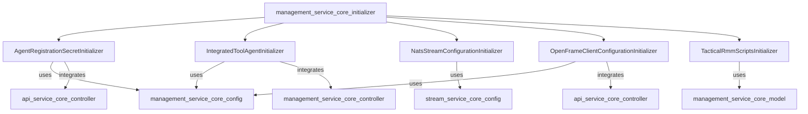
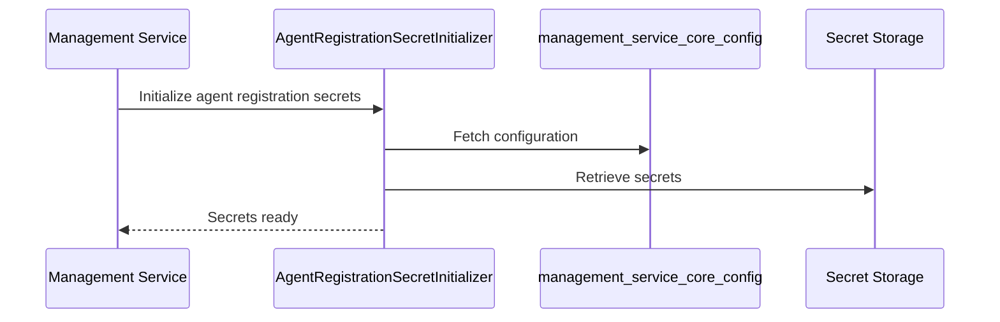

# management_service_core_initializer

## Introduction

The `management_service_core_initializer` module is responsible for initializing and configuring key components and services required for the management service's operation. It acts as the entry point for setting up integrations, secrets, client configurations, and streaming infrastructure necessary for the orchestration and management of integrated tools, agent registration, and client communication within the system.

This module is essential for ensuring that all dependent services and configurations are properly initialized at application startup, enabling seamless operation and integration with external systems and internal modules.

## Core Components

The module provides the following core initializers:

- **AgentRegistrationSecretInitializer**: Handles the initialization of agent registration secrets, ensuring secure onboarding of agents.
- **IntegratedToolAgentInitializer**: Sets up and configures integrated tool agents, preparing them for operation within the management ecosystem.
- **NatsStreamConfigurationInitializer**: Initializes the NATS streaming configuration, enabling reliable message streaming and communication between distributed components.
- **OpenFrameClientConfigurationInitializer**: Prepares the OpenFrame client configuration, allowing clients to interact with the management service using the correct settings and endpoints.
- **TacticalRmmScriptsInitializer**: Loads and configures scripts for Tactical RMM (Remote Monitoring and Management), supporting automation and remote operations.

## Architecture Overview

The `management_service_core_initializer` module acts as a central orchestrator, coordinating the initialization of various subsystems. It interacts with configuration modules, service modules, and external integration modules to ensure all dependencies are satisfied before the management service becomes operational.

## Component Interactions and Data Flow

Each initializer in this module is responsible for preparing a specific aspect of the management service:

- **AgentRegistrationSecretInitializer** interacts with configuration and secret management modules to securely load and provide agent registration secrets. It may depend on [management_service_core_config.md] and [api_service_core_controller.md] for configuration and controller logic.
- **IntegratedToolAgentInitializer** sets up integrated tool agents, working closely with [management_service_core_controller.md] and [management_service_core_model.md] for tool definitions and operational logic.
- **NatsStreamConfigurationInitializer** configures the NATS streaming infrastructure, relying on [stream_service_core_config.md] for Kafka/NATS settings and message handling.
- **OpenFrameClientConfigurationInitializer** prepares client configuration, ensuring that clients can connect and interact with the management service, referencing [api_service_core_controller.md] for client-facing endpoints.
- **TacticalRmmScriptsInitializer** loads and manages scripts for Tactical RMM, utilizing [management_service_core_model.md] for script configuration and storage.

### Data Flow Example

## Dependencies

The `management_service_core_initializer` module depends on several other modules for configuration, data models, and service logic:

- [management_service_core_config.md]: Provides configuration classes and settings
- [management_service_core_model.md]: Supplies data models such as script configurations
- [management_service_core_controller.md]: Exposes controllers for integrated tools and versioning
- [stream_service_core_config.md]: Supplies streaming and messaging configuration
- [api_service_core_controller.md]: Offers API endpoints for agent registration, client configuration, and more

## Integration in the Overall System

This module is invoked during the application startup phase. It ensures that all required secrets, tool agents, client configurations, and streaming infrastructures are initialized and ready for use by other modules and services. Its successful execution is critical for the management service to function correctly and securely.

## Related Documentation

- [management_service_core_config.md]
- [management_service_core_model.md]
- [management_service_core_controller.md]
- [stream_service_core_config.md]
- [api_service_core_controller.md]

## Summary

The `management_service_core_initializer` module is a foundational part of the management service, responsible for orchestrating the initialization of secrets, tool agents, client configurations, and streaming infrastructure. By coordinating with configuration, model, and controller modules, it ensures the management service is fully prepared for operation and integration with the broader system.
