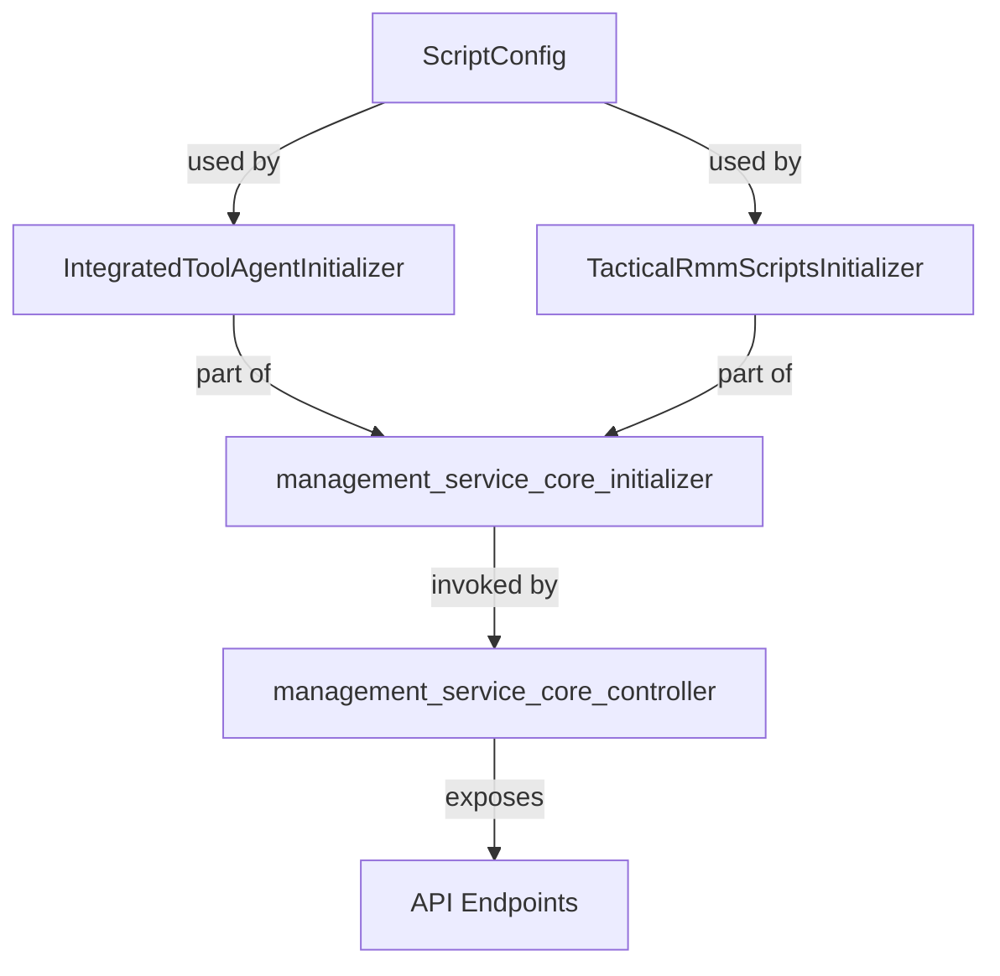
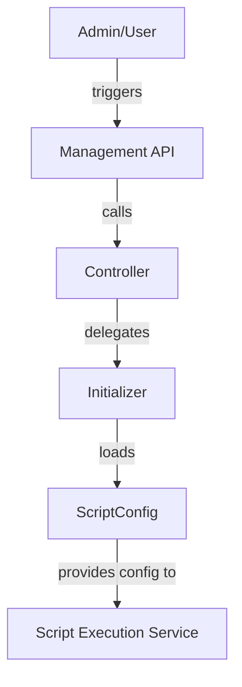

# management_service_core_model Module Documentation

## Introduction

The `management_service_core_model` module provides core data models and configuration objects that are essential for the management service layer of the system. These models are primarily used to represent and manage script configurations and related metadata, serving as a bridge between the management service and other system components such as controllers, initializers, and schedulers.

This module is designed to be lightweight, focusing on encapsulating configuration data and ensuring consistency across the management service's operations. It is typically used in conjunction with other modules such as `management_service_core_controller`, `management_service_core_initializer`, and `management_service_core_scheduler`.

## Core Components

### ScriptConfig

The primary component of this module is the `ScriptConfig` model. This model encapsulates the configuration details required for managing and executing scripts within the management service. It is referenced by initializers and controllers that handle script-based automation, integration, and orchestration tasks.

**Key responsibilities:**
- Define and store script-related configuration parameters
- Provide a structured way to access script metadata
- Facilitate integration with script initializers and execution services

> **Note:** For details on how `ScriptConfig` is used during initialization, see [management_service_core_initializer.md].

## Architecture and Component Relationships

The `management_service_core_model` module is a foundational building block within the management service architecture. It interacts with several other modules, either directly or indirectly, as illustrated below.

### Component Interaction

- **ScriptConfig**: Defines the structure for script configuration data.
- **Initializers** (e.g., `IntegratedToolAgentInitializer`, `TacticalRmmScriptsInitializer`): Use `ScriptConfig` to load and manage script configurations at service startup.
- **Controllers**: Indirectly interact with `ScriptConfig` via initializers to expose management APIs.

## Data Flow

The following diagram illustrates the typical data flow involving the `ScriptConfig` model:

## Dependencies and Integration

- **Upstream dependencies:** None (the module is self-contained and does not depend on other modules for its core functionality).
- **Downstream dependencies:**
    - [management_service_core_initializer.md]: Consumes `ScriptConfig` for initializing script agents and configurations.
    - [management_service_core_controller.md]: Indirectly interacts with `ScriptConfig` through initializers to provide management endpoints.
    - [management_service_core_scheduler.md]: May reference `ScriptConfig` for scheduled script-related tasks.

## How It Fits Into the Overall System

The `management_service_core_model` module acts as a central definition point for script configuration data within the management service. By providing a consistent model, it enables other components to reliably access and manage script-related settings, ensuring smooth orchestration and automation across the management service.

For more information on related modules, see:
- [management_service_core_initializer.md]
- [management_service_core_controller.md]
- [management_service_core_scheduler.md]

## References

- [management_service_core_initializer.md]: Details on how script configurations are loaded and initialized
- [management_service_core_controller.md]: API endpoints for managing scripts and tools
- [management_service_core_scheduler.md]: Scheduled tasks involving script management
