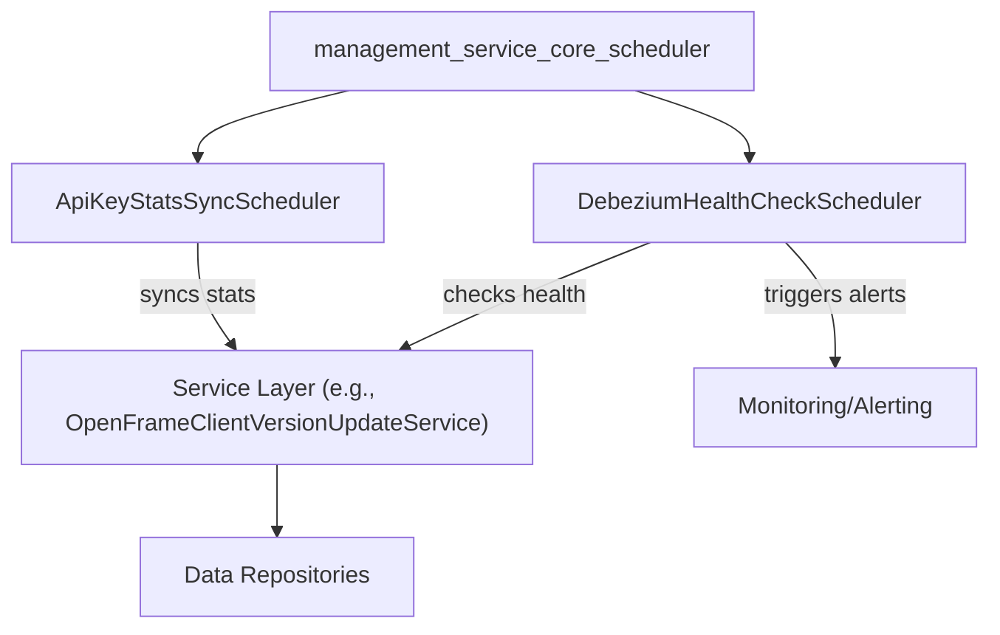
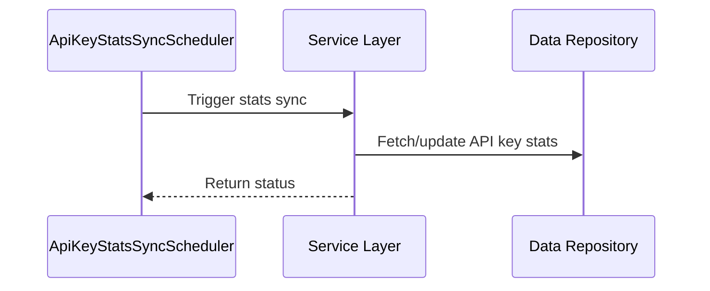
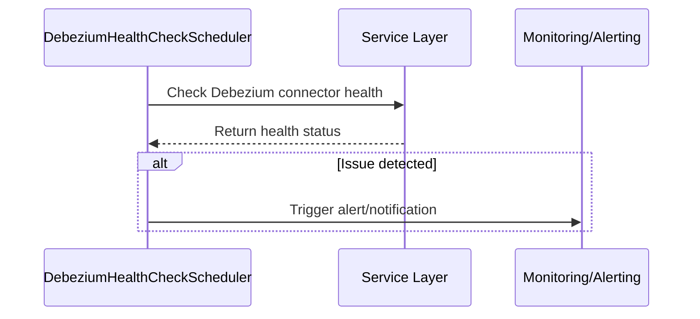
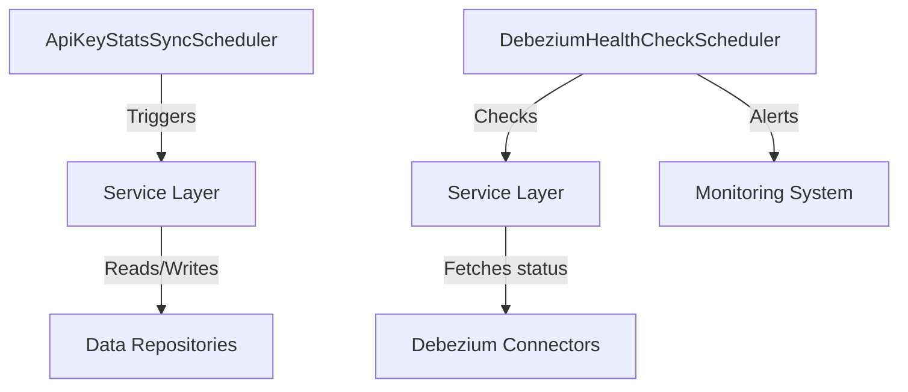

# management_service_core_scheduler

## Introduction

The `management_service_core_scheduler` module is responsible for orchestrating scheduled background tasks within the management service. Its primary focus is on automating periodic operations such as synchronizing API key statistics and monitoring the health of Debezium connectors, which are essential for data integration and system observability. This module ensures that critical maintenance and monitoring tasks are executed reliably and on schedule, contributing to the overall stability and health of the management platform.

## Core Components

- **ApiKeyStatsSyncScheduler**: Handles the periodic synchronization of API key usage statistics, ensuring that the system maintains up-to-date records for auditing, monitoring, and quota enforcement.
- **DebeziumHealthCheckScheduler**: Periodically checks the health status of Debezium connectors, which are used for change data capture (CDC) from databases, and triggers alerts or remediation if issues are detected.

## Architecture Overview

The schedulers in this module are typically implemented as Spring-managed beans, leveraging scheduling frameworks (such as Spring's `@Scheduled` annotation or ShedLock for distributed environments) to execute tasks at fixed intervals. They interact with service layers and data repositories to perform their operations.

## Component Details

### ApiKeyStatsSyncScheduler

- **Purpose**: Periodically synchronizes API key usage statistics.
- **Interactions**:
  - Invokes service methods (potentially in [management_service_core_service.md]) to fetch and update API key stats.
  - May interact with data repositories for persistence.
- **Scheduling**: Uses a scheduling mechanism (e.g., Spring Scheduler, ShedLock) to run at configured intervals.
- **Typical Flow**:

### DebeziumHealthCheckScheduler

- **Purpose**: Monitors the health of Debezium connectors for CDC.
- **Interactions**:
  - Queries the status of Debezium connectors (see [management_service_core_dto_debezium.md] for ConnectorStatus, TaskStatus).
  - Notifies monitoring/alerting systems if issues are detected.
- **Scheduling**: Runs at regular intervals to ensure timely detection of issues.
- **Typical Flow**:

## Dependencies and Integration

- **Service Layer**: The schedulers depend on service classes (e.g., [management_service_core_service.md]) to perform business logic and data access.
- **DTOs**: For Debezium health checks, the module uses DTOs such as `ConnectorStatus` and `TaskStatus` from [management_service_core_dto_debezium.md].
- **Configuration**: Scheduling intervals and distributed lock settings are typically configured in [management_service_core_config.md] (see `ShedLockConfig`).
- **Monitoring/Alerting**: Integration with monitoring systems is essential for proactive issue detection and response.

## Data Flow

## Related Modules

- [management_service_core_service.md]: Service implementations used by the schedulers.
- [management_service_core_dto_debezium.md]: DTOs for Debezium connector health.
- [management_service_core_config.md]: Configuration for scheduling and distributed locks.

## Summary

The `management_service_core_scheduler` module is a critical part of the management service, ensuring that background maintenance and monitoring tasks are performed reliably and on schedule. By automating API key statistics synchronization and Debezium connector health checks, it helps maintain system integrity, observability, and operational excellence.
