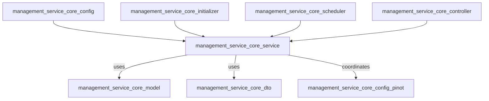
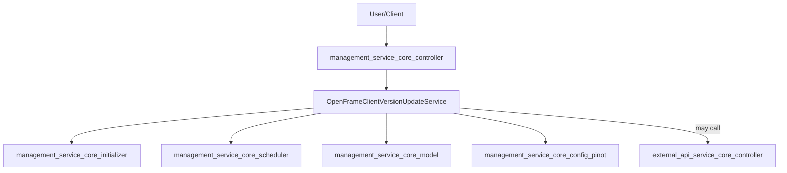
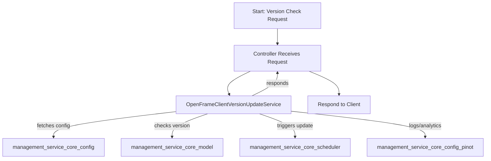

# management_service_core_service Module Documentation

## Introduction

The `management_service_core_service` module is a core part of the management service layer, responsible for providing essential business logic and orchestration for management-related operations within the system. Its primary focus is on supporting version management and update flows for OpenFrame client applications, ensuring that client versions are kept up-to-date and compatible with backend requirements.

This module is designed to interact closely with other management service modules, such as configuration, controllers, initializers, and schedulers, as well as with external data sources and messaging systems. It plays a pivotal role in the overall system's maintainability, upgradability, and operational health.

## Core Components

- **OpenFrameClientVersionUpdateService**: The main service responsible for managing and orchestrating OpenFrame client version updates across the system.

## Architecture Overview

The `management_service_core_service` module fits into the broader management service architecture as shown below:

- **Config**: Provides configuration beans and settings required by the service.
- **Initializer**: Handles startup logic and data seeding relevant to version management.
- **Scheduler**: Triggers periodic or event-driven update checks and syncs.
- **Controller**: Exposes endpoints for version management and update operations.
- **Model/DTO**: Supplies data structures and transfer objects for versioning workflows.
- **PinotConfig**: Ensures analytics and event streaming compatibility for version updates.

## Component Interactions and Data Flow

The following diagram illustrates the high-level data flow and interactions between the `OpenFrameClientVersionUpdateService` and other system components:

- **User/Client**: Initiates version check or update requests.
- **Controller**: Receives requests and delegates to the service.
- **Service**: Orchestrates update logic, interacts with initializers, schedulers, and models.
- **External API**: May be called for additional data or update triggers.

## Core Functionality

### OpenFrameClientVersionUpdateService

This service is responsible for:
- Checking for available OpenFrame client updates
- Coordinating update rollouts and version enforcement
- Integrating with configuration and scheduling modules to automate update checks
- Ensuring compatibility with analytics/event streaming (via Pinot)
- Providing interfaces for controllers to expose update-related endpoints

#### Example Process Flow

## Dependencies and Related Modules

The `management_service_core_service` module depends on and interacts with several other modules:

- [management_service_core_config.md](management_service_core_config.md): Configuration and settings
- [management_service_core_controller.md](management_service_core_controller.md): API endpoints for management operations
- [management_service_core_initializer.md](management_service_core_initializer.md): Startup and data initialization logic
- [management_service_core_scheduler.md](management_service_core_scheduler.md): Scheduled tasks and update triggers
- [management_service_core_model.md](management_service_core_model.md): Data models for versioning and scripts
- [management_service_core_config_pinot.md](management_service_core_config_pinot.md): Pinot analytics and event streaming configuration
- [external_api_service_core_controller.md](external_api_service_core_controller.md): External API endpoints for integration

## How This Module Fits Into the System

The `management_service_core_service` module acts as the central orchestrator for OpenFrame client version management. It ensures that version updates are handled efficiently, reliably, and in coordination with other management and analytics modules. By abstracting the update logic into a dedicated service, the system achieves better maintainability, scalability, and separation of concerns.

## See Also

- [management_service_core_config.md](management_service_core_config.md)
- [management_service_core_controller.md](management_service_core_controller.md)
- [management_service_core_initializer.md](management_service_core_initializer.md)
- [management_service_core_scheduler.md](management_service_core_scheduler.md)
- [management_service_core_model.md](management_service_core_model.md)
- [management_service_core_config_pinot.md](management_service_core_config_pinot.md)
- [external_api_service_core_controller.md](external_api_service_core_controller.md)
