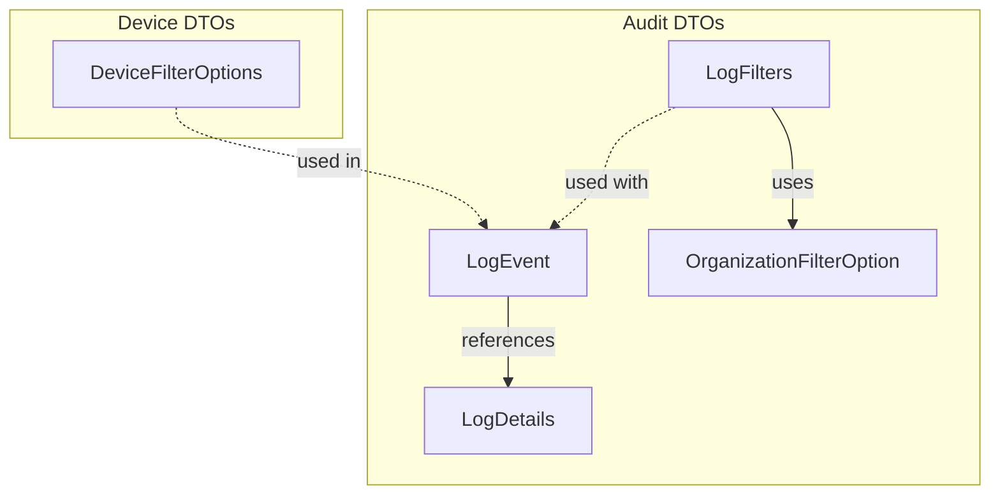
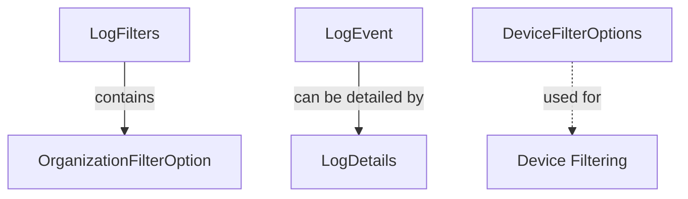

# module_1 Documentation

## Introduction

`module_1` provides core data transfer objects (DTOs) and filter option classes for the audit logging and device filtering subsystems of the OpenFrame API. These DTOs are essential for representing log events, log details, filter options, and device filter criteria, enabling flexible querying and management of audit and device data across the platform.

## Architecture Overview

The module is structured around several key DTOs, each encapsulating a specific aspect of audit logging or device filtering. The relationships between these components are primarily compositional, with filter classes aggregating option classes and event/detail classes representing log data at different levels of granularity.

## Core Components and Sub-Modules

### Audit DTOs

- **[LogEvent](#logevent)**: Represents a single audit log event, capturing metadata such as event type, severity, user, device, and organization context.
- **[LogDetails](#logdetails)**: Extends log event data with additional message and detail fields, providing a more comprehensive view of an audit event.
- **[LogFilters](#logfilters)**: Encapsulates filter criteria for querying logs, including tool types, event types, severities, and organizations.
- **[OrganizationFilterOption](#organizationfilteroption)**: Represents an organization option for filtering, used within `LogFilters`.

### Device DTOs

- **[DeviceFilterOptions](#devicefilteroptions)**: Defines available filter options for devices, such as status, type, OS, organization, and tags.

> For related filter and query result DTOs, see [module_2.md](module_2.md).

## Component Relationships

## Sub-Module Documentation

- [LogEvent](LogEvent.md)
- [LogDetails](LogDetails.md)
- [LogFilters](LogFilters.md)
- [OrganizationFilterOption](OrganizationFilterOption.md)
- [DeviceFilterOptions](DeviceFilterOptions.md)

## Integration with Other Modules

- `module_1` DTOs are often used in conjunction with filter and query result DTOs from [module_2.md](module_2.md), especially for advanced filtering and result pagination.

---

# Sub-Module Overviews

## LogEvent
See [LogEvent.md](LogEvent.md) for details.

## LogDetails
See [LogDetails.md](LogDetails.md) for details.

## LogFilters
See [LogFilters.md](LogFilters.md) for details.

## OrganizationFilterOption
See [OrganizationFilterOption.md](OrganizationFilterOption.md) for details.

## DeviceFilterOptions
See [DeviceFilterOptions.md](DeviceFilterOptions.md) for details.
