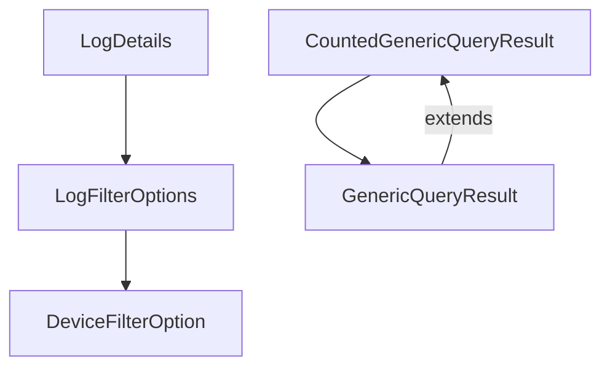

# Module 1 Documentation

## Introduction
Module 1 is a core component of the OpenFrame API library, designed to handle various data transfer objects (DTOs) related to auditing and device filtering. This module provides essential structures for managing log details, query results, and filter options, facilitating efficient data handling and querying within the system.

## Architecture Overview
The architecture of Module 1 is centered around several key DTOs that interact with each other to provide comprehensive data management capabilities. Below is a high-level overview of the architecture:

## Core Components

### LogDetails
- **Purpose**: Represents detailed information about log events, including metadata such as event type, severity, and timestamps.
- **Key Fields**: `toolEventId`, `eventType`, `severity`, `timestamp`, `message`

### CountedGenericQueryResult
- **Purpose**: Extends `GenericQueryResult` to include a count of filtered results, enhancing query capabilities.
- **Key Fields**: `filteredCount`

### LogFilterOptions
- **Purpose**: Provides filtering options for log queries, allowing for refined data retrieval based on criteria like date range and event type.
- **Key Fields**: `startDate`, `endDate`, `eventTypes`, `severities`

### DeviceFilterOption
- **Purpose**: Represents filtering options for devices, including value-label pairs and count information.
- **Key Fields**: `value`, `label`, `count`

### GenericQueryResult
- **Purpose**: A generic structure for query results, supporting pagination and item listing.
- **Key Fields**: `items`, `pageInfo`

## Related Modules
For more detailed information on related components, refer to the documentation of [Module 2](module_2.md).

---
This documentation provides a foundational understanding of Module 1's components and their interactions within the OpenFrame API library. For further details on each sub-module, please refer to their respective documentation files.