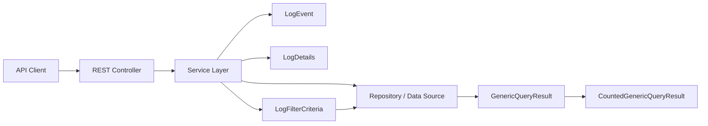
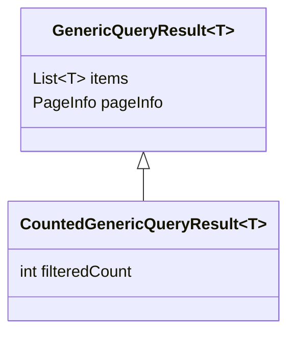
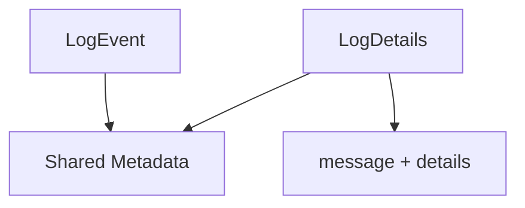
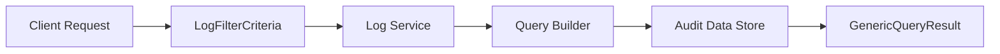
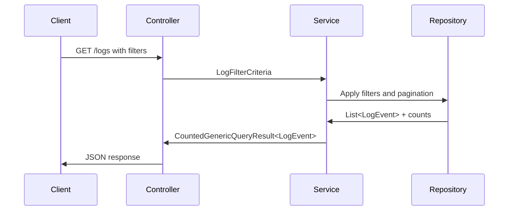

# Module 1

## Overview

**Module 1** defines the core Data Transfer Objects (DTOs) used for:

- Generic paginated query responses
- Count-aware query results
- Audit log event modeling
- Log filtering criteria

It acts as a foundational API contract layer within the `openframe-api-lib`, providing reusable, type-safe response and filtering structures that can be shared across services in the OpenFrame and Flamingo ecosystem.

This module is primarily concerned with **data representation**, not business logic. It ensures consistent API payloads across audit, reporting, and search endpoints.

---

## Architectural Context

Module 1 plays two key roles:

1. ✅ Standardizes paginated query results across the API.
2. ✅ Defines the canonical structure for audit log events and filters.

It is consumed by higher-level modules (such as device, organization, and audit services) and works closely with filtering models defined in sibling modules like [Module 2](../module_2/module_2.md).

### High-Level Architecture



Module 1 defines the **response envelopes** (`GenericQueryResult`, `CountedGenericQueryResult`) and **audit DTOs** (`LogEvent`, `LogDetails`, `LogFilterCriteria`).

---

# Core Components

## 1. GenericQueryResult<T>

**Component:**  
`openframe-oss-lib.openframe-api-lib.src.main.java.com.openframe.api.dto.GenericQueryResult.GenericQueryResult`

### Purpose

`GenericQueryResult<T>` is a reusable, generic wrapper for paginated API responses.

It encapsulates:

- A list of result items (`List<T> items`)
- Pagination metadata (`PageInfo pageInfo`)

### Structure

```java
public class GenericQueryResult<T> {
    private List<T> items;
    private PageInfo pageInfo;
}
```

### Responsibilities

- Standardizes response structure across query endpoints
- Ensures consistent pagination metadata
- Provides type-safe responses via generics

### Typical Usage

Used in endpoints such as:

- `GET /logs`
- `GET /devices`
- `GET /organizations`

Example conceptual response:

```json
{
  "items": [ { ... }, { ... } ],
  "pageInfo": {
    "page": 0,
    "size": 25,
    "total": 320
  }
}
```

---

## 2. CountedGenericQueryResult<T>

**Component:**  
`openframe-oss-lib.openframe-api-lib.src.main.java.com.openframe.api.dto.CountedGenericQueryResult.CountedGenericQueryResult`

### Purpose

Extends `GenericQueryResult<T>` by adding a `filteredCount` field.

```java
public class CountedGenericQueryResult<T> extends GenericQueryResult<T> {
    private int filteredCount;
}
```

### Why It Exists

In filtering scenarios, you often need:

- ✅ Total number of records
- ✅ Count of records after applying filters

This class supports advanced UI use cases such as:

- Dashboard analytics
- Faceted search
- Filter previews

### Inheritance Relationship



---

## 3. LogEvent

**Component:**  
`openframe-oss-lib.openframe-api-lib.src.main.java.com.openframe.api.dto.audit.LogEvent.LogEvent`

### Purpose

Represents a **lightweight audit log record**, optimized for list views.

### Key Fields

- `id`
- `toolEventId`
- `eventType`
- `toolType`
- `severity`
- `userId`
- `deviceId`
- `hostname`
- `organizationId`
- `organizationName`
- `summary`
- `timestamp`

### Design Rationale

This model is optimized for:

- Log listing pages
- Search results
- Summary dashboards

It excludes heavy payload fields like full message details.

---

## 4. LogDetails

**Component:**  
`openframe-oss-lib.openframe-api-lib.src.main.java.com.openframe.api.dto.audit.LogDetails.LogDetails`

### Purpose

Represents the **full audit log record**, including extended information.

It extends the conceptual structure of `LogEvent` by adding:

- `message`
- `details`

### Comparison: LogEvent vs LogDetails



| Field Category | LogEvent | LogDetails |
|----------------|----------|------------|
| Core metadata  | ✅       | ✅         |
| Summary        | ✅       | ✅         |
| Full message   | ❌       | ✅         |
| Extended data  | ❌       | ✅         |

### Usage Pattern

- `GET /logs` → returns `GenericQueryResult<LogEvent>`
- `GET /logs/{id}` → returns `LogDetails`

---

## 5. LogFilterCriteria

**Component:**  
`openframe-oss-lib.openframe-api-lib.src.main.java.com.openframe.api.dto.audit.LogFilterCriteria.LogFilterCriteria`

### Purpose

Encapsulates filtering parameters for audit log queries.

### Fields

- `startDate`
- `endDate`
- `eventTypes`
- `toolTypes`
- `severities`
- `organizationIds`
- `deviceId`

### Filtering Flow



### Design Principles

- ✅ Strongly typed filtering
- ✅ Explicit date boundaries
- ✅ Multi-value filtering support (`List<String>`)
- ✅ Device-specific and organization-specific scoping

For reusable filter option definitions and higher-level filtering structures, see [Module 2](../module_2/module_2.md).

---

# Data Flow in Module 1

Below is the end-to-end flow of an audit log query using Module 1 structures.



---

# Design Patterns Used

## 1. Generic Response Envelope Pattern

`GenericQueryResult<T>` implements a reusable API envelope pattern:

- Promotes consistency
- Simplifies frontend integration
- Reduces duplication

## 2. DTO Separation Pattern

`LogEvent` and `LogDetails` demonstrate a **list/detail separation pattern**:

- Lightweight list model
- Rich detail model

This improves performance and network efficiency.

## 3. Builder Pattern (Lombok)

All DTOs leverage Lombok annotations:

- `@Data`
- `@Builder` / `@SuperBuilder`
- `@NoArgsConstructor`
- `@AllArgsConstructor`

This ensures:

- Immutability-friendly construction
- Clean, readable instantiation
- Reduced boilerplate

---

# How Module 1 Fits into the Overall System

Module 1 is a **foundational API DTO module** that:

- Standardizes query result modeling
- Defines audit event schemas
- Enables consistent filtering contracts
- Supports scalable search and pagination patterns

It does not implement:

- Persistence logic
- Query execution
- Security enforcement

Instead, it defines the contracts consumed by higher-level services and controllers across the OpenFrame platform.

---

# Summary

Module 1 provides:

- ✅ Generic paginated response modeling (`GenericQueryResult`)
- ✅ Count-aware filtering support (`CountedGenericQueryResult`)
- ✅ Lightweight audit event representation (`LogEvent`)
- ✅ Full audit event detail modeling (`LogDetails`)
- ✅ Strongly typed log filtering (`LogFilterCriteria`)

Together, these components establish a consistent and extensible foundation for audit logging and query-driven APIs within the OpenFrame ecosystem.
