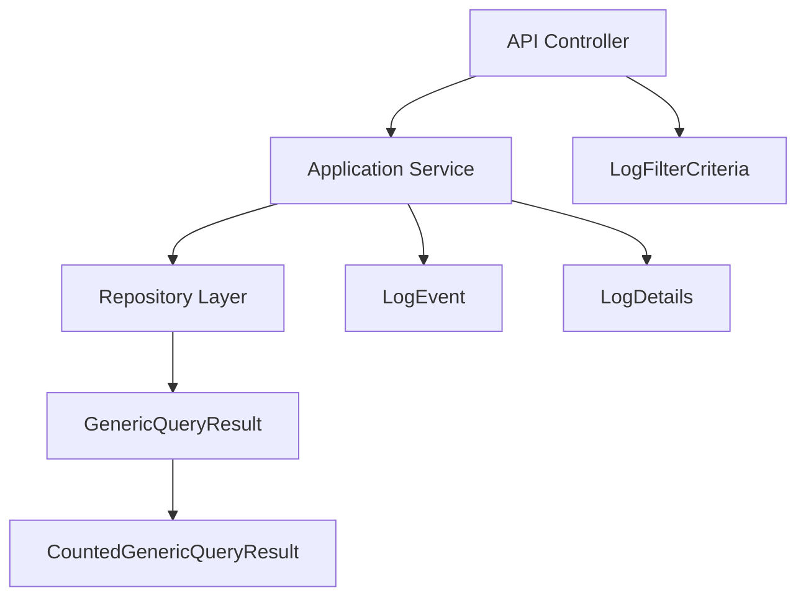
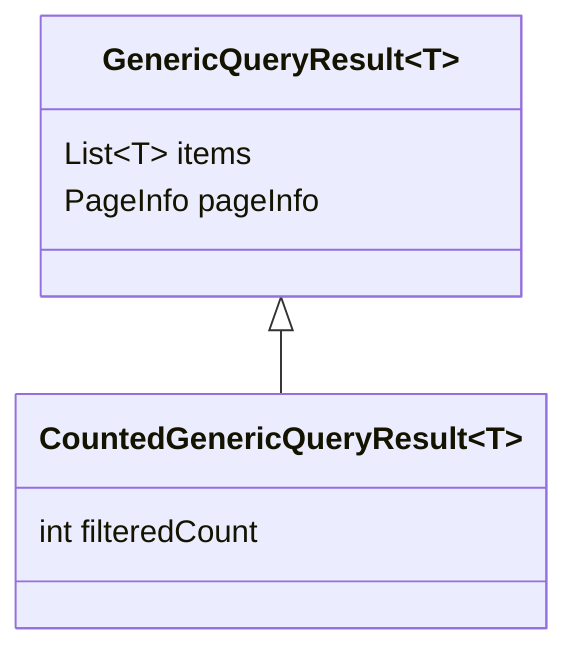
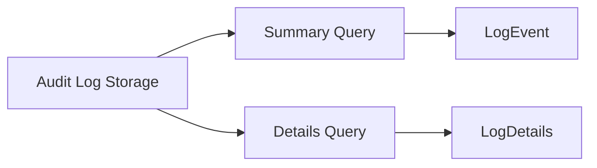
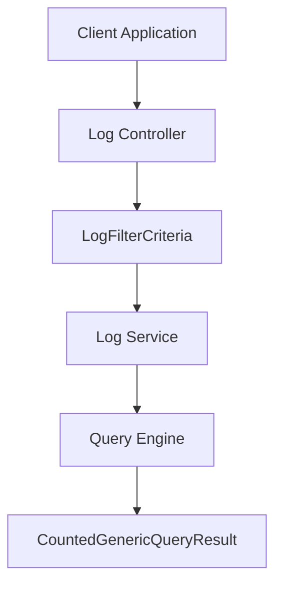
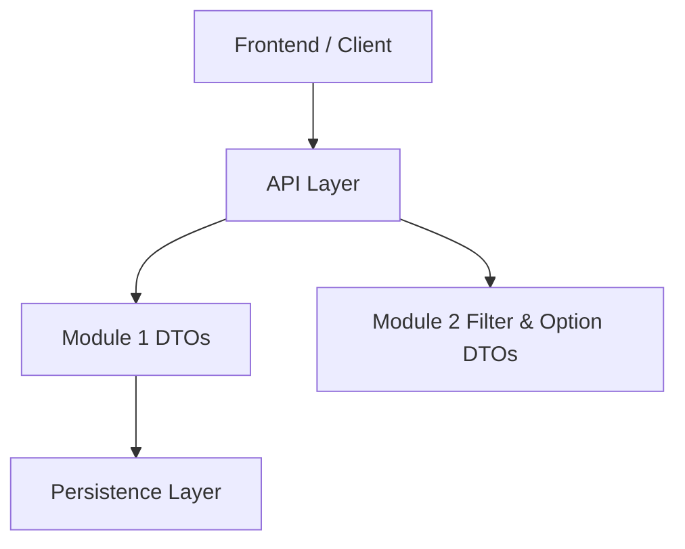

# Module 1

## Overview

**Module 1** defines the foundational Data Transfer Objects (DTOs) for query results and audit log handling within the OpenFrame API library. It standardizes how paginated data, counted query results, and audit log information are represented and exchanged across services.

This module plays a central role in:

- Providing a reusable, generic query result abstraction
- Supporting paginated API responses
- Modeling audit log events and detailed log records
- Defining structured filter criteria for log queries

Module 1 is primarily consumed by service and controller layers across the platform and works closely with filtering and option DTOs defined in [Module 2](../module_2/module_2.md).

---

## Core Components

Module 1 contains the following core components:

- `GenericQueryResult<T>`
- `CountedGenericQueryResult<T>`
- `LogEvent`
- `LogDetails`
- `LogFilterCriteria`

These classes are simple, Lombok-annotated DTOs and do not contain business logic. Their primary responsibility is structural consistency and type safety in API communication.

---

## Architecture Overview

At a high level, Module 1 provides:

- A **generic query result model** for paginated responses
- A **count-augmented query result model** for filtered datasets
- An **audit event model** for summary and detailed log records
- A **log filter criteria model** for querying audit data



This structure ensures that:

- Controllers accept structured filter criteria.
- Services return standardized query results.
- Consumers receive predictable response shapes for pagination and filtering.

---

## Generic Query Result Model

### GenericQueryResult<T>

`GenericQueryResult<T>` is a generic wrapper used to represent paginated query responses.

### Structure

```java
public class GenericQueryResult<T> {
    private List<T> items;
    private PageInfo pageInfo;
}
```

### Responsibilities

- Encapsulates a list of result items (`List<T>`)
- Provides pagination metadata via `PageInfo`
- Ensures consistent response shape across different endpoints

### Typical Usage

- Returning paginated device lists
- Returning audit log summaries
- Returning organization or user queries

---

## Counted Query Result Model

### CountedGenericQueryResult<T>

`CountedGenericQueryResult<T>` extends `GenericQueryResult<T>` by adding a filtered count.

### Structure

```java
public class CountedGenericQueryResult<T> extends GenericQueryResult<T> {
    private int filteredCount;
}
```

### Responsibilities

- Inherits `items` and `pageInfo`
- Adds `filteredCount` to represent total results matching filter criteria

This is particularly useful when:

- The backend applies complex filters
- The UI needs to know the total number of matching records
- The filtered dataset differs from the raw total dataset

### Inheritance Relationship



This design promotes reuse and avoids duplication of pagination logic.

---

## Audit Log Models

Module 1 defines two representations of audit logs:

- `LogEvent` – lightweight summary view
- `LogDetails` – extended detailed view

### LogEvent

`LogEvent` represents a summarized audit log entry suitable for list views.

#### Key Fields

- `id`
- `toolEventId`
- `eventType`
- `toolType`
- `severity`
- `userId`
- `deviceId`
- `organizationId`
- `organizationName`
- `summary`
- `timestamp`

### LogDetails

`LogDetails` extends the summary model conceptually (not via inheritance) by including:

- `message`
- `details`

This separation enables:

- Efficient list queries using `LogEvent`
- Detailed inspection views using `LogDetails`

### Summary vs Details Flow



This approach optimizes performance and payload size for list endpoints while still supporting deep inspection.

---

## LogFilterCriteria

`LogFilterCriteria` defines structured filtering options for querying audit logs.

### Structure

```java
public class LogFilterCriteria {
    private LocalDate startDate;
    private LocalDate endDate;
    private List<String> eventTypes;
    private List<String> toolTypes;
    private List<String> severities;
    private List<String> organizationIds;
    private String deviceId;
}
```

### Responsibilities

- Encapsulates all filtering parameters in a single object
- Supports multi-value filtering via lists
- Defines time-range constraints (`startDate`, `endDate`)
- Enables device- and organization-scoped queries

### Filtering Flow



`LogFilterCriteria` is often used together with filter option DTOs defined in [Module 2](../module_2/module_2.md), which provide predefined filter sets and selectable options.

---

## Design Patterns and Conventions

### 1. Lombok-Driven DTOs

All classes use Lombok annotations such as:

- `@Data`
- `@Builder` or `@SuperBuilder`
- `@NoArgsConstructor`
- `@AllArgsConstructor`

This ensures:

- Reduced boilerplate
- Immutable-style construction (via builder)
- Clean and consistent DTO definitions

### 2. Generic Abstractions

The use of generics in `GenericQueryResult<T>`:

- Promotes strong typing
- Avoids duplication across entity types
- Simplifies service-layer contracts

### 3. Separation of Summary and Detail Models

Rather than overloading a single DTO, Module 1 cleanly separates:

- Lightweight summary objects (`LogEvent`)
- Detailed objects (`LogDetails`)

This aligns with API best practices for scalable and performant systems.

---

## How Module 1 Fits into the Overall System

Module 1 acts as a **shared contract layer** for:

- Controllers
- Services
- Client applications
- Other DTO modules (such as Module 2)



In this architecture:

- Module 1 defines the shape of results and log records.
- Module 2 complements it by defining filter options and additional criteria structures.
- Business logic resides outside this module, preserving separation of concerns.

---

## Summary

Module 1 provides the foundational DTO layer for:

- Generic paginated query results
- Count-aware filtered results
- Audit log summaries and details
- Structured log filtering criteria

Its clean, generic, and strongly-typed design ensures consistent API contracts across the OpenFrame platform while remaining lightweight and framework-agnostic.