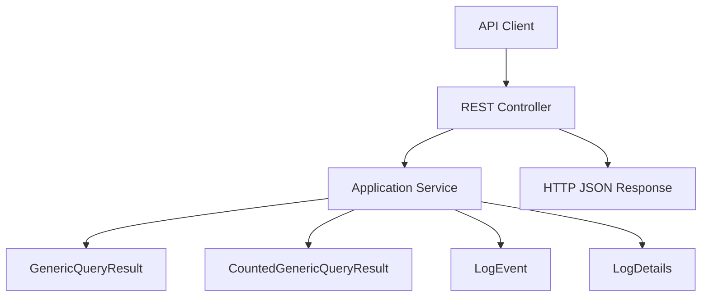
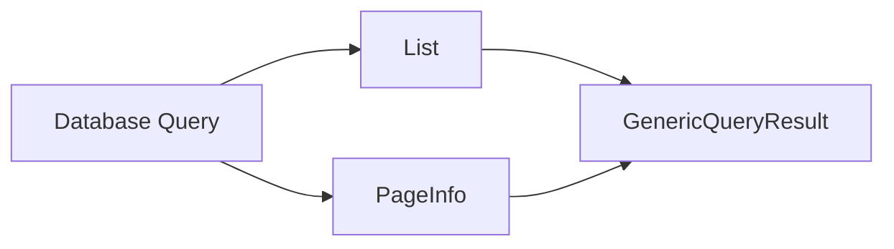
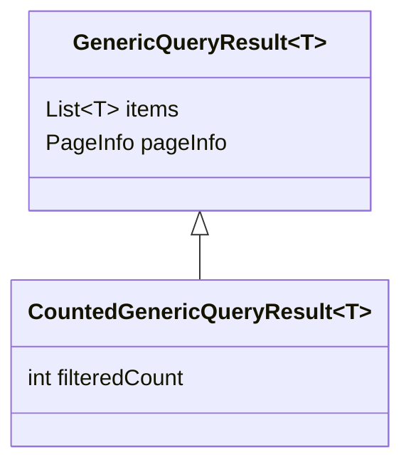
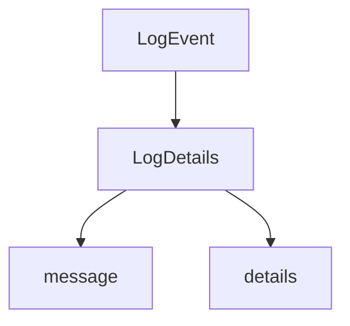
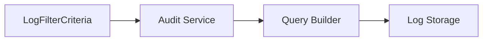
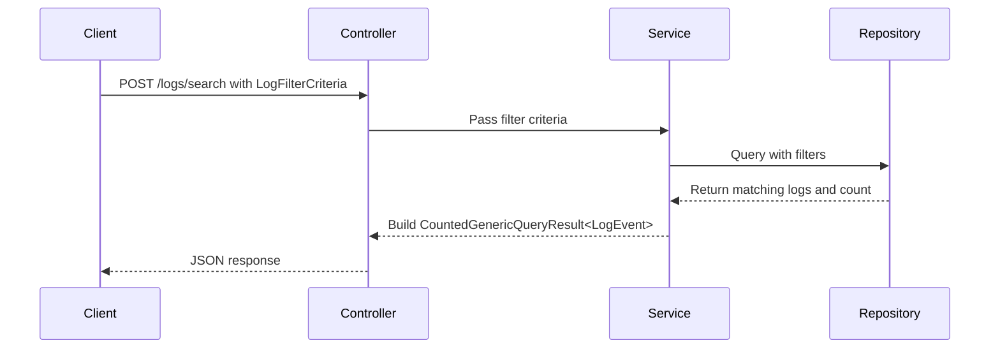

# Module 1

## Overview

**Module 1** provides the foundational Data Transfer Objects (DTOs) used for:

- Generic query result wrapping (pagination + result sets)
- Count-aware filtered results
- Audit log representation (summary and detailed views)
- Log filtering criteria for search APIs

This module acts as a **contract layer** between backend services and API consumers. It standardizes how query results and audit log data are represented and transported across service boundaries.

Module 1 is part of the OpenFrame API library and is designed to be reusable across multiple services in the Flamingo / OpenFrame stack.

---

## Architectural Role

At a high level, Module 1 sits in the **API DTO layer** and is consumed by:

- REST controllers
- Service layers
- Audit and logging subsystems
- Frontend clients expecting paginated responses

### High-Level Architecture



Module 1 does not contain business logic. Instead, it defines **structured contracts** that other layers use to serialize and deserialize data.

---

## Core Components

Module 1 consists of two logical areas:

1. **Generic Query Wrappers**
2. **Audit Log DTOs and Filtering**

---

# 1. Generic Query Wrappers

These classes provide a reusable pattern for paginated API responses.

## GenericQueryResult<T>

**Purpose:**
A generic container for paginated query results.

### Structure

```java
public class GenericQueryResult<T> {
    private List<T> items;
    private PageInfo pageInfo;
}
```

### Responsibilities

- Encapsulates a list of result items
- Attaches pagination metadata via `PageInfo`
- Standardizes API responses across domains

### Conceptual Model



### Design Characteristics

- Uses Lombok annotations (`@Data`, `@SuperBuilder`, etc.) for immutability-style construction and reduced boilerplate
- Fully generic (`<T>`), making it reusable for devices, logs, users, organizations, etc.
- Clean separation between data and metadata

---

## CountedGenericQueryResult<T>

**Purpose:**
Extends `GenericQueryResult<T>` by adding a filtered result count.

### Structure

```java
public class CountedGenericQueryResult<T> extends GenericQueryResult<T> {
    private int filteredCount;
}
```

### Why It Exists

In many search APIs, we need:

- The current page of results
- Pagination metadata
- The total number of items matching filters (not just current page size)

This class enables that without modifying the base contract.

### Inheritance Relationship



### Typical Usage Pattern

- Controller receives filter criteria
- Service executes filtered query
- Service calculates total filtered count
- Response returned as `CountedGenericQueryResult<T>`

---

# 2. Audit Log DTOs and Filtering

This section defines the structure of audit logs and how they can be filtered.

These DTOs are typically used by:

- Audit services
- Log ingestion pipelines
- Monitoring dashboards
- Security review tooling

---

## LogEvent

**Purpose:**
Represents a lightweight summary view of a log entry.

### Key Fields

- `id`
- `toolEventId`
- `eventType`
- `toolType`
- `severity`
- `userId`
- `deviceId`
- `organizationId`
- `organizationName`
- `summary`
- `timestamp`

### Design Intent

`LogEvent` is optimized for:

- List views
- Search results
- Timeline displays
- High-volume pagination scenarios

It avoids heavy payload fields such as full message bodies or extended details.

---

## LogDetails

**Purpose:**
Represents a full, expanded log record.

### Additional Fields Over LogEvent

- `message`
- `details`

### Relationship to LogEvent

Conceptually, `LogDetails` is an enriched version of `LogEvent`.



### Usage Pattern

- API returns `GenericQueryResult<LogEvent>` for list endpoints
- API returns `LogDetails` for single log detail endpoints

This separation improves performance and reduces payload size for list queries.

---

## LogFilterCriteria

**Purpose:**
Defines structured filtering options for querying logs.

### Fields

- `startDate`
- `endDate`
- `eventTypes`
- `toolTypes`
- `severities`
- `organizationIds`
- `deviceId`

### Filtering Model



### Design Goals

- Support multi-dimensional filtering
- Allow date range constraints
- Support multi-value filters (lists of types and severities)
- Remain serialization-friendly for REST APIs

---

# Data Flow Example: Filtered Log Search

The following diagram illustrates how Module 1 DTOs interact in a filtered log search operation.



This highlights how:

- `LogFilterCriteria` defines constraints
- `LogEvent` represents lightweight results
- `CountedGenericQueryResult<LogEvent>` wraps results with pagination and counts

---

# Relationship with Other Modules

Module 1 defines the **core DTO contracts** for query results and audit logs.

Filtering option structures for devices and organizations are extended in:

- [Module 2](../module_2/module_2.md)

Module 2 builds on the same filtering and DTO design philosophy but applies it to device-level and organization-level filtering structures.

Module 1 focuses on:

- Core result wrapping
- Audit log modeling
- Log filtering contracts

Module 2 focuses on:

- Concrete filter option representations
- Device-specific filtering models

---

# Design Principles

## 1. Generic Reusability

The use of generics (`<T>`) ensures that the query wrapper pattern is reusable across domains.

## 2. Separation of Summary and Detail

By separating `LogEvent` and `LogDetails`, the module:

- Reduces payload size for list endpoints
- Improves performance
- Preserves flexibility for detail views

## 3. Clear API Contracts

All classes are pure DTOs:

- No business logic
- No persistence logic
- No framework coupling

They exist solely to define structured data exchanged across layers.

## 4. Lombok-Driven Boilerplate Reduction

The use of Lombok annotations such as `@Data`, `@Builder`, and `@SuperBuilder` ensures:

- Reduced boilerplate
- Consistent immutability-style construction
- Cleaner codebase

---

# Summary

**Module 1** provides the foundational API DTO layer for:

- Generic paginated query results
- Count-aware filtered results
- Audit log summaries and details
- Structured log filtering criteria

It enables consistent, scalable, and reusable API contracts across the OpenFrame ecosystem and serves as the structural backbone for higher-level filtering and domain-specific DTO modules such as [Module 2](../module_2/module_2.md).
