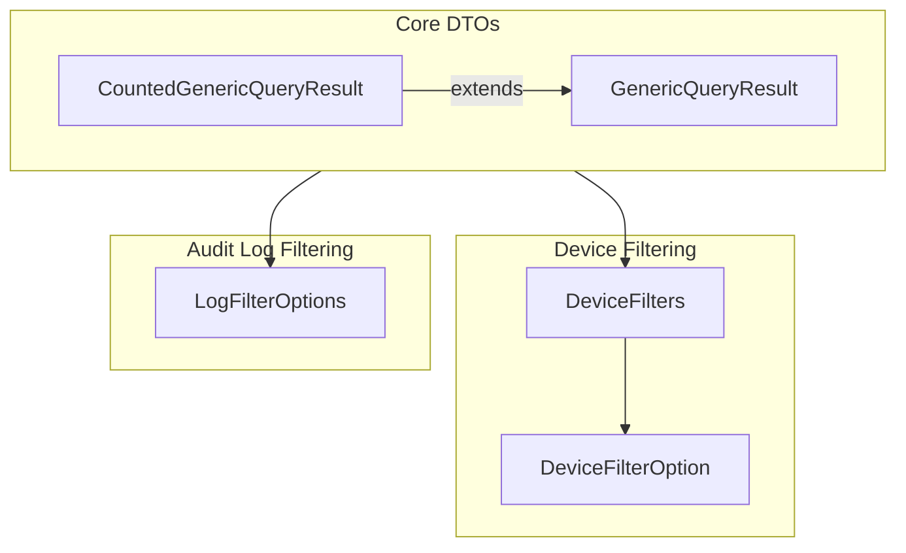
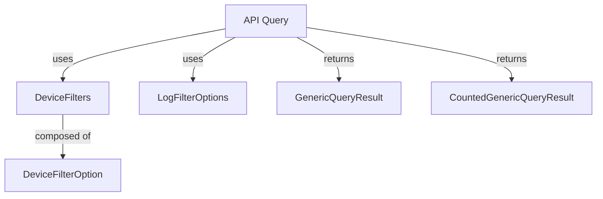

# module_2 Documentation

## Introduction

`module_2` provides a set of generic and device/audit-specific data transfer objects (DTOs) for representing query results and filter options within the OpenFrame API ecosystem. These DTOs are designed to support flexible querying, filtering, and pagination of data, especially for device and audit log management. The module is foundational for building API endpoints and services that require structured query results and filter mechanisms.

## Architecture Overview

The core components of `module_2` are focused on:
- Generic query result encapsulation (with and without count)
- Device filtering options and filter sets
- Audit log filtering options

These components are designed to be reusable and composable, supporting both generic and domain-specific (device, audit) use cases.

### High-Level Architecture

## Component Overview

### 1. [GenericQueryResult](GenericQueryResult.md)
A generic DTO for paginated query results, supporting any item type and cursor-based pagination. See [GenericQueryResult.md](GenericQueryResult.md) for detailed documentation.

### 2. [CountedGenericQueryResult](CountedGenericQueryResult.md)
Extends `GenericQueryResult` by adding a `filteredCount` field for total filtered items, useful for pagination UIs. See [CountedGenericQueryResult.md](CountedGenericQueryResult.md) for details.

### 3. [DeviceFilters](DeviceFilters.md)
Encapsulates multiple device filter options (status, type, OS, organization, tags) and the count of filtered devices. See [DeviceFilters.md](DeviceFilters.md) for a full breakdown.

### 4. [DeviceFilterOption](DeviceFilterOption.md)
Represents a single filter option for devices, including value, label, and count. See [DeviceFilterOption.md](DeviceFilterOption.md) for field-level details.

### 5. [LogFilterOptions](LogFilterOptions.md)
Defines filter options for querying audit logs, such as date range, event/tool types, severities, organizations, and device. See [LogFilterOptions.md](LogFilterOptions.md) for usage and field descriptions.

## Relationships to Other Modules

- Device and audit log filter options in `module_2` are conceptually related to the audit and device DTOs in [module_1.md].
- For details on log event and organization filter DTOs, see [module_1.md].

## Visualizing Data Flow

## Sub-Module Documentation

- [GenericQueryResult.md](GenericQueryResult.md)
- [CountedGenericQueryResult.md](CountedGenericQueryResult.md)
- [DeviceFilters.md](DeviceFilters.md)
- [DeviceFilterOption.md](DeviceFilterOption.md)
- [LogFilterOptions.md](LogFilterOptions.md)

Refer to each sub-module documentation for detailed field descriptions and usage examples.

---

For related audit and device DTOs, see [module_1.md].
