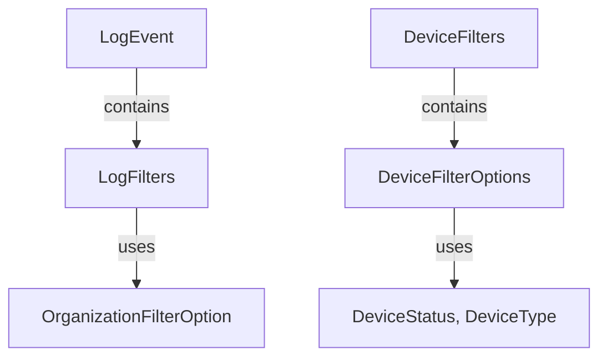

# Module 2 Documentation

## Introduction
Module 2 is designed to handle various aspects of audit logging and device filtering within the OpenFrame API. It provides data transfer objects (DTOs) that facilitate the management and querying of log events and device-related data.

## Architecture Overview
The module is structured into several key components, each responsible for different aspects of audit and device data management. Below is a high-level overview of the architecture:

## Core Components

### LogEvent
The `LogEvent` class represents an audit log entry, capturing details such as event type, severity, and associated user and device information.

- **Attributes**:
  - `toolEventId`: Unique identifier for the event.
  - `eventType`: Type of the event.
  - `ingestDay`: Day the event was ingested.
  - `toolType`: Type of tool that generated the event.
  - `severity`: Severity level of the event.
  - `userId`: ID of the user associated with the event.
  - `deviceId`: ID of the device associated with the event.
  - `hostname`: Hostname where the event occurred.
  - `organizationId`: ID of the organization associated with the event.
  - `organizationName`: Name of the organization.
  - `summary`: Summary of the event.
  - `timestamp`: Timestamp of the event.

### DeviceFilters
The `DeviceFilters` class is used to apply various filters to device data, such as status, type, and organization.

- **Attributes**:
  - `statuses`: List of device status filter options.
  - `deviceTypes`: List of device type filter options.
  - `osTypes`: List of operating system type filter options.
  - `organizationIds`: List of organization IDs for filtering.
  - `tags`: List of tag filter options.
  - `filteredCount`: Count of devices after filtering.

### DeviceFilterOptions
The `DeviceFilterOptions` class provides options for filtering devices based on status, type, and other criteria.

- **Attributes**:
  - `statuses`: List of device statuses.
  - `deviceTypes`: List of device types.
  - `osTypes`: List of operating system types.
  - `organizationIds`: List of organization IDs.
  - `tagNames`: List of tag names.

### LogFilters
The `LogFilters` class is used to apply filters to log data, such as tool type, event type, and severity.

- **Attributes**:
  - `toolTypes`: List of tool types for filtering.
  - `eventTypes`: List of event types for filtering.
  - `severities`: List of severity levels for filtering.
  - `organizations`: List of organization filter options.

### OrganizationFilterOption
The `OrganizationFilterOption` class represents a filter option for organizations, used in log filtering.

- **Attributes**:
  - `id`: Unique identifier for the organization.
  - `name`: Name of the organization.

## Related Modules
For more information on related components, refer to the [module_1.md](module_1.md) documentation.