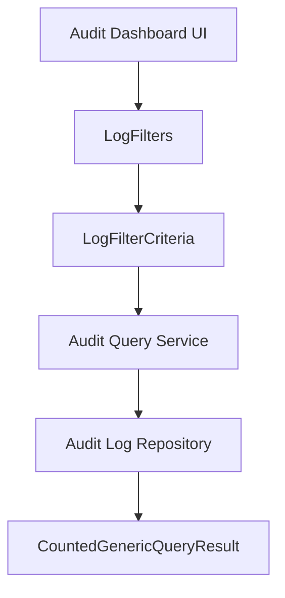
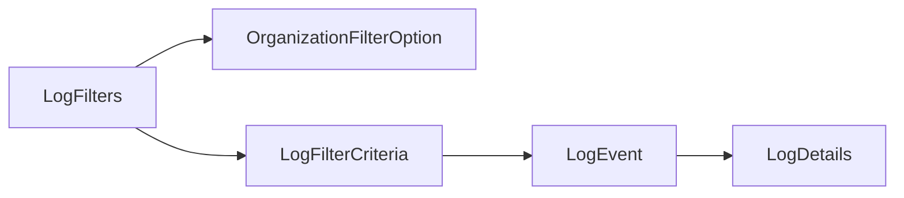
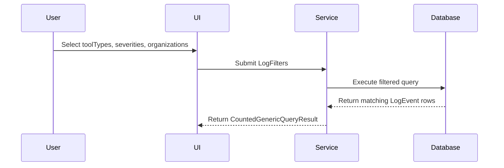
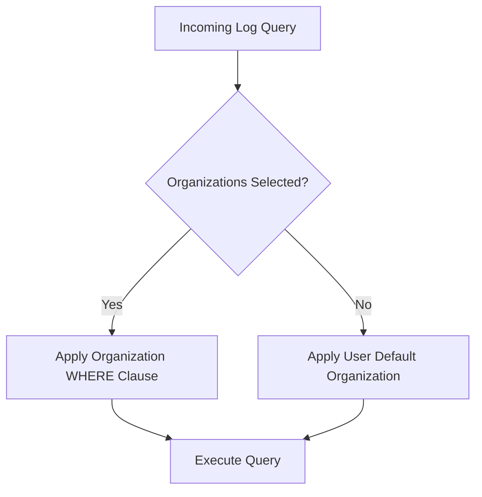

# Audit Filtering

## Overview

The **Audit Filtering** module defines the data transfer objects (DTOs) responsible for filtering and refining audit log queries across the OpenFrame platform. It enables structured filtering of log events based on tool type, event type, severity, and organization scope.

This module plays a critical role in supporting:
- Audit log dashboards
- Security investigations
- Compliance reporting
- Multi-tenant log isolation

Audit Filtering works in conjunction with core audit DTOs such as `LogEvent`, `LogDetails`, and `LogFilterCriteria`, and integrates with paginated result wrappers like `GenericQueryResult` and `CountedGenericQueryResult`.

---

## Core Components

### 1. LogFilters

The `LogFilters` DTO represents a collection of filtering dimensions that can be applied when querying audit logs.

```java
@Data
@Builder
@NoArgsConstructor
@AllArgsConstructor
public class LogFilters {
    private List<String> toolTypes;
    private List<String> eventTypes;
    private List<String> severities;
    private List<OrganizationFilterOption> organizations;
}
```

#### Responsibilities

- Encapsulates multiple filtering categories
- Supports multi-select filtering per category
- Enables tenant-aware filtering via organization scoping
- Serves as a request payload component for audit log queries

#### Filtering Dimensions

| Field | Type | Purpose |
|--------|------|----------|
| toolTypes | List<String> | Filter logs by originating tool or subsystem |
| eventTypes | List<String> | Filter logs by event classification |
| severities | List<String> | Filter logs by severity level |
| organizations | List<OrganizationFilterOption> | Restrict results to specific organizations |

---

### 2. OrganizationFilterOption

Represents a selectable organization used in audit filtering.

```java
@Data
@Builder
@NoArgsConstructor
@AllArgsConstructor
public class OrganizationFilterOption {
    private String id;
    private String name;
}
```

#### Responsibilities

- Provides UI-friendly organization representation
- Supports dropdown population in filtering interfaces
- Enables multi-tenant audit scoping

---

## Architectural Context

Audit Filtering is part of the broader audit query pipeline.



### Flow Explanation

1. The UI constructs a `LogFilters` object.
2. The filters are embedded into a higher-level `LogFilterCriteria`.
3. The Audit Query Service translates filters into database queries.
4. The repository executes filtered queries.
5. Results are returned in a paginated `CountedGenericQueryResult<LogEvent>` wrapper.

---

## Component Relationships



### Relationship Breakdown

- `LogFilters` contains multiple `OrganizationFilterOption` instances.
- `LogFilterCriteria` aggregates `LogFilters` with additional query metadata (dates, pagination, etc.).
- Filtered queries return `LogEvent` objects.
- Each `LogEvent` may contain detailed metadata via `LogDetails`.

---

## Data Flow Example



This ensures:
- Strong separation between filtering logic and persistence
- Type-safe filter transmission
- Consistent query result formatting

---

## Multi-Tenant Filtering Strategy

The `organizations` field enables multi-tenant log isolation.



### Key Design Principles

- Organization scoping is explicit when provided.
- Default scoping ensures users cannot query logs outside permitted tenants.
- Filtering is applied at query time for performance efficiency.

---

## Integration with Device Filtering

Audit Filtering operates independently from device-level filtering but follows the same structural pattern.

For device-specific filtering DTOs, see:

- [Device Filtering](../device_filtering/device_filtering.md)

Both modules:
- Use structured filter DTOs
- Support multi-select filter values
- Enable dropdown-based UI filtering
- Promote separation between UI filtering and backend query logic

---

## Design Considerations

### 1. Extensibility
New filter dimensions (e.g., userId, IP address, correlationId) can be added without breaking existing API contracts.

### 2. UI Compatibility
DTOs are designed to directly support dropdown and multi-select components.

### 3. Performance
Filtering is translated into indexed query constraints at the persistence layer.

### 4. Strong Typing
Using structured DTOs ensures:
- Validation at compile time
- Clear API documentation
- Reduced risk of malformed queries

---

## Summary

The **Audit Filtering** module provides a structured, extensible mechanism for refining audit log queries across the OpenFrame platform. It ensures:

- Consistent filter modeling
- Multi-tenant awareness
- Clean separation of concerns
- Compatibility with paginated query results

By encapsulating filtering logic into dedicated DTOs such as `LogFilters` and `OrganizationFilterOption`, the module forms a foundational layer for secure and scalable audit log exploration.