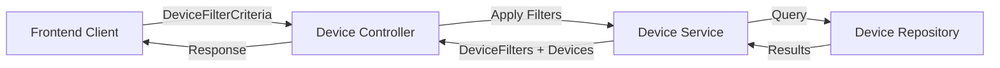
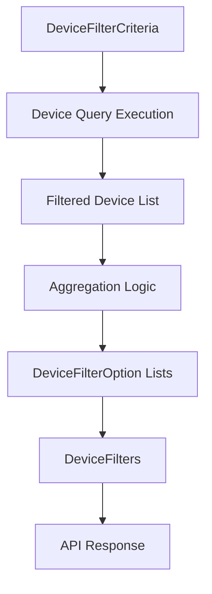
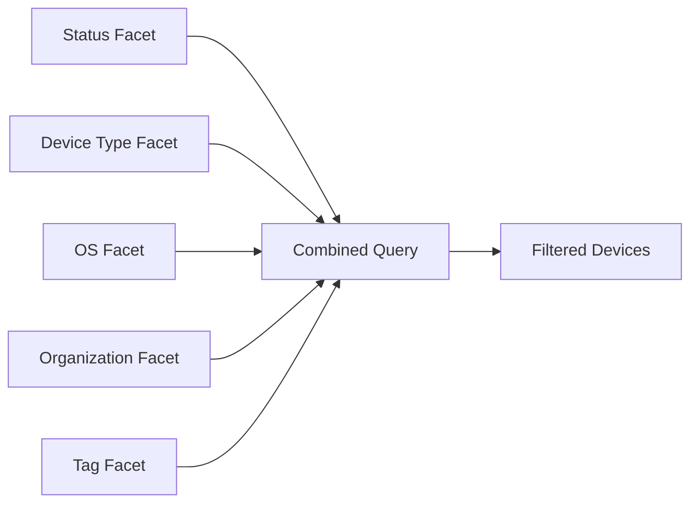

# Device Filtering

The **Device Filtering** module defines the data transfer objects (DTOs) used to filter, aggregate, and present device-related data across the OpenFrame platform. It standardizes how clients request filtered device lists and how the backend responds with filter options and counts.

This module is part of the API layer and provides a clean contract between frontend clients, controllers, and device services.

---

## 1. Purpose and Responsibilities

The Device Filtering module is responsible for:

- Defining structured filter criteria for querying devices
- Providing normalized filter options for UI dropdowns and faceted search
- Returning aggregated counts for filtered device results
- Supporting multi-dimensional filtering (status, type, OS, organization, tags)

It does **not** implement filtering logic itself. Instead, it provides the DTOs consumed by controllers and services that execute queries against the data layer.

---

## 2. Core Components

The module consists of three primary DTOs:

1. `DeviceFilterCriteria`
2. `DeviceFilterOption`
3. `DeviceFilters`

### 2.1 DeviceFilterCriteria

`DeviceFilterCriteria` defines the structure of a device filtering request.

```java
@Data
@Builder
@NoArgsConstructor
@AllArgsConstructor
public class DeviceFilterCriteria {

    private List<DeviceStatus> statuses;
    private List<DeviceType> deviceTypes;
    private List<String> osTypes;
    private List<String> organizationIds;

    private List<String> tagKeys;
    private List<String> tagValues;
}
```

#### Responsibilities

- Encapsulates all supported filter dimensions
- Enables multi-value filtering (each field is a list)
- Supports tag-based filtering (key/value model)
- Serves as input to device query services

#### Filter Dimensions

| Field | Type | Description |
|-------|------|------------|
| statuses | List<DeviceStatus> | Filter by device lifecycle state |
| deviceTypes | List<DeviceType> | Filter by device category |
| osTypes | List<String> | Filter by operating system |
| organizationIds | List<String> | Multi-tenant filtering |
| tagKeys | List<String> | Filter by tag key |
| tagValues | List<String> | Filter by tag value |

This structure allows combining filters such as:

- All online laptops
- All Windows devices in Organization A
- All devices tagged with "production"

---

### 2.2 DeviceFilterOption

`DeviceFilterOption` represents a single selectable filter value exposed to clients.

```java
@Data
@Builder
@NoArgsConstructor
@AllArgsConstructor
public class DeviceFilterOption {
    private String value;
    private String label;
    private Integer count;
}
```

#### Responsibilities

- Represents a filter value (e.g., "ONLINE", "LAPTOP", "Windows")
- Provides a user-friendly label
- Includes a count for faceted filtering

#### Example

```text
Value:  "ONLINE"
Label:  "Online"
Count:  42
```

This enables UI components to display:

- Online (42)
- Offline (13)

---

### 2.3 DeviceFilters

`DeviceFilters` represents the aggregated filter metadata returned alongside device results.

```java
@Data
@Builder
@NoArgsConstructor
@AllArgsConstructor
public class DeviceFilters {
    private List<DeviceFilterOption> statuses;
    private List<DeviceFilterOption> deviceTypes;
    private List<DeviceFilterOption> osTypes;
    private List<DeviceFilterOption> organizationIds;
    private List<TagFilterOption> tagKeys;
    private Integer filteredCount;
}
```

#### Responsibilities

- Provides all available filter options
- Includes counts per dimension
- Returns total filtered result count
- Enables dynamic faceted filtering in UI

The `filteredCount` field represents the total number of devices matching the current filter criteria.

---

## 3. High-Level Architecture

The Device Filtering module acts as a contract between client and backend services.



### Flow Explanation

1. Client submits `DeviceFilterCriteria`
2. Controller forwards criteria to service layer
3. Service applies filters to repository query
4. Repository returns matching devices
5. Service computes aggregated `DeviceFilters`
6. Client receives devices + filter metadata

---

## 4. Data Flow: Request to Response

The following diagram shows how filtering metadata and results move through the system.



### Key Concepts

- **Filtering phase** reduces the dataset
- **Aggregation phase** calculates counts per dimension
- **Response phase** returns both filtered devices and filter metadata

This separation allows dynamic UI updates without hardcoding filter values.

---

## 5. Faceted Filtering Model

Device Filtering follows a faceted search approach.



Each facet can:

- Narrow results
- Be combined with other facets
- Display remaining available options with counts

---

## 6. Multi-Tenancy and Tag Support

### Organization Filtering

The `organizationIds` field enables tenant-aware filtering. This ensures:

- Isolation of device data
- Scoped administrative views
- Cross-organization queries when permitted

### Tag-Based Filtering

Tags introduce flexible metadata-driven filtering:

- `tagKeys` allow filtering by tag category
- `tagValues` allow filtering by tag content

This enables dynamic grouping such as:

- Environment: production, staging
- Department: finance, engineering
- Compliance: pci, hipaa

---

## 7. Integration Within the System

The Device Filtering module fits into the broader system as:

- An API contract layer (DTO definitions)
- A shared model between frontend and backend
- A reusable filtering abstraction for device-related features

It complements other filtering modules (such as audit filtering) by following the same architectural pattern:

- Criteria object for input
- Option object for selectable values
- Filters container for aggregated metadata

This consistency improves:

- Developer experience
- Frontend integration
- Cross-module maintainability

---

## 8. Design Principles

The module follows several key design principles:

### 1. Separation of Concerns
DTOs define structure only — filtering logic resides in services.

### 2. Extensibility
New filter dimensions can be added by:

- Extending `DeviceFilterCriteria`
- Adding corresponding lists to `DeviceFilters`

### 3. UI-Driven Aggregation
Counts in `DeviceFilterOption` enable responsive faceted UI behavior.

### 4. Strong Typing
Use of `DeviceStatus` and `DeviceType` enums ensures:

- Compile-time safety
- Controlled vocabulary
- Consistent filtering semantics

---

## 9. Summary

The **Device Filtering** module provides a structured and extensible filtering contract for device queries in OpenFrame.

It enables:

- Multi-dimensional filtering
- Faceted search with counts
- Tenant-aware queries
- Tag-based dynamic grouping

By clearly separating filtering criteria from filtering logic and aggregation metadata, the module ensures scalable, maintainable, and UI-friendly device querying across the platform.