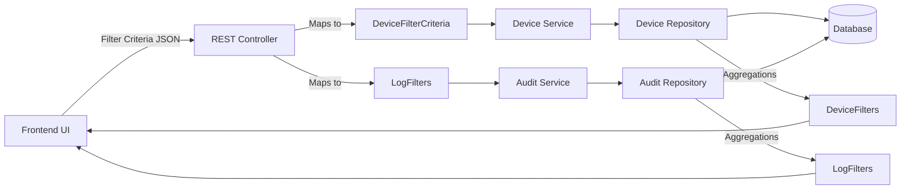
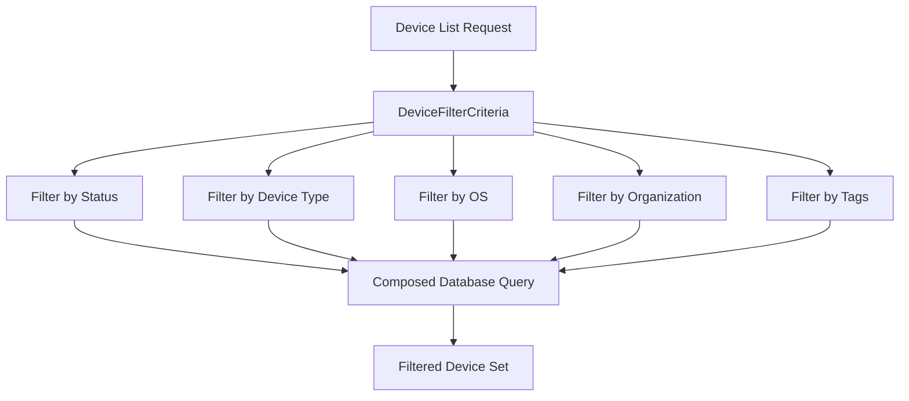
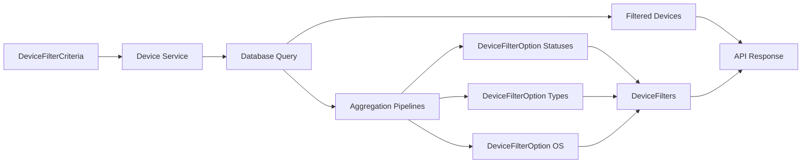

# Module 2

## Overview

**Module 2** provides the filtering data transfer objects (DTOs) used by the OpenFrame API layer to support advanced filtering and faceted search for:

- Audit logs
- Managed devices

While [Module 1](../module_1/module_1.md) defines core query result wrappers and audit log result structures (such as `GenericQueryResult`, `CountedGenericQueryResult`, and `LogEvent`), **Module 2 focuses exclusively on filter definition and filter option modeling**.

It enables:

- Expressing complex filter criteria in API requests
- Returning structured filter options for UI dropdowns
- Supporting faceted filtering with counts
- Maintaining strong typing between API and domain layers

---

## Architectural Role

Module 2 sits in the **API DTO layer** and acts as a contract between:

- Frontend applications (filter forms, dropdowns, dashboards)
- Backend services (query builders, repositories, aggregations)



### Key Responsibility

Module 2 does **not** perform filtering itself. Instead, it:

- Defines filter inputs (`DeviceFilterCriteria`, `LogFilters`)
- Defines filter option outputs (`DeviceFilters`, `DeviceFilterOption`, `OrganizationFilterOption`)
- Standardizes how filters are represented across the platform

---

## Audit Filtering Components

Audit filtering structures extend the log result model defined in [Module 1](../module_1/module_1.md).

### 1. LogFilters

**Class:** `LogFilters`

Represents filter criteria used when querying audit logs.

```java
public class LogFilters {
    private List<String> toolTypes;
    private List<String> eventTypes;
    private List<String> severities;
    private List<OrganizationFilterOption> organizations;
}
```

#### Responsibilities

- Filter logs by tool type
- Filter by event category
- Filter by severity level
- Filter by organization (multi-tenant support)

#### Design Characteristics

- Uses `List<String>` for flexible multi-value filtering
- Uses structured `OrganizationFilterOption` instead of raw IDs for better UI alignment
- Built with Lombok (`@Data`, `@Builder`) for immutability-style construction

---

### 2. OrganizationFilterOption

**Class:** `OrganizationFilterOption`

Represents a selectable organization in a filter dropdown.

```java
public class OrganizationFilterOption {
    private String id;
    private String name;
}
```

#### Purpose

- Provides both identifier and display label
- Avoids UI needing additional lookup requests
- Enables multi-tenant filtering consistency

#### Why Not Just IDs?

Returning both `id` and `name`:

- Reduces additional round-trips
- Keeps UI rendering simple
- Maintains consistent labeling across views

---

## Device Filtering Components

Device filtering is more complex than log filtering due to:

- Enumerated statuses
- Device types
- OS categories
- Tag-based metadata
- Organization scoping

Module 2 separates **filter criteria (input)** from **filter options (output)**.

---

### 1. DeviceFilterCriteria

**Class:** `DeviceFilterCriteria`

Defines filtering constraints when querying devices.

```java
public class DeviceFilterCriteria {
    private List<DeviceStatus> statuses;
    private List<DeviceType> deviceTypes;
    private List<String> osTypes;
    private List<String> organizationIds;

    private List<String> tagKeys;
    private List<String> tagValues;
}
```

#### Responsibilities

- Filter by `DeviceStatus` (enum-based)
- Filter by `DeviceType` (enum-based)
- Filter by OS type (string-based for flexibility)
- Filter by organization IDs
- Filter by metadata tags (key/value)

#### Filtering Flow



This structure allows:

- Composable filtering
- Optional criteria (null or empty lists ignored)
- Type safety through enums

---

### 2. DeviceFilterOption

**Class:** `DeviceFilterOption`

Represents a single filter option with an associated count.

```java
public class DeviceFilterOption {
    private String value;
    private String label;
    private Integer count;
}
```

#### Purpose

Used in faceted filtering UI components such as:

- Status dropdown with counts
- Device type selector
- OS selector

Example conceptual JSON:

```json
{
  "value": "ONLINE",
  "label": "Online",
  "count": 42
}
```

This enables dynamic UI experiences such as:

- Showing how many devices match each filter
- Grey-out empty filter categories
- Updating counts after filtering

---

### 3. DeviceFilters

**Class:** `DeviceFilters`

Represents the full set of filter options returned alongside a filtered device list.

```java
public class DeviceFilters {
    private List<DeviceFilterOption> statuses;
    private List<DeviceFilterOption> deviceTypes;
    private List<DeviceFilterOption> osTypes;
    private List<DeviceFilterOption> organizationIds;
    private List<TagFilterOption> tagKeys;
    private Integer filteredCount;
}
```

#### Responsibilities

- Return all available filter buckets
- Provide counts for each bucket
- Provide total number of filtered records

#### Faceted Filtering Architecture



This supports:

- Real-time filter recalculation
- Dynamic dashboards
- Efficient server-side aggregation

---

## Design Patterns Used

### 1. DTO Segregation Pattern

- Input DTOs: `DeviceFilterCriteria`, `LogFilters`
- Output DTOs: `DeviceFilters`, `DeviceFilterOption`, `OrganizationFilterOption`

This prevents mixing responsibilities and keeps request/response contracts clean.

---

### 2. Faceted Search Pattern

Module 2 enables a faceted search architecture:

- Apply current filters
- Compute counts per category
- Return updated filter options

This is commonly used in:

- Inventory systems
- Log explorers
- Security dashboards

---

### 3. Strong Typing for Domain Integrity

- `DeviceStatus` and `DeviceType` are enums
- Organization is modeled structurally
- Tags are explicitly separated into keys and values

This reduces runtime errors and enforces consistency between API and data layer.

---

## Relationship with Module 1

- **Module 1** defines how results are returned (query wrappers, log DTOs).
- **Module 2** defines how filtering is expressed and how filter options are returned.

Together they provide:

- Structured query inputs
- Structured query outputs
- Pagination and counted results
- Faceted filter metadata

For log result structures and query result wrappers, see [Module 1](../module_1/module_1.md).

---

## Summary

**Module 2** is the filtering backbone of the OpenFrame API DTO layer.

It:

- Defines structured filter criteria for audit logs and devices
- Provides faceted filter option models with counts
- Supports multi-tenant organization filtering
- Enables dynamic UI filtering experiences
- Cleanly separates input criteria from output aggregations

By isolating filtering contracts in a dedicated module, the platform ensures:

- Clean API boundaries
- Strong type safety
- Reusable filtering logic
- Consistent user experience across modules
