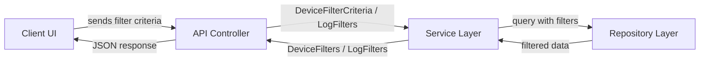
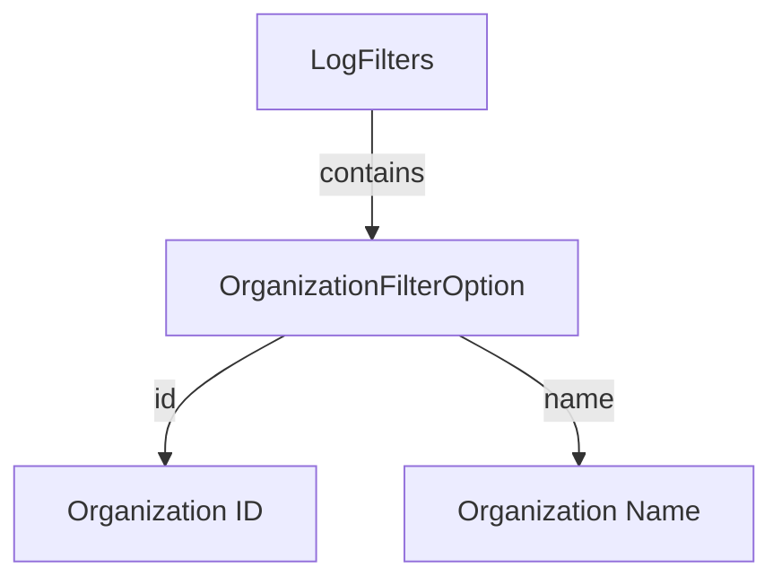
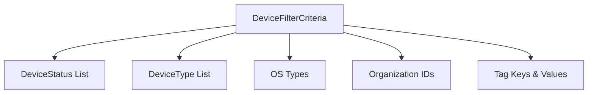
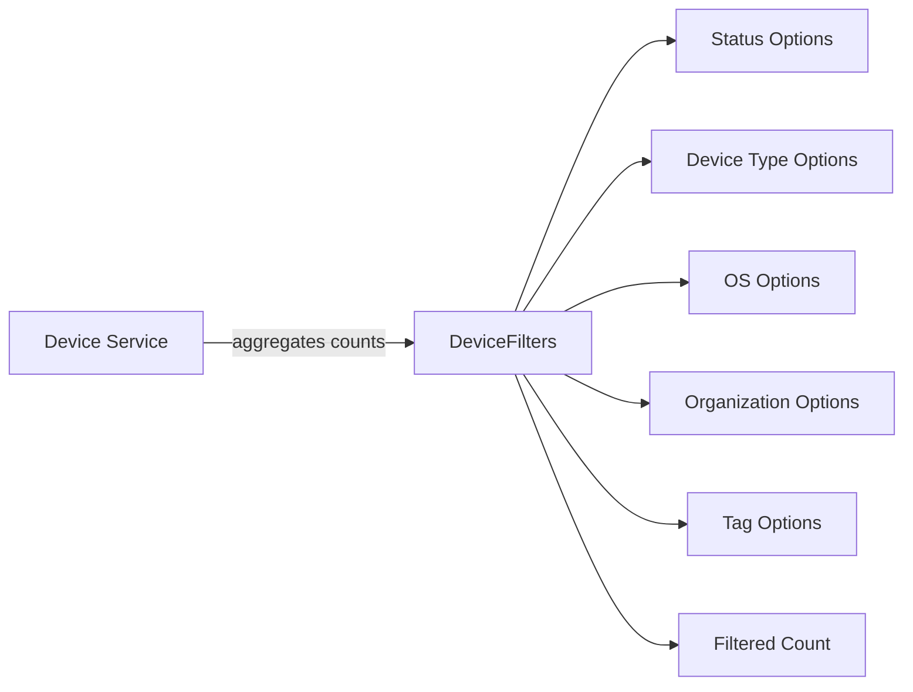
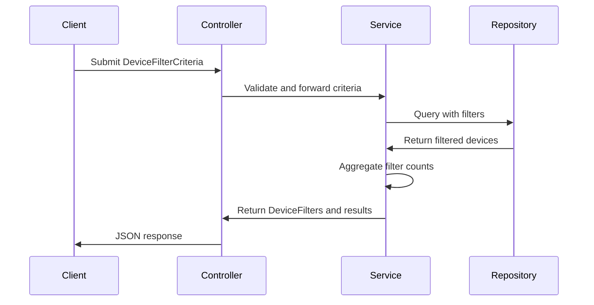
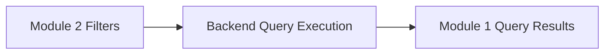

# Module 2

## Overview

Module 2 defines the **filtering data transfer objects (DTOs)** used across the OpenFrame API for audit logs and device management. It standardizes how clients:

- Submit filter criteria to the backend
- Receive available filter options for UI dropdowns
- Retrieve metadata such as filtered counts

This module complements [Module 1](../module_1/module_1.md), which focuses on log result structures and query responses. While Module 1 models *what is returned*, Module 2 models *how data is filtered and refined* before retrieval.

---

## Architectural Role

Module 2 sits at the boundary between:

- REST controllers (API layer)
- Service layer (business filtering logic)
- Data access layer (repositories and queries)

It defines:

- **Filter Criteria DTOs** → Input from clients
- **Filter Option DTOs** → Metadata for UI filter components
- **Filter Aggregation DTOs** → Structured filter groups returned to clients

### High-Level Architecture



Module 2 defines the DTOs used in both directions:

- ✅ Input filtering (criteria)
- ✅ Output filter metadata (options + counts)

---

# Audit Log Filtering

Audit filtering structures are designed to support dynamic, multi-dimensional log searches.

## Core Components

- `LogFilters`
- `OrganizationFilterOption`

These complement the audit result and event models defined in [Module 1](../module_1/module_1.md).

---

## LogFilters

`LogFilters` represents the available filter dimensions applied when retrieving audit logs.

### Responsibilities

- Provide multi-value filtering support
- Enable UI dropdowns for tool types, event types, and severities
- Support organization-based filtering

### Structure

```java
public class LogFilters {
    private List<String> toolTypes;
    private List<String> eventTypes;
    private List<String> severities;
    private List<OrganizationFilterOption> organizations;
}
```

### Filtering Dimensions

- **Tool Types** → Originating system or subsystem
- **Event Types** → Type of log event (create, update, delete, etc.)
- **Severities** → Log level (INFO, WARN, ERROR, etc.)
- **Organizations** → Tenant-level scoping

---

## OrganizationFilterOption

Represents a selectable organization entry in a filter dropdown.

```java
public class OrganizationFilterOption {
    private String id;
    private String name;
}
```

### Purpose

- Decouples internal organization IDs from UI representation
- Enables label/value pattern for frontend dropdowns
- Keeps filtering consistent across modules

### Relationship Diagram



---

# Device Filtering

Device filtering is more complex than log filtering because devices have:

- Enumerated types
- Status states
- Operating systems
- Organization scoping
- Tag-based metadata

## Core Components

- `DeviceFilterCriteria`
- `DeviceFilterOption`
- `DeviceFilters`

These DTOs enable both **filter submission** and **dynamic filter option generation**.

---

## DeviceFilterCriteria

Represents filtering constraints sent from the client to the backend.

```java
public class DeviceFilterCriteria {
    private List<DeviceStatus> statuses;
    private List<DeviceType> deviceTypes;
    private List<String> osTypes;
    private List<String> organizationIds;
    private List<String> tagKeys;
    private List<String> tagValues;
}
```

### Key Concepts

- **Strong typing** for status and device type
- **Multi-select support** via lists
- **Tag-based filtering** for flexible metadata search
- **Organization scoping** for multi-tenant environments

### Filtering Flow



---

## DeviceFilterOption

Represents a single selectable option within a filter category.

```java
public class DeviceFilterOption {
    private String value;
    private String label;
    private Integer count;
}
```

### Design Pattern

This follows a common UI-friendly structure:

- **value** → Internal identifier
- **label** → Human-readable text
- **count** → Number of devices matching this option

The `count` field enables:

- Faceted search
- Dynamic filter narrowing
- Real-time UI feedback

---

## DeviceFilters

Encapsulates grouped filter options returned to the client.

```java
public class DeviceFilters {
    private List<DeviceFilterOption> statuses;
    private List<DeviceFilterOption> deviceTypes;
    private List<DeviceFilterOption> osTypes;
    private List<DeviceFilterOption> organizationIds;
    private List<TagFilterOption> tagKeys;
    private Integer filteredCount;
}
```

### Responsibilities

- Provide categorized filter options
- Support faceted search interfaces
- Expose total filtered result count

### Filter Response Architecture



---

# End-to-End Device Filtering Lifecycle



---

# Design Principles

Module 2 follows several important design principles:

## 1. Separation of Concerns

- Criteria DTOs define **input filtering**
- Option DTOs define **output metadata**
- Result DTOs (Module 1) define **data payloads**

## 2. UI-Oriented Modeling

All filter option classes follow a consistent:

- `value`
- `label`
- `count`

pattern for seamless frontend integration.

## 3. Multi-Tenant Awareness

Both audit and device filters support organization scoping, enabling:

- Tenant isolation
- Scoped queries
- Controlled visibility

## 4. Extensibility

Because filters are list-based and loosely coupled:

- New dimensions can be added without breaking existing APIs
- Tag-based filtering supports arbitrary metadata
- Strong typing for enums ensures compile-time safety

---

# Relationship with Module 1

Module 2 works closely with [Module 1](../module_1/module_1.md):

- Module 2 defines **how queries are constrained**
- Module 1 defines **how query results are structured**

Together, they form the full query lifecycle:



---

# Summary

Module 2 provides the foundational DTOs for:

- Audit log filtering
- Device filtering
- Faceted search support
- Multi-tenant scoping
- UI-driven filter metadata

It ensures filtering is:

- Structured
- Extensible
- Type-safe
- Frontend-friendly

In combination with Module 1, it completes the API query contract between client and backend systems within the OpenFrame ecosystem.