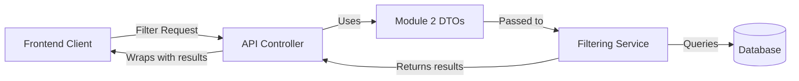
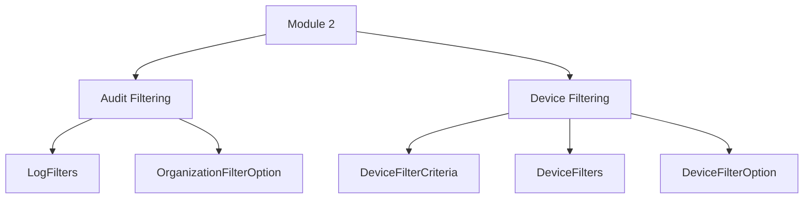
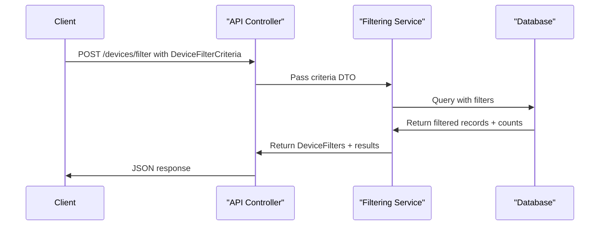

# Module 2

## Overview

**Module 2** defines the filtering data transfer objects (DTOs) used across the OpenFrame API layer for audit logs and device management. It standardizes how clients:

- Submit filter criteria to backend services
- Receive available filter options (for dropdowns and faceted search)
- Retrieve filtered result counts

This module plays a critical role in enabling dynamic filtering, multi-tenant isolation, and consistent UI-driven querying across audit and device domains.

Module 2 works closely with [Module 1](../module_1/module_1.md), which defines generic query result wrappers and core audit DTOs such as log events and filter criteria.

---

## Architectural Context

Module 2 sits in the API DTO layer and is consumed by:

- REST controllers
- Service-layer filtering logic
- Frontend applications (via JSON contracts)

Module 2 focuses strictly on:

- Filter criteria objects (input)
- Filter option objects (faceted output)
- Aggregated filter containers

It does **not** implement business logic or database queries.

---

## High-Level Structure

Module 2 is logically divided into two sub-domains:

1. **Audit Filtering** – Filter configuration and options for log queries
2. **Device Filtering** – Criteria and faceted filters for device inventory queries

Detailed documentation for each sub-domain:

- [Audit Filtering](module_2/audit_filtering/audit_filtering.md)
- [Device Filtering](module_2/device_filtering/device_filtering.md)

---

## Design Principles

### 1. Separation of Criteria and Options

Module 2 clearly separates:

- **Criteria DTOs** – What the client sends to filter data
- **Filter Option DTOs** – What the backend returns to populate dropdowns and facets

This allows:

- Dynamic UI generation
- Faceted search experiences
- Accurate filtered counts

---

### 2. Multi-Tenant Awareness

Both audit and device filtering include organization-based filtering:

- `OrganizationFilterOption` (audit domain)
- `organizationIds` (device domain)

This ensures tenant isolation and scoped querying.

---

### 3. Builder-Based Construction

All DTOs use:

- `@Data`
- `@Builder`
- `@NoArgsConstructor`
- `@AllArgsConstructor`

This provides:

- Immutable-style construction patterns
- Reduced boilerplate
- Clean JSON serialization/deserialization

---

## Typical Filtering Flow

The same pattern applies to audit log filtering using `LogFilters`.

---

## Responsibilities of Module 2

✅ Defines consistent filter contracts  
✅ Enables faceted filtering with counts  
✅ Supports multi-select filtering  
✅ Keeps API layer independent from persistence layer  

❌ Does not execute queries  
❌ Does not contain domain entities  
❌ Does not manage pagination or generic result wrapping (handled in Module 1)

---

## Summary

Module 2 provides the foundational filtering DTOs for both audit logs and device inventory. By clearly separating filter criteria from filter options and supporting multi-tenant and faceted querying, it ensures consistent filtering behavior across the OpenFrame API.

For detailed class-level documentation, refer to:

- [Audit Filtering](module_2/audit_filtering/audit_filtering.md)
- [Device Filtering](module_2/device_filtering/device_filtering.md)
