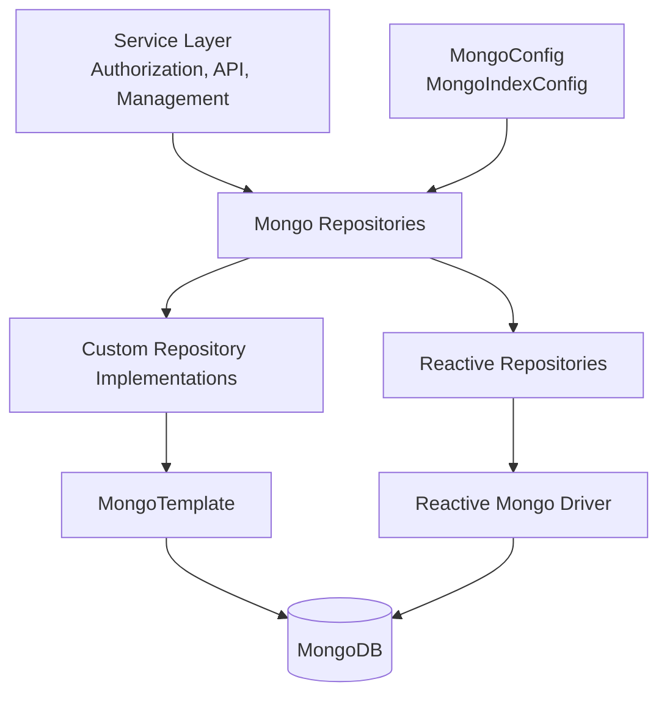
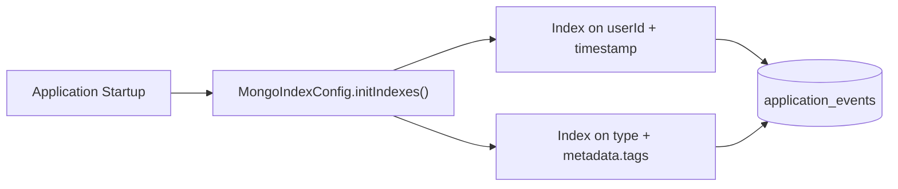
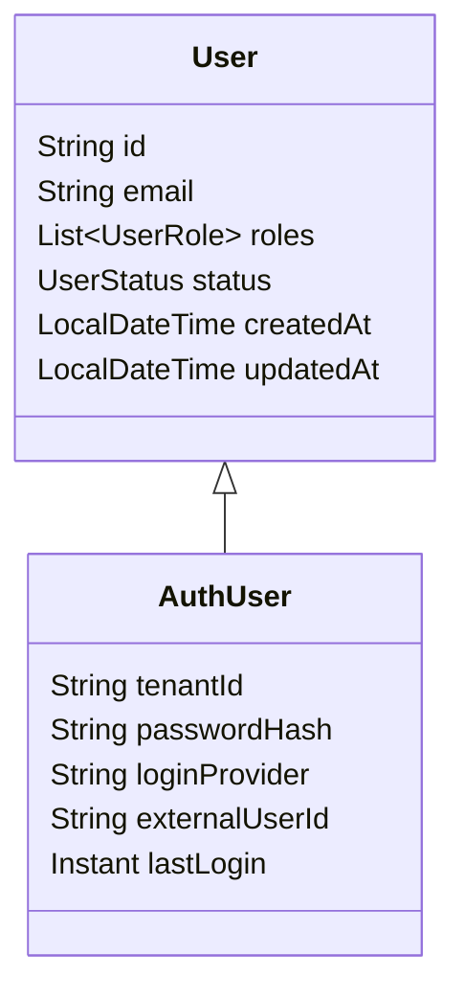
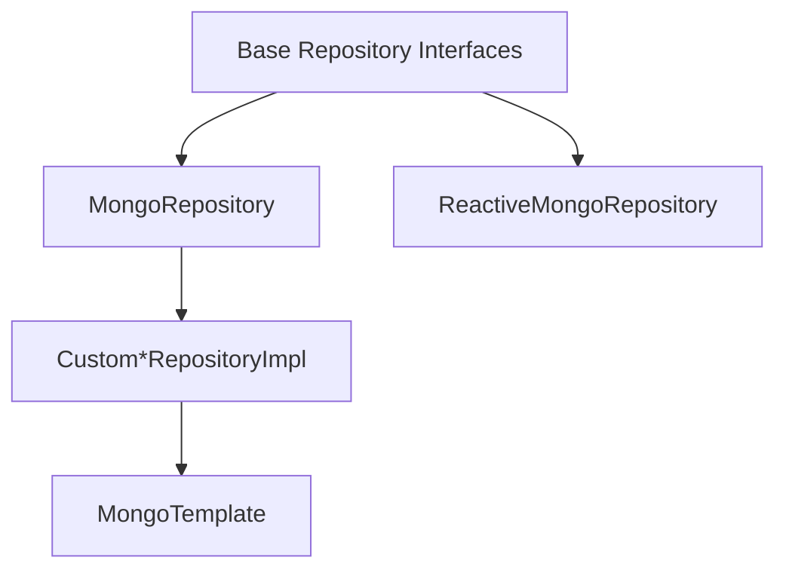
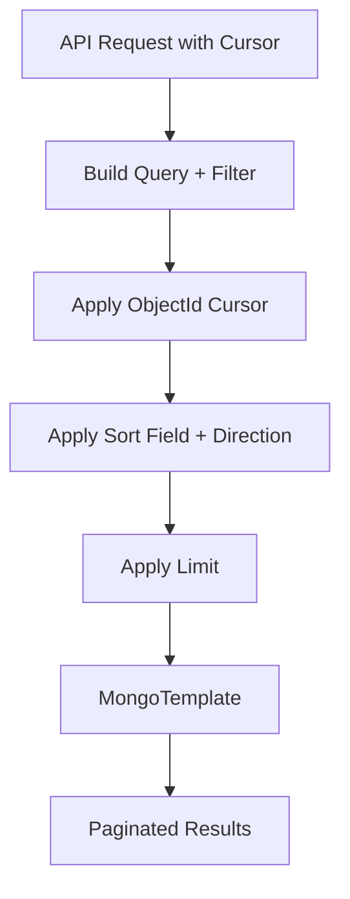
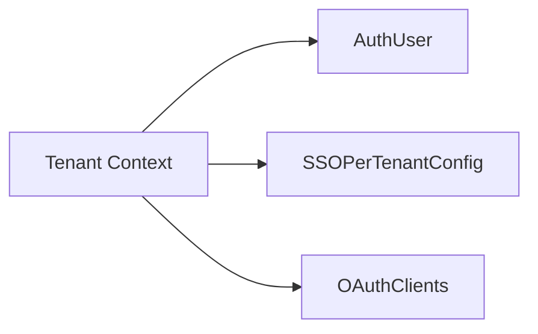
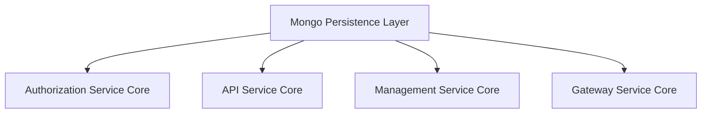

# Mongo Persistence Layer

The **Mongo Persistence Layer** module provides the primary MongoDB-backed storage implementation for OpenFrame OSS. It defines:

- MongoDB document models for core domain entities
- Blocking and reactive repositories
- Custom query builders with filtering, search, and cursor-based pagination
- Index configuration and Mongo-specific tuning

This module acts as the persistence backbone for higher-level modules such as:

- Authorization Service Core
- API Service Core Controllers and GraphQL
- Management Service Core
- Gateway Service Core

It encapsulates MongoDB-specific concerns so that upstream modules depend only on repository contracts and domain models.

---

## 1. Architectural Overview

The Mongo Persistence Layer follows a layered architecture:

- **Configuration Layer** – Mongo setup, converters, indexes
- **Document Layer** – MongoDB `@Document` models
- **Repository Layer** – Spring Data repositories (blocking + reactive)
- **Custom Query Layer** – Advanced filtering, cursor pagination, search



### Key Design Principles

- ✅ Separation of document models from business services
- ✅ Technology-agnostic base repository interfaces
- ✅ Support for both blocking and reactive stacks
- ✅ Cursor-based pagination for scalable data access
- ✅ Database-level filtering and indexing for performance

---

## 2. Configuration Layer

### 2.1 MongoConfig

`MongoConfig` enables:

- `@EnableMongoRepositories` for blocking repositories
- `@EnableReactiveMongoRepositories` for reactive repositories
- `@EnableMongoAuditing` for `@CreatedDate` and `@LastModifiedDate`
- Custom `MappingMongoConverter`

Important customization:

- Replaces `.` in map keys with `__dot__` using `setMapKeyDotReplacement("__dot__")`
- Ensures compatibility with MongoDB field naming constraints

Reactive repositories are only enabled when running in a reactive web application.

---

### 2.2 MongoIndexConfig

`MongoIndexConfig` ensures critical indexes at startup:



These indexes optimize:

- Time-range queries
- Tag-based filtering
- User-based event lookups

---

## 3. Document Layer (MongoDB Models)

The document layer defines the MongoDB collections and embedded structures.

### 3.1 User & Authentication Documents

#### User

Collection: `users`

Key features:

- Indexed email
- Roles list
- Email normalization (lowercase)
- Status tracking
- Auditing timestamps

#### AuthUser

Extends `User` for multi-tenant authorization:

- Indexed `tenantId`
- Compound unique index: `{ tenantId, email }`
- Supports login providers (LOCAL, GOOGLE, etc.)
- Password hash storage



Used heavily by the Authorization Service Core.

---

### 3.2 Organization Domain

#### Organization

Collection: `organizations`

Key capabilities:

- Unique `organizationId`
- Soft delete (`deleted`, `deletedAt`)
- Contract lifecycle logic
- Indexed fields for search and filtering

#### OrganizationQueryFilter

Used to construct MongoDB queries with:

- Category filtering
- Employee range filtering
- Active contract detection

Soft-deleted records are excluded at query level in `CustomOrganizationRepositoryImpl`.

---

### 3.3 Device & Machine Tagging

#### Device

Collection: `devices`

Fields include:

- Machine linkage
- OS version
- Status (ACTIVE, OFFLINE, MAINTENANCE)
- Health and configuration

#### MachineTag

Collection: `machine_tags`

Compound unique index:

```text
{'machineId': 1, 'tagId': 1}
```

Prevents duplicate tag assignments.

---

### 3.4 Event Documents

#### CoreEvent

Collection: `events`

- Type
- Payload
- Timestamp
- Status (CREATED, PROCESSING, COMPLETED, FAILED)

#### EventQueryFilter

Supports:

- User ID filtering
- Event type filtering
- Date-range filtering

CustomEventRepositoryImpl converts `LocalDate` to UTC `Instant` ranges.

---

### 3.5 OAuth & SSO Documents

#### MongoRegisteredClient

Collection: `oauth_registered_clients`

- Unique `clientId`
- Grant types
- Redirect URIs
- Token TTL configuration
- PKCE requirement

#### OAuthToken

Collection: `oauth_tokens`

- Access & refresh tokens
- Expiry timestamps
- Client binding

#### SSOPerTenantConfig

Extends base SSO configuration:

- Unique tenant binding
- Auditing timestamps

Used by the Authorization Service Core for tenant-scoped SSO.

---

### 3.6 Tools & Integrations

#### Tag

Collection: `tags`

- Unique name
- Organization scoping
- Color metadata

#### ToolQueryFilter

Supports filtering by:

- Enabled
- Type
- Category
- Platform category

#### ToolAgentAsset

Represents downloadable tool agent metadata:

- Version
- Source
- Download configurations
- Executable flag

---

## 4. Repository Layer

The repository layer consists of:

- Standard Spring Data repositories
- Reactive repositories
- Base repository interfaces
- Custom repository implementations



---

### 4.1 Base Repository Interfaces

Technology-agnostic contracts:

- `BaseUserRepository`
- `BaseTenantRepository`
- `BaseApiKeyRepository`
- `BaseIntegratedToolRepository`

These allow:

- Blocking implementations (Optional, List)
- Reactive implementations (Mono, Flux)

This abstraction enables flexibility across service types.

---

### 4.2 Reactive Repositories

Examples:

- `ReactiveUserRepository`
- `ReactiveOAuthClientRepository`

Reactive repositories are conditionally enabled in reactive web environments.

They are primarily consumed by OAuth and BFF components.

---

### 4.3 Custom Repository Implementations

Custom implementations use `MongoTemplate` for advanced queries.

#### Cursor-Based Pagination Pattern

Used in:

- CustomMachineRepositoryImpl
- CustomEventRepositoryImpl
- CustomOrganizationRepositoryImpl



Key properties:

- Uses `_id` as stable cursor
- Supports ASC and DESC ordering
- Prevents offset-based performance degradation

---

#### Filtering Strategy

Each custom repository implements:

- `build*Query(filter, search)`
- `isSortableField(field)`
- `getDefaultSortField()`

All filtering is pushed down to MongoDB for performance.

---

## 5. Multi-Tenancy Considerations

Multi-tenancy is enforced at multiple levels:

- Compound index on `AuthUser` (tenantId + email)
- Tenant-scoped SSO configuration
- Domain-based lookup in tenant repositories



This design ensures strict tenant isolation at persistence level.

---

## 6. Performance & Indexing Strategy

The Mongo Persistence Layer optimizes for:

- Cursor-based pagination
- Database-level filtering
- Explicit compound indexes
- Distinct field lookups
- Soft delete filtering at query level

Examples:

- `findDistinctUserIds()`
- `findDistinctEventTypes()`
- Compound tag and event indexes

All sorting is validated against a whitelist of sortable fields.

---

## 7. Integration with Other Modules

The Mongo Persistence Layer is a foundational module consumed by:

- Authorization Service Core – users, OAuth clients, tokens
- API Service Core Controllers and GraphQL – devices, organizations, events, tools
- Management Service Core – integrated tools and configuration
- Gateway Service Core – indirectly via authentication and API keys



This separation ensures that:

- Domain logic remains outside persistence
- MongoDB specifics are centralized
- The platform can evolve storage strategies without affecting service APIs

---

# Summary

The **Mongo Persistence Layer** provides a robust, scalable, and multi-tenant-ready MongoDB integration for OpenFrame OSS.

It delivers:

- Rich document modeling
- Custom MongoTemplate-based querying
- Reactive and blocking repository support
- Cursor pagination for large datasets
- Strong indexing and filtering strategies
- Tenant-aware authentication persistence

As the data backbone of the platform, this module ensures consistent, high-performance access to core domain entities across all higher-level services.
