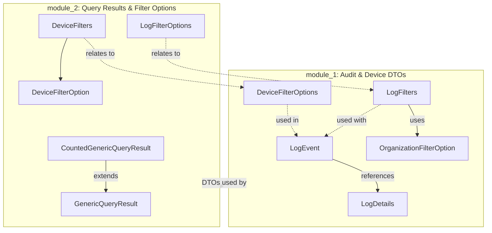
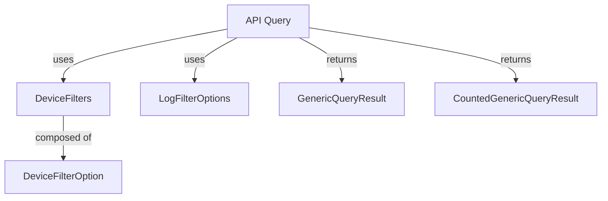

# openframe-oss-lib Overview

The `openframe-oss-lib` repository provides foundational data transfer objects (DTOs), filter options, and query result structures for the OpenFrame API ecosystem. Its primary purpose is to enable robust audit logging, device management, and flexible querying/filtering of data across OpenFrame platform services.

---

## Purpose

- **Audit Logging:** Supplies DTOs for representing log events, log details, and filtering options, supporting comprehensive audit trails and search capabilities.
- **Device Management:** Defines device filter options and DTOs to facilitate device inventory queries and management.
- **Query Results:** Implements generic and counted query result wrappers for paginated API responses, supporting both generic and domain-specific (device, audit) use cases.

---

## End-to-End Architecture

The repository is organized into two main modules, each with a clear responsibility and compositional relationships:

### Data Flow Example

---

## Repository Structure & Core Modules

### module_1: Audit & Device DTOs

- **Purpose:** Core DTOs for audit logging and device filtering.
- **Key Components:**
  - [`LogEvent`](LogEvent.md): Represents an audit log event.
  - [`LogDetails`](LogDetails.md): Detailed information for log events.
  - [`LogFilters`](LogFilters.md): Criteria for querying logs.
  - [`OrganizationFilterOption`](OrganizationFilterOption.md): Organization-based filtering.
  - [`DeviceFilterOptions`](DeviceFilterOptions.md): Device filter criteria.

> See [module_1 documentation](module_1.md) for a full breakdown and mermaid diagrams.

### module_2: Query Results & Filter Options

- **Purpose:** Generic and domain-specific query result wrappers and filter option DTOs.
- **Key Components:**
  - [`GenericQueryResult`](GenericQueryResult.md): Paginated query results.
  - [`CountedGenericQueryResult`](CountedGenericQueryResult.md): Query results with total count.
  - [`DeviceFilters`](DeviceFilters.md): Aggregates device filter options.
  - [`DeviceFilterOption`](DeviceFilterOption.md): Single device filter option.
  - [`LogFilterOptions`](LogFilterOptions.md): Audit log filter options.

> See [module_2 documentation](module_2.md) for detailed usage and architecture.

---

## References to Core Module Documentation

- [module_1.md](module_1.md): Audit and device DTOs, including LogEvent, LogDetails, LogFilters, OrganizationFilterOption, and DeviceFilterOptions.
- [module_2.md](module_2.md): Query result wrappers and filter option DTOs, including GenericQueryResult, CountedGenericQueryResult, DeviceFilters, DeviceFilterOption, and LogFilterOptions.

For detailed field-level documentation, refer to the respective sub-module markdown files linked above.

---

## Summary

The `openframe-oss-lib` repository is the backbone for OpenFrame API data modeling, providing reusable, composable DTOs and filter/query result structures. Its modular design supports scalable audit logging, device management, and efficient data querying across the OpenFrame platform.