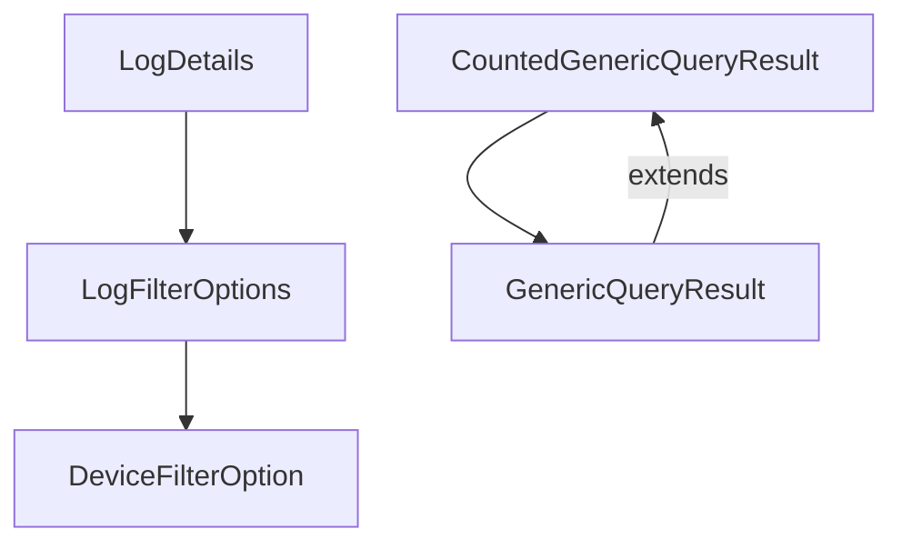
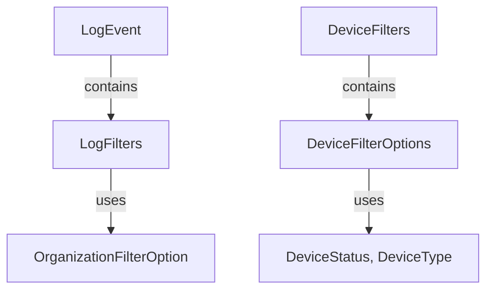

# OpenFrame OSS Library Overview

The `openframe-oss-lib` repository is a comprehensive library designed to facilitate the management and querying of audit logs and device-related data within the OpenFrame API. It provides a robust set of data transfer objects (DTOs) that enable efficient data handling and filtering capabilities.

## End-to-End Architecture

The architecture of the `openframe-oss-lib` is visualized below using Mermaid diagrams, illustrating the interactions between core components across its modules.

### Module 1 Architecture

### Module 2 Architecture

## Core Modules Documentation

### Module 1

Module 1 is a core component of the OpenFrame API library, focusing on handling DTOs related to auditing and device filtering. It includes components such as `LogDetails`, `CountedGenericQueryResult`, `LogFilterOptions`, `DeviceFilterOption`, and `GenericQueryResult`. These components work together to provide comprehensive data management capabilities.

For detailed documentation, refer to the [Module 1 Documentation](#).

### Module 2

Module 2 is designed to manage various aspects of audit logging and device filtering. It includes components like `LogEvent`, `DeviceFilters`, `DeviceFilterOptions`, `LogFilters`, and `OrganizationFilterOption`. These components facilitate the management and querying of log events and device-related data.

For detailed documentation, refer to the [Module 2 Documentation](#).

---

This overview provides a foundational understanding of the `openframe-oss-lib` repository's architecture and core modules. For further details on each module, please refer to their respective documentation files.