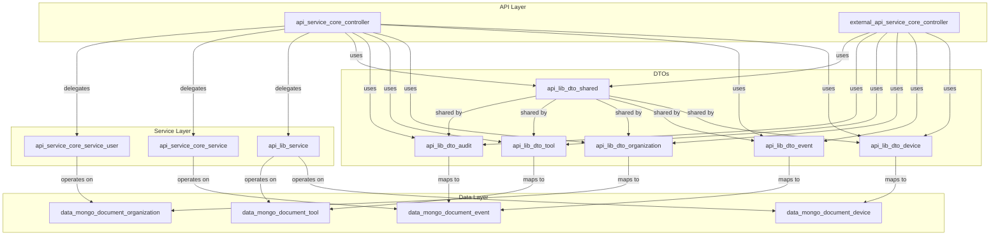
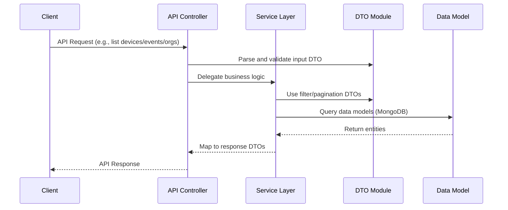

# openframe-oss-lib Repository Overview

The `openframe-oss-lib` repository provides the foundational libraries, data models, API DTOs, and service interfaces for the OpenFrame platform. It is designed to enable secure, scalable, and extensible management of devices, organizations, events, tools, and user authentication across distributed environments. The repository serves as the core building block for OpenFrame’s API, client, management, and authorization services, supporting both internal and external integrations.

---

## Purpose

- **Standardization:** Defines shared data transfer objects (DTOs), service interfaces, and configuration patterns for all OpenFrame services.
- **Interoperability:** Enables seamless communication between microservices, clients, and external systems via consistent data models and APIs.
- **Extensibility:** Provides modular components for device, event, organization, tool, and audit management, supporting future feature growth.
- **Security & Multi-Tenancy:** Lays the groundwork for secure, multi-tenant SaaS architectures with robust authentication, authorization, and audit capabilities.

---

## End-to-End Architecture

The architecture of `openframe-oss-lib` is modular, with clear separation between API DTOs, service interfaces, configuration, and data models. The following diagrams illustrate the high-level flow and relationships between core modules.

### 1. High-Level System Architecture

### 2. Data Flow: Device/Event/Organization Query

---

## Core Modules & Documentation References

Below are the key modules in `openframe-oss-lib` and links to their detailed documentation:

### Shared DTOs and Pagination

- **[api_lib_dto_shared](api_lib_dto_shared.md):**  
  Provides `CursorPaginationInput` for consistent, cursor-based pagination across all API endpoints.

### Device Management

- **[api_lib_dto_device](api_lib_dto_device.md):**  
  DTOs for device filtering, tagging, and querying.
- **[data_mongo_document_device](data_mongo_document_device.md):**  
  MongoDB models for devices, alerts, compliance, and security events.

### Event Management

- **[api_lib_dto_event](api_lib_dto_event.md):**  
  DTOs for event filtering and querying.
- **[data_mongo_document_event](data_mongo_document_event.md):**  
  MongoDB models for core and external events.

### Organization Management

- **[api_lib_dto_organization](api_lib_dto_organization.md):**  
  DTOs for organization filtering and API responses.
- **[data_mongo_document_organization](data_mongo_document_organization.md):**  
  MongoDB models for organizations and contacts.

### Tool Management

- **[api_lib_dto_tool](api_lib_dto_tool.md):**  
  DTOs for tool filtering and tool lists.
- **[data_mongo_document_tool](data_mongo_document_tool.md):**  
  MongoDB models for tool tags and tool entities.

### Audit and Logging

- **[api_lib_dto_audit](api_lib_dto_audit.md):**  
  DTOs for log details, events, and filter options.

### Service Interfaces

- **[api_lib_service](api_lib_service.md):**  
  Service interfaces for agent, tag, and tool connection management.

### Core Utilities

- **[core_dto](core_dto.md):**  
  Provides `PageResponse` for paginated API responses.
- **[core_util](core_util.md):**  
  Utility functions such as `SlugUtil` for consistent slug generation.
- **[core_validation](core_validation.md):**  
  Validators like `ValidEmailValidator` for input validation.

---

## Extensibility & Integration

- **Modular Design:** Each domain (device, event, organization, tool, audit) has its own DTO and data model modules, making it easy to extend or customize.
- **Shared Pagination:** All filter DTOs embed `CursorPaginationInput` for unified pagination.
- **Service Layer:** Service interfaces abstract business logic, enabling flexible backend implementations.
- **Security & Multi-Tenancy:** DTOs and service patterns are designed for secure, multi-tenant SaaS environments.

---

## Best Practices

- **Use Shared DTOs:** Always use `CursorPaginationInput` and shared filter DTOs for pagination and filtering.
- **Validate Input:** Leverage validators (e.g., `ValidEmailValidator`) to ensure data integrity.
- **Consistent Data Flow:** Map API DTOs to data models for persistence and back to DTOs for responses.
- **Extend Modularly:** Add new filter options or response fields by extending the relevant DTO module.

---

## Related Documentation

- [api_lib_dto_shared.md] – Shared DTOs and pagination
- [api_lib_dto_device.md], [api_lib_dto_event.md], [api_lib_dto_organization.md], [api_lib_dto_tool.md], [api_lib_dto_audit.md] – Domain-specific DTOs
- [api_lib_service.md] – Service interfaces
- [core_dto.md], [core_util.md], [core_validation.md] – Core utilities and validation
- [data_mongo_document_device.md], [data_mongo_document_event.md], [data_mongo_document_organization.md], [data_mongo_document_tool.md] – Data models

---

## Summary

The `openframe-oss-lib` repository is the backbone of the OpenFrame platform, providing standardized data models, DTOs, and service interfaces for all major domains. Its modular, extensible architecture enables rapid development of secure, scalable, and interoperable services for device, event, organization, tool, and audit management.