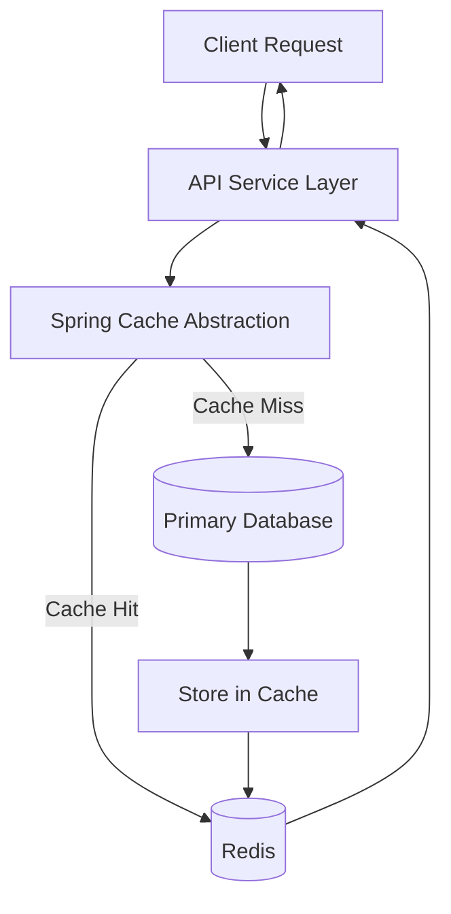
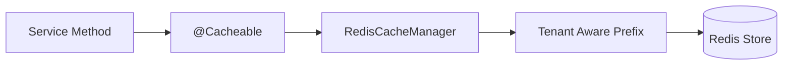
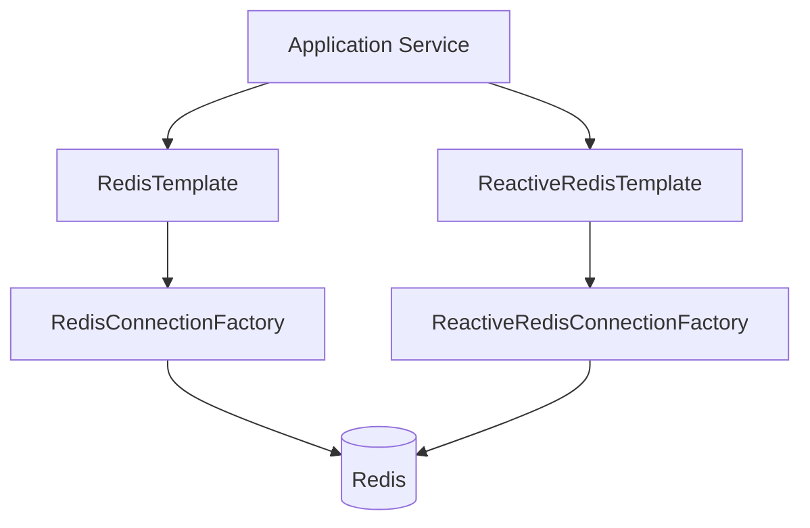
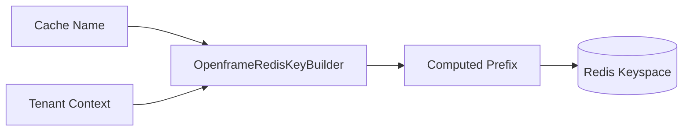

# Redis Caching Layer

## Overview

The **Redis Caching Layer** provides distributed caching and low-latency data access capabilities across the OpenFrame platform. It integrates Spring Cache, RedisTemplate, and reactive Redis support to enable:

- Tenant-aware cache key generation
- Centralized cache configuration
- Synchronous and reactive Redis access
- Consistent serialization strategies
- Optional activation via configuration property

This module is designed as a reusable infrastructure layer consumed by API services, gateway components, stream processors, and management services.

Redis is enabled only when the property `spring.redis.enabled=true` is set, ensuring safe opt-in behavior per deployment environment.

---

## Architectural Context

The Redis Caching Layer sits between application services and persistence layers such as MongoDB, Cassandra, and Pinot. It improves performance by caching frequently accessed data and reducing database load.



### Responsibilities in the Stack

- API Service Core: Uses Spring Cache annotations for performance optimization.
- Gateway Service Core: May use Redis for rate limiting or token caching.
- Authorization Service Core: Can cache token validation metadata or client registrations.
- Data Platform Core: Works alongside Redis when combining hot and analytical data access patterns.

The Redis Caching Layer does not implement business logic. It provides infrastructure and configuration only.

---

## Core Components

The module contains three primary configuration classes:

1. CacheConfig  
2. RedisConfig  
3. OpenframeRedisKeyConfiguration  

Each component plays a specific role in enabling caching and Redis connectivity.

---

## Cache Configuration

**Class:** CacheConfig  
**Package:** com.openframe.data.config

This configuration enables Spring Cache backed by Redis.

### Key Features

- Enables caching via `@EnableCaching`
- Creates a Redis-backed `CacheManager`
- Applies a default Time-To-Live (TTL) of 6 hours
- Disables caching of null values
- Uses JSON serialization for values
- Uses String serialization for keys
- Enforces tenant-aware key prefixes

### Cache Manager Flow



### Default TTL Policy

```text
Default TTL: 6 hours
Null values: Not cached
Key serializer: StringRedisSerializer
Value serializer: GenericJackson2JsonRedisSerializer
```

This ensures consistent serialization across services and prevents stale cache accumulation beyond the configured duration.

---

## Redis Connectivity Configuration

**Class:** RedisConfig  
**Package:** com.openframe.data.config

This configuration defines the Redis connection templates used by synchronous and reactive components.

### Provided Beans

1. RedisTemplate<String, String>
2. ReactiveStringRedisTemplate
3. ReactiveRedisTemplate<String, String>

### Design Goals

- String-based key/value serialization for consistency
- Reactive support for WebFlux-based services
- Conditional bean creation to avoid duplication
- Auto-enablement of Redis repositories

### Connectivity Diagram



This allows both blocking and non-blocking services to use Redis consistently.

---

## Tenant-Aware Key Management

**Class:** OpenframeRedisKeyConfiguration  
**Provides:** OpenframeRedisKeyBuilder

This configuration ensures all Redis keys are prefixed using a standardized format.

### Why Tenant Awareness Matters

The platform supports multi-tenant deployments. Without proper key isolation, cache collisions across tenants could occur.

### Cache Key Format

```text
<prefix>:<tenant>:<cacheName>::<key>
```

The `OpenframeRedisKeyBuilder` centralizes this logic so that:

- All cache keys are consistently formatted
- Cache isolation is enforced at the infrastructure level
- Developers do not need to manually manage prefixes

### Key Prefix Computation



The prefix is computed dynamically and applied automatically by the `RedisCacheConfiguration`.

---

## Conditional Activation

The entire module is guarded by the configuration property:

```text
spring.redis.enabled=true
```

If not explicitly enabled:

- No Redis templates are created
- No cache manager is initialized
- No Redis repositories are activated

This allows deployments to:

- Disable Redis in local development
- Enable Redis in production
- Toggle caching per environment

---

## Serialization Strategy

Two primary serialization approaches are used:

### Cache Values

- Serializer: GenericJackson2JsonRedisSerializer
- Purpose: Store structured Java objects as JSON

### Direct Redis Templates

- Serializer: StringRedisSerializer
- Purpose: Efficient storage for string-based keys and values

This separation ensures:

- Type-safe object caching via Spring Cache
- Lightweight direct string operations where needed

---

## Interaction with Other Platform Modules

The Redis Caching Layer is infrastructure-focused and used by higher-level modules such as:

- API services for caching query results
- Authorization services for token or client metadata caching
- Gateway services for rate limiting or request metadata
- Management services for frequently accessed configuration

It does not depend on business DTOs, controllers, or repositories from other modules. Instead, it exposes reusable Redis capabilities that other modules consume.

---

## Design Principles

### 1. Infrastructure-Only Responsibility
The module strictly handles Redis configuration and cache management.

### 2. Tenant Isolation by Default
All cache keys are prefixed using a tenant-aware strategy.

### 3. Consistent Serialization
All components use explicit serializers to avoid ambiguity.

### 4. Reactive + Blocking Support
Supports both traditional MVC and reactive WebFlux services.

### 5. Safe Opt-In Activation
Redis must be explicitly enabled via configuration.

---

## Summary

The **Redis Caching Layer** provides:

- Centralized Redis configuration
- Spring Cache integration with 6-hour TTL defaults
- Multi-tenant key isolation
- Reactive and synchronous Redis support
- Conditional environment-based activation

By abstracting Redis configuration into a dedicated module, the platform ensures consistent caching behavior, tenant isolation, and high-performance data access across all services.