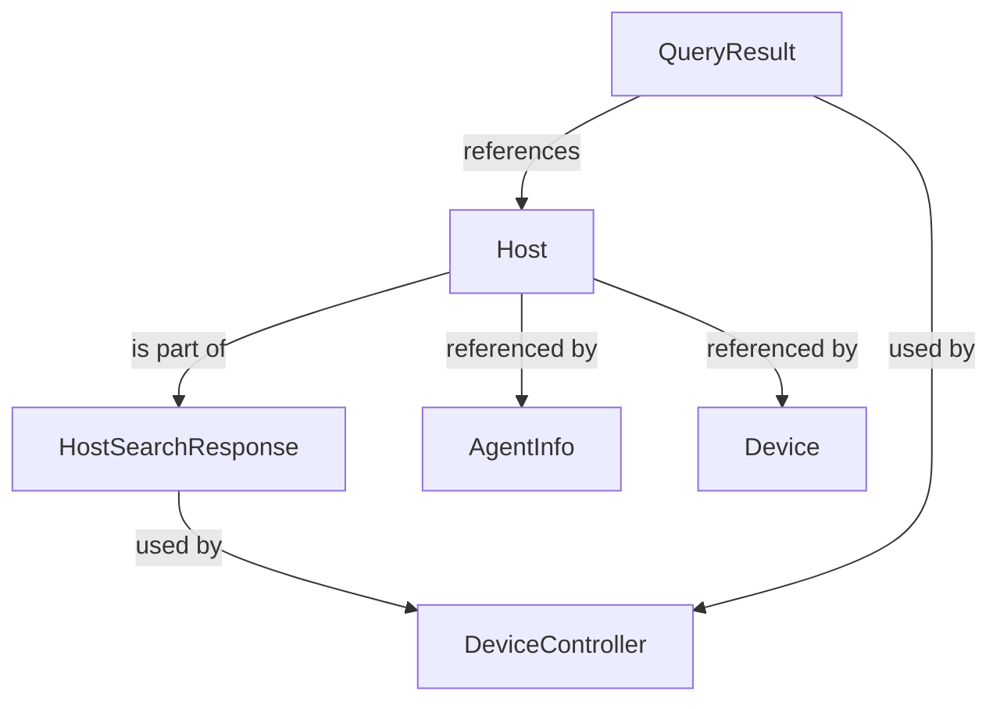
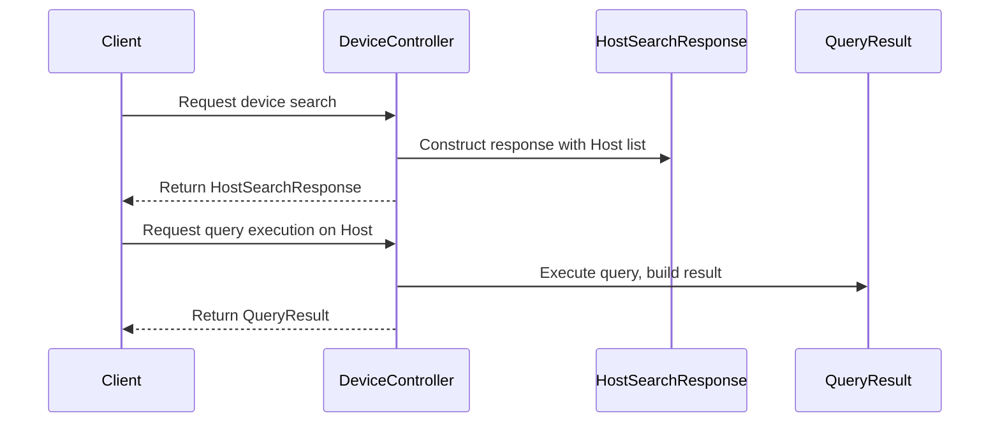

# sdk_fleetmdm_model Module Documentation

## Introduction

The `sdk_fleetmdm_model` module provides core data models for representing and interacting with host devices and query results within the Fleet MDM (Mobile Device Management) ecosystem. These models are foundational for SDK consumers and internal services that need to process, search, or display information about managed hosts and the results of queries executed against them.

This module is designed to be interoperable with other SDK and service modules, serving as a bridge between low-level data representations and higher-level business logic or API layers.

---

## Core Components

### 1. `Host`
Represents a managed device (host) within the Fleet MDM system. This model encapsulates key attributes of a device, such as its unique identifier, platform, status, and metadata required for device management operations.

**Typical fields include:**
- `id`: Unique identifier for the host
- `hostname`: Device hostname
- `platform`: OS/platform type (e.g., Windows, macOS, Linux)
- `status`: Current status (e.g., online, offline)
- `last_seen`: Timestamp of last activity
- `metadata`: Additional device-specific information

**Usage:**
- Used by search and listing APIs
- Passed between services for device management operations
- Referenced in query results and audit logs

### 2. `HostSearchResponse`
Encapsulates the response structure for host/device search operations. This model typically includes a list of `Host` objects and pagination or metadata fields to support efficient querying and navigation.

**Typical fields include:**
- `hosts`: List of `Host` objects matching the search criteria
- `total_count`: Total number of matching hosts
- `page`: Current page number
- `page_size`: Number of hosts per page
- `has_next`: Boolean indicating if more results are available

**Usage:**
- Returned by device search APIs
- Used in UI components for paginated device listings

### 3. `QueryResult`
Represents the result of executing a query (e.g., SQL, inventory, or compliance check) against one or more hosts. This model is flexible to accommodate various result types and structures.

**Typical fields include:**
- `host_id`: Identifier of the host the result pertains to
- `columns`: List of column names in the result
- `rows`: List of row data (each row is a list of values)
- `error`: Error message if the query failed
- `executed_at`: Timestamp of query execution

**Usage:**
- Used by reporting and analytics features
- Consumed by UI components displaying query results
- Passed between backend services for further processing

---

## Architecture and Component Relationships

The `sdk_fleetmdm_model` module is primarily a data model layer. It does not implement business logic, but its models are used extensively throughout the Fleet MDM system. The following diagram illustrates the relationships between its core components and their interactions with other modules:

### Explanation
- `Host` is the foundational model, referenced by both `HostSearchResponse` and `QueryResult`.
- `HostSearchResponse` aggregates multiple `Host` objects and is typically returned by search/list APIs.
- `QueryResult` references a `Host` and contains the results of queries executed against it.
- Both `HostSearchResponse` and `QueryResult` are used by controllers such as `DeviceController` in the `api_service_core_controller` module ([api_service_core_controller.md]).
- The `Host` model is conceptually mapped to persistent entities like `Device` in `data_mongo_document_device` ([data_mongo_document_device.md]) and to agent representations like `AgentInfo` in `sdk_tacticalrmm_model` ([sdk_tacticalrmm_model.md]).

---

## Data Flow and Process Overview

The following diagram shows a typical data flow for a device search and query operation using these models:

---

## Integration with Other Modules

- **Device Persistence:** The `Host` model is conceptually mapped to the `Device` document in [data_mongo_document_device.md].
- **Agent Representation:** The `Host` model is referenced by agent models such as `AgentInfo` in [sdk_tacticalrmm_model.md].
- **API Layer:** The `HostSearchResponse` and `QueryResult` models are used by controllers in [api_service_core_controller.md] for device-related endpoints.
- **Search and Pagination:** For advanced pagination, see [api_lib_dto_shared.md] (`CursorPaginationInput`).
- **Query Results:** For generic query result structures, see [api_lib_dto.md] (`CountedGenericQueryResult`).

---

## References

- [api_service_core_controller.md] — DeviceController and related API endpoints
- [data_mongo_document_device.md] — Device persistence model
- [sdk_tacticalrmm_model.md] — AgentInfo and agent-side representations
- [api_lib_dto_shared.md] — Pagination input models
- [api_lib_dto.md] — Generic query result models

---

## Summary

The `sdk_fleetmdm_model` module provides essential data models for representing hosts and query results in the Fleet MDM system. These models are widely used across API, persistence, and agent layers, ensuring consistent data exchange and interoperability throughout the platform.
