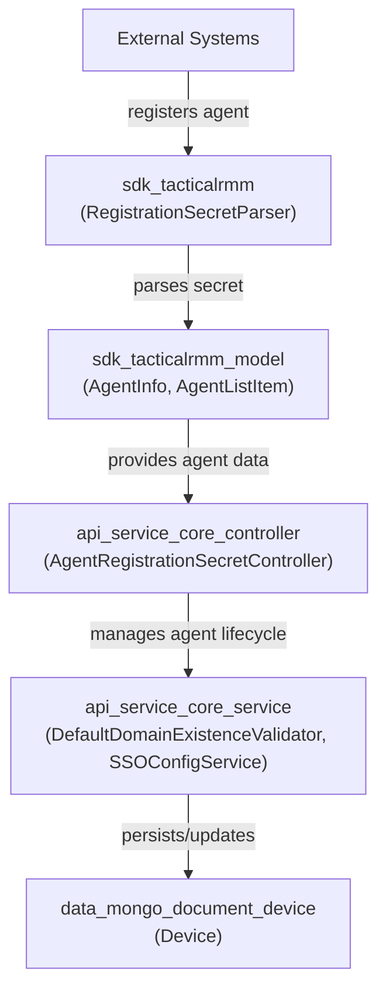
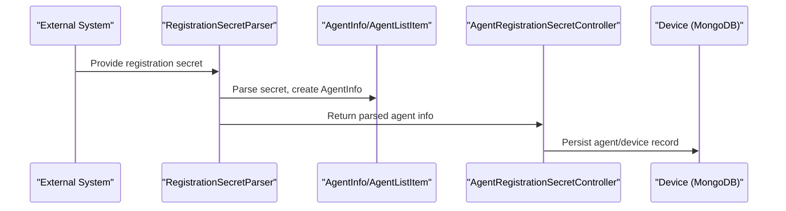

# sdk_tacticalrmm Module Documentation

## Introduction

The `sdk_tacticalrmm` module provides essential utilities and data models for integrating with Tactical RMM (Remote Monitoring and Management) systems. It is designed to support agent registration, secret parsing, and agent information modeling, serving as a bridge between the core platform and Tactical RMM-specific workflows. This module is typically used in conjunction with other SDK and service modules to enable seamless device and agent management within the broader system.

## Core Components

- **RegistrationSecretParser**: Utility for parsing and validating agent registration secrets specific to Tactical RMM agents.

See also: [sdk_tacticalrmm_model.md] for data models related to Tactical RMM agents.

## Architecture Overview

The `sdk_tacticalrmm` module is a lightweight SDK layer that interacts with both the core platform and Tactical RMM-specific services. It is primarily responsible for:

- Parsing and validating agent registration secrets
- Providing data models for Tactical RMM agents
- Supporting agent onboarding and management workflows

### High-Level Architecture

## Component Relationships

### RegistrationSecretParser

- **Purpose**: Parses and validates registration secrets for Tactical RMM agents.
- **Inputs**: Registration secret string (typically provided by an external system or agent installer).
- **Outputs**: Parsed agent information, or error if the secret is invalid.
- **Dependencies**:
  - Utilizes data models from [sdk_tacticalrmm_model.md]
  - Consumed by controllers such as `AgentRegistrationSecretController` ([api_service_core_controller.md])

### Data Models

For details on Tactical RMM agent data models, see [sdk_tacticalrmm_model.md].

## Data Flow

The following diagram illustrates the typical data flow for agent registration using the Tactical RMM SDK:

## Integration Points

- **Agent Registration**: The `RegistrationSecretParser` is invoked during agent onboarding, typically via the `AgentRegistrationSecretController`.
- **Data Modeling**: Agent information is structured using models from [sdk_tacticalrmm_model.md], which are then persisted in the device database ([data_mongo_document_device.md]).
- **Service Layer**: The parsed agent data may be further processed by service components such as `DefaultDomainExistenceValidator` or `SSOConfigService` ([api_service_core_service.md]).

## Related Modules

- [sdk_tacticalrmm_model.md]: Tactical RMM agent data models
- [api_service_core_controller.md]: Core API controllers, including agent registration
- [api_service_core_service.md]: Core service logic for agent and domain management
- [data_mongo_document_device.md]: Device persistence models

## Summary

The `sdk_tacticalrmm` module is a focused SDK utility for Tactical RMM agent registration and data modeling. It plays a critical role in the agent onboarding workflow, ensuring that registration secrets are correctly parsed and agent data is structured for downstream processing and persistence. For implementation details of agent data models, refer to [sdk_tacticalrmm_model.md].
