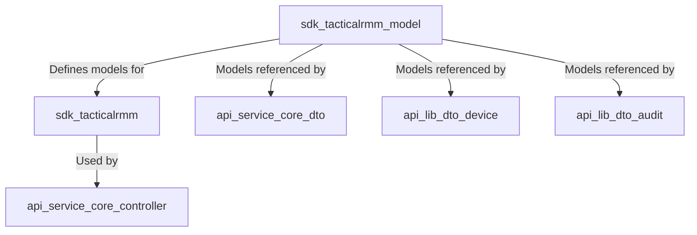
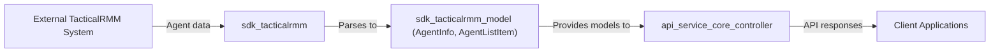

# sdk_tacticalrmm_model Module Documentation

## Introduction

The `sdk_tacticalrmm_model` module provides core data models for representing agent information and agent listings within the TacticalRMM integration layer. These models are essential for the interaction between the system and TacticalRMM agents, enabling the system to parse, store, and transfer agent-related data efficiently. The module is typically used in conjunction with the [sdk_tacticalrmm](sdk_tacticalrmm.md) module, which handles parsing and business logic for TacticalRMM registration secrets and agent operations.

## Core Components

- **AgentInfo**: Represents detailed information about a single TacticalRMM agent, including its identity, status, and relevant metadata.
- **AgentListItem**: Represents a summary or listing view of an agent, optimized for use in agent lists or search results.

These models are designed to be serializable and compatible with the broader system's data transfer and persistence mechanisms.

## Architecture and Component Relationships

The `sdk_tacticalrmm_model` module is a foundational part of the TacticalRMM integration stack. It is typically used by service and controller layers that require access to agent data, and it interacts with other modules as shown below.

### Component Interaction

- **sdk_tacticalrmm**: Utilizes `AgentInfo` and `AgentListItem` for parsing and handling agent registration secrets and agent-related operations. See [sdk_tacticalrmm.md](sdk_tacticalrmm.md) for more details.
- **api_service_core_controller**: Controllers such as `DeviceController` and `AgentRegistrationSecretController` may use these models to expose agent data via API endpoints. See [api_service_core_controller.md](api_service_core_controller.md).
- **api_service_core_dto** and **api_lib_dto_device**: Data transfer objects in these modules may wrap or reference `AgentInfo` and `AgentListItem` for API responses and filtering. See [api_service_core_dto.md](api_service_core_dto.md) and [api_lib_dto_device.md](api_lib_dto_device.md).

## Data Flow

The following diagram illustrates the typical data flow involving the `sdk_tacticalrmm_model` module:

## How It Fits Into the Overall System

The `sdk_tacticalrmm_model` module acts as a bridge between raw TacticalRMM agent data and the system's higher-level business logic and API layers. By providing well-defined models, it ensures consistency and type safety across the system when dealing with agent information. It is not responsible for business logic or data persistence, but rather for the structure and serialization of agent data.

- **Upstream**: Receives raw agent data from the TacticalRMM system via the [sdk_tacticalrmm](sdk_tacticalrmm.md) module.
- **Downstream**: Supplies structured agent data to API controllers, DTOs, and other modules that require agent information.

## Related Modules

- [sdk_tacticalrmm.md](sdk_tacticalrmm.md): Handles TacticalRMM registration secret parsing and agent operations.
- [api_service_core_controller.md](api_service_core_controller.md): API controllers that expose agent data.
- [api_service_core_dto.md](api_service_core_dto.md): Data transfer objects for API responses.
- [api_lib_dto_device.md](api_lib_dto_device.md): Device-related DTOs that may reference agent models.
- [api_lib_dto_audit.md](api_lib_dto_audit.md): Audit log DTOs that may include agent information.

## Summary

The `sdk_tacticalrmm_model` module is a key part of the TacticalRMM integration, providing the data structures necessary for representing and transferring agent information throughout the system. It is designed for interoperability and is referenced by multiple service, controller, and DTO modules to ensure a consistent approach to agent data handling.
