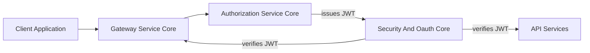
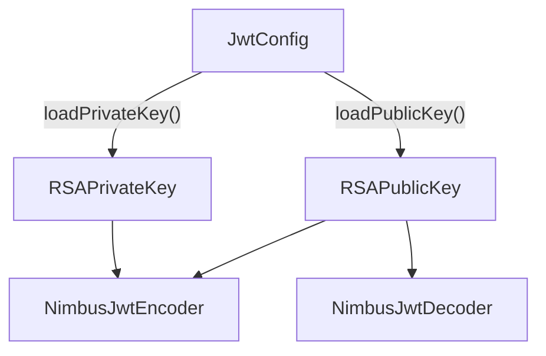
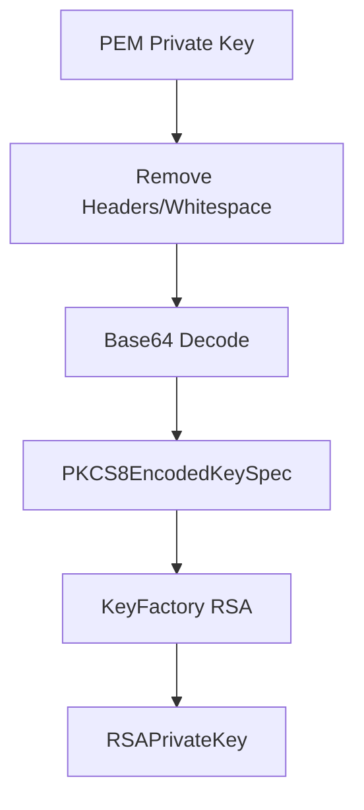
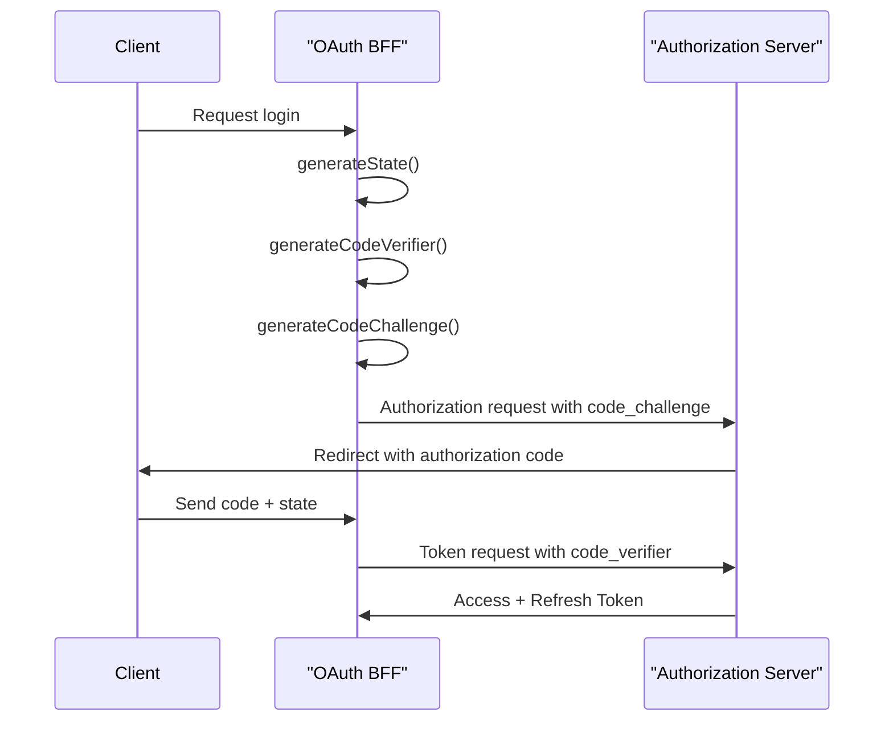
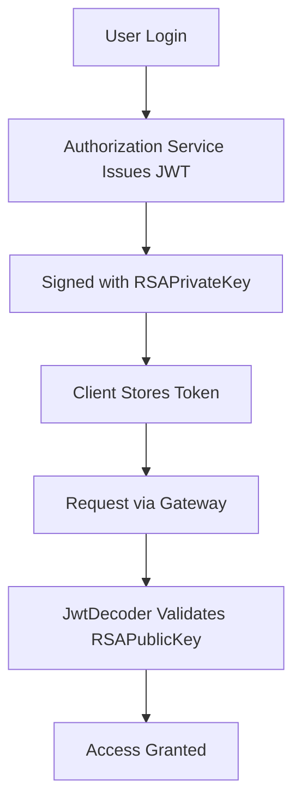

# Security And Oauth Core

## Overview

The **Security And Oauth Core** module provides the foundational security primitives used across the OpenFrame platform. It centralizes:

- JWT encoding and decoding configuration
- RSA key loading and management
- OAuth2-related constants
- PKCE (Proof Key for Code Exchange) utilities for secure authorization flows

This module is intentionally lightweight and framework-agnostic at the business layer. It exposes reusable security building blocks that are consumed by higher-level modules such as:

- [Authorization Service Core](../authorization-service-core/authorization-service-core.md)
- [Gateway Service Core](../gateway-service-core/gateway-service-core.md)
- [Security Oauth Bff](../security-oauth-bff/security-oauth-bff.md)

It does **not** implement authentication flows itself. Instead, it provides the cryptographic and configuration infrastructure required to support them.

---

## Architectural Role in the Platform

At runtime, the Security And Oauth Core module sits at the center of token issuance and validation across services.



### Responsibilities

- Provide `JwtEncoder` and `JwtDecoder` beans
- Load RSA keys from configuration
- Define shared OAuth token/header constants
- Support PKCE-compliant OAuth2 flows

This separation ensures:

- Cryptographic consistency across services
- Centralized JWT configuration
- Reusable PKCE logic for BFF and OAuth flows
- Minimal duplication of security utilities

---

## Core Components

The module consists of four primary components:

1. **JwtSecurityConfig** – Spring configuration for JWT encoder/decoder
2. **JwtConfig** – RSA key loading and JWT property binding
3. **SecurityConstants** – Shared OAuth token/header constants
4. **PKCEUtils** – PKCE generation utilities

---

# 1. JWT Infrastructure

## JwtSecurityConfig

**Component:**
`openframe-oss-lib.openframe-security-core.src.main.java.com.openframe.security.config.JwtSecurityConfig.JwtSecurityConfig`

### Purpose

Provides Spring beans for:

- `JwtEncoder`
- `JwtDecoder`

Using the Nimbus JOSE + JWT implementation.

### Bean Wiring Flow



### Key Details

- Uses `RSAKey` wrapped in a `JWKSet`
- Encoder supports signing with private key
- Decoder validates tokens using public key only
- Designed for asymmetric JWT signing (RS256)

This allows:

- Authorization Service Core to sign tokens
- Gateway and API services to validate them

---

## JwtConfig

**Component:**
`openframe-oss-lib.openframe-security-core.src.main.java.com.openframe.security.jwt.JwtConfig.JwtConfig`

### Purpose

Binds application properties under the `jwt.*` prefix and provides runtime key loading.

### Configurable Properties

```text
jwt.public-key.value
jwt.private-key.value
jwt.issuer
jwt.audience
```

### Key Loading Process



### Security Considerations

- Private key is parsed from PKCS#8 PEM
- Public key is loaded through `KeyConfig`
- Keys should be injected via secure configuration (Vault, secrets manager, or environment injection)
- Issuer and audience can be enforced by higher-level services

---

# 2. OAuth Token Constants

## SecurityConstants

**Component:**
`openframe-oss-lib.openframe-security-core.src.main.java.com.openframe.security.oauth.SecurityConstants.SecurityConstants`

### Purpose

Defines shared OAuth-related parameter and header names used across services.

### Defined Constants

```text
AUTHORIZATION_QUERY_PARAM = "authorization"
ACCESS_TOKEN = "access_token"
REFRESH_TOKEN = "refresh_token"
ACCESS_TOKEN_HEADER = "Access-Token"
REFRESH_TOKEN_HEADER = "Refresh-Token"
```

### Why This Matters

- Prevents duplication of string literals
- Ensures consistent header naming across Gateway and BFF layers
- Avoids subtle bugs caused by mismatched token names

These constants are typically consumed by:

- Gateway filters
- OAuth BFF controllers
- External API adapters

---

# 3. PKCE Utilities

## PKCEUtils

**Component:**
`openframe-oss-lib.openframe-security-core.src.main.java.com.openframe.security.pkce.PKCEUtils.PKCEUtils`

### Purpose

Implements RFC 7636 (PKCE) utilities for secure OAuth2 authorization code flows.

### Supported Operations

- `generateState()` – CSRF protection
- `generateCodeVerifier()` – PKCE verifier
- `generateCodeChallenge()` – SHA-256 based challenge
- `urlEncode()` – UTF-8 URL encoding helper

---

## PKCE Flow Overview



### Security Guarantees

- `SecureRandom` ensures cryptographic entropy
- SHA-256 ensures challenge integrity
- Base64URL encoding prevents padding and unsafe characters
- State parameter mitigates CSRF attacks

---

## Integration with Other Modules

### Authorization Service Core

Consumes:

- JWT encoder for signing tokens
- PKCE utilities for OAuth flows
- Security constants for token naming

### Gateway Service Core

Consumes:

- JWT decoder for request validation
- Token header constants

### Security Oauth Bff

Consumes:

- PKCE utilities
- OAuth constants

This modular approach ensures that cryptographic primitives are not duplicated across services.

---

## End-to-End Token Lifecycle



---

## Design Principles

1. **Asymmetric cryptography first** – Private key signs, public key verifies
2. **Stateless validation** – JWT enables horizontal scalability
3. **Spec compliance** – PKCE and OAuth2 aligned with standards
4. **Separation of concerns** – No business logic inside security primitives
5. **Framework-native integration** – Leverages Spring Security infrastructure

---

## When to Modify This Module

Changes here affect every service that relies on JWT validation or OAuth behavior.

Modify this module when:

- Changing signing algorithms
- Rotating key format handling
- Introducing new token header standards
- Extending PKCE behavior

Avoid modifying this module for:

- Business-level authentication rules
- Tenant-specific policy enforcement
- Controller-level security logic

Those belong in higher-level modules such as Authorization Service Core.

---

## Summary

The **Security And Oauth Core** module is the cryptographic backbone of OpenFrame’s authentication and authorization model.

It provides:

- RSA-based JWT infrastructure
- Secure PKCE implementation
- Centralized OAuth constants
- Spring-native security configuration

By keeping these primitives isolated and reusable, the platform ensures consistent, secure, and scalable authentication across all services.