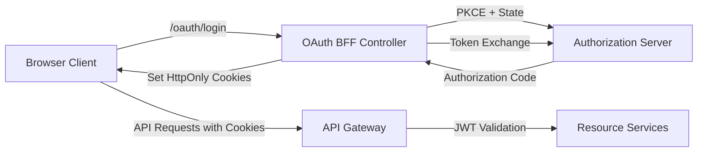
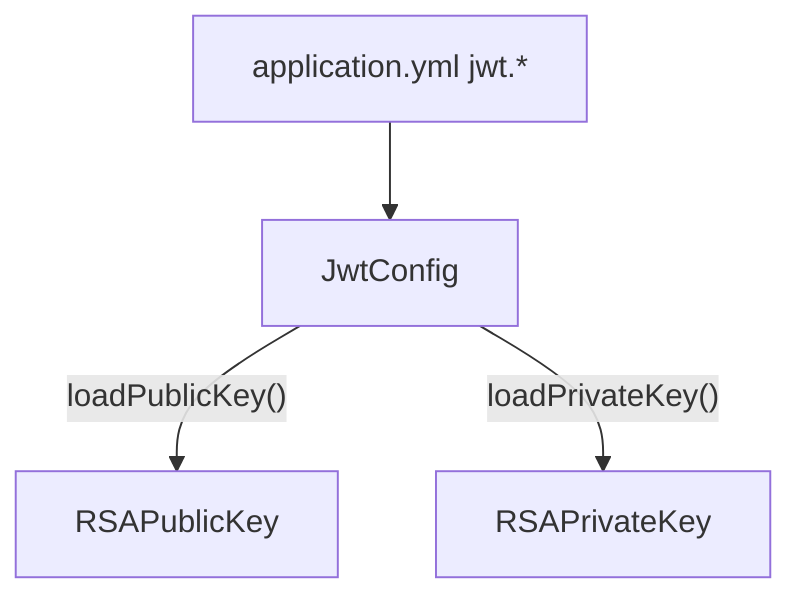
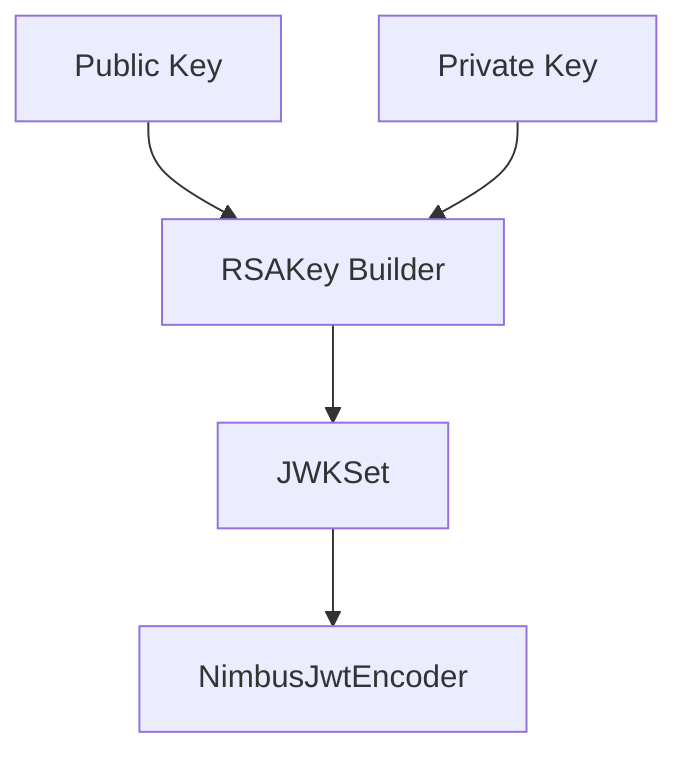
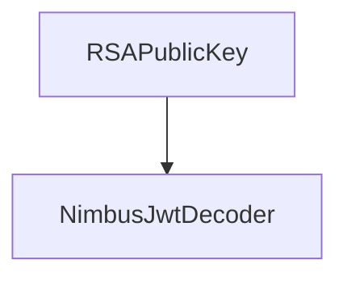
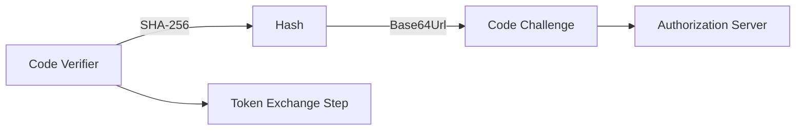
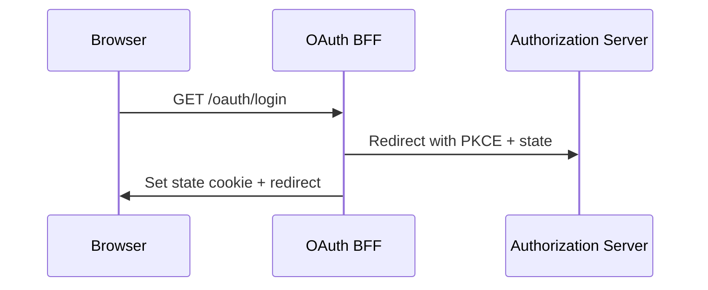
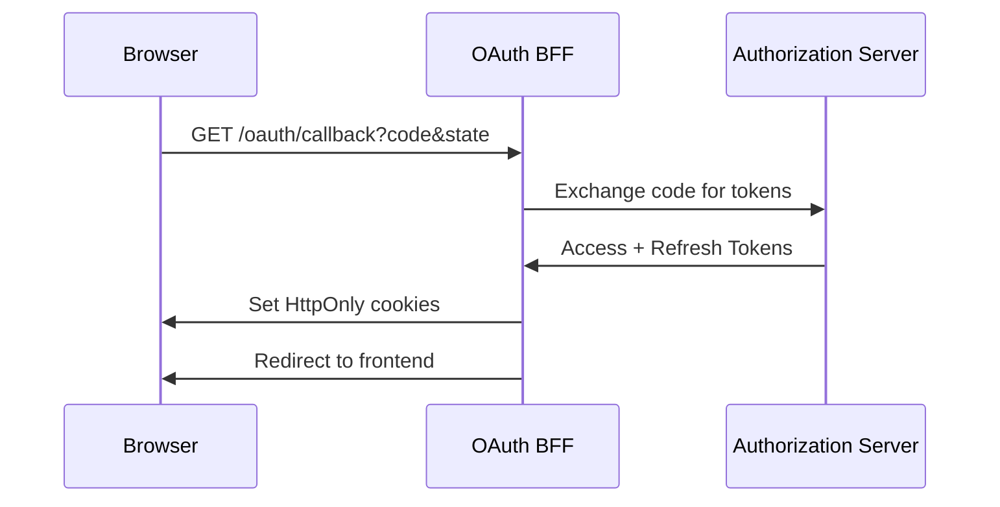
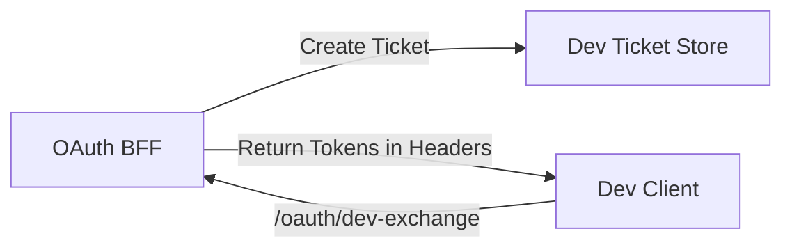
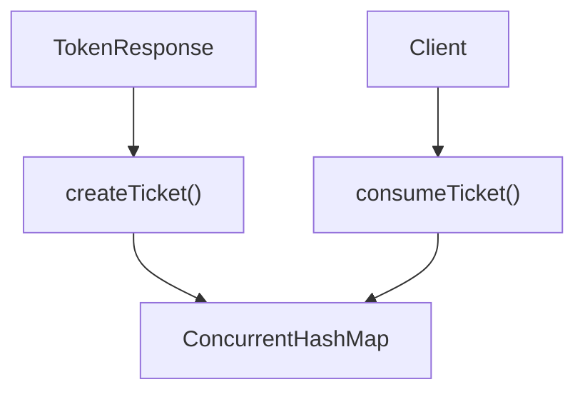
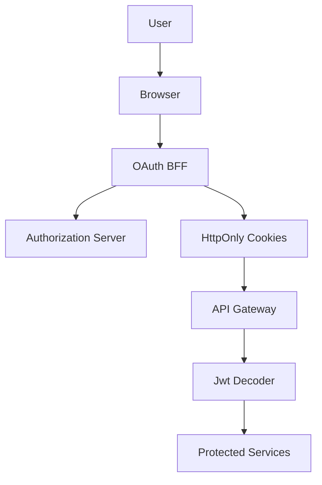

# Security Core And Oauth Bff

The **Security Core And Oauth Bff** module provides the foundational security building blocks for the OpenFrame platform, including:

- JWT encoding and decoding infrastructure
- RSA key configuration and loading
- OAuth2 + PKCE utilities
- A Backend-for-Frontend (BFF) layer for OAuth flows
- Development ticket support for local and integration environments

This module acts as the bridge between:

- The Authorization Server (token issuer)
- The Gateway layer (cookie-based session boundary)
- Frontend applications (browser clients)

It standardizes how tokens are generated, validated, transported, refreshed, and revoked across the platform.

---

## 1. High-Level Architecture

The Security Core And Oauth Bff module sits between the browser and the authorization infrastructure.



### Responsibilities

| Layer | Responsibility |
|--------|----------------|
| JWT Core | Key loading, encoder/decoder beans |
| PKCE Utilities | Secure OAuth code verifier and challenge generation |
| OAuth BFF | Login, callback, refresh, logout orchestration |
| Dev Ticket Store | Developer token exchange support |
| Redirect Resolver | Safe redirect handling |

---

## 2. Module Structure

The module is logically divided into two parts:

### 2.1 Security Core

Core primitives for JWT and OAuth security:

- `JwtSecurityConfig`
- `JwtConfig`
- `SecurityConstants`
- `PKCEUtils`

### 2.2 OAuth BFF Layer

Reactive WebFlux-based BFF implementation:

- `OAuthBffController`
- `InMemoryOAuthDevTicketStore`
- `DefaultRedirectTargetResolver`
- `NoopForwardedHeadersContributor`

---

# 3. JWT Infrastructure

## 3.1 JwtConfig

`JwtConfig` is a configuration-bound component (`@ConfigurationProperties(prefix = "jwt")`).

It loads:

- RSA public key
- RSA private key
- Issuer
- Audience

### Key Responsibilities

- Parses PEM formatted RSA keys
- Converts Base64 PKCS8 private keys
- Provides `RSAPublicKey` and `RSAPrivateKey`



This abstraction isolates key parsing logic from the rest of the security configuration.

---

## 3.2 JwtSecurityConfig

`JwtSecurityConfig` defines Spring beans for:

- `JwtEncoder`
- `JwtDecoder`

It uses:

- `NimbusJwtEncoder`
- `NimbusJwtDecoder`
- JWK (JSON Web Key) infrastructure

### Encoder Flow



### Decoder Flow



This ensures:

- Tokens are signed with private key
- Tokens are verified using public key

---

# 4. PKCE Utilities

## 4.1 PKCEUtils

`PKCEUtils` implements OAuth2 PKCE (Proof Key for Code Exchange).

### Capabilities

- Generate secure state values (CSRF protection)
- Generate code verifier (256-bit random)
- Generate SHA-256 code challenge
- Base64 URL-safe encoding (without padding)

### PKCE Flow



Security Properties:

- Prevents authorization code interception attacks
- Enforces cryptographic binding between authorization and token exchange
- Uses `SecureRandom`

---

# 5. OAuth BFF Controller

`OAuthBffController` implements the Backend-for-Frontend pattern.

It is conditionally enabled via:

```text
openframe.gateway.oauth.enable=true
```

The controller exposes:

- `/oauth/login`
- `/oauth/continue`
- `/oauth/callback`
- `/oauth/refresh`
- `/oauth/logout`
- `/oauth/dev-exchange`

---

## 5.1 Login Flow



Key steps:

1. Clear existing authentication cookies
2. Generate state and PKCE parameters
3. Build authorize URL
4. Store signed state JWT in cookie
5. Redirect to Authorization Server

---

## 5.2 Callback Flow



Security measures:

- Validates state
- Exchanges authorization code
- Clears state cookie
- Sets secure authentication cookies

On error:

- Redirects with `error=oauth_failed`
- Includes encoded error message

---

## 5.3 Refresh Flow

Endpoint: `/oauth/refresh`

Behavior:

- Reads refresh token from cookie or header
- Supports tenant-aware refresh
- Returns new access and refresh tokens
- Optionally emits dev headers

If token missing or invalid → `401 Unauthorized`

---

## 5.4 Logout Flow

Endpoint: `/oauth/logout`

Steps:

1. Clear authentication cookies
2. Revoke refresh token (if present)
3. Return `204 No Content`

This enforces server-side token invalidation.

---

## 5.5 Dev Ticket Exchange

For development environments only.

When enabled:

```text
openframe.gateway.oauth.dev-ticket-enabled=true
```

Flow:



Used to:

- Expose tokens in headers
- Simplify local debugging
- Avoid reading HttpOnly cookies manually

---

# 6. Development Ticket Store

## 6.1 InMemoryOAuthDevTicketStore

Default implementation of `OAuthDevTicketStore`.

Characteristics:

- Uses `ConcurrentHashMap`
- Generates UUID ticket IDs
- One-time consumption (remove on read)



Custom implementations can replace it via Spring bean override.

---

# 7. Redirect Handling

## 7.1 DefaultRedirectTargetResolver

Determines post-login redirect target.

Resolution order:

1. Explicit `redirectTo` parameter
2. HTTP Referer header
3. Root path `/`

This prevents null or unsafe redirect handling.

---

# 8. Security Constants

`SecurityConstants` defines shared header and token names:

- `access_token`
- `refresh_token`
- `Access-Token`
- `Refresh-Token`

These constants ensure:

- Header consistency
- Cookie consistency
- Cross-module interoperability

---

# 9. Forwarded Headers Strategy

`NoopForwardedHeadersContributor` provides a safe default implementation when no forwarded header contributor is present.

This ensures:

- Compatibility in simple deployments
- Extensibility for reverse proxy environments

---

# 10. Security Model Summary



### Core Security Properties

- RSA-based JWT signing
- PKCE enforcement
- CSRF protection via state
- HttpOnly cookie isolation
- Optional refresh token revocation
- Multi-tenant ready design
- Reactive, non-blocking architecture

---

# 11. How This Module Fits the Platform

Security Core And Oauth Bff integrates with:

- Authorization Server (token issuance)
- Gateway Service (JWT validation)
- API services (resource protection)
- Frontend clients (browser-based apps)

It centralizes:

- Token lifecycle management
- OAuth flow orchestration
- Key management abstraction
- Secure cookie handling

By isolating JWT infrastructure and BFF logic into a dedicated module, the platform ensures:

- Consistency across services
- Strong cryptographic guarantees
- Extensibility for additional OAuth providers
- Clean separation between frontend and authorization server

---

# 12. Extension Points

The module supports customization through:

- Custom `OAuthDevTicketStore`
- Custom `RedirectTargetResolver`
- Custom forwarded headers contributor
- Externalized JWT key configuration

This makes the Security Core And Oauth Bff module suitable for:

- Production multi-tenant SaaS deployments
- Development and staging environments
- Hybrid cloud setups
- Reverse proxy or edge gateway architectures

---

**Security Core And Oauth Bff** provides the cryptographic foundation and OAuth orchestration layer that secures the entire OpenFrame ecosystem.